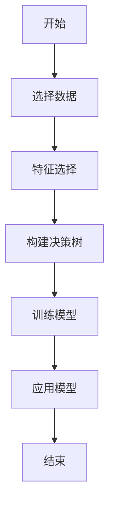
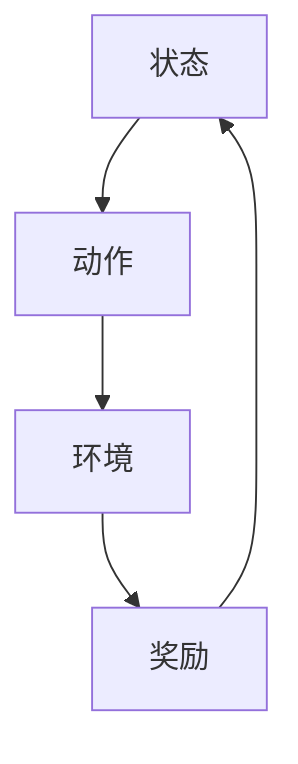
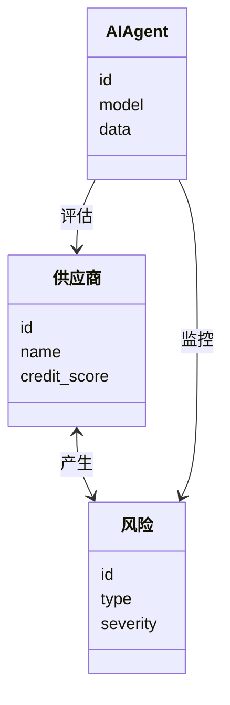
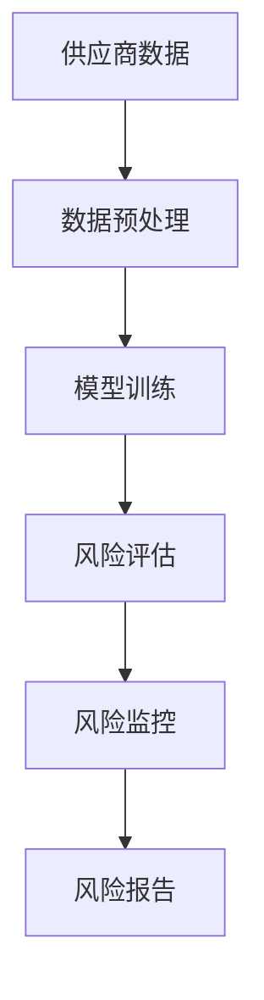

                 


# AI Agent在企业供应商风险评估与管理中的应用

> 关键词：AI Agent、供应商风险管理、企业供应链、风险评估模型、动态优化算法、机器学习、强化学习

> 摘要：本文探讨了AI Agent在企业供应商风险评估与管理中的应用，通过分析AI Agent的核心概念、算法原理、系统架构设计以及实际案例，展示了如何利用智能化手段优化供应商风险管理流程，提升企业供应链的整体稳定性。

---

## 第一部分: AI Agent与企业供应商风险评估概述

### 第1章: AI Agent与企业供应商管理概述

#### 1.1 企业供应商管理的背景与挑战
企业供应商管理是企业运营中的关键环节，直接关系到供应链的稳定性和成本控制。随着市场竞争的加剧，企业需要更高效、更精准的方法来评估和管理供应商风险。传统的供应商管理方法依赖于人工评估和静态数据分析，存在效率低、覆盖面窄、响应慢等问题。此外，全球经济的不确定性加剧了供应商风险的复杂性，如供应链中断、合规问题和财务风险等。因此，企业亟需引入智能化工具来提升供应商风险管理能力。

#### 1.2 AI Agent的基本概念与特点
AI Agent（人工智能代理）是一种能够感知环境、自主决策并执行任务的智能系统。与传统的自动化工具不同，AI Agent具备以下特点：
- **自主性**：能够自主决策，无需人工干预。
- **反应性**：能够实时感知环境变化并做出响应。
- **学习能力**：通过机器学习和数据挖掘不断优化自身的决策模型。
- **适应性**：能够根据环境变化调整策略。

#### 1.3 供应商风险评估与管理的流程
供应商风险评估与管理通常包括以下几个步骤：
1. **数据收集**：收集供应商的历史交易数据、信用记录、合规信息等。
2. **风险识别**：通过数据分析识别潜在风险点。
3. **风险评估**：利用模型对风险进行量化评估。
4. **风险监控**：实时监控供应商的状态，及时发现风险变化。
5. **风险应对**：根据评估结果制定相应的风险 mitigation 策略。

---

## 第二部分: AI Agent的核心概念与原理

### 第2章: AI Agent的核心概念与原理

#### 2.1 AI Agent的感知与决策机制
AI Agent的核心在于其感知和决策能力。感知层通过收集数据（如供应商的历史数据、市场动态等）来识别潜在风险。决策层基于这些数据，利用机器学习模型（如决策树、随机森林等）生成风险评估结果，并制定应对策略。

#### 2.2 AI Agent的多目标优化模型
在供应商风险管理中，AI Agent需要在多个目标之间进行权衡，例如成本最低、风险最小化、供应商稳定性等。多目标优化模型通过数学方法找到最优解，通常使用加权和方法将多个目标转化为单个优化问题。

#### 2.3 AI Agent的实体关系模型
以下是供应商、风险和AI Agent之间的关系图：

```mermaid
erDiagram
    supplier [供应商] {
        id
        name
        credit_score
        risk_level
    }
    risk [风险] {
        id
        type
        severity
        timestamp
    }
    ai_agent [AI Agent] {
        id
        model_version
        training_data
    }
    supplier --> risk : 产生
    ai_agent --> risk : 监控
    ai_agent --> supplier : 评估
```

---

## 第三部分: AI Agent的算法原理与数学模型

### 第3章: AI Agent的算法原理

#### 3.1 基于机器学习的风险评估算法
机器学习算法在供应商风险管理中被广泛应用。以下是一个基于决策树的供应商风险分类算法：



以下是决策树分类的数学模型示例：

$$
\text{预测风险等级} = \argmax_{y} P(y | x, \text{树结构})
$$

#### 3.2 基于强化学习的动态优化算法
强化学习通过试错机制优化决策策略。以下是一个强化学习算法的流程图：



奖励函数通常定义为：

$$
R(s, a) = \begin{cases}
    1 & \text{如果动作 } a \text{ 有效} \\
    0 & \text{否则}
\end{cases}
$$

---

## 第四部分: 系统分析与架构设计

### 第4章: 系统分析与架构设计

#### 4.1 问题场景介绍
供应商风险管理系统的应用场景包括供应商选择、风险监控和风险缓解策略制定。系统需要处理大量的实时数据，并快速生成评估结果。

#### 4.2 系统功能设计
以下是系统功能的领域模型类图：



#### 4.3 系统架构设计
以下是系统架构图：



---

## 第五部分: 项目实战与案例分析

### 第5章: 项目实战

#### 5.1 环境安装与配置
以下是Python环境的安装步骤：
1. 安装Python：`python --version`
2. 安装依赖库：`pip install numpy pandas scikit-learn`

#### 5.2 系统核心实现
以下是基于决策树的供应商风险分类算法的Python代码：

```python
from sklearn.tree import DecisionTreeClassifier
from sklearn.model_selection import train_test_split
from sklearn.metrics import accuracy_score

# 数据准备
X = df[['feature1', 'feature2']]
y = df['target']

# 数据分割
X_train, X_test, y_train, y_test = train_test_split(X, y, test_size=0.2)

# 模型训练
model = DecisionTreeClassifier()
model.fit(X_train, y_train)

# 模型预测
y_pred = model.predict(X_test)

# 评估准确率
print("Accuracy:", accuracy_score(y_test, y_pred))
```

---

## 第六部分: 最佳实践与小结

### 第6章: 最佳实践与小结

#### 6.1 最佳实践
- **数据质量**：确保数据的准确性和完整性。
- **模型更新**：定期更新模型以适应数据变化。
- **监控反馈**：建立反馈机制，及时调整风险评估策略。

#### 6.2 小结
本文详细探讨了AI Agent在企业供应商风险评估与管理中的应用，从理论到实践，展示了如何利用智能化工具优化供应链管理。AI Agent通过实时数据分析和动态优化算法，显著提升了供应商风险管理的效率和准确性。

#### 6.3 注意事项
在实际应用中，需要注意数据隐私和模型解释性问题，确保合规性和透明性。

#### 6.4 拓展阅读
推荐阅读《机器学习实战》和《强化学习入门》以深入理解相关技术。

---

## 作者信息

作者：AI天才研究院/AI Genius Institute & 禅与计算机程序设计艺术 /Zen And The Art of Computer Programming

--- 

希望这篇文章能够为读者提供关于AI Agent在供应商风险管理中的深入见解，并为企业的实践应用提供有价值的参考。

