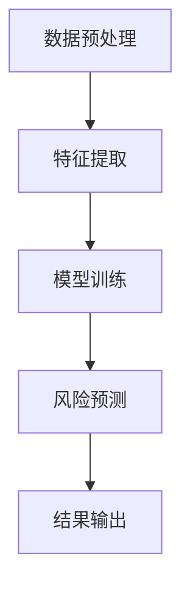
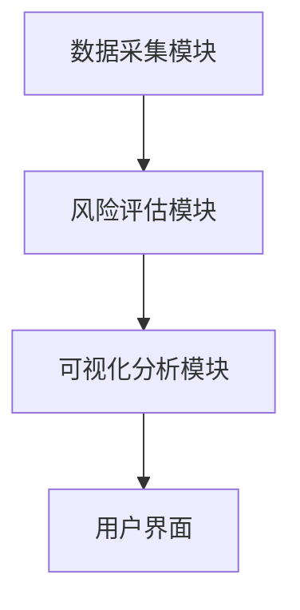

                 


# AI Agent在企业供应商风险评估与管理中的角色

## 关键词：
AI Agent, 供应商风险评估, 企业风险管理, 机器学习, 知识图谱, 自然语言处理

## 摘要：
随着企业全球化进程的加速，供应商管理变得日益复杂。企业面临的风险不仅来自供应商的财务状况，还包括交付能力、合规性和道德风险等多个方面。传统的供应商管理方法已难以应对这些复杂挑战。AI Agent作为一种智能代理，能够通过机器学习、自然语言处理和知识图谱等技术，为企业供应商风险评估与管理提供高效、精准的解决方案。本文将深入探讨AI Agent在供应商风险评估中的角色，分析其核心技术与应用场景，并通过具体案例展示其实际价值。

---

# 第1章: AI Agent与企业供应商管理背景

## 1.1 企业供应商管理的背景与挑战

### 1.1.1 企业供应商管理的定义与重要性
企业供应商管理是指对供应商的全生命周期进行规划、选择、评估、监控和优化的过程。供应商是企业供应链的重要组成部分，其表现直接影响企业的运营效率和成本控制。随着全球化和供应链复杂化的加剧，供应商管理的重要性日益凸显。

### 1.1.2 传统供应商管理的局限性
传统的供应商管理依赖于人工评估和经验判断，存在以下问题：
1. **信息不全**：难以全面收集和分析供应商的多维度数据。
2. **主观性**：评估结果受人为因素影响较大。
3. **效率低下**：面对海量供应商数据，人工处理效率有限。
4. **动态变化**：供应商风险可能因市场波动或突发事件而快速变化，难以及时应对。

### 1.1.3 数字化转型对企业供应商管理的影响
数字化转型为企业供应商管理带来了新的机遇。通过大数据、人工智能和区块链等技术，企业可以实现供应商数据的实时采集、分析和决策支持，从而提升管理效率和准确性。

### 1.1.4 边界与外延
供应商管理的边界包括供应商的选择、评估、监控和优化，而外延则涉及供应商关系管理（SRM）、供应链风险管理等领域。

## 1.2 AI Agent的基本概念与特点

### 1.2.1 AI Agent的定义与核心功能
AI Agent是一种能够感知环境、自主决策并执行任务的智能代理。其核心功能包括数据采集、分析、决策和反馈。

### 1.2.2 AI Agent与传统软件系统的区别
AI Agent的核心区别在于其智能性和自主性。它能够通过学习和适应不断优化其行为，而传统软件系统则依赖于预定义的规则。

### 1.2.3 AI Agent在企业中的应用场景
AI Agent广泛应用于企业中的智能推荐、风险预警、自动化运维等领域。

## 1.3 AI Agent在供应商管理中的角色

### 1.3.1 供应商风险评估的核心问题
供应商风险评估的核心问题是如何准确识别和预测供应商的信用风险、交付风险和合规风险。

### 1.3.2 AI Agent在供应商风险评估中的优势
AI Agent通过机器学习算法能够快速分析海量数据，识别潜在风险，并提供实时预警。

### 1.3.3 AI Agent与企业供应商管理的结合
AI Agent可以通过实时监控供应商的动态数据，如市场波动、舆情信息等，帮助企业及时调整供应商策略。

## 1.4 本章小结
本章介绍了企业供应商管理的背景、挑战和数字化转型的影响，阐述了AI Agent的基本概念和特点，并分析了其在供应商管理中的角色和优势。

---

# 第2章: 供应商风险评估的核心模型与算法

## 2.1 供应商风险评估的关键指标

### 2.1.1 供应商信用风险的定义与影响
信用风险是指供应商因财务状况恶化而无法履行合同义务的风险。它直接影响企业的资金流和供应链稳定性。

### 2.1.2 供应商交付能力的评估标准
交付能力包括供应商按时交付的能力、产品质量稳定性等。这些指标可以通过历史数据和实时监控来评估。

### 2.1.3 供应商合规性与道德风险的考量
合规性包括供应商是否符合行业标准和法律法规，道德风险则涉及供应商的劳动条件、环境保护等方面。

## 2.2 AI Agent驱动的供应商风险评估模型

### 2.2.1 基于机器学习的风险评估模型
机器学习模型能够通过历史数据训练，识别供应商的潜在风险。常用算法包括逻辑回归、随机森林和神经网络。

### 2.2.2 基于知识图谱的供应商关联风险分析
知识图谱可以帮助识别供应商之间的关联风险，例如同一供应商的不同分支机构可能存在协同风险。

### 2.2.3 基于自然语言处理的供应商文档分析
自然语言处理技术可以自动分析供应商的合同、报告等文档，提取关键信息以辅助风险评估。

## 2.3 算法原理与数学模型

### 2.3.1 机器学习模型的训练过程
1. 数据预处理：清洗、特征提取。
2. 模型训练：使用训练数据拟合模型。
3. 模型评估：通过测试数据验证模型性能。
4. 模型部署：将模型应用于实际数据。

### 2.3.2 风险评估的数学公式
$$风险值 = \alpha \cdot 信用评分 + \beta \cdot 交付能力 + \gamma \cdot 合规性$$

### 2.3.3 算法流程图（使用 Mermaid）


## 2.4 本章小结
本章详细介绍了供应商风险评估的关键指标和AI Agent驱动的评估模型，包括机器学习、知识图谱和自然语言处理等技术。

---

# 第3章: 供应商风险评估系统的架构设计

## 3.1 系统功能模块划分

### 3.1.1 数据采集模块
负责采集供应商的多维度数据，包括财务数据、市场舆情、合同文本等。

### 3.1.2 风险评估模块
基于机器学习模型对供应商进行风险评估，并生成风险报告。

### 3.1.3 可视化分析模块
提供直观的可视化界面，帮助用户快速理解风险评估结果。

## 3.2 系统架构设计

### 3.2.1 分层架构设计
系统分为数据层、业务逻辑层和用户界面层，确保各层功能分离。

### 3.2.2 微服务架构的应用
采用微服务架构，提高系统的可扩展性和可维护性。

### 3.2.3 数据流与交互流程
1. 用户提交供应商信息。
2. 数据采集模块获取相关数据。
3. 风险评估模块进行评估并生成报告。
4. 可视化分析模块展示结果。

## 3.3 系统架构图（使用 Mermaid）


## 3.4 本章小结
本章详细描述了供应商风险评估系统的架构设计，包括功能模块划分和系统架构图。

---

# 第4章: 项目实战与案例分析

## 4.1 环境安装与配置

### 4.1.1 安装Python和相关库
安装Python 3.8及以上版本，并安装机器学习库（如scikit-learn、TensorFlow）和自然语言处理库（如spaCy、NLTK）。

### 4.1.2 数据集准备
收集供应商的财务数据、合同文本和市场舆情数据。

## 4.2 系统核心实现源代码

### 4.2.1 数据预处理代码
```python
import pandas as pd
from sklearn.preprocessing import StandardScaler

# 读取数据
data = pd.read_csv('suppliers.csv')

# 数据清洗
data = data.dropna()
data = data.drop_duplicates()

# 特征提取
features = data[['credit_score', 'delivery_delay_rate', 'compliance_score']]
scaler = StandardScaler()
scaled_features = scaler.fit_transform(features)
```

### 4.2.2 机器学习模型实现
```python
from sklearn.ensemble import RandomForestClassifier
from sklearn.metrics import accuracy_score

# 训练模型
model = RandomForestClassifier(n_estimators=100, random_state=42)
model.fit(scaled_features, labels)

# 预测
new_data = scaler.transform(new_features)
 predictions = model.predict(new_data)
```

### 4.2.3 可视化分析代码
```python
import matplotlib.pyplot as plt

# 绘制风险分布图
plt.bar(risk_scores, height=0.5)
plt.xlabel('供应商编号')
plt.ylabel('风险评分')
plt.show()
```

## 4.3 实际案例分析

### 4.3.1 案例背景
某企业面临多个供应商的信用风险问题，希望通过AI Agent进行评估和管理。

### 4.3.2 数据分析与建模
通过机器学习模型分析供应商的信用评分、交付能力和合规性，生成风险评分。

### 4.3.3 可视化与决策
可视化工具帮助管理层快速识别高风险供应商，并制定相应的管理策略。

## 4.4 本章小结
本章通过实际案例展示了AI Agent在供应商风险评估中的应用，详细介绍了系统实现和数据处理过程。

---

# 第5章: 最佳实践与小结

## 5.1 最佳实践 tips
1. 数据质量是关键，确保数据的完整性和准确性。
2. 组合使用多种技术，如机器学习、知识图谱和自然语言处理。
3. 定期更新模型，适应市场变化。

## 5.2 小结
AI Agent通过智能化的分析和决策，显著提升了企业供应商风险评估的效率和准确性。随着技术的不断进步，其在企业供应链管理中的应用前景广阔。

## 5.3 注意事项
1. 保护供应商数据隐私。
2. 定期进行模型验证和优化。
3. 建立多部门协作机制。

## 5.4 拓展阅读
1. 《机器学习实战》
2. 《知识图谱：概念、方法与应用》
3. 《自然语言处理入门》

---

# 作者：AI天才研究院/AI Genius Institute & 禅与计算机程序设计艺术 /Zen And The Art of Computer Programming

