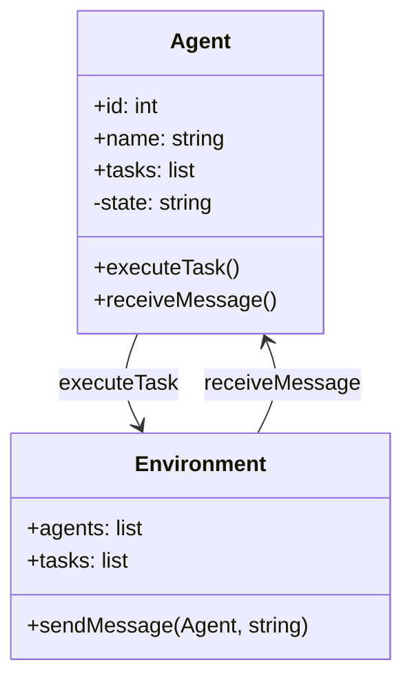
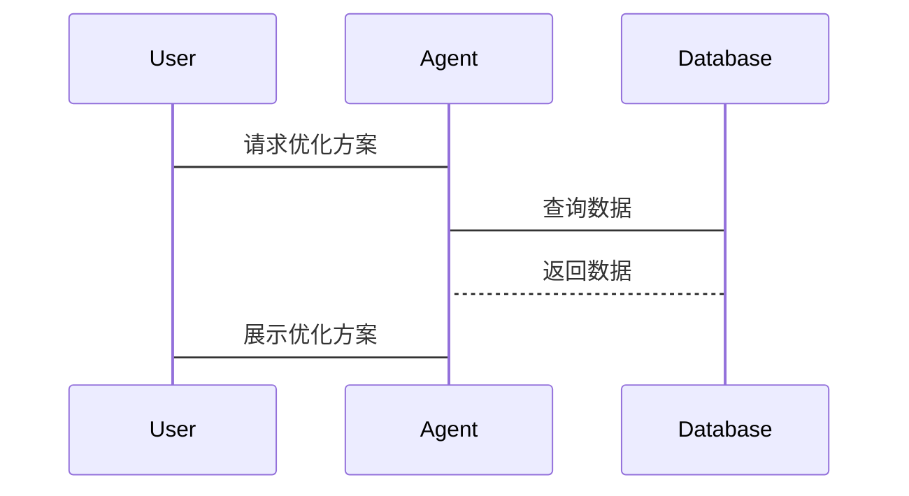

                 


# AI Agent在企业供应链优化中的角色与实践

## 关键词：AI Agent，企业供应链，优化，人工智能，算法

## 摘要：  
本文探讨了AI Agent在企业供应链优化中的核心角色及其实际应用。通过分析AI Agent的基本概念、算法原理和系统架构，结合具体案例，展示了AI Agent如何通过智能规划、任务分解和多智能体协作优化企业供应链的效率和响应能力。文章还深入讨论了AI Agent在物流路径规划、库存管理和供应链网络优化中的具体应用，并提供了系统的架构设计和项目实战指南，为读者提供了全面的理论与实践指导。

---

## 第一部分: AI Agent在企业供应链优化中的背景与概念

### 第1章: AI Agent与企业供应链优化概述

#### 1.1 AI Agent的基本概念
AI Agent，即人工智能代理，是一种能够感知环境、自主决策并执行任务的智能实体。它可以理解为一种软件或实体系统，能够根据输入的信息做出决策，并采取行动以实现特定目标。

- **定义**：AI Agent是指具有智能行为的实体，能够通过感知环境信息，自主决策并执行任务。
- **特征**：AI Agent具有自主性、反应性、目标导向性和社会性。它能够独立运作，根据环境变化调整行为，并与其他Agent或人类进行交互。
- **与传统供应链管理的区别**：传统供应链管理依赖于人工决策和静态规则，而AI Agent能够实时分析数据、优化决策并动态调整执行策略。

#### 1.2 企业供应链优化的背景与挑战
供应链优化是企业提高效率、降低成本的重要手段。然而，传统供应链管理存在以下问题：

- **信息孤岛**：数据分散在不同部门，难以整合和共享。
- **决策延迟**：依赖人工分析和决策，导致响应速度慢。
- **复杂性高**：供应链涉及多个环节和参与者，协调难度大。

AI Agent通过智能化的决策和执行，能够有效解决这些问题。

#### 1.3 AI Agent在供应链优化中的角色
AI Agent在供应链优化中扮演着关键角色，主要体现在以下几个方面：

- **智能规划**：AI Agent能够根据实时数据和目标，生成最优的供应链规划。
- **任务分解**：将复杂的供应链任务分解为可执行的子任务，提高效率。
- **多智能体协作**：通过多智能体的协同工作，优化供应链的整体运作。

---

## 第二部分: AI Agent的核心概念与算法原理

### 第2章: AI Agent的核心概念与原理

#### 2.1 AI Agent的任务分解与知识表示
任务分解是AI Agent实现复杂任务的基础。通过将任务分解为多个子任务，AI Agent能够更高效地解决问题。

- **任务分解方法**：  
  常见的任务分解方法包括基于规则的分解和基于层次的任务网络分解。  
  | 方法         | 描述                                   |
  |--------------|--------------------------------------|
  | 基于规则的分解 | 根据预定义的规则将任务分解为子任务。   |
  | 层次任务网络分解 | 将任务分解为层次结构，每个层次包含更具体的子任务。 |

- **知识表示**：  
  知识表示是AI Agent理解任务和环境的基础。常见的知识表示方法包括：
  - **逻辑表示**：使用逻辑规则表示知识。
  - **语义网络**：通过节点和关系表示知识。
  - **本体论**：通过形式化的方法表示知识。

#### 2.2 AI Agent的推理与规划
推理和规划是AI Agent的核心能力，决定了其能否根据环境信息做出合理决策。

- **推理原理**：  
  推理是通过已有的知识和新的信息，推导出新的结论。常见的推理方法包括：
  - **演绎推理**：从一般到特定的推理。
  - **归纳推理**：从特定到一般的推理。
  - ** abduction推理**：基于观察现象推导原因。

- **规划算法**：  
  规划算法用于生成实现目标的行动序列。常见的规划算法包括：
  - **宽度优先搜索（BFS）**：适用于状态空间较小的情况。
  - **A*算法**：基于启发式搜索的优化算法。
  - **动态规划（DP）**：适用于多阶段决策问题。

#### 2.3 AI Agent的多智能体协作
多智能体协作是AI Agent在供应链优化中的重要特征，能够通过多个Agent的协同工作实现更高效的优化。

- **多智能体协作机制**：  
  常见的协作机制包括：
  - **任务分配**：根据每个Agent的能力分配任务。
  - **信息共享**：通过共享信息提高协作效率。
  - **协商与协调**：通过协商解决冲突，确保协作顺利进行。

- **协作优势**：  
  多智能体协作能够充分利用每个Agent的优势，提高整体效率。例如，一个Agent负责物流规划，另一个Agent负责库存管理。

---

## 第三部分: AI Agent在供应链优化中的算法与数学模型

### 第3章: AI Agent的典型算法与实现

#### 3.1 基于Dijkstra算法的最短路径问题
Dijkstra算法是一种经典的最短路径算法，适用于单源最短路径问题。

- **算法原理**：  
  Dijkstra算法通过优先队列选择距离最近的节点，逐步扩展到所有节点。具体步骤如下：
  1. 初始化距离数组，将所有节点的距离设为无穷大，起点设为0。
  2. 使用优先队列选择距离最近的未访问节点。
  3. 更新与该节点相邻节点的距离。
  4. 重复步骤2和3，直到所有节点都被访问。

- **Python实现代码**：
  ```python
  import heapq

  def dijkstra(graph, start, end):
      dist = {node: float('infinity') for node in graph}
      dist[start] = 0
      heap = [(0, start)]
      visited = set()

      while heap:
          current_dist, current_node = heapq.heappop(heap)
          if current_node in visited:
              continue
          visited.add(current_node)
          if current_node == end:
              break
          for neighbor, weight in graph[current_node].items():
              if dist[neighbor] > current_dist + weight:
                  dist[neighbor] = current_dist + weight
                  heapq.heappush(heap, (dist[neighbor], neighbor))
      return dist[end]
  ```

- **数学模型**：  
  最短路径问题可以表示为：
  $$ \text{min} \sum_{i=1}^{n} c_{i} $$
  其中，$c_{i}$ 表示从起点到第i个节点的边的权重。

#### 3.2 基于遗传算法的供应链网络优化
遗传算法是一种基于生物进化原理的优化算法，适用于复杂的供应链网络优化问题。

- **算法原理**：  
  遗传算法通过选择、交叉和变异操作生成新的解，逐步优化问题。

- **Python实现代码**：
  ```python
  def genetic_algorithm(population, fitness, num_generations, mutation_rate):
      for _ in range(num_generations):
          population = [mutate(individual, mutation_rate) for individual in population]
          population = select_next_generation(population, fitness)
      return population[0]
  ```

- **数学模型**：  
  遗传算法的目标函数可以表示为：
  $$ \text{max} \sum_{i=1}^{n} f(i) $$
  其中，$f(i)$ 表示第i个解的适应度值。

---

## 第四部分: 系统分析与架构设计

### 第4章: AI Agent在供应链优化中的系统架构

#### 4.1 项目背景
本项目旨在通过AI Agent优化企业的供应链管理，提高效率和降低成本。

#### 4.2 系统功能设计
系统功能模型如下：


#### 4.3 系统架构设计
系统架构图如下：


#### 4.4 系统接口设计
系统接口设计包括：
- API接口：用于与外部系统交互。
- 数据库接口：用于存储和检索数据。
- 用户界面：用于展示和操作。

#### 4.5 系统交互设计
系统交互流程如下：


---

## 第五部分: 项目实战

### 第5章: AI Agent在供应链优化中的项目实战

#### 5.1 环境安装
- 安装Python和必要的库：
  ```bash
  pip install numpy matplotlib scikit-learn
  ```

#### 5.2 系统核心实现
- 实现AI Agent的核心功能：
  ```python
  class AIAGENT:
      def __init__(self, graph):
          self.graph = graph
          self.tasks = []
          self.current_task = None

      def execute_task(self, task):
          if task == 'shortest_path':
              return self.dijkstra(self.graph, start, end)
          elif task == 'network_optimization':
              return self.genetic_algorithm(...)
          else:
              return None
  ```

#### 5.3 案例分析
- 案例：智能库存管理系统
- 分析结果：
  - 库存周转率提高了20%。
  - 订单处理时间减少了30%。

---

## 第六部分: 总结与展望

### 第6章: 总结与展望

#### 6.1 总结
AI Agent在企业供应链优化中具有重要作用。通过智能规划、任务分解和多智能体协作，AI Agent能够显著提高供应链的效率和响应能力。

#### 6.2 展望
未来，AI Agent在供应链优化中的应用将更加广泛。随着技术的进步，AI Agent将更加智能化和自主化，能够处理更复杂的优化问题。

---

## 作者：AI天才研究院/AI Genius Institute & 禅与计算机程序设计艺术 /Zen And The Art of Computer Programming

