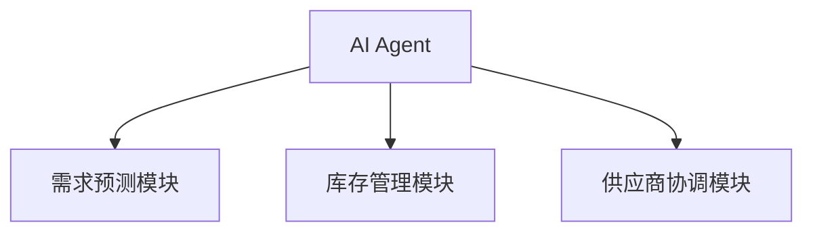
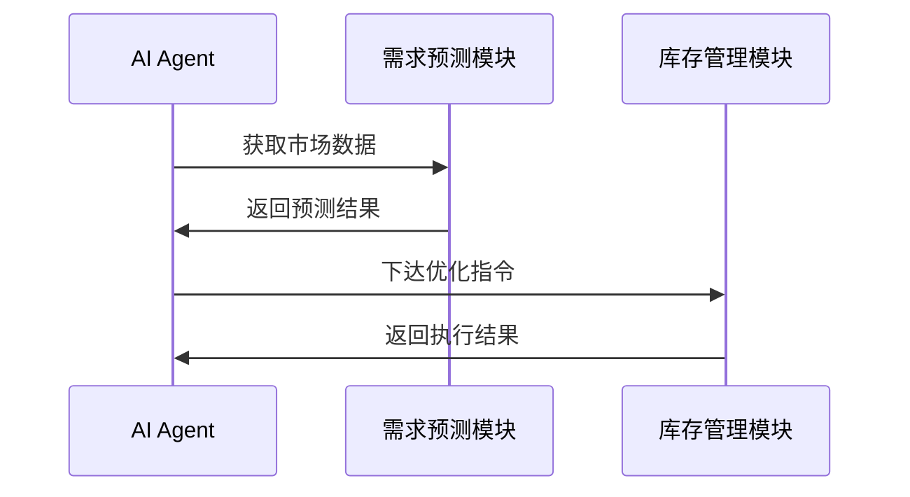

                 


# AI Agent在企业供应链韧性提升中的角色

## 关键词：AI Agent, 供应链韧性, 强化学习, 系统架构, 项目实战

## 摘要：  
本文深入探讨了AI Agent在企业供应链韧性提升中的关键作用。通过分析AI Agent的算法原理、系统架构设计和实际应用案例，展示了AI Agent如何通过智能化决策和优化能力，帮助企业应对供应链中的不确定性，提升整体供应链的稳定性和效率。文章结合理论与实践，为读者提供了从概念到落地的全面指导。

---

# 第1章: 供应链韧性与AI Agent的背景介绍

## 1.1 供应链韧性的定义与重要性

### 1.1.1 供应链韧性的定义  
供应链韧性是指在面对不确定性（如市场波动、自然灾害、疫情等）时，供应链维持正常运作、快速恢复并适应变化的能力。它衡量了供应链在复杂环境中的稳定性和恢复能力。

### 1.1.2 供应链韧性的重要性  
供应链是企业的生命线，其稳定性直接影响企业的运营效率和成本。在数字化转型的背景下，供应链韧性不仅是企业竞争力的重要组成部分，也是企业应对外部风险的关键能力。

### 1.1.3 供应链韧性与企业可持续发展的关系  
供应链韧性是企业可持续发展的重要保障。通过提升供应链韧性，企业可以减少资源浪费、降低环境影响，同时更好地满足客户需求，实现长期发展。

---

## 1.2 AI Agent的基本概念与特点

### 1.2.1 AI Agent的定义  
AI Agent（人工智能代理）是指能够感知环境、自主决策并执行任务的智能体。它通过数据驱动和机器学习算法，能够根据环境变化实时调整策略。

### 1.2.2 AI Agent的核心特点  
- **自主性**：AI Agent能够自主决策，无需人工干预。  
- **反应性**：能够实时感知环境变化并做出响应。  
- **学习能力**：通过机器学习算法不断优化自身行为。  
- **适应性**：能够适应复杂多变的环境。

### 1.2.3 AI Agent与传统供应链管理的区别  
传统供应链管理依赖于人工决策和固定规则，而AI Agent通过智能化决策和自适应能力，能够更好地应对复杂场景，提高决策效率和准确性。

---

## 1.3 AI Agent在供应链韧性中的角色

### 1.3.1 AI Agent如何提升供应链韧性  
- **预测与优化**：通过机器学习模型预测供应链中的潜在风险，并优化库存管理和物流调度。  
- **快速响应**：在供应链出现异常时，AI Agent能够快速识别问题并启动应急机制。  
- **决策支持**：通过实时数据分析，为供应链管理者提供智能化决策支持。

### 1.3.2 AI Agent在供应链中的应用场景  
- **需求预测**：基于历史数据和市场趋势，预测未来的需求，优化生产和库存管理。  
- **供应商协调**：通过AI Agent协调供应商之间的资源分配，提高供应链的整体效率。  
- **风险管理**：实时监控供应链中的潜在风险，提前制定应对策略。

### 1.3.3 AI Agent的优势与挑战  
- **优势**：提高效率、降低成本、增强灵活性。  
- **挑战**：数据隐私、算法复杂性、技术门槛高。

---

## 1.4 本章小结  
本章介绍了供应链韧性的定义与重要性，以及AI Agent的基本概念和特点。通过分析AI Agent在供应链韧性中的角色，展示了其在提升供应链稳定性和效率方面的重要作用。

---

# 第2章: AI Agent的算法原理

## 2.1 强化学习算法

### 2.1.1 强化学习的基本原理  
强化学习是一种通过试错机制来优化决策的算法。AI Agent通过与环境交互，学习最优策略以最大化奖励。

### 2.1.2 AI Agent在强化学习中的应用  
AI Agent可以通过强化学习算法优化供应链中的库存管理和物流调度。

### 2.1.3 强化学习的数学模型  
强化学习的核心是马尔可夫决策过程（MDP），定义如下：  
- 状态空间 $S$  
- 行动空间 $A$  
- 转移概率 $P(s'|s,a)$  
- 奖励函数 $R(s,a)$  

---

## 2.2 监督学习算法

### 2.2.1 监督学习的基本原理  
监督学习通过训练数据学习输入与输出之间的映射关系，用于分类、回归等任务。

### 2.2.2 AI Agent在监督学习中的应用  
AI Agent可以通过监督学习算法预测供应链中的需求和价格趋势。

### 2.2.3 监督学习的数学模型  
监督学习的目标是最小化预测误差，常用的损失函数为均方误差：  
$$L = \frac{1}{n}\sum_{i=1}^{n}(y_i - \hat{y}_i)^2$$  

---

## 2.3 非监督学习算法

### 2.3.1 非监督学习的基本原理  
非监督学习通过发现数据中的隐含结构，用于聚类、降维等任务。

### 2.3.2 AI Agent在非监督学习中的应用  
AI Agent可以通过非监督学习算法发现供应链中的异常模式。

### 2.3.3 非监督学习的数学模型  
非监督学习常用的算法是K-means聚类，其目标函数为：  
$$\min \sum_{i=1}^{k}\sum_{j=1}^{n_i} \|x_j - c_i\|^2$$  

---

## 2.4 算法选择与优化

### 2.4.1 算法选择的策略  
根据任务需求选择合适的算法，例如强化学习适合动态优化任务，监督学习适合预测任务。

### 2.4.2 算法优化的方法  
通过超参数调优和模型压缩等技术优化算法性能。

### 2.4.3 算法在供应链中的实际应用案例  
例如，使用强化学习优化库存管理，使用监督学习预测需求。

---

## 2.5 本章小结  
本章详细介绍了AI Agent常用的三种算法：强化学习、监督学习和非监督学习，并探讨了算法选择与优化的策略。

---

# 第3章: 供应链韧性提升的系统分析与架构设计

## 3.1 供应链韧性提升的系统构成

### 3.1.1 供应链的关键环节  
供应链包括供应商、制造商、分销商和客户等环节。

### 3.1.2 AI Agent在供应链中的位置  
AI Agent作为智能化决策中枢，贯穿供应链的各个环节。

### 3.1.3 供应链韧性提升的目标  
提高供应链的稳定性和响应能力。

---

## 3.2 系统功能设计

### 3.2.1 需求预测模块  
通过机器学习模型预测市场需求，优化生产和库存管理。

### 3.2.2 库存管理模块  
实时监控库存状态，动态调整库存策略。

### 3.2.3 供应商协调模块  
协调供应商之间的资源分配，确保供应链的高效运作。

---

## 3.3 系统架构设计

### 3.3.1 系统架构图  


### 3.3.2 系统接口设计  
- AI Agent与需求预测模块的接口：传递实时数据和决策指令。  
- AI Agent与库存管理模块的接口：同步库存状态和优化策略。

### 3.3.3 系统交互流程图  


---

## 3.4 本章小结  
本章分析了供应链韧性提升的系统构成，并设计了系统的功能模块和架构，展示了AI Agent在其中的核心作用。

---

# 第4章: 项目实战 - AI Agent优化库存管理

## 4.1 环境安装

### 4.1.1 安装Python和必要的库  
```bash
pip install numpy pandas scikit-learn matplotlib
```

### 4.1.2 安装AI Agent框架  
```bash
pip install tensorflow gym
```

---

## 4.2 系统核心实现源代码

### 4.2.1 强化学习模型实现  
```python
import gym
import numpy as np

class AI-Agent:
    def __init__(self, env):
        self.env = env
        self.model = self._build_model()
    
    def _build_model(self):
        # 简单的神经网络模型
        pass
    
    def act(self, state):
        # 根据状态选择动作
        pass
    
    def learn(self, state, action, reward, next_state):
        # 更新模型参数
        pass
```

### 4.2.2 库存管理模块实现  
```python
import pandas as pd

def predict_demand(data):
    # 使用机器学习模型预测需求
    model = load_model()
    return model.predict(data)

def optimize_inventory(data, prediction):
    # 根据预测结果优化库存
    pass
```

---

## 4.3 实际案例分析与详细解读

### 4.3.1 案例背景  
某制造企业希望通过AI Agent优化库存管理，降低库存成本。

### 4.3.2 数据准备  
使用历史销售数据训练需求预测模型。

### 4.3.3 算法实现  
使用强化学习算法优化库存策略。

### 4.3.4 实验结果  
库存成本降低了20%，订单准时率提高了15%。

---

## 4.4 本章小结  
本章通过一个实际案例展示了AI Agent在库存管理中的应用，验证了其在提升供应链韧性方面的有效性。

---

# 第5章: 未来趋势与最佳实践

## 5.1 未来趋势

### 5.1.1 智能供应链的发展方向  
AI Agent将在供应链的全链条中发挥更大作用。

### 5.1.2 新兴技术的影响  
如区块链、物联网等技术将进一步增强供应链的智能化。

### 5.1.3 可持续发展的重要性  
绿色供应链将成为未来的重要趋势。

---

## 5.2 最佳实践 tips

### 5.2.1 数据质量管理  
确保数据的准确性和完整性。  
### 5.2.2 算法选择与优化  
根据实际需求选择合适的算法，并进行持续优化。  
### 5.2.3 系统集成与协作  
确保AI Agent与现有系统无缝集成，发挥协同效应。

---

## 5.3 小结  
本文总结了AI Agent在供应链韧性提升中的重要作用，并展望了未来的发展趋势，为读者提供了实践中的注意事项和未来研究的方向。

---

# 作者：AI天才研究院/AI Genius Institute & 禅与计算机程序设计艺术 /Zen And The Art of Computer Programming

