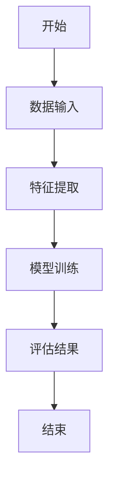
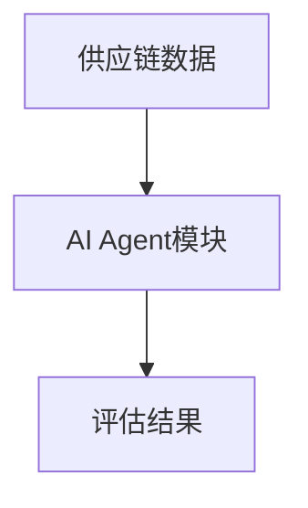

                 


# AI Agent在企业供应链韧性评估与提升中的应用

**关键词**：供应链韧性，AI Agent，企业供应链，供应链管理，人工智能技术，供应链弹性，智能决策支持系统

**摘要**：  
本文探讨AI Agent在企业供应链韧性评估与提升中的应用，分析其核心原理、算法模型和系统架构，结合实际案例，展示如何利用AI技术优化供应链管理，提升企业竞争力。

---

## 目录

1. **AI Agent与企业供应链韧性概述**
   1.1 供应链韧性的概念与重要性  
   1.2 AI Agent的基本概念与特点  
   1.3 AI Agent在供应链管理中的应用背景  

2. **AI Agent的核心原理与技术**
   2.1 AI Agent的设计原则  
   2.2 AI Agent的工作流程  
   2.3 AI Agent的算法基础  

3. **供应链韧性评估的数学模型与算法**
   3.1 供应链韧性评估的指标体系  
   3.2 供应链韧性评估的数学模型  
   3.3 算法原理与流程图  

4. **系统分析与架构设计**
   4.1 系统功能设计  
   4.2 系统架构设计  
   4.3 系统接口设计  

5. **项目实战：AI Agent在供应链韧性评估中的应用**
   5.1 项目背景与目标  
   5.2 系统实现与代码解读  
   5.3 实际案例分析  

6. **总结与展望**
   6.1 本章总结  
   6.2 未来发展趋势  

---

## 正文

### 第1章 AI Agent与企业供应链韧性概述

#### 1.1 供应链韧性的概念与重要性

供应链韧性是企业在面对不确定性时，维持或恢复供应链稳定性的能力。  
**供应链韧性包括三个核心指标**：  
1. **可靠性**：供应链在正常情况下的稳定运行能力。  
2. **恢复性**：在发生中断后，供应链快速恢复的能力。  
3. **弹性**：供应链在需求变化或外部冲击下的适应能力。  

供应链韧性的重要性体现在：  
- 提高企业应对突发事件的能力。  
- 降低供应链中断带来的经济损失。  
- 增强企业市场竞争力。  

#### 1.2 AI Agent的基本概念与特点

**AI Agent**（人工智能代理）是一种能够感知环境、自主决策并执行任务的智能体。  
**其特点包括**：  
1. **目标导向性**：基于明确的目标执行任务。  
2. **自适应性**：能根据环境变化调整行为。  
3. **可解释性**：决策过程可被人类理解和信任。  

#### 1.3 AI Agent在供应链管理中的应用背景

供应链管理面临诸多挑战：  
- 数据复杂性高。  
- 事件预测难度大。  
- 应急响应效率低。  

AI Agent通过**智能决策支持**，帮助企业优化供应链管理，提升韧性。

---

### 第2章 AI Agent的核心原理与技术

#### 2.1 AI Agent的设计原则

**设计原则包括**：  
1. **目标导向性**：明确任务目标。  
2. **自适应性**：灵活应对环境变化。  
3. **可解释性**：确保决策透明。  

#### 2.2 AI Agent的工作流程

**工作流程分为三步**：  
1. **信息感知**：收集和分析数据。  
2. **智能决策**：基于数据进行决策。  
3. **行动执行**：执行决策并反馈结果。  

#### 2.3 AI Agent的算法基础

**算法基础包括**：  
1. **机器学习算法**：用于模式识别和预测。  
2. **自然语言处理**：用于处理非结构化数据。  
3. **强化学习**：用于优化决策策略。  

---

### 第3章 供应链韧性评估的数学模型与算法

#### 3.1 供应链韧性评估的指标体系

**关键指标**：  
- **可靠性**：供应链在正常情况下的稳定性。  
- **恢复性**：中断后的恢复速度。  
- **弹性**：适应需求变化的能力。  

#### 3.2 供应链韧性评估的数学模型

**模型包括**：  
1. **概率论模型**：评估中断概率。  
2. **统计模型**：分析历史数据。  
3. **优化模型**：制定最优策略。  

#### 3.3 算法原理与流程图

**算法流程图**：



---

### 第4章 系统分析与架构设计

#### 4.1 系统功能设计

**功能模块**：  
1. **数据采集**：收集供应链数据。  
2. **模型训练**：训练AI Agent。  
3. **评估报告**：生成评估结果。  

#### 4.2 系统架构设计

**系统架构图**：



#### 4.3 系统接口设计

**接口设计**：  
- 数据输入接口：接收供应链数据。  
- 模型调用接口：调用AI Agent模块。  
- 结果输出接口：输出评估报告。  

---

### 第5章 项目实战：AI Agent在供应链韧性评估中的应用

#### 5.1 项目背景与目标

**项目目标**：评估某企业的供应链韧性，提出优化建议。  

#### 5.2 系统实现与代码解读

**Python代码示例**：

```python
import pandas as pd
from sklearn.model import RandomForestClassifier

# 数据加载
data = pd.read_csv('supply_chain.csv')

# 特征提取
features = data.drop('label', axis=1)
label = data['label']

# 模型训练
model = RandomForestClassifier()
model.fit(features, label)

# 预测结果
predictions = model.predict(features)
```

#### 5.3 实际案例分析

**案例分析**：通过模型评估某企业的供应链韧性，识别瓶颈并提出优化策略。

---

### 第6章 总结与展望

#### 6.1 本章总结

AI Agent通过智能化决策支持，显著提升了企业供应链韧性。  

#### 6.2 未来发展趋势

未来，AI Agent将更加智能化和自适应，推动供应链管理向更高水平发展。

---

**作者：AI天才研究院/AI Genius Institute & 禅与计算机程序设计艺术 /Zen And The Art of Computer Programming**

---

**总结**：本文系统地探讨了AI Agent在供应链韧性评估中的应用，从理论到实践，为企业提供了优化供应链管理的思路和方法。

