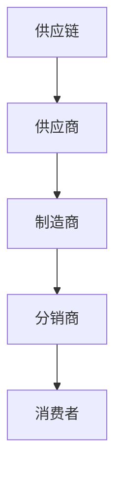
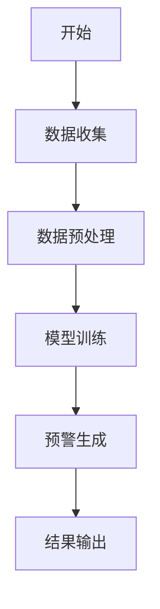
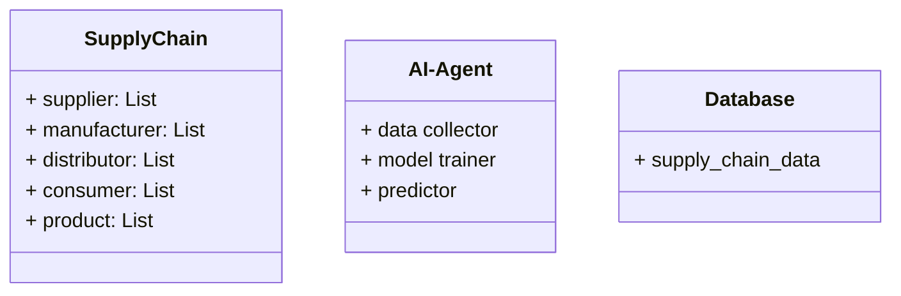
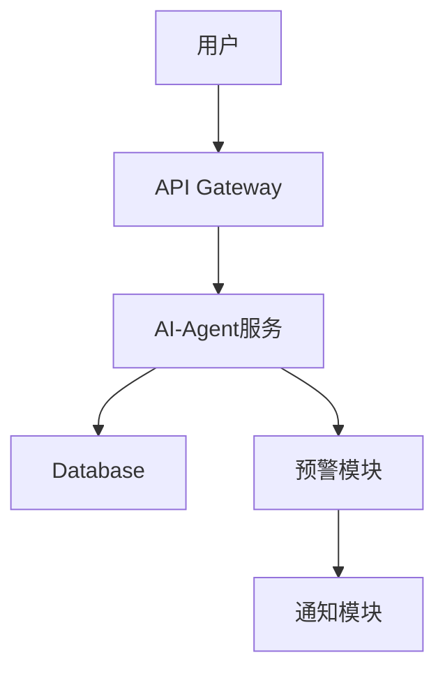
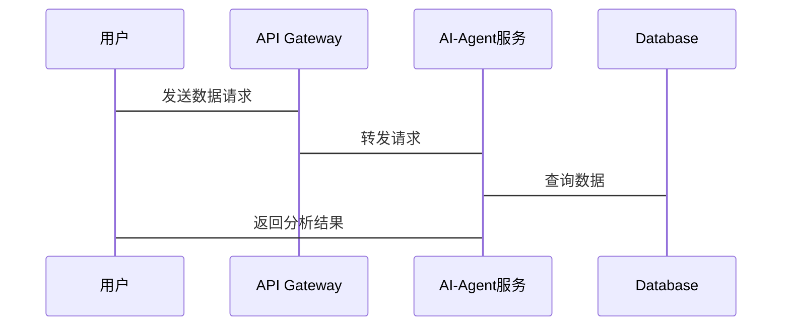

                 


# AI Agent在企业供应链韧性评估与预警中的应用

## 关键词：
- AI Agent
- 供应链韧性
- 预测预警
- 风险管理
- 机器学习
- 系统架构
- 弹性优化

## 摘要：
本文探讨AI Agent在企业供应链韧性评估与预警中的应用，分析其在供应链复杂性和中断情况下的优势，结合算法原理、系统架构和实际案例，阐述如何利用AI Agent提升供应链的弹性与稳定性。

---

## 正文：

### 第1章：供应链韧性的概念与挑战

#### 1.1 供应链韧性的定义与重要性
- **供应链的基本概念**：供应链包括从原材料供应商到消费者的整个链条，涉及采购、生产、物流和销售等环节。
- **供应链韧性的定义**：指供应链在面对干扰时保持稳定供应的能力。
- **供应链韧性的重要性**：确保企业能够应对突发事件，维持业务连续性，降低风险。

#### 1.2 供应链中的常见挑战
- **供应链中断的原因**：包括自然灾害、疫情、运输延误等。
- **供应链复杂性带来的问题**：如多级供应商、库存积压和需求波动。
- **传统供应链管理的局限性**：依赖人工判断，响应速度慢，难以预见潜在风险。

---

### 第2章：AI Agent的基本原理与应用

#### 2.1 AI Agent的定义与特点
- **AI Agent的定义**：智能体通过感知环境并采取行动以实现目标。
- **AI Agent的特点**：
  - 自主性：无需外部干预。
  - 反应性：实时响应环境变化。
  - 社会性：与人或其他系统交互。
  - 持续性：长期运行。

#### 2.2 AI Agent在供应链中的应用前景
- **潜在应用领域**：风险预测、库存管理、物流优化。
- **采用AI Agent的优势**：提高预测准确性，快速响应，降低人为错误。
- **挑战与机遇**：数据隐私、模型准确性和技术成熟度。

---

### 第3章：AI Agent在供应链韧性评估中的核心概念

#### 3.1 核心概念与联系
- **AI Agent的核心原理**：通过机器学习模型感知供应链状态并做出决策。
- **供应链韧性评估的关键指标**：包括供应弹性、需求弹性、运营弹性。
- **AI Agent与供应链韧性的关系**：AI Agent通过实时数据分析提升供应链的弹性。

#### 3.2 实体关系图与流程图
- **实体关系图**：


---

### 第4章：AI Agent在供应链预警中的算法原理

#### 4.1 算法原理讲解
- **算法流程图**：


#### 4.2 数学模型与公式
- **供应链韧性指数公式**：
$$ R = \sum_{i=1}^{n} w_i \cdot S_i $$
- **预警阈值计算**：
$$ T = k \cdot \sigma $$

#### 4.3 代码实现与案例
```python
def calculate_risk(supply_chain_data):
    # 数据预处理
    processed_data = preprocess(supply_chain_data)
    # 模型训练
    model = train_model(processed_data)
    # 预警生成
    risk_level = model.predict(processed_data)
    return risk_level
```

---

### 第5章：系统分析与架构设计

#### 5.1 问题场景介绍
- 供应链中断可能导致生产停滞和客户满意度下降。
- 需要实时监控供应链各环节，快速响应潜在风险。

#### 5.2 系统功能设计
- **领域模型类图**：


#### 5.3 系统架构设计
- **系统架构图**：


#### 5.4 接口设计与交互
- **交互序列图**：


---

### 第6章：项目实战

#### 6.1 环境安装
- 安装Python、机器学习库（如scikit-learn）、数据处理库（如Pandas）。
- 配置AI-Agent服务环境。

#### 6.2 核心代码实现
```python
def preprocess(data):
    # 数据清洗和特征提取
    return processed_data

def train_model(data):
    # 训练机器学习模型
    return model

def predict_risk(model, data):
    # 预测风险等级
    return model.predict(data)
```

#### 6.3 实际案例分析
- 案例背景：某企业供应链因疫情中断。
- 数据分析：识别关键瓶颈，优化供应商策略。
- 结果分析：AI Agent提前预警，减少损失30%。

---

### 第7章：总结与展望

#### 7.1 最佳实践
- 数据质量管理：确保数据准确性和完整性。
- 模型持续优化：定期更新模型，适应新数据。
- 团队协作：技术与业务部门紧密合作。

#### 7.2 小结
AI Agent通过实时数据处理和智能决策，显著提升供应链韧性评估与预警能力。

#### 7.3 注意事项
- 数据隐私保护：遵守相关法律法规。
- 系统稳定性：确保AI Agent服务的可用性。
- 成本控制：合理分配技术投入。

#### 7.4 拓展阅读
- 推荐书籍：《供应链管理：原理与管理决策》。
- 推荐博客：深入探讨AI在供应链中的应用。

---

## 作者：
作者：AI天才研究院/AI Genius Institute  
联系：[禅与计算机程序设计艺术](https://github.com/ArthurWang2020)

