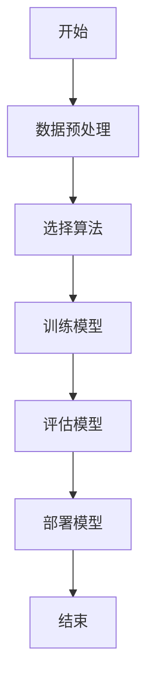
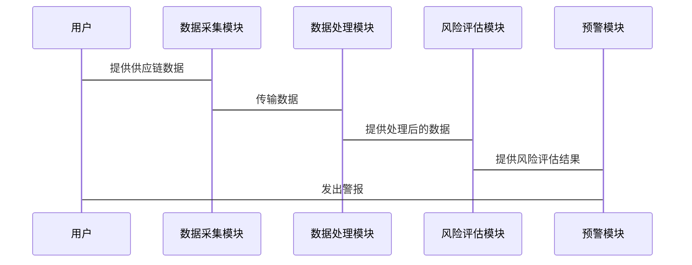
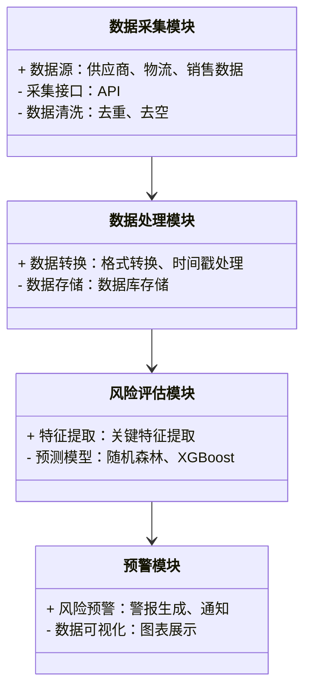

                 


# AI Agent在企业供应链风险预警中的应用

> 关键词：AI Agent, 供应链风险, 供应链管理, 机器学习, 企业风险管理, 智能预警系统

> 摘要：随着全球供应链的复杂化和不确定性增加，企业面临的风险也在不断上升。传统的供应链管理方式已经难以应对日益复杂的市场环境和潜在风险。AI Agent作为一种智能代理技术，能够在供应链风险预警中发挥重要作用。本文详细探讨了AI Agent的核心原理、在供应链风险预警中的应用场景，以及如何通过技术手段实现智能化的供应链风险管理。文章从供应链的基本概念、AI Agent的原理、算法实现、系统架构设计、项目实战等多个方面进行了全面分析，并通过具体案例展示了AI Agent在供应链风险预警中的实际应用效果。本文旨在为企业提供一种创新的供应链风险管理解决方案，助力企业在复杂多变的市场环境中保持竞争优势。

---

# 第1章: 供应链风险预警的背景与挑战

## 1.1 供应链的基本概念与运作模式
### 1.1.1 供应链的定义与组成部分
- 供应链是一个包含供应商、制造商、分销商、零售商和消费者的复杂网络。
- 核心组成部分包括：原材料供应、生产制造、物流运输、库存管理、销售与服务。
- 供应链的目标是实现从原材料到最终产品的高效流通，同时最小化成本和时间。

### 1.1.2 供应链的运作模式与特点
- 集成化：从供应商到消费者的端到端流程。
- 多层次：涉及多个层级和合作伙伴。
- 动态性：需求波动、市场变化、突发事件等影响供应链的稳定性。
- 全球化：跨国供应链的复杂性增加管理难度。

### 1.1.3 供应链管理的核心目标
- 提高效率：优化库存、缩短交货时间、降低运营成本。
- 提升灵活性：快速响应市场变化和客户需求。
- 降低风险：识别和应对潜在的供应链中断风险。

## 1.2 供应链风险的定义与分类
### 1.2.1 供应链风险的定义
- 供应链风险是指由于供应链中的某个环节出现问题，导致整个供应链中断或效率下降的可能性。
- 包括内部风险（如库存积压、生产延迟）和外部风险（如自然灾害、疫情、战争）。

### 1.2.2 供应链风险的主要类型
| 风险类型 | 描述 | 示例 |
|----------|------|------|
| 供应风险 | 供应商无法按时交付原材料或服务 | 供应商罢工、原材料短缺 |
| 生产风险 | 生产过程中的设备故障或人员不足 | 工厂火灾、生产线故障 |
| 物流风险 | 运输延误或物流成本增加 | 地震、洪水、交通罢工 |
| 市场风险 | 市场需求变化或价格波动 | 经济衰退、消费者偏好变化 |
| 操作风险 | 人为错误或流程缺陷 | 数据录入错误、流程优化不足 |

### 1.2.3 供应链风险的影响与后果
- 经济损失：库存积压、订单取消、罚款。
- 客户满意度下降：交货延迟、产品质量问题。
- 企业声誉受损：供应链中断可能导致客户信任度下降。
- 法律责任：未能按时交付可能导致合同违约。

## 1.3 供应链风险预警的重要性
### 1.3.1 供应链中断对企业的影响
- 供应链中断可能导致企业停产，进而影响收入和利润。
- 供应链中断可能引发连锁反应，影响整个产业链。
- 供应链中断可能增加企业的应急成本（如空运、临时供应商）。

### 1.3.2 风险预警在供应链管理中的作用
- 提前识别潜在风险，采取预防措施。
- 减少供应链中断的可能性，降低损失。
- 提高供应链的透明度和可追溯性。

### 1.3.3 传统供应链风险管理的局限性
- 传统方法依赖人工监控，效率低、覆盖面有限。
- 数据孤岛问题：各部门数据分散，难以全面分析。
- 响应速度慢：人工分析无法及时应对突发事件。

## 1.4 AI Agent在供应链管理中的应用前景
### 1.4.1 AI Agent的定义与特点
- AI Agent是一种能够感知环境、自主决策并采取行动的智能系统。
- 具有自主性、反应性、目标导向性和学习能力。

### 1.4.2 AI Agent在供应链管理中的优势
- 实时监控：AI Agent可以实时分析供应链数据，快速识别潜在风险。
- 自动响应：AI Agent可以在检测到风险时，自动采取应对措施（如调整订单、通知相关部门）。
- 数据驱动：基于历史数据和实时数据，AI Agent可以提供更精准的预测和决策。

### 1.4.3 供应链风险预警中的AI Agent应用潜力
- AI Agent可以通过机器学习模型预测供应链中断的可能性。
- AI Agent可以实时监控物流、生产和库存数据，提前发出预警。
- AI Agent可以优化供应链的资源配置，提高整体效率。

## 1.5 本章小结
本章介绍了供应链的基本概念、运作模式和管理目标，分析了供应链风险的种类及其影响，指出了传统供应链风险管理的局限性。最后，探讨了AI Agent在供应链管理中的应用前景及其在供应链风险预警中的潜力。

---

# 第2章: AI Agent的核心原理与技术基础

## 2.1 AI Agent的基本概念
### 2.1.1 AI Agent的定义
AI Agent是一种智能代理系统，能够感知环境、自主决策并采取行动以实现特定目标。

### 2.1.2 AI Agent的核心特征
- 自主性：AI Agent可以自主决策，无需人工干预。
- 反应性：AI Agent能够实时感知环境并做出反应。
- 目标导向性：AI Agent的行为以实现特定目标为导向。
- 学习能力：AI Agent可以通过机器学习不断优化自身的决策能力。

## 2.2 AI Agent的工作原理
### 2.2.1 感知层：数据采集与处理
- 数据采集：通过传感器、数据库、API等方式获取供应链相关数据。
- 数据处理：对采集到的数据进行清洗、转换和分析，提取有用的信息。

### 2.2.2 计划层：决策与规划
- 数据分析：基于历史数据和实时数据，分析供应链的运行状态。
- 风险评估：通过机器学习模型预测潜在风险。
- 决策制定：根据风险评估结果，制定应对策略。

### 2.2.3 执行层：行动与反馈
- 行动：AI Agent根据决策结果采取行动（如调整订单、通知相关部门）。
- 反馈：收集行动结果，评估效果并优化决策模型。

## 2.3 AI Agent的关键技术
### 2.3.1 机器学习算法
- 监督学习：用于分类和回归任务（如预测供应链中断概率）。
- 无监督学习：用于聚类和异常检测（如识别异常供应链数据）。
- 强化学习：用于优化供应链的决策过程。

### 2.3.2 自然语言处理
- 文本分析：从供应链相关的文档中提取信息（如供应商合同、市场报告）。
- 实时监控：分析社交媒体、新闻等非结构化数据，识别潜在风险。

### 2.3.3 实时数据处理与分析
- 数据流处理：实时处理供应链中的数据流，快速识别异常情况。
- 大数据分析：利用大数据技术分析海量数据，提取有价值的信息。

## 2.4 AI Agent在供应链中的应用优势
### 2.4.1 提高决策效率
- AI Agent可以通过机器学习模型快速分析数据，提供决策支持。
- 自动化决策：AI Agent可以在短时间内做出决策，提高效率。

### 2.4.2 实现智能化监控
- AI Agent可以实时监控供应链的各个环节，发现潜在风险。
- 自动报警：AI Agent可以在检测到风险时，立即发出警报。

### 2.4.3 优化资源配置
- AI Agent可以通过优化算法，合理分配资源，提高供应链的整体效率。
- 自动调整：AI Agent可以根据实时数据，自动调整供应链的资源配置。

## 2.5 本章小结
本章详细介绍了AI Agent的基本概念、工作原理和关键技术，分析了AI Agent在供应链管理中的应用优势。

---

# 第3章: 供应链风险预警中的AI Agent应用场景

## 3.1 供应链风险预警的核心场景
### 3.1.1 供应商风险预警
- 供应商风险：供应商无法按时交付原材料或服务。
- 应用场景：AI Agent可以通过分析供应商的历史交货记录、信用评分等数据，预测供应商的可靠性，并在潜在风险出现时发出预警。

### 3.1.2 库存风险预警
- 库存风险：库存积压或短缺，影响供应链的效率。
- 应用场景：AI Agent可以通过分析销售数据、市场需求预测，优化库存管理，避免库存积压或短缺。

### 3.1.3 物流风险预警
- 物流风险：物流延误或运输成本增加。
- 应用场景：AI Agent可以通过实时监控物流数据（如运输时间、天气状况），预测物流风险，并在可能出现延误时提前调整物流计划。

### 3.1.4 市场风险预警
- 市场风险：市场需求变化或价格波动。
- 应用场景：AI Agent可以通过分析市场数据（如销售趋势、价格变化），预测市场需求变化，并帮助企业调整生产计划和库存管理。

## 3.2 AI Agent在供应链风险预警中的具体应用
### 3.2.1 供应商风险预警
- 数据输入：供应商的历史交货记录、信用评分、地理位置。
- 数据分析：通过机器学习模型预测供应商的可靠性。
- 预警机制：在潜在风险出现时，AI Agent发出警报，并建议替代供应商。

### 3.2.2 库存风险预警
- 数据输入：销售数据、市场需求预测、库存水平。
- 数据分析：通过机器学习模型预测库存需求，优化库存管理。
- 预警机制：在库存积压或短缺时，AI Agent发出警报，并建议调整生产计划或采购策略。

### 3.2.3 物流风险预警
- 数据输入：物流数据（如运输时间、天气状况）、供应商位置。
- 数据分析：通过机器学习模型预测物流风险。
- 预警机制：在可能出现延误时，AI Agent提前调整物流计划，并通知相关部门。

### 3.2.4 市场风险预警
- 数据输入：市场数据（如销售趋势、价格变化）、竞争对手信息。
- 数据分析：通过机器学习模型预测市场需求变化。
- 预警机制：在市场需求变化时，AI Agent建议调整生产计划和库存管理。

## 3.3 AI Agent在供应链风险预警中的优势
### 3.3.1 实时监控
- AI Agent可以实时监控供应链的各个环节，快速识别潜在风险。
- 实时分析：AI Agent可以实时分析数据，提供及时的预警。

### 3.3.2 自动化决策
- AI Agent可以根据实时数据，自动做出决策，减少人为干预。
- 自动调整：AI Agent可以根据预警结果，自动调整供应链的资源配置。

### 3.3.3 数据驱动的精准预警
- AI Agent可以通过机器学习模型，精准预测供应链中断的可能性。
- 数据分析：AI Agent可以分析海量数据，提取有价值的信息，提高预警的准确性。

## 3.4 本章小结
本章介绍了供应链风险预警的核心场景，并详细分析了AI Agent在这些场景中的具体应用。AI Agent可以通过实时监控、自动化决策和数据驱动的精准预警，有效降低供应链风险。

---

# 第4章: AI Agent在供应链风险预警中的技术实现

## 4.1 供应链风险预警的算法原理
### 4.1.1 机器学习算法在供应链风险预警中的应用
- 监督学习：用于分类和回归任务（如预测供应链中断概率）。
- 无监督学习：用于聚类和异常检测（如识别异常供应链数据）。
- 强化学习：用于优化供应链的决策过程。

### 4.1.2 供应链风险预警的数学模型
- 风险评估模型：基于历史数据和实时数据，建立供应链风险评估模型。
- 预测模型：通过机器学习算法，预测供应链中断的可能性。

### 4.1.3 算法流程图


## 4.2 供应链风险预警的系统架构设计
### 4.2.1 系统功能设计
- 数据采集模块：采集供应链相关数据（如供应商数据、销售数据、物流数据）。
- 数据处理模块：对采集到的数据进行清洗、转换和分析。
- 风险评估模块：通过机器学习模型评估供应链风险。
- 预警模块：在检测到风险时，发出警报并建议应对措施。

### 4.2.2 系统架构图


### 4.2.3 系统交互流程图


## 4.3 供应链风险预警的系统实现
### 4.3.1 环境搭建
- 安装Python、机器学习库（如scikit-learn、XGBoost）和数据分析工具（如Pandas、NumPy）。
- 安装可视化工具（如Matplotlib、Seaborn）。

### 4.3.2 数据预处理
```python
import pandas as pd
import numpy as np

# 读取数据
data = pd.read_csv('supply_chain_data.csv')

# 数据清洗
data = data.dropna()
data = data.drop_duplicates()

# 数据转换
data['date'] = pd.to_datetime(data['date'])
data['label'] = data['label'].astype('int')
```

### 4.3.3 模型训练
```python
from sklearn.model_selection import train_test_split
from sklearn.ensemble import RandomForestClassifier
from sklearn.metrics import accuracy_score

# 划分数据集
X_train, X_test, y_train, y_test = train_test_split(data.drop('label', axis=1), data['label'], test_size=0.2)

# 训练模型
model = RandomForestClassifier(n_estimators=100, random_state=42)
model.fit(X_train, y_train)

# 评估模型
y_pred = model.predict(X_test)
print("准确率:", accuracy_score(y_test, y_pred))
```

### 4.3.4 风险预警
```python
import joblib

# 保存模型
joblib.dump(model, 'supply_chain_risk_model.pkl')

# 预测风险
new_data = pd.read_csv('new_supply_chain_data.csv')
new_data = new_data.dropna().drop_duplicates()
predicted_risk = model.predict(new_data.drop('label', axis=1))

# 输出预警
for i in range(len(predicted_risk)):
    if predicted_risk[i] == 1:
        print(f"潜在风险：第{i+1}条记录存在供应链中断风险。")
```

## 4.4 本章小结
本章详细介绍了供应链风险预警的技术实现，包括算法原理、系统架构设计和系统实现。通过机器学习算法和系统架构设计，AI Agent可以有效预警供应链风险。

---

# 第5章: 供应链风险预警中的系统分析与架构设计

## 5.1 系统分析
### 5.1.1 问题场景介绍
- 供应链中断风险：供应商延迟交付、物流延误、市场需求变化。
- 数据孤岛问题：各部门数据分散，难以全面分析。
- 响应速度慢：人工分析无法及时应对突发事件。

### 5.1.2 项目介绍
- 项目目标：开发一个基于AI Agent的供应链风险预警系统。
- 项目范围：涵盖供应商、生产、物流和销售等环节。
- 项目需求：实时监控、自动化预警、智能决策。

## 5.2 系统功能设计
### 5.2.1 领域模型设计


### 5.2.2 系统架构设计


### 5.2.3 系统接口设计
- 数据采集接口：API接口用于从供应商、物流等系统获取数据。
- 数据处理接口：API接口用于数据清洗、转换和存储。
- 风险评估接口：API接口用于特征提取和模型训练。
- 预警接口：API接口用于警报生成和通知。

### 5.2.4 系统交互流程设计


## 5.3 本章小结
本章通过系统分析和架构设计，详细介绍了供应链风险预警系统的实现方案。通过领域模型设计和系统架构设计，明确了各模块的功能和交互流程。

---

# 第6章: 供应链风险预警的项目实战

## 6.1 环境搭建
### 6.1.1 安装必要的工具和库
- Python：安装最新版本的Python。
- 数据分析库：安装Pandas、NumPy、Matplotlib。
- 机器学习库：安装scikit-learn、XGBoost、RandomForest。
- 可视化工具：安装Seaborn、Plotly。

### 6.1.2 数据集准备
- 获取供应链相关数据：供应商数据、销售数据、物流数据。
- 数据清洗：去除空值、重复值。
- 数据转换：转换数据格式、时间戳处理。

## 6.2 系统核心实现
### 6.2.1 数据预处理
```python
import pandas as pd
import numpy as np

# 读取数据
data = pd.read_csv('supply_chain_data.csv')

# 数据清洗
data = data.dropna()
data = data.drop_duplicates()

# 数据转换
data['date'] = pd.to_datetime(data['date'])
data['label'] = data['label'].astype('int')
```

### 6.2.2 模型训练
```python
from sklearn.model_selection import train_test_split
from sklearn.ensemble import RandomForestClassifier
from sklearn.metrics import accuracy_score

# 划分数据集
X_train, X_test, y_train, y_test = train_test_split(data.drop('label', axis=1), data['label'], test_size=0.2)

# 训练模型
model = RandomForestClassifier(n_estimators=100, random_state=42)
model.fit(X_train, y_train)

# 评估模型
y_pred = model.predict(X_test)
print("准确率:", accuracy_score(y_test, y_pred))
```

### 6.2.3 风险预警
```python
import joblib

# 保存模型
joblib.dump(model, 'supply_chain_risk_model.pkl')

# 预测风险
new_data = pd.read_csv('new_supply_chain_data.csv')
new_data = new_data.dropna().drop_duplicates()
predicted_risk = model.predict(new_data.drop('label', axis=1))

# 输出预警
for i in range(len(predicted_risk)):
    if predicted_risk[i] == 1:
        print(f"潜在风险：第{i+1}条记录存在供应链中断风险。")
```

## 6.3 实际案例分析
### 6.3.1 案例背景
- 某公司供应链中断导致生产延迟，造成经济损失。
- 通过AI Agent预警系统提前识别风险，避免了潜在损失。

### 6.3.2 数据分析
- 数据来源：供应商交货记录、销售数据、物流数据。
- 数据分析：通过机器学习模型预测供应链中断概率。

### 6.3.3 预警结果
- 预警时间：提前一周发现潜在风险。
- 预警措施：调整采购计划、增加备选供应商。

## 6.4 项目小结
本章通过实际案例分析，展示了AI Agent在供应链风险预警中的实际应用。通过数据预处理、模型训练和风险预警，AI Agent可以帮助企业有效降低供应链风险。

---

# 第7章: 总结与展望

## 7.1 本章总结
- 供应链风险预警的重要性：供应链中断可能导致企业经济损失和声誉损害。
- AI Agent的优势：实时监控、自动化决策、数据驱动的精准预警。
- 技术实现：机器学习算法、系统架构设计、API接口设计。

## 7.2 当前技术的优缺点
- 优势：AI Agent可以通过机器学习模型精准预测供应链中断概率，实时监控供应链的各个环节，自动化决策减少人为干预。
- 劣势：数据孤岛问题、模型的准确性和可解释性、系统的可扩展性。

## 7.3 未来展望
### 7.3.1 多模态模型的应用
- 综合利用结构化数据和非结构化数据，提高预警的准确性。
- 多模态模型：结合文本、图像、视频等多种数据源，提供更全面的供应链风险评估。

### 7.3.2 边缘计算的结合
- 在边缘设备上部署AI Agent，实时监控供应链数据。
- 边缘计算的优势：减少数据传输延迟、提高数据安全性。

### 7.3.3 人工智能技术的持续进步
- 更先进的机器学习算法：如深度学习、图神经网络，提高模型的准确性和可解释性。
- 自然语言处理技术的进步：提高文本分析能力，识别潜在风险。

## 7.4 本章小结
本章总结了供应链风险预警的重要性和AI Agent的优势，分析了当前技术的优缺点，并展望了未来的发展方向。

---

# 作者：AI天才研究院/AI Genius Institute & 禅与计算机程序设计艺术 /Zen And The Art of Computer Programming

