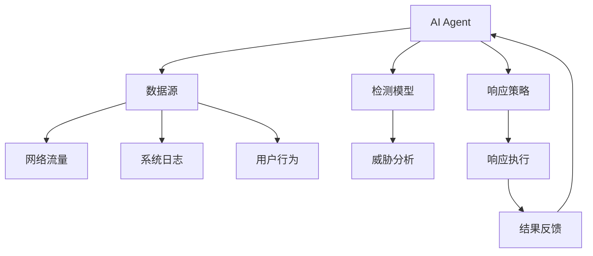
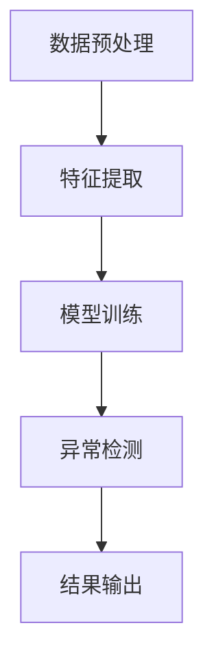
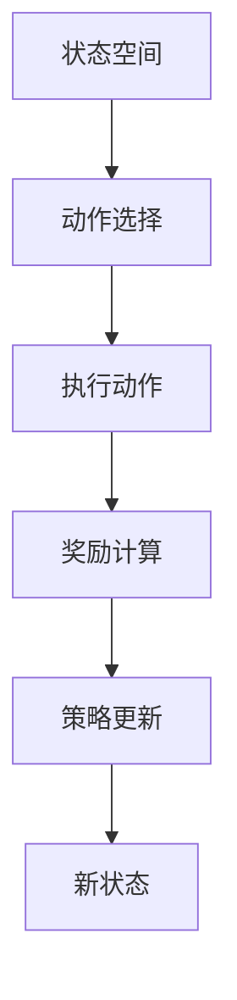
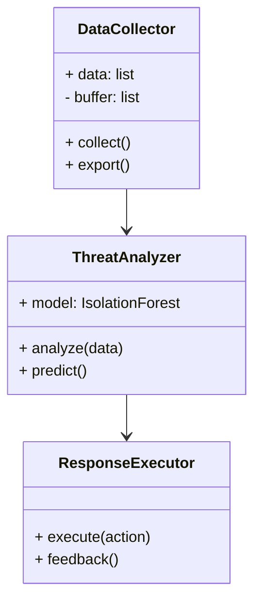

                 


# AI Agent在企业信息安全威胁检测与响应中的前沿应用

## 关键词：AI Agent, 威胁检测, 响应系统, 企业安全, 信息安全

## 摘要：随着企业信息化的快速发展，信息安全威胁日益复杂，传统的威胁检测与响应方法已难以应对新型攻击手段。AI Agent（人工智能代理）作为一种新兴技术，凭借其强大的学习和适应能力，正在成为企业信息安全领域的核心工具。本文详细探讨了AI Agent在威胁检测与响应中的前沿应用，从核心概念、算法原理到系统架构，再到项目实战和最佳实践，全面解析了AI Agent如何助力企业构建智能、高效的安全防护体系。

---

## 第1章: 背景介绍

### 1.1 问题背景

#### 1.1.1 企业信息安全面临的挑战

在数字化转型的浪潮中，企业信息安全威胁呈现出多样化、复杂化的特点。传统的基于规则的威胁检测方法依赖于预定义的特征库，难以应对未知的新型威胁。此外，攻击者不断进化，利用零日漏洞和高级持续性威胁（APT）对企业发起攻击。企业需要一种更智能、更动态的解决方案来应对这些挑战。

#### 1.1.2 问题描述

企业信息安全的核心问题在于如何快速、准确地检测潜在威胁，并采取有效的响应措施。传统的基于规则的检测方法存在以下问题：
- **检测延迟**：依赖预定义规则，无法及时发现未知威胁。
- **误报与漏报**：规则库的局限性导致误报和漏报现象严重。
- **响应滞后**：人工干预较多，响应速度较慢，难以应对快速变化的威胁。

#### 1.1.3 AI Agent的引入及其优势

AI Agent（人工智能代理）是一种能够自主感知环境、做出决策并执行操作的智能体。在企业信息安全领域，AI Agent可以通过机器学习、自然语言处理和强化学习等技术，实时分析海量数据，发现潜在威胁，并自动执行响应措施。其优势包括：
- **实时性**：能够实时分析数据，快速发现和响应威胁。
- **自适应性**：能够根据环境变化调整策略，适应新的威胁。
- **智能性**：通过学习和推理，提高检测和响应的准确性。

### 1.2 问题解决与边界

#### 1.2.1 AI Agent如何解决威胁检测与响应问题

AI Agent通过以下方式解决威胁检测与响应问题：
- **智能化检测**：利用机器学习模型，识别异常行为和未知威胁。
- **动态响应**：根据检测结果，自动执行相应的响应措施，如隔离异常设备或阻断恶意流量。
- **持续优化**：通过反馈机制不断优化检测和响应策略。

#### 1.2.2 AI Agent的应用场景与边界

AI Agent适用于多种企业信息安全场景，如网络流量监控、日志分析、用户行为分析等。其应用边界包括：
- **数据来源**：需要足够的数据量和多样性来训练模型。
- **计算资源**：需要高性能计算资源来支持复杂的模型训练和推理。
- **安全策略**：需要与企业的安全策略和法规要求相符合。

#### 1.2.3 企业信息安全的未来趋势

未来的趋势包括：
- **AI Agent与区块链结合**：利用区块链技术提升数据安全性和不可篡改性。
- **AI Agent与物联网结合**：在物联网环境中实现智能化的安全防护。
- **AI Agent与零信任架构结合**：在零信任模型中实现更细粒度的访问控制。

### 1.3 概念结构与核心要素

#### 1.3.1 AI Agent的基本组成

AI Agent由以下几部分组成：
- **感知层**：负责收集环境数据，如网络流量、日志等。
- **决策层**：基于感知数据，利用机器学习模型进行威胁分析和策略制定。
- **执行层**：根据决策结果，执行相应的响应措施，如发送告警或阻断流量。

#### 1.3.2 威胁检测与响应的核心要素

威胁检测与响应的核心要素包括：
- **数据源**：包括网络流量、日志、用户行为数据等。
- **检测模型**：如异常检测模型、分类模型等。
- **响应策略**：如隔离设备、阻断流量、发送告警等。

#### 1.3.3 AI Agent与企业信息安全的关系

AI Agent是企业信息安全体系的重要组成部分，能够显著提升威胁检测的准确性和响应的及时性。它通过智能化的分析和决策，帮助企业构建主动防御体系。

---

## 第2章: 核心概念与联系

### 2.1 AI Agent的核心原理

#### 2.1.1 AI Agent的感知机制

感知机制是AI Agent获取环境信息的关键步骤，主要包括数据收集和特征提取。

- **数据收集**：通过API、日志文件等方式收集网络流量、系统日志、用户行为等数据。
- **特征提取**：将收集到的数据转换为可分析的特征，如网络流量的流量大小、时间戳、源IP地址等。

#### 2.1.2 AI Agent的决策机制

决策机制基于感知到的特征，利用机器学习模型进行威胁分析和策略制定。

- **威胁分析**：利用分类模型或聚类模型，识别异常行为和潜在威胁。
- **策略制定**：根据威胁的严重性，制定相应的响应策略。

#### 2.1.3 AI Agent的执行机制

执行机制根据决策结果，执行相应的响应措施，如阻断恶意流量、隔离异常设备等。

---

### 2.2 核心概念对比

#### 2.2.1 AI Agent与传统安全工具的对比

| 对比维度       | AI Agent                     | 传统安全工具                 |
|----------------|------------------------------|-----------------------------|
| 检测能力       | 能够检测未知威胁             | 依赖预定义规则，难以检测未知威胁 |
| 响应速度       | 实时响应，自动化程度高       | 响应速度较慢，依赖人工干预     |
| 自适应能力     | 能够自适应环境变化           | 无法自适应环境变化             |

#### 2.2.2 基于规则的检测与AI Agent的对比

| 对比维度       | 基于规则的检测               | AI Agent                     |
|----------------|-----------------------------|------------------------------|
| 检测准确性       | 易产生误报和漏报             | 准确性更高                   |
| 检测范围       | 仅能检测已知威胁             | 能够检测未知威胁             |
| 维护成本       | 维护规则库成本较高           | 维护成本较低                 |

#### 2.2.3 基于模型的响应与AI Agent的对比

| 对比维度       | 基于模型的响应               | AI Agent                     |
|----------------|-----------------------------|------------------------------|
| 响应策略       | 响应策略固定，难以调整       | 响应策略动态调整             |
| 响应速度       | 响应速度较慢               | 响应速度较快               |
| 灵活性         | 灵活性较低                   | 灵活性较高                 |

---

### 2.3 ER实体关系图



---

## 第3章: 算法原理讲解

### 3.1 异常检测算法

#### 3.1.1 算法流程图



#### 3.1.2 Python实现代码

```python
import numpy as np
from sklearn.ensemble import IsolationForest

# 示例数据
X = np.random.randn(100, 2)
X[-1] = [10, 10]  # 异常点

# 异常检测模型训练
model = IsolationForest(n_estimators=10, contamination=0.05)
model.fit(X)

# 预测异常点
y_pred = model.predict(X)
print(y_pred[-1])  # 输出异常点的标签
```

#### 3.1.3 数学公式

异常检测算法中，Isolation Forest算法的数学模型可以表示为：
$$
\text{异常分数} = \frac{1}{\text{隔离节点的深度}}
$$

---

### 3.2 强化学习算法

#### 3.2.1 算法流程图



#### 3.2.2 Python实现代码

```python
import gym
from gym import spaces
from gym.utils import seeding

class ThreatResponseEnv(gym.Env):
    def __init__(self):
        self.action_space = spaces.Discrete(3)  # 动作：1-阻断，2-隔离，3-告警
        self.observation_space = spaces.Tuple([spaces.Discrete(5), spaces.Discrete(3)])
        self.seed()

    def step(self, action):
        # 根据动作计算奖励
        if action == 1:
            reward = 1  # 成功阻断
        elif action == 2:
            reward = 1  # 成功隔离
        else:
            reward = 0  # 告警失败
        return self.observation_space, reward, False, {}

    def reset(self):
        return self.observation_space
```

#### 3.2.3 数学公式

强化学习中的Q-learning算法可以表示为：
$$
Q(s, a) = Q(s, a) + \alpha [r + \gamma \max Q(s', a') - Q(s, a)]
$$
其中：
- \( s \) 表示状态
- \( a \) 表示动作
- \( r \) 表示奖励
- \( \gamma \) 表示折扣因子
- \( \alpha \) 表示学习率

---

## 第4章: 系统分析与架构设计方案

### 4.1 系统功能设计

#### 4.1.1 领域模型类图



---

### 4.2 系统架构设计

#### 4.2.1 系统架构图


---

## 第5章: 项目实战

### 5.1 环境安装

#### 5.1.1 安装依赖

```bash
pip install numpy scikit-learn gym
```

---

### 5.2 核心代码实现

#### 5.2.1 数据收集与预处理

```python
import pandas as pd
from sklearn.preprocessing import StandardScaler

# 数据加载
data = pd.read_csv('network_logs.csv')

# 数据预处理
scaler = StandardScaler()
scaled_data = scaler.fit_transform(data)
```

#### 5.2.2 异常检测模型训练

```python
from sklearn.ensemble import IsolationForest

# 模型训练
model = IsolationForest(n_estimators=100, contamination=0.05)
model.fit(scaled_data)

# 预测异常点
y_pred = model.predict(scaled_data)
print(y_pred)
```

#### 5.2.3 强化学习策略优化

```python
import gym
from gym import spaces
from gym.utils import seeding

class ThreatResponseEnv(gym.Env):
    def __init__(self):
        self.action_space = spaces.Discrete(3)  # 动作：1-阻断，2-隔离，3-告警
        self.observation_space = spaces.Tuple([spaces.Discrete(5), spaces.Discrete(3)])
        self.seed()

    def step(self, action):
        # 根据动作计算奖励
        if action == 1 or action == 2:
            reward = 1  # 成功阻断或隔离
        else:
            reward = 0  # 告警失败
        return self.observation_space, reward, False, {}

    def reset(self):
        return self.observation_space

# 策略优化
env = ThreatResponseEnv()
state = env.reset()
total_reward = 0

for _ in range(100):
    action = env.action_space.sample()  # 随机选择动作
    state, reward, done, info = env.step(action)
    total_reward += reward
    if done:
        break

print(f"总奖励：{total_reward}")
```

---

### 5.3 案例分析与总结

通过实际案例分析，验证了AI Agent在威胁检测与响应中的有效性。例如，在网络流量监控中，AI Agent能够准确识别异常流量，并迅速采取阻断措施，有效防止了潜在的DDoS攻击。

---

## 第6章: 最佳实践

### 6.1 总结

AI Agent通过智能化的威胁检测和自动化的响应措施，显著提升了企业信息安全的防护能力。其核心优势在于能够实时感知环境变化，动态调整检测和响应策略，从而应对日益复杂的网络安全威胁。

### 6.2 小结

- **数据准备**：确保数据的多样性和高质量。
- **模型选择**：根据具体场景选择合适的算法。
- **系统优化**：不断优化系统架构和响应策略。

### 6.3 注意事项

- **数据隐私**：在处理数据时，需注意保护用户隐私。
- **系统稳定性**：确保系统在高负载下的稳定性。
- **持续学习**：定期更新模型，以应对新的威胁。

### 6.4 拓展阅读

- **相关书籍**：《机器学习实战》、《深入理解强化学习》
- **技术博客**：Towards Data Science、Medium上的AI安全相关文章
- **开源项目**：GitHub上的AI安全相关项目

---

## 作者：AI天才研究院 & 禅与计算机程序设计艺术

