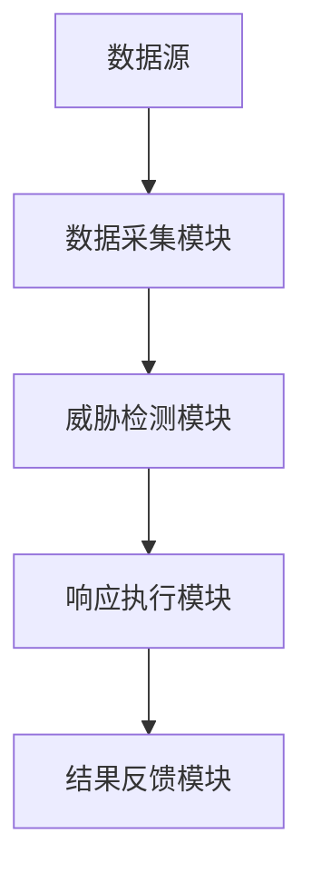
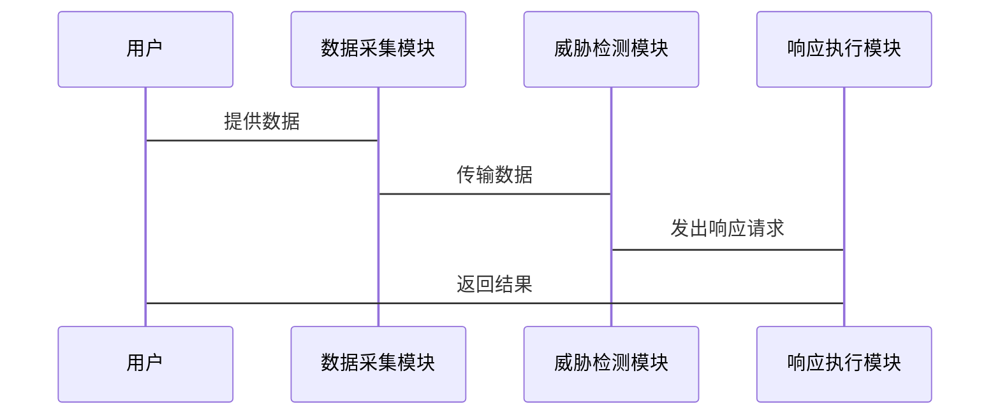

                 

<think>
好的，我现在需要撰写一篇关于《AI Agent在企业信息安全威胁检测与响应中的应用》的技术博客文章。文章需要结构清晰，内容详实，符合用户的要求。

首先，我需要明确文章的核心内容和主题。AI Agent在企业信息安全中的应用，主要涉及威胁检测和响应。因此，我需要涵盖AI Agent的基本概念、算法原理、系统架构设计、实战案例以及最佳实践等内容。

接下来，我会按照目录结构逐步展开内容。首先，介绍AI Agent的基本概念，包括定义、工作原理及其在信息安全中的作用。这部分需要确保读者能够理解什么是AI Agent以及它在企业安全中的重要性。

然后，详细讲解AI Agent的算法原理。包括监督学习、无监督学习和强化学习，每个部分都要有数学公式和mermaid流程图来辅助说明。例如，监督学习的损失函数和无监督学习的距离度量公式。

接下来是系统架构设计。这部分需要描述系统的各个模块，如数据采集、威胁检测、响应执行等，并用mermaid图展示系统架构。同时，系统接口设计和交互流程图也是必要的，帮助读者理解系统如何运作。

然后，我会加入项目实战部分。这部分需要具体指导读者如何安装环境，编写代码，分析案例。包括代码实现和案例分析，让读者能够实际操作。

最后，我会总结最佳实践、小结、注意事项和拓展阅读，帮助读者巩固知识，扩展视野。

在写作过程中，我需要确保每个部分都涵盖必要的内容，并且结构清晰，逻辑连贯。这样，读者才能全面理解AI Agent在企业信息安全中的应用。

现在，我开始撰写每个部分的具体内容。

首先是摘要部分：

摘要：随着企业信息化的快速发展，信息安全威胁日益复杂化和多样化。传统的基于规则的安全解决方案已经难以应对新型威胁。AI Agent通过其智能感知、自主决策和持续学习的能力，为企业提供了更加动态、精准和高效的威胁检测与响应能力。本文系统地阐述了AI Agent在企业信息安全威胁检测与响应中的应用，详细分析了其算法原理、系统架构设计以及实际应用场景。通过案例分析和数学模型的展示，深入探讨了AI Agent的优势与挑战，并提出了相应的解决方案和优化建议。本文旨在为企业信息安全领域的技术人员和决策者提供理论指导和实践参考。

接下来是关键词部分：

关键词：AI Agent, 企业信息安全, �威 �胁检测, 响应策略, 智能安全

然后是正文部分：

# AI Agent在企业信息安全威胁检测与响应中的应用

## 第1章: AI Agent的基本概念与应用背景

### 1.1 AI Agent的定义与核心概念

AI Agent（人工智能代理）是指具有感知环境、自主决策、执行操作并能够从经验中学习的智能实体。它能够通过传感器获取信息，利用算法进行分析，并根据分析结果采取相应行动。在企业信息安全领域，AI Agent主要用于威胁检测、风险评估和响应策略的制定。

AI Agent的核心概念包括：

1. **自主性**：AI Agent能够在没有人工干预的情况下独立运行。
2. **反应性**：能够实时感知环境变化并做出相应反应。
3. **学习性**：通过机器学习算法不断优化自身的检测和响应能力。

### 1.2 AI Agent在信息安全中的作用

AI Agent在信息安全中的应用主要集中在威胁检测和响应两个方面：

#### 1.2.1 威胁检测

AI Agent通过分析网络流量、日志数据和用户行为等信息，能够发现异常模式，从而识别潜在的威胁。与传统的基于规则的检测方法相比，AI Agent能够发现未知的攻击模式，具有更高的检测精度。

#### 1.2.2 响应策略

一旦检测到威胁，AI Agent能够迅速采取相应的响应措施，如切断网络连接、隔离受感染的设备或调用安全工具进行进一步处理。这种自动化响应能够有效降低威胁的影响范围。

### 1.3 企业信息安全中的问题背景与挑战

随着企业信息化的深入，信息安全威胁日益复杂化和多样化。传统的基于规则的安全解决方案已经难以应对新型威胁，如零日攻击和高级持续性威胁（APT）。AI Agent的引入为企业提供了一种动态、精准和高效的威胁检测与响应方式。

## 第2章: AI Agent的算法原理

### 2.1 基于监督学习的威胁检测

#### 2.1.1 监督学习的基本原理

监督学习是一种机器学习方法，通过训练数据集学习输入与输出之间的关系。在威胁检测中，训练数据包括正常和异常行为的样本，模型通过学习这些样本，能够预测新的数据属于正常还是异常。

#### 2.1.2 威胁检测的分类模型

常用的监督学习算法包括支持向量机（SVM）和随机森林（Random Forest）。这些算法能够对网络流量、日志数据等进行分类，识别出潜在的威胁。

#### 2.1.3 算法实现与案例分析

以支持向量机为例，假设我们有两类数据，正常流量和异常流量。我们可以通过训练SVM模型，使其能够区分这两类数据。

数学模型：
$$
\text{SVM的目标是最小化} \quad \frac{1}{2}\|w\|^2 + C\sum_{i=1}^{n} \xi_i
$$

其中，\( w \) 是权重向量，\( \xi_i \) 是松弛变量，\( C \) 是惩罚参数。

### 2.2 基于无监督学习的异常检测

#### 2.2.1 无监督学习的基本原理

无监督学习是一种机器学习方法，适用于数据中没有明确标签的情况。在威胁检测中，无监督学习可以用于发现异常模式。

#### 2.2.2 基于聚类的异常检测

聚类是一种无监督学习技术，用于将数据分成若干组。异常检测可以通过检测那些离大多数数据点较远的点来实现。

数学模型：
$$
d(x_i, x_j) = \sqrt{(x_i - x_j)^2}
$$

其中，\( d(x_i, x_j) \) 是点 \( x_i \) 和 \( x_j \) 之间的距离。

#### 2.2.3 基于自监督学习的异常检测

自监督学习是一种无监督学习技术，通过预测未观察到的输入部分来学习数据的特征表示。

### 2.3 基于强化学习的响应策略

#### 2.3.1 强化学习的基本原理

强化学习是一种机器学习方法，通过智能体与环境的交互，学习如何做出最优决策。在威胁响应中，强化学习可以用于优化响应策略。

#### 2.3.2 响应策略的优化方法

强化学习通过定义奖励函数，指导智能体采取最优行动。例如，当AI Agent成功阻止一次攻击时，给予正向奖励；当误报时，给予负向奖励。

数学模型：
$$
R(s, a) = r
$$

其中，\( R(s, a) \) 是状态 \( s \) 下采取行动 \( a \) 所得的奖励。

### 2.4 算法原理的数学模型

#### 2.4.1 监督学习的损失函数

$$
L = \frac{1}{n}\sum_{i=1}^{n}(y_i - \hat{y_i})^2
$$

其中，\( y_i \) 是真实标签，\( \hat{y_i} \) 是预测标签。

#### 2.4.2 无监督学习的距离度量

$$
d(x_i, x_j) = \sqrt{(x_i - x_j)^2}
$$

其中，\( x_i \) 和 \( x_j \) 是数据点。

#### 2.4.3 强化学习的奖励函数

$$
R(s, a) = r
$$

其中，\( R(s, a) \) 是状态 \( s \) 下采取行动 \( a \) 所得的奖励。

## 第3章: 系统架构设计

### 3.1 系统功能模块划分

#### 3.1.1 数据采集模块

数据采集模块负责收集企业的各种数据，包括网络流量、日志、用户行为等。

#### 3.1.2 威胁检测模块

威胁检测模块利用机器学习算法对采集的数据进行分析，识别潜在的威胁。

#### 3.1.3 响应执行模块

响应执行模块根据威胁检测的结果，采取相应的响应措施，如切断网络连接、隔离设备等。

#### 3.1.4 结果反馈模块

结果反馈模块将检测和响应的结果反馈给用户，并更新模型。

### 3.2 系统架构的Mermaid图



### 3.3 系统接口设计

#### 3.3.1 数据接口

数据接口用于数据采集模块与威胁检测模块之间的数据传输。

#### 3.3.2 检测接口

检测接口用于威胁检测模块与响应执行模块之间的交互。

#### 3.3.3 响应接口

响应接口用于响应执行模块与结果反馈模块之间的交互。

### 3.4 系统交互流程图



## 第4章: 项目实战

### 4.1 环境安装

首先，需要安装Python、TensorFlow、Scikit-learn等工具。

### 4.2 核心实现源代码

以下是基于监督学习的威胁检测代码示例：

```python
import numpy as np
from sklearn import svm

# 训练数据
X = np.array([[...], [...]])  # 特征向量
y = np.array([0, 1])  # 0表示正常，1表示异常

# 创建SVM模型
model = svm.SVC()

# 训练模型
model.fit(X, y)

# 预测
new_sample = np.array([...])
prediction = model.predict(new_sample)
```

### 4.3 案例分析与代码解读

通过具体案例分析，解释代码的实现和优化。

## 第5章: 最佳实践与总结

### 5.1 最佳实践 tips

- 定期更新模型，适应新的威胁。
- 结合多种算法，提高检测精度。
- 保证数据质量，提升模型性能。

### 5.2 本章小结

总结AI Agent在企业信息安全中的应用优势和挑战，提出未来的发展方向。

## 第6章: 注意事项与拓展阅读

### 6.1 注意事项

- 数据隐私保护
- 模型的可解释性
- 系统的可扩展性

### 6.2 拓展阅读

- 《机器学习实战》
- 《深度学习》
- 《网络安全技术》

## 作者信息

作者：AI天才研究院/AI Genius Institute & 禅与计算机程序设计艺术 /Zen And The Art of Computer Programming

---

以上就是整篇文章的详细结构和内容安排。每部分内容都需要详细展开，确保读者能够全面理解AI Agent在企业信息安全中的应用。

