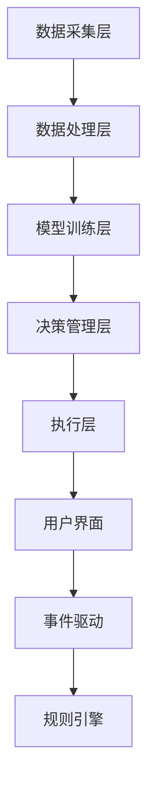
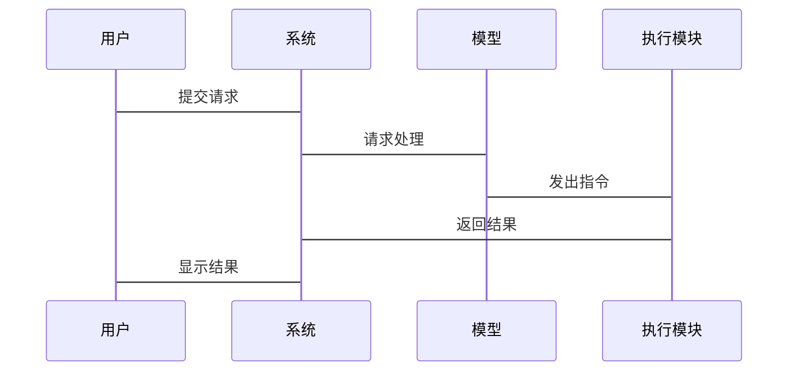

                 


# AI Agent在企业信息安全管理中的应用

> 关键词：AI Agent，企业信息安全，风险管理，威胁检测，漏洞管理，安全策略

> 摘要：随着信息技术的飞速发展，企业信息安全面临着前所未有的挑战。AI Agent作为一种智能化的安全管理工具，能够通过机器学习、自然语言处理和强化学习等技术，实现对企业信息安全的实时监控、威胁预测和自动响应。本文将详细探讨AI Agent在企业信息安全管理中的应用，包括其核心原理、应用场景、算法实现、系统架构以及实际案例分析，为企业信息安全管理人员和技术人员提供理论和实践指导。

---

# 第一部分：AI Agent在企业信息安全管理中的应用概述

## 第1章：AI Agent与企业信息安全管理概述

### 1.1 AI Agent的基本概念

#### 1.1.1 AI Agent的定义与特点
AI Agent（人工智能代理）是一种能够感知环境、自主决策并执行任务的智能实体。它具备以下特点：
- **自主性**：能够在没有人工干预的情况下独立运行。
- **反应性**：能够实时感知环境变化并做出响应。
- **目标导向**：具有明确的目标，能够优化决策以实现目标。
- **学习能力**：能够通过机器学习不断优化自身的行为。

#### 1.1.2 企业信息安全管理的核心目标
企业信息安全管理的核心目标包括：
1. **保护数据完整性**：确保数据在存储和传输过程中不被篡改。
2. **保障数据机密性**：防止未经授权的人员访问敏感信息。
3. **实现数据可用性**：确保 authorized人员能够随时访问所需数据。
4. **合规性**：符合相关法律法规和企业内部安全政策。

#### 1.1.3 AI Agent在企业信息安全管理中的作用
AI Agent在企业信息安全管理中扮演着重要角色，主要体现在以下几个方面：
- **实时监控**：通过AI Agent实时监控网络流量、日志数据，识别潜在威胁。
- **威胁预测**：利用机器学习模型预测未来可能发生的威胁，并提前采取措施。
- **自动响应**：在检测到威胁后，AI Agent能够快速启动相应的应急响应措施。

### 1.2 企业信息安全管理的挑战与需求

#### 1.2.1 传统信息安全管理模式的局限性
传统的信息安全管理模式主要依赖人工监控和静态规则，存在以下问题：
- **效率低下**：人工监控容易出现疏漏，且效率较低。
- **应对能力有限**：面对复杂的新型威胁，传统的规则无法快速响应。
- **成本高昂**：需要大量专业人员进行监控和维护。

#### 1.2.2 AI Agent在企业信息安全管理中的优势
与传统模式相比，AI Agent在企业信息安全管理中的优势显著：
- **高效性**：通过自动化技术快速处理大量数据，提高工作效率。
- **智能化**：能够识别复杂模式，发现潜在威胁。
- **灵活性**：能够根据环境变化动态调整安全策略。

#### 1.2.3 企业信息安全智能化管理的趋势
随着AI技术的不断发展，企业信息安全管理正朝着智能化方向发展。AI Agent的应用使得企业能够更高效地应对日益复杂的网络安全威胁。

---

## 第2章：AI Agent的核心原理与技术实现

### 2.1 AI Agent的工作原理

#### 2.1.1 AI Agent的感知与决策机制
AI Agent通过以下步骤实现感知与决策：
1. **数据采集**：从企业信息系统中采集相关数据，如网络流量、日志信息等。
2. **数据处理**：对采集的数据进行清洗、特征提取等预处理。
3. **模型训练**：利用机器学习算法训练模型，识别潜在威胁。
4. **决策制定**：根据模型输出结果，制定相应的安全策略。
5. **执行行动**：根据决策结果采取具体行动，如封锁可疑IP地址。

#### 2.1.2 基于机器学习的威胁识别
AI Agent通过以下方式实现威胁识别：
- **监督学习**：利用已标记的数据训练分类器，识别恶意行为。
- **无监督学习**：通过聚类分析发现异常行为。
- **强化学习**：通过不断试错优化威胁识别模型。

#### 2.1.3 自适应安全策略的动态调整
AI Agent能够根据实时威胁情况动态调整安全策略，例如：
- **调整防火墙规则**：根据威胁情况动态修改防火墙规则。
- **优化入侵检测系统（IDS）**：根据最新威胁调整IDS的检测参数。

### 2.2 AI Agent的关键技术

#### 2.2.1 自然语言处理在安全日志分析中的应用
自然语言处理技术在安全日志分析中的应用主要体现在：
- **日志解析**：通过NLP技术解析安全日志中的文本信息，提取有用信息。
- **异常检测**：通过分析日志中的模式，识别异常行为。

#### 2.2.2 强化学习在安全决策中的应用
强化学习在安全决策中的应用主要体现在：
- **动态决策**：通过强化学习算法，AI Agent能够根据环境变化动态调整决策策略。
- **多步推理**：在复杂的安全场景中，AI Agent能够通过多步推理找到最优解决方案。

#### 2.2.3 分布式计算与多Agent协作
分布式计算与多Agent协作在AI Agent中的应用主要体现在：
- **分布式计算**：通过分布式计算技术，AI Agent能够高效处理大规模数据。
- **多Agent协作**：多个AI Agent协同工作，共同完成复杂的安全任务。

### 2.3 AI Agent的模型训练与优化

#### 2.3.1 数据预处理与特征提取
数据预处理包括：
- **数据清洗**：去除噪声数据，确保数据质量。
- **特征提取**：从原始数据中提取有用特征，如IP地址、时间戳、用户行为等。

#### 2.3.2 深度学习模型的训练与调优
深度学习模型的训练与调优包括：
- **模型选择**：选择适合任务的深度学习模型，如卷积神经网络（CNN）、循环神经网络（RNN）等。
- **超参数调优**：通过网格搜索、随机搜索等方法优化模型超参数。
- **模型评估**：通过交叉验证等方法评估模型性能。

#### 2.3.3 模型的可解释性与鲁棒性
模型的可解释性与鲁棒性包括：
- **可解释性**：通过可视化技术或特征重要性分析，理解模型的决策过程。
- **鲁棒性**：通过对抗训练等方法提高模型的鲁棒性，防止被攻击者欺骗。

---

## 第3章：AI Agent在企业信息安全管理中的应用场景

### 3.1 风险评估与预测

#### 3.1.1 基于AI Agent的风险评估模型
基于AI Agent的风险评估模型包括：
- **数据收集**：收集企业的资产信息、漏洞信息、威胁情报等。
- **风险评估**：通过机器学习模型评估每个资产的风险等级。
- **风险报告**：生成风险报告，指导企业进行风险管理。

#### 3.1.2 威胁情报的实时分析
威胁情报的实时分析包括：
- **情报收集**：从多个来源收集威胁情报，如CVE数据库、MISP平台等。
- **情报处理**：对收集的情报进行清洗、分类，提取有用信息。
- **情报应用**：将情报应用于企业的风险管理中，如调整安全策略。

#### 3.1.3 安全风险的动态预测
安全风险的动态预测包括：
- **时间序列分析**：通过ARIMA模型预测未来的安全风险。
- **异常检测**：通过异常检测算法识别潜在的安全威胁。

### 3.2 威胁检测与响应

#### 3.2.1 异常行为检测
异常行为检测包括：
- **基于行为的检测**：通过分析用户行为模式，识别异常行为。
- **基于流量的检测**：通过分析网络流量，识别可疑活动。
- **基于日志的检测**：通过分析系统日志，识别异常事件。

#### 3.2.2 基于AI Agent的主动防御策略
基于AI Agent的主动防御策略包括：
- **主动监控**：实时监控网络和系统状态，发现异常立即响应。
- **主动防御**：在潜在威胁发生前采取措施，防止攻击发生。
- **动态调整**：根据最新威胁情报动态调整防御策略。

#### 3.2.3 实时威胁响应机制
实时威胁响应机制包括：
- **快速响应**：在检测到威胁后，立即启动应急响应措施。
- **自动化处理**：通过自动化工具快速隔离受感染设备，切断攻击源。
- **协同响应**：多个AI Agent协同工作，共同应对复杂威胁。

### 3.3 漏洞管理与修复

#### 3.3.1 漏洞发现与分类
漏洞发现与分类包括：
- **漏洞扫描**：通过自动化工具扫描系统漏洞。
- **漏洞分类**：根据漏洞的严重性、影响范围等进行分类。
- **漏洞管理**：对漏洞进行优先级排序，制定修复计划。

#### 3.3.2 漏洞修复的自动化决策
漏洞修复的自动化决策包括：
- **修复建议**：基于漏洞分析结果，生成修复建议。
- **自动化修复**：通过自动化工具自动修复已知漏洞。
- **修复验证**：修复完成后，验证漏洞是否已被成功修复。

#### 3.3.3 漏洞管理的闭环流程
漏洞管理的闭环流程包括：
- **漏洞发现**：通过扫描和监控发现新漏洞。
- **漏洞评估**：评估漏洞的严重性和影响范围。
- **漏洞修复**：制定修复方案并实施。
- **漏洞验证**：验证修复效果，确保漏洞已解决。

---

## 第4章：AI Agent的算法原理与数学模型

### 4.1 基于深度学习的威胁检测算法

#### 4.1.1 深度神经网络结构
深度神经网络结构包括：
- **卷积神经网络（CNN）**：常用于图像识别任务。
- **循环神经网络（RNN）**：常用于时间序列分析。
- **深度信念网络（DBN）**：常用于无监督学习任务。

#### 4.1.2 模型训练的数学公式
模型训练过程中常用的数学公式包括：
- **损失函数**：$$ L = \frac{1}{N}\sum_{i=1}^{N}(y_i - \hat{y}_i)^2 $$
- **优化算法**：$$ \theta = \theta - \eta \frac{\partial L}{\partial \theta} $$
- **激活函数**：$$ f(x) = \frac{1}{1 + e^{-x}} $$

#### 4.1.3 模型的训练过程与优化方法
模型的训练过程包括：
1. **数据预处理**：清洗数据，提取特征。
2. **模型选择**：选择适合任务的深度学习模型。
3. **模型训练**：使用训练数据训练模型，调整模型参数。
4. **模型验证**：通过验证集评估模型性能，调整超参数。
5. **模型优化**：通过正则化、数据增强等方法优化模型。

### 4.2 AI Agent的强化学习算法

#### 4.2.1 强化学习的基本概念
强化学习是一种通过试错学习的方法，其中智能体通过与环境互动，学习采取的行动以最大化累积奖励。

#### 4.2.2 Q-learning算法
Q-learning算法是一种常见的强化学习算法，其核心思想是通过Q表记录状态-动作对的价值，通过不断更新Q表来优化决策策略。

#### 4.2.3 深度Q网络（DQN）
深度Q网络是一种结合深度学习和强化学习的技术，通过深度神经网络近似Q函数，实现复杂环境中的决策。

---

## 第5章：AI Agent的系统架构设计

### 5.1 问题场景介绍
在企业信息安全管理中，AI Agent需要处理多种复杂场景，如网络安全攻击、数据泄露、系统漏洞等。为了应对这些挑战，需要设计一个高效、可靠的系统架构。

### 5.2 系统功能设计

#### 5.2.1 领域模型设计
领域模型设计包括：
- **资产识别**：识别企业的关键资产，如服务器、数据库、网络设备等。
- **威胁识别**：识别可能的威胁来源，如恶意软件、网络攻击等。
- **风险评估**：评估每个资产的风险等级，制定相应的安全策略。

#### 5.2.2 系统架构设计
系统架构设计包括：
- **数据采集层**：负责采集企业信息系统中的数据，如网络流量、日志信息等。
- **数据处理层**：对采集的数据进行预处理、特征提取等操作。
- **模型训练层**：利用机器学习算法训练模型，识别潜在威胁。
- **决策管理层**：根据模型输出结果，制定相应的安全策略。
- **执行层**：根据决策结果采取具体行动，如封锁可疑IP地址、调整防火墙规则等。

#### 5.2.3 系统接口设计
系统接口设计包括：
- **API接口**：提供RESTful API，供其他系统调用。
- **日志接口**：与企业现有的日志系统对接，获取日志信息。
- **配置接口**：允许用户配置安全策略、模型参数等。

#### 5.2.4 系统交互设计
系统交互设计包括：
- **用户界面**：提供友好的用户界面，方便用户进行操作。
- **事件驱动**：根据系统事件触发相应的处理流程。
- **规则引擎**：根据预设的规则自动执行相应操作。

### 5.3 系统架构图（Mermaid）



### 5.4 系统交互图（Mermaid）



---

## 第6章：AI Agent的项目实战

### 6.1 环境安装与配置

#### 6.1.1 系统环境
- **操作系统**：Linux（推荐）或Windows。
- **Python版本**：Python 3.6或更高版本。
- **依赖库**：numpy、pandas、scikit-learn、tensorflow、keras、flask等。

#### 6.1.2 安装步骤
1. 安装Python和pip：
   ```bash
   # 安装Python和pip（如果尚未安装）
   ```
2. 安装依赖库：
   ```bash
   pip install numpy pandas scikit-learn tensorflow keras flask
   ```

### 6.2 系统核心实现

#### 6.2.1 数据采集模块

```python
import pandas as pd
import requests

def collect_data(url):
    try:
        response = requests.get(url)
        data = response.json()
        return pd.DataFrame(data)
    except Exception as e:
        print(f"数据采集失败：{e}")
        return None
```

#### 6.2.2 模型训练模块

```python
from sklearn.model

