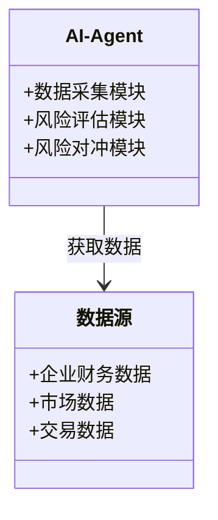
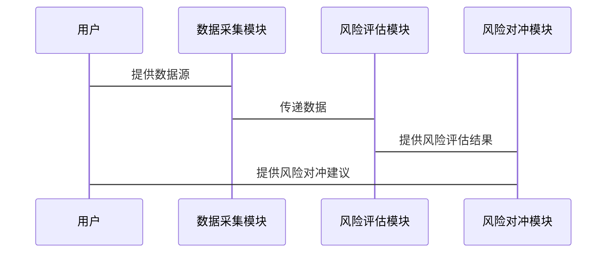

                 


# AI Agent在企业信用风险评估与管理中的应用

**关键词**：AI Agent、信用风险评估、风险管理、机器学习、企业信用管理

**摘要**：随着人工智能技术的快速发展，AI Agent（智能体）在企业信用风险评估与管理中的应用越来越广泛。本文将深入探讨AI Agent的核心原理、信用风险评估的数学模型、相关的算法实现，以及如何通过系统设计将AI Agent应用于实际的企业信用风险管理场景中。通过理论分析和实际案例的结合，本文将展示AI Agent在信用风险管理中的创新应用和显著优势。

---

# 第一部分: AI Agent与企业信用风险评估概述

## 第1章: AI Agent与信用风险管理的背景介绍

### 1.1 AI Agent的基本概念

#### 1.1.1 AI Agent的定义与特点
AI Agent（智能体）是指能够感知环境并采取行动以实现目标的智能系统。它具有以下特点：
- **自主性**：能够在没有外部干预的情况下自主决策。
- **反应性**：能够实时感知环境并做出反应。
- **目标导向性**：所有行动都以实现特定目标为导向。
- **学习能力**：通过数据和经验不断优化自身的决策能力。

#### 1.1.2 AI Agent的核心要素与功能
AI Agent的核心要素包括：
- **感知模块**：通过传感器或数据输入感知环境。
- **推理模块**：基于感知信息进行逻辑推理。
- **决策模块**：根据推理结果制定行动策略。
- **执行模块**：将决策转化为实际行动。

AI Agent的功能主要体现在以下几个方面：
1. 数据采集与处理：从多种渠道获取信用相关信息。
2. 风险识别：通过算法识别潜在的信用风险。
3. 风险评估：对风险进行量化评估并制定应对策略。
4. 自适应优化：根据市场变化和数据反馈不断优化自身的决策模型。

#### 1.1.3 AI Agent在企业信用管理中的应用潜力
AI Agent在企业信用管理中的潜力主要体现在以下几个方面：
1. **实时监控**：能够实时监控企业的信用状况，及时发现潜在风险。
2. **精准评估**：通过机器学习算法实现对信用风险的精准评估。
3. **智能决策**：基于历史数据和实时信息，制定最优的信用管理策略。
4. **自适应优化**：根据市场变化和企业内部数据不断优化信用风险管理模型。

### 1.2 信用风险管理的基本概念

#### 1.2.1 信用风险的定义与分类
信用风险是指由于债务人或交易对手无法履行其合同义务而给债权人带来的损失风险。信用风险可以分为以下几类：
- **交易对手风险**：由于交易对手的信用状况变化而导致的风险。
- **信用违约风险**：由于债务人违约而导致的风险。
- **信用迁移风险**：由于市场变化导致的信用等级变化带来的风险。

#### 1.2.2 信用风险管理的目标与方法
信用风险管理的目标是通过有效的手段降低信用风险的发生概率和损失程度。常用的方法包括：
- **信用评分**：通过对企业的财务数据和市场表现进行分析，评估其信用状况。
- **风险分散**：通过分散投资或业务来降低信用风险。
- **风险对冲**：通过金融衍生品对冲信用风险。

#### 1.2.3 传统信用风险管理的局限性
传统的信用风险管理方法存在以下局限性：
1. **数据依赖性**：传统方法依赖于历史数据，难以捕捉实时市场变化。
2. **计算复杂性**：复杂的计算模型可能导致效率低下，难以应对实时决策需求。
3. **人为因素影响**：人为判断可能引入主观性，影响风险评估的准确性。

### 1.3 AI Agent在信用风险管理中的问题背景

#### 1.3.1 传统信用风险管理的痛点
传统信用风险管理的痛点主要体现在以下几个方面：
1. **数据处理能力有限**：传统方法难以处理海量数据，导致决策滞后。
2. **模型更新缓慢**：传统模型难以快速适应市场变化。
3. **缺乏实时性**：传统方法难以满足实时信用评估的需求。

#### 1.3.2 AI Agent如何解决信用风险管理的难题
AI Agent通过以下方式解决了传统信用风险管理的难题：
1. **实时数据分析**：AI Agent能够实时处理大量数据，快速捕捉市场变化。
2. **自动化决策**：通过机器学习算法实现自动化信用评估和风险对冲。
3. **自适应优化**：AI Agent能够根据市场反馈不断优化自身的决策模型。

#### 1.3.3 企业信用风险管理的边界与外延
企业信用风险管理的边界是指企业在信用管理过程中需要关注的核心领域，包括信用评估、风险监控和风险对冲。外延则包括与信用风险管理相关的市场环境、政策法规和企业内部管理流程。

### 1.4 本章小结
本章主要介绍了AI Agent的基本概念、信用风险管理的核心概念以及AI Agent在信用风险管理中的应用潜力。通过对比传统信用风险管理方法的局限性，提出了AI Agent在信用风险管理中的独特优势。

---

## 第2章: AI Agent的核心原理与数学模型

### 2.1 AI Agent的决策机制

#### 2.1.1 基于概率的决策模型
基于概率的决策模型通过计算不同决策方案的概率值，选择概率最大的方案作为最优决策。例如，可以使用贝叶斯定理来计算信用违约的概率。

$$ P(违约 | 数据) = \frac{P(数据 | 违约) \cdot P(违约)}{P(数据)} $$

#### 2.1.2 基于强化学习的决策过程
强化学习是一种通过试错机制不断优化决策策略的方法。AI Agent在信用风险管理中可以通过强化学习来选择最优的信用投资组合。

#### 2.1.3 多智能体协作的信用风险管理
在复杂的企业信用风险管理场景中，可能需要多个AI Agent协同工作。例如，一个AI Agent负责数据收集，另一个负责风险评估，还有一个负责风险对冲。

### 2.2 信用风险评估的数学模型

#### 2.2.1 信用风险的违约概率模型
违约概率模型是信用风险评估的核心模型之一。常用的违约概率模型包括：
1. **KMV模型**：通过企业的市场价值和资本结构计算违约概率。
2. **Merton模型**：基于期权定价理论计算违约概率。

#### 2.2.2 信用评分的构建与优化
信用评分是通过对企业财务数据和市场表现进行分析，构建一个评分模型，评估企业的信用状况。常用的信用评分方法包括逻辑回归、随机森林等。

#### 2.2.3 非线性回归模型在信用风险中的应用
非线性回归模型能够更好地捕捉信用风险中的非线性关系。例如，使用神经网络模型对信用风险进行建模。

### 2.3 AI Agent与信用风险评估的关联性

#### 2.3.1 AI Agent在信用风险评估中的角色
AI Agent在信用风险评估中扮演多重角色，包括数据收集、模型构建、风险评估和决策优化。

#### 2.3.2 信用风险评估中的特征选择与权重分配
特征选择和权重分配是信用风险评估的重要步骤。AI Agent可以通过机器学习算法自动选择最优特征，并根据特征的重要性分配权重。

#### 2.3.3 AI Agent如何优化信用风险评估的准确性
通过集成学习和模型优化，AI Agent可以显著提高信用风险评估的准确性。例如，使用投票机制集成多个模型的预测结果。

---

## 第3章: 信用风险评估的核心算法与实现

### 3.1 信用风险评估的常用算法

#### 3.1.1 逻辑回归模型
逻辑回归是一种常用的二分类算法，可以用于信用违约的分类问题。

$$ P(违约 | X) = \frac{1}{1 + e^{-\beta X}} $$

#### 3.1.2 随机森林与梯度提升树
随机森林和梯度提升树是常用的 ensemble 方法，能够提高信用风险评估的准确性和鲁棒性。

#### 3.1.3 神经网络模型
神经网络模型通过多层非线性变换，能够捕捉复杂的信用风险特征。

### 3.2 算法实现与优化

#### 3.2.1 数据预处理
数据预处理是信用风险评估的重要步骤，包括数据清洗、特征工程和数据标准化。

#### 3.2.2 模型训练与优化
通过交叉验证和超参数调优，可以提高信用风险评估模型的性能。

#### 3.2.3 模型评估与部署
模型评估包括准确率、召回率和F1分数的计算。模型部署可以通过API接口或集成到企业管理系统中。

---

## 第4章: AI Agent信用风险管理系统的架构设计

### 4.1 系统功能设计

#### 4.1.1 数据采集模块
数据采集模块负责从企业财务数据、市场数据和交易数据中提取相关信息。

#### 4.1.2 风险评估模块
风险评估模块基于机器学习模型对企业的信用风险进行评估。

#### 4.1.3 风险对冲模块
风险对冲模块通过金融衍生品对冲信用风险，降低企业的财务损失。

### 4.2 系统架构设计

#### 4.2.1 系统类图


#### 4.2.2 系统交互流程


### 4.3 系统接口设计

#### 4.3.1 API接口定义
- `POST /api/credit-risk inputData`
- `GET /api/credit-risk-result`

#### 4.3.2 接口实现
通过RESTful API接口实现系统的数据交互和功能调用。

---

## 第5章: 项目实战与案例分析

### 5.1 项目背景
本项目旨在通过AI Agent实现企业信用风险的实时评估与管理。

### 5.2 环境安装
需要安装以下工具和库：
- Python 3.8+
- scikit-learn、XGBoost、TensorFlow
- Flask或Django框架
- Jupyter Notebook

### 5.3 核心代码实现

#### 5.3.1 数据预处理
```python
import pandas as pd
from sklearn.preprocessing import StandardScaler

# 数据加载
data = pd.read_csv('credit_data.csv')

# 特征工程
features = data[[' revenue', 'profit', 'debt']]
target = data['default']

# 数据标准化
scaler = StandardScaler()
features_scaled = scaler.fit_transform(features)
```

#### 5.3.2 模型训练
```python
from sklearn.ensemble import RandomForestClassifier

model = RandomForestClassifier(n_estimators=100, random_state=42)
model.fit(features_scaled, target)
```

#### 5.3.3 模型评估
```python
from sklearn.metrics import accuracy_score, recall_score, f1_score

y_pred = model.predict(features_scaled)
print(f'Accuracy: {accuracy_score(target, y_pred)}')
print(f'Recall: {recall_score(target, y_pred)}')
print(f'F1 Score: {f1_score(target, y_pred)}')
```

### 5.4 案例分析
通过实际案例分析，展示了AI Agent在信用风险管理中的应用效果和优势。

### 5.5 项目小结
总结项目的主要成果和经验教训，为后续的研究和实践提供参考。

---

## 第6章: 总结与展望

### 6.1 本章总结
总结全文的主要内容和研究成果，强调AI Agent在信用风险管理中的创新应用和显著优势。

### 6.2 未来展望
展望AI Agent在信用风险管理中的未来发展方向，包括更复杂的模型优化、多智能体协作和实时决策优化。

---

# 作者
作者：AI天才研究院/AI Genius Institute  
作者：禅与计算机程序设计艺术/Zen And The Art of Computer Programming

