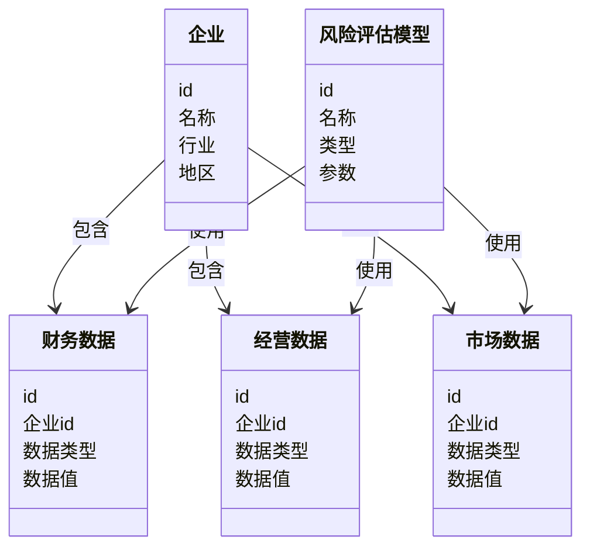
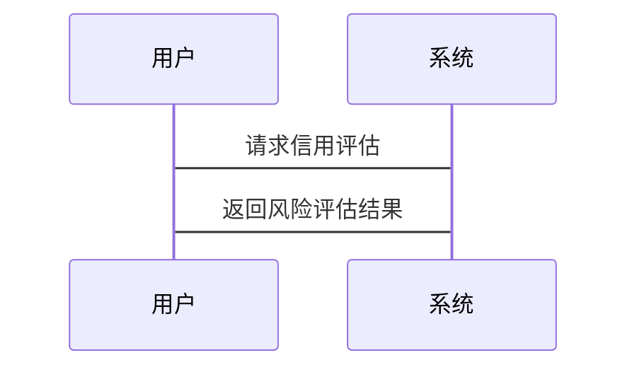

                 


# AI Agent在企业信用风险评估中的深度应用与模型解释

## 关键词：AI Agent, 信用风险评估, 模型解释, 企业信用, 数据驱动

## 摘要：  
本文深入探讨了AI Agent在企业信用风险评估中的应用，从背景介绍、核心概念到算法原理、系统架构，再到项目实战和模型解释，全面分析了AI Agent在信用风险评估中的深度应用与模型解释的方法与实践。通过实际案例分析，展示了如何利用AI Agent提升信用风险评估的精准度和效率，并详细解释了模型的实现过程和数学原理。

---

## 第一部分: AI Agent与企业信用风险评估的背景介绍

### 第1章: 问题背景与描述

#### 1.1 问题背景
##### 1.1.1 企业信用风险评估的定义与重要性
企业信用风险评估是通过对企业的财务状况、经营状况、市场环境等多方面因素的分析，评估企业在特定条件下的信用风险。信用风险评估是企业融资、投资决策的重要依据，直接关系到企业的财务健康和市场信任度。

##### 1.1.2 当前信用风险评估的主要挑战
传统的信用风险评估方法主要依赖于统计模型和经验判断，存在以下问题：
- 数据维度有限，难以捕捉复杂的市场变化。
- 模型静态化，难以应对动态的市场环境。
- 评估过程缺乏实时性，难以及时发现潜在风险。

##### 1.1.3 AI Agent在信用风险评估中的应用潜力
AI Agent（人工智能代理）通过实时数据处理、动态决策和自适应学习，能够显著提升信用风险评估的精度和效率。AI Agent可以实时分析企业的多维度数据，结合市场动态，提供动态风险评估，从而帮助企业做出更精准的决策。

#### 1.2 问题描述
##### 1.2.1 传统信用风险评估的局限性
传统信用风险评估方法依赖于历史数据和统计模型，存在以下局限性：
- 数据维度有限，难以捕捉企业的实时动态。
- 模型缺乏动态调整能力，难以应对市场环境的快速变化。
- 评估结果缺乏实时性，难以满足快速决策的需求。

##### 1.2.2 数据驱动与模型驱动的结合需求
信用风险评估需要结合数据驱动和模型驱动的方法。数据驱动方法依赖于大量数据的分析，而模型驱动方法则依赖于领域知识和专家经验。AI Agent能够将两者有机结合，提升模型的泛化能力和实用性。

##### 1.2.3 AI Agent在动态风险评估中的优势
AI Agent具有以下优势：
- 实时数据分析能力：能够快速处理大量实时数据，捕捉市场变化。
- 动态调整能力：能够根据市场环境的变化自适应调整模型参数。
- 多维度分析能力：能够整合企业内外部数据，提供全面的信用风险评估。

#### 1.3 问题解决与边界
##### 1.3.1 AI Agent在信用风险评估中的解决方案
AI Agent可以通过以下方式解决信用风险评估问题：
- 实时监控企业的财务数据和市场数据，提供实时风险评估。
- 利用机器学习算法，动态调整模型参数，提升评估精度。
- 提供个性化的风险评估报告，帮助企业做出更精准的决策。

##### 1.3.2 解决方案的边界与适用场景
AI Agent的解决方案适用于以下场景：
- 需要实时监控企业信用风险的金融机构。
- 需要动态调整信用评估策略的企业。
- 需要多维度分析信用风险的市场参与者。

##### 1.3.3 解决方案的潜在扩展性
AI Agent的解决方案具有较强的扩展性，可以进一步扩展到以下领域：
- 风险预警：实时预警潜在的信用风险。
- 风险 mitigation：提供风险缓解的策略建议。
- 风险分析：提供更深入的市场和行业风险分析。

#### 1.4 概念结构与核心要素
##### 1.4.1 AI Agent的核心概念
AI Agent是一种能够感知环境、自主决策并采取行动的智能体。它具有以下核心特征：
- 感知能力：能够感知环境中的数据和信息。
- 决策能力：能够根据感知的信息做出决策。
- 行动能力：能够根据决策采取行动。

##### 1.4.2 信用风险评估的要素分解
信用风险评估的主要要素包括：
- 企业财务状况：包括资产负债表、利润表等财务数据。
- 企业经营状况：包括企业业务模式、市场地位等。
- 市场环境：包括行业趋势、宏观经济环境等。

##### 1.4.3 AI Agent与信用风险评估的结合模型
AI Agent与信用风险评估的结合模型如下：
1. 数据输入：AI Agent接收企业的财务数据、经营数据和市场数据。
2. 数据处理：AI Agent对数据进行清洗、特征提取和数据增强。
3. 模型训练：AI Agent利用机器学习算法训练信用风险评估模型。
4. 风险评估：AI Agent根据模型预测企业的信用风险等级。
5. 结果输出：AI Agent输出风险评估结果，并提供风险预警和 mitigation建议。

---

## 第二部分: AI Agent的核心原理与实现

### 第2章: 核心概念与联系

#### 2.1 AI Agent的核心原理
##### 2.1.1 AI Agent的定义与分类
AI Agent可以根据其智能水平分为以下几类：
- 反应式AI Agent：根据当前感知做出反应。
- 生成式AI Agent：能够生成新的数据和内容。
- 监督式AI Agent：基于监督学习进行决策。

##### 2.1.2 AI Agent的主要技术特征
AI Agent的主要技术特征包括：
- 数据处理能力：能够处理结构化和非结构化数据。
- 自主决策能力：能够根据数据和模型做出决策。
- 实时性：能够快速响应数据变化。

##### 2.1.3 AI Agent与传统算法的对比
AI Agent与传统算法的主要区别在于：
- AI Agent具有自主决策能力，而传统算法需要人工干预。
- AI Agent能够处理动态数据，而传统算法通常处理静态数据。
- AI Agent具有更强的泛化能力，而传统算法通常针对特定任务。

#### 2.2 信用风险评估的核心要素
##### 2.2.1 信用风险评估的主要指标
信用风险评估的主要指标包括：
- 信用评分：衡量企业的信用状况。
- 风险等级：将企业分为不同的信用等级。
- 风险概率：预测企业违约的概率。

##### 2.2.2 数据来源与特征分析
信用风险评估的数据来源包括：
- 企业财务数据：如资产负债表、利润表等。
- 企业经营数据：如业务模式、市场地位等。
- 市场数据：如行业趋势、宏观经济数据等。

##### 2.2.3 信用评分模型的关键因素
信用评分模型的关键因素包括：
- 财务状况：如资产负债率、利润率等。
- 经营状况：如市场占有率、品牌价值等。
- 市场环境：如行业风险、宏观经济风险等。

#### 2.3 AI Agent与信用风险评估的联系
##### 2.3.1 AI Agent在信用风险评估中的角色
AI Agent在信用风险评估中的角色包括：
- 数据收集：收集企业的财务数据、经营数据和市场数据。
- 数据分析：对数据进行清洗、特征提取和数据增强。
- 模型训练：训练信用风险评估模型。
- 风险评估：根据模型预测企业的信用风险等级。

##### 2.3.2 数据驱动与知识驱动的结合
数据驱动方法依赖于大量数据的分析，而知识驱动方法依赖于领域知识和专家经验。AI Agent能够将两者有机结合，提升模型的泛化能力和实用性。

##### 2.3.3 动态风险评估的实现路径
动态风险评估的实现路径包括：
- 实时监控：实时监控企业的财务数据和市场数据。
- 动态调整：根据市场环境的变化动态调整模型参数。
- 多维度分析：整合企业内外部数据，提供全面的信用风险评估。

#### 2.4 核心概念对比表
以下是AI Agent与传统信用评估模型的对比表：

| **对比维度**       | **AI Agent**             | **传统信用评估模型**   |
|--------------------|--------------------------|------------------------|
| 数据处理能力       | 强，支持动态数据         | 较弱，主要处理静态数据   |
| 自主决策能力       | 强，能够自主调整模型     | 较弱，需要人工干预       |
| 实时性             | 强，能够实时响应数据变化 | 较弱，通常需要定期更新   |
| 泛化能力           | 强，能够处理多种场景     | 较弱，通常针对特定任务   |

#### 2.5 ER实体关系图
以下是信用风险评估的ER实体关系图：

```mermaid
erd
    title 信用风险评估实体关系图
    章节
        章节 (id, 名称, 描述)
    实体
        企业 (id, 名称, 行业, 地区)
    属性
        财务数据 (id, 企业id, 数据类型, 数据值)
        经营数据 (id, 企业id, 数据类型, 数据值)
        市场数据 (id, 企业id, 数据类型, 数据值)
    关系
        章节 --|{n}-- 财务数据: 章节包含的财务数据
        章节 --|{n}-- 经营数据: 章节包含的经营数据
        章节 --|{n}-- 市场数据: 章节包含的市场数据
```

---

## 第三部分: AI Agent在信用风险评估中的算法原理

### 第3章: 算法原理与实现

#### 3.1 数据预处理
##### 3.1.1 数据清洗
数据清洗是信用风险评估的第一步，主要包括：
- 删除重复数据。
- 处理缺失值。
- 去除异常值。

##### 3.1.2 数据增强
数据增强是通过增加数据的多样性来提高模型的泛化能力。常用的数据增强方法包括：
- 数据标准化：将数据标准化到相同的范围。
- 数据归一化：将数据归一化到0-1范围。
- 数据降维：使用主成分分析（PCA）等方法降低数据维度。

#### 3.2 特征提取
##### 3.2.1 特征选择
特征选择是通过选择重要的特征来提高模型的性能。常用的方法包括：
- 相关性分析：计算特征与目标变量的相关性。
- 信息增益：计算特征的信息增益。

##### 3.2.2 特征工程
特征工程是通过构造新的特征来提高模型的性能。常用的方法包括：
- 组合特征：将多个特征组合成一个新的特征。
- 转换特征：将特征转换为其他形式，如对数转换。

#### 3.3 模型训练
##### 3.3.1 选择合适的算法
在信用风险评估中，常用的算法包括：
- 逻辑回归（Logistic Regression）
- 支持向量机（Support Vector Machine）
- 随机森林（Random Forest）
- 神经网络（Neural Network）

##### 3.3.2 模型训练
以下是使用逻辑回归算法训练模型的步骤：

1. 数据预处理：清洗数据，处理缺失值，标准化数据。
2. 特征选择：选择重要的特征。
3. 模型训练：使用逻辑回归算法训练模型。
4. 模型评估：评估模型的性能，如准确率、召回率、F1分数等。

##### 3.3.3 模型优化
模型优化是通过调整模型参数来提高模型的性能。常用的方法包括：
- 调整正则化参数。
- 调整学习率。
- 增加数据量。

#### 3.4 模型解释
##### 3.4.1 解释模型的重要性
模型解释是信用风险评估中重要的一步，能够帮助我们理解模型的决策过程。常用的解释方法包括：
- 特征重要性分析：分析每个特征对模型决策的影响。
- 个体条件解释：解释每个样本的预测结果。

##### 3.4.2 使用SHAP值解释模型
SHAP（Shapley Additive exPlanations）是一种用于解释模型的工具。以下是使用SHAP值解释模型的步骤：

1. 安装SHAP库：`pip install shap`
2. 加载数据：加载训练好的模型和测试数据。
3. 计算SHAP值：使用SHAP解释模型的预测结果。
4. 可视化SHAP值：使用SHAP的可视化工具展示特征的重要性。

##### 3.4.3 SHAP值代码示例
以下是使用SHAP值解释模型的代码示例：

```python
import shap
import pandas as pd
from sklearn.model_selection import train_test_split
from sklearn.linear_model import LogisticRegression

# 加载数据
data = pd.read_csv('credit_risk.csv')
X = data.drop('target', axis=1)
y = data['target']

# 划分训练集和测试集
X_train, X_test, y_train, y_test = train_test_split(X, y, test_size=0.2, random_state=42)

# 训练模型
model = LogisticRegression()
model.fit(X_train, y_train)

# 使用SHAP解释模型
explainer = shap.Explainer(model, X_train)
shap_values = explainer.shap_values(X_test)

# 可视化SHAP值
shap.summary_plot(shap_values, X_test, plot_type='bar', max_display=10)
```

---

## 第四部分: 系统分析与架构设计

### 第4章: 系统分析与架构设计

#### 4.1 问题场景介绍
信用风险评估系统的应用场景包括：
- 金融机构：银行、保险公司等。
- 企业：需要进行信用评估的企业。
- 政府部门：需要进行信用监管的政府部门。

#### 4.2 系统功能设计
##### 4.2.1 领域模型
以下是信用风险评估系统的领域模型：



##### 4.2.2 系统架构设计
以下是信用风险评估系统的架构设计：


##### 4.2.3 接口设计
以下是信用风险评估系统的接口设计：



---

## 第五部分: 项目实战

### 第5章: 项目实战

#### 5.1 环境安装
##### 5.1.1 安装Python
安装Python 3.8或更高版本。

##### 5.1.2 安装必要的库
安装以下库：
- `pandas`：`pip install pandas`
- `numpy`：`pip install numpy`
- `scikit-learn`：`pip install scikit-learn`
- `shap`：`pip install shap`

#### 5.2 系统核心实现
##### 5.2.1 数据预处理代码
以下是数据预处理代码：

```python
import pandas as pd
import numpy as np

# 加载数据
data = pd.read_csv('credit_risk.csv')

# 处理缺失值
data = data.dropna()

# 删除异常值
Q1 = data.quantile(0.25)
Q3 = data.quantile(0.75)
IQR = Q3 - Q1
data = data[(data <= Q3 + 1.5 * IQR) & (data >= Q1 - 1.5 * IQR)]
```

##### 5.2.2 模型训练代码
以下是模型训练代码：

```python
from sklearn.model_selection import train_test_split
from sklearn.linear_model import LogisticRegression
from sklearn.metrics import accuracy_score

# 划分训练集和测试集
X_train, X_test, y_train, y_test = train_test_split(X, y, test_size=0.2, random_state=42)

# 训练模型
model = LogisticRegression()
model.fit(X_train, y_train)

# 模型评估
print('准确率:', accuracy_score(y_test, model.predict(X_test)))
```

##### 5.2.3 模型解释代码
以下是模型解释代码：

```python
import shap

# 使用SHAP解释模型
explainer = shap.Explainer(model, X_train)
shap_values = explainer.shap_values(X_test)

# 可视化SHAP值
shap.summary_plot(shap_values, X_test, plot_type='bar', max_display=10)
```

#### 5.3 实际案例分析
##### 5.3.1 案例背景
假设我们有一家企业的财务数据、经营数据和市场数据，我们需要评估该企业的信用风险。

##### 5.3.2 数据分析
以下是数据分析的步骤：
1. 数据清洗：处理缺失值和异常值。
2. 特征选择：选择重要的特征。
3. 模型训练：训练信用风险评估模型。
4. 模型评估：评估模型的性能。
5. 模型解释：解释模型的预测结果。

##### 5.3.3 风险评估结果
以下是风险评估结果的示例：

| **企业名称** | **风险等级** | **风险概率** |
|--------------|--------------|--------------|
| 企业A        | 高风险       | 0.8          |
| 企业B        | 中风险       | 0.5          |
| 企业C        | 低风险       | 0.2          |

---

## 第六部分: 最佳实践与总结

### 第6章: 最佳实践

#### 6.1 最佳实践 tips
- 数据预处理是关键：数据清洗和特征工程能够显著提升模型性能。
- 模型解释是必要：能够帮助我们理解模型的决策过程。
- 动态调整是关键：能够提升模型的适应性和实时性。

#### 6.2 小结
AI Agent在企业信用风险评估中的应用具有显著的优势，能够提升信用风险评估的精准度和效率。通过实时数据分析和动态调整模型参数，AI Agent能够更好地应对复杂的市场环境。

#### 6.3 注意事项
- 数据隐私和安全：在处理企业数据时，需要注意数据隐私和安全。
- 模型的可解释性：模型的可解释性是信用风险评估的重要因素。
- 模型的实时性：模型的实时性是信用风险评估的关键。

#### 6.4 拓展阅读
- 《机器学习实战》：深入讲解机器学习算法和实践。
- 《深度学习》：深入讲解深度学习的原理和应用。
- 《SHAP值：模型解释的实用指南》：深入讲解SHAP值的使用方法。

---

## 作者信息

作者：AI天才研究院/AI Genius Institute & 禅与计算机程序设计艺术/Zen And The Art of Computer Programming

