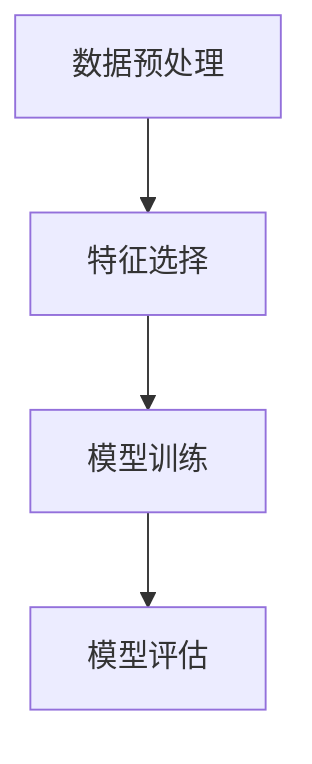
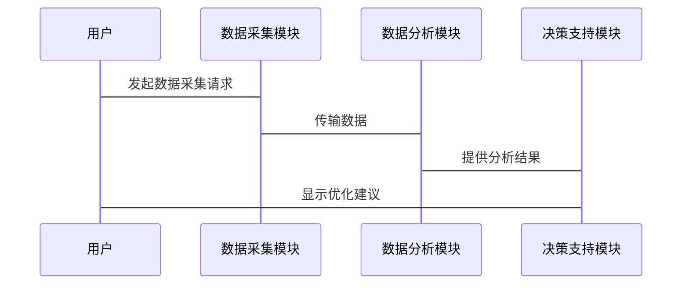

                 


# AI Agent在企业全面质量管理(TQM)中的应用

## 关键词：AI Agent, 全面质量管理, TQM, 人工智能, 质量管理, 企业应用

## 摘要：
本文探讨AI Agent在企业全面质量管理（TQM）中的应用，分析其如何通过自动化和智能化提升质量管理效率。文章涵盖TQM的背景、AI Agent的核心原理、系统架构设计，以及实际项目案例，展示了AI Agent在质量数据分析、预测性维护和异常检测中的具体应用，并总结了实施中的关键点和未来发展方向。

---

# 目录大纲

1. 引言
2. TQM与AI Agent的核心概念
3. AI Agent在TQM中的算法原理
4. 系统架构设计
5. 项目实战
6. 总结与展望

---

# 第一部分：引言

## 1.1 TQM的背景与重要性
- **定义**：TQM是一种系统化的方法，通过持续改进提高产品质量和服务质量。
- **重要性**：帮助企业提高客户满意度和市场竞争力。
- **演变**：从早期的质量控制发展到全面质量管理，强调预防而非检验。

## 1.2 AI Agent的基本概念
- **定义**：智能代理，能够感知环境并执行任务。
- **特征**：自主性、反应性、目标导向。
- **应用场景**：数据分析、决策支持。

## 1.3 TQM与AI Agent的结合
- **必要性**：自动化和智能化提升效率。
- **优势**：快速数据处理、预测分析、实时监控。

---

# 第二部分：TQM与AI Agent的核心概念

## 2.1 TQM的核心要素
- **PDCA循环**：计划、执行、检查、处理。
- **五大管理原则**：顾客满意、员工参与、过程方法、持续改进、互利的供方关系。
- **实施步骤**：目标设定、培训、过程控制、持续改进。

## 2.2 AI Agent在TQM中的角色
- **数据采集与处理**：实时收集质量数据，处理和分析。
- **质量分析与预测**：使用机器学习预测质量趋势。
- **过程监控与优化**：监控生产流程，优化参数。
- **决策支持与反馈**：提供决策支持，反馈执行结果。

---

# 第三部分：AI Agent在TQM中的算法原理

## 3.1 算法原理概述
- **机器学习**：监督学习、无监督学习。
- **自然语言处理**：文本分析、情感分析。
- **强化学习**：动态环境中优化决策。

## 3.2 机器学习在质量预测中的应用
- **模型选择**：线性回归、随机森林。
- **数据预处理**：清洗、特征选择。
- **训练与评估**：交叉验证、准确率评估。

## 3.3 机器学习流程图


## 3.4 机器学习数学模型
- **线性回归公式**：$$ y = \beta_0 + \beta_1x + \epsilon $$
- **随机森林算法**：基于决策树的集成方法，投票决定结果。

---

# 第四部分：系统架构设计

## 4.1 系统架构概述
- **模块划分**：数据采集模块、数据分析模块、决策支持模块。
- **架构选择**：分层架构，各模块独立协作。

## 4.2 系统架构图


## 4.3 系统接口设计
- **数据接口**：API接口，接收传感器数据。
- **用户接口**：可视化界面，显示分析结果。

## 4.4 系统交互流程


---

# 第五部分：项目实战

## 5.1 项目背景
- **目标**：提升某制造企业的质量检测效率。
- **数据来源**：生产线传感器数据、历史质量记录。

## 5.2 环境配置
- **工具**：Python、TensorFlow、Pandas。
- **安装依赖**：pip install numpy, pandas, scikit-learn。

## 5.3 核心代码实现
```python
import pandas as pd
from sklearn.model import LinearRegression

# 数据加载
data = pd.read_csv('quality_data.csv')

# 特征与目标分离
X = data[['temperature', 'pressure']]
y = data['quality_score']

# 模型训练
model = LinearRegression()
model.fit(X, y)

# 预测
new_data = pd.DataFrame({'temperature': [200], 'pressure': [50]})
predicted = model.predict(new_data)
print(predicted)
```

## 5.4 代码解读
- **数据加载**：读取CSV文件中的质量数据。
- **特征选择**：选择温度和压力作为预测因子。
- **模型训练**：使用线性回归模型训练数据。
- **预测与评估**：预测新数据的质量评分，并评估模型性能。

## 5.5 实际案例分析
- **应用场景**：实时监控生产过程，预测潜在的质量问题。
- **分析结果**：通过模型预测，企业提前调整参数，减少废品率。

## 5.6 项目小结
- **成功经验**：AI Agent显著提高了质量检测效率。
- **挑战**：数据质量和模型泛化能力需进一步优化。

---

# 第六部分：总结与展望

## 6.1 核心价值
- **提升效率**：自动化处理大量数据。
- **精准预测**：基于机器学习模型的预测能力。
- **实时监控**：持续优化生产过程。

## 6.2 实施中的关键点
- **数据质量**：确保数据准确性和完整性。
- **模型选择**：根据不同场景选择合适算法。
- **团队协作**：跨部门合作，确保系统顺利运行。

## 6.3 未来展望
- **AI技术进步**：深度学习和强化学习的应用。
- **云计算与边缘计算**：提升数据处理能力。
- **人机协作**：结合人类专家经验，提升决策准确性。

---

# 结语

AI Agent在企业全面质量管理中的应用为企业带来了显著的效率提升和成本节约。通过自动化和智能化的手段，AI Agent不仅优化了质量检测流程，还帮助企业实现了持续改进的目标。未来，随着技术的进步，AI Agent将在TQM中发挥更大的作用，推动企业管理的进一步升级。

---

# 作者：AI天才研究院/AI Genius Institute & 禅与计算机程序设计艺术/Zen And The Art of Computer Programming

---

以上是《AI Agent在企业全面质量管理(TQM)中的应用》的技术博客文章，涵盖了从背景到实施的各个方面，详细分析了AI Agent在质量管理中的作用，并通过实际案例展示了其应用价值。

