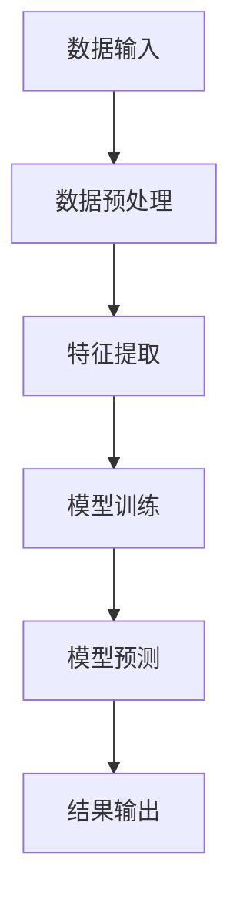
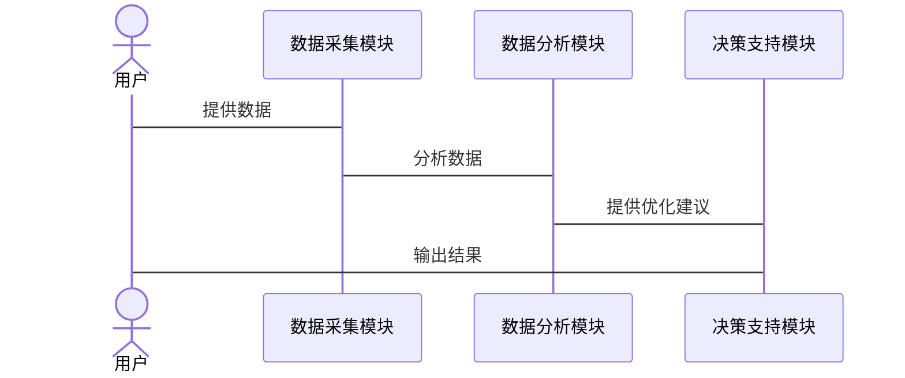

                 


# AI Agent在企业全面质量管理(TQM)中的深度应用

> 关键词：AI Agent, 全面质量管理(TQM), 质量管理, 人工智能, 数据分析

> 摘要：本文深入探讨了AI Agent在企业全面质量管理（TQM）中的应用，分析了TQM的核心概念与AI Agent的结合方式，详细讲解了AI Agent在TQM中的算法原理、系统架构设计与项目实战，最后给出了最佳实践、总结与展望。

---

## 第一部分: AI Agent与全面质量管理(TQM)的结合

### 第1章: 全面质量管理(TQM)概述

#### 1.1 全面质量管理的基本概念

全面质量管理（Total Quality Management，TQM）是一种以顾客为中心，通过全员参与、持续改进和数据驱动的方法来提高产品质量和企业绩效的管理方式。TQM强调全过程管理，从产品设计、生产到交付的每个环节都关注质量控制。

**核心原则**：
1. 顾客导向：以顾客需求为核心。
2. 全员参与：鼓励员工参与质量改进。
3. 持续改进：通过PDCA（计划、执行、检查、改进）循环不断提升质量。
4. 数据驱动：依赖数据分析进行决策。

#### 1.2 AI Agent的基本概念

AI Agent（人工智能代理）是指能够感知环境、执行任务并做出决策的智能实体。AI Agent可以通过传感器、数据库或其他系统获取信息，利用机器学习、自然语言处理等技术进行分析，并通过预设规则或模型生成解决方案。AI Agent的核心功能包括数据采集、分析、推理、决策和执行。

**AI Agent的特点**：
1. **自主性**：能够独立执行任务。
2. **反应性**：能够实时感知环境变化并做出反应。
3. **目标导向**：具有明确的目标和优先级。
4. **学习能力**：能够通过数据优化自身的决策能力。

#### 1.3 TQM与AI Agent的结合意义

AI Agent的引入为TQM带来了革命性的变化。通过AI Agent，企业可以实现质量管理的自动化、智能化和实时化。AI Agent能够快速处理海量数据，发现潜在问题，并提出优化建议，从而提高质量管理水平，降低成本，提升顾客满意度。

---

### 第2章: AI Agent在TQM中的核心概念与联系

#### 2.1 TQM的核心要素

TQM的核心要素包括以下几个方面：
1. **质量目标**：明确的质量标准和目标。
2. **质量工具**：如因果图、检查表、控制图等。
3. **过程控制**：对关键质量过程进行监控和优化。
4. **持续改进**：通过PDCA循环不断改进质量。

#### 2.2 AI Agent在TQM中的角色

AI Agent在TQM中的角色主要体现在以下几个方面：
1. **数据采集与分析**：AI Agent可以实时采集生产过程中的数据，并通过机器学习模型进行分析，发现潜在的质量问题。
2. **过程监控与优化**：AI Agent可以对生产过程进行实时监控，识别异常情况，并提出优化建议。
3. **智能决策支持**：AI Agent可以通过分析历史数据和实时数据，为质量管理决策提供支持。

#### 2.3 TQM与AI Agent的实体关系图

```mermaid
erDiagram
    actor 顾客
    actor 员工
    actor 管理层
    actor 供应商
    class 质量数据
    class AI Agent
    class 质量管理流程
    顾客 --> 质量管理流程: 提交反馈
    员工 --> 质量管理流程: 执行操作
    管理层 --> 质量管理流程: 制定策略
    供应商 --> 质量管理流程: 提供原材料
    质量管理流程 --> AI Agent: 提供数据
    AI Agent --> 质量管理流程: 提供优化建议
```

---

### 第3章: AI Agent在TQM中的算法原理

#### 3.1 数据预处理与特征提取

在质量管理中，数据预处理是非常重要的一步。AI Agent需要对收集到的数据进行清洗、转换和标准化，以便更好地进行分析和建模。

1. **数据清洗**：去除噪声数据、填补缺失值、删除重复数据。
2. **特征选择**：通过统计分析或特征重要性评估选择关键特征。
3. **数据标准化**：将数据归一化，以便不同特征之间可以比较。

#### 3.2 AI Agent的决策树算法

决策树是一种常用的机器学习算法，适用于分类和回归问题。在质量管理中，决策树可以用于预测产品质量、识别关键影响因素等。

1. **ID3算法**：基于信息增益的决策树构建方法。
2. **信息熵公式**：$$ H(S) = -\sum_{i=1}^{n} p_i \log_2 p_i $$
3. **决策树的剪枝**：为了防止过拟合，可以通过剪枝方法优化决策树。

#### 3.3 基于机器学习的质量预测模型

1. **线性回归模型**：适用于连续变量的预测。
2. **支持向量机(SVM)**：适用于分类和回归问题。
3. **神经网络模型**：适用于复杂非线性关系的建模。

---

### 第4章: 系统分析与架构设计方案

#### 4.1 项目场景介绍

假设我们正在为一家汽车制造企业设计一个基于AI Agent的TQM系统。该系统需要实时监控生产线上的质量数据，识别异常情况，并提出优化建议。

#### 4.2 系统功能设计

1. **数据采集模块**：实时采集生产线上的质量数据。
2. **数据分析模块**：利用机器学习算法分析数据，识别潜在问题。
3. **决策支持模块**：为质量管理决策提供支持。

#### 4.3 系统架构设计



#### 4.4 系统交互设计



---

### 第5章: 项目实战

#### 5.1 环境安装

安装Python和相关库：
```bash
pip install numpy
pip install scikit-learn
pip install matplotlib
```

#### 5.2 核心代码实现

```python
import numpy as np
from sklearn.tree import DecisionTreeClassifier
from sklearn.metrics import accuracy_score

# 示例数据集
X = np.array([[2, 3], [5, 6], [7, 8], [1, 2]])
y = np.array([0, 1, 1, 0])

# 训练决策树模型
model = DecisionTreeClassifier()
model.fit(X, y)

# 预测
predicted = model.predict(X)
print("准确率:", accuracy_score(y, predicted))
```

#### 5.3 案例分析

假设我们正在分析一个汽车制造企业的生产线数据，AI Agent可以帮助识别影响产品质量的关键因素，并提出优化建议。

---

### 第6章: 总结与展望

#### 6.1 最佳实践

1. 在实施AI Agent之前，确保数据质量。
2. 定期更新模型，以适应新的数据和业务需求。
3. 培训员工，提高他们对AI Agent的理解和使用能力。

#### 6.2 总结

本文深入探讨了AI Agent在企业全面质量管理（TQM）中的应用，分析了TQM的核心概念与AI Agent的结合方式，详细讲解了AI Agent在TQM中的算法原理、系统架构设计与项目实战，最后给出了最佳实践、总结与展望。

#### 6.3 展望

未来，随着人工智能技术的不断发展，AI Agent在TQM中的应用将更加广泛和深入。我们可以期待更多创新的应用场景和技术突破。

---

### 作者信息

作者：AI天才研究院/AI Genius Institute  
联系邮箱：contact@ai-genius.com  

---

希望这篇文章能够为您提供有价值的见解和启示！

