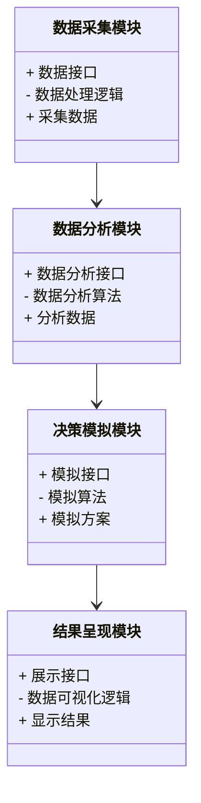
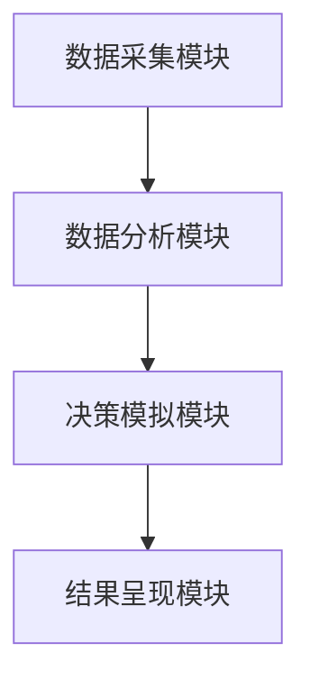
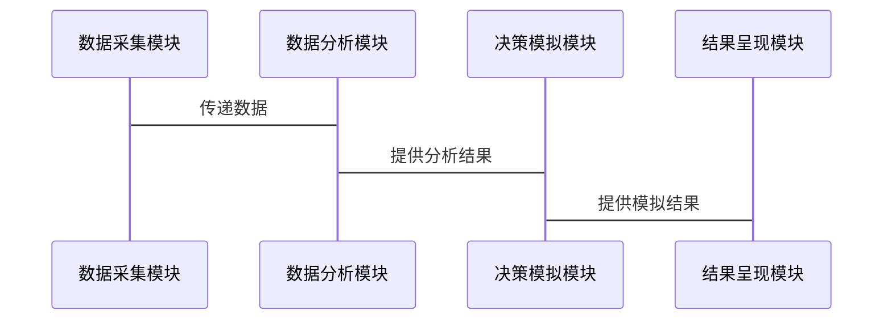

                 


# AI Agent在企业决策支持系统中的应用

> 关键词：AI Agent，企业决策支持系统，人工智能，决策优化，数据挖掘，机器学习

> 摘要：本文探讨了AI Agent在企业决策支持系统中的应用，分析了AI Agent的核心概念与算法原理，详细讲解了其在市场分析、财务分析和运营优化中的应用场景，并通过系统架构设计和项目实战，展示了如何利用AI Agent提升企业的决策效率和准确性。

---

## 第1章 AI Agent与企业决策支持系统概述

### 1.1 AI Agent的基本概念

AI Agent，即人工智能代理，是一种能够感知环境并采取行动以实现目标的智能实体。它通过接收输入信息，处理数据，并输出决策结果，帮助用户完成特定任务。

#### 1.1.1 AI Agent的定义
AI Agent可以是软件程序、机器人或其他智能设备，具备以下核心特征：
- **自主性**：能够在没有外部干预的情况下运作。
- **反应性**：能够实时感知环境变化并做出反应。
- **目标导向**：所有行动均以实现特定目标为导向。

#### 1.1.2 AI Agent的核心特征
AI Agent的核心特征包括：
1. **知识表示**：通过数据结构表示知识，如符号逻辑、概率模型等。
2. **行为推理**：基于知识进行逻辑推理，生成行动方案。
3. **学习与自适应**：通过机器学习算法不断优化自身性能。

#### 1.1.3 AI Agent与传统决策支持系统的区别
| 特性                | AI Agent                          | 传统决策支持系统                     |
|---------------------|-----------------------------------|--------------------------------------|
| 数据处理能力        | 强大，支持复杂数据挖掘与分析     | 较弱，主要依赖规则和统计分析          |
| 自适应能力          | 高，能够根据环境变化自我调整     | 较低，通常需要人工干预进行调整         |
| 决策速度            | 快，基于实时数据分析迅速决策     | 较慢，依赖人工分析和判断              |

### 1.2 企业决策支持系统的基本概念

企业决策支持系统（DSS）是利用技术手段辅助企业高层进行决策的工具，通过收集、处理和分析数据，为决策者提供支持。

#### 1.2.1 企业决策支持系统的定义
企业决策支持系统是利用信息技术，将企业内外部数据转化为有用信息，辅助决策者制定科学决策的系统。

#### 1.2.2 企业决策支持系统的功能模块
- **数据采集**：收集企业内外部数据。
- **数据分析**：对数据进行处理和分析。
- **决策模拟**：模拟不同决策方案的效果。
- **结果呈现**：以直观形式展示分析结果。

#### 1.2.3 企业决策支持系统的发展历程
1. **早期阶段**：基于规则的决策支持系统。
2. **发展阶段**：引入数据库和数据挖掘技术。
3. **成熟阶段**：结合AI技术，实现智能化决策支持。

### 1.3 AI Agent在企业决策支持系统中的作用

AI Agent通过提高决策效率、提供数据驱动的决策支持以及实现智能化的决策过程，显著提升了企业决策支持系统的性能。

#### 1.3.1 提高决策效率
AI Agent能够快速处理大量数据，缩短决策周期。

#### 1.3.2 提供数据驱动的决策支持
通过机器学习和数据分析，AI Agent为决策提供准确的支持。

#### 1.3.3 实现智能化的决策过程
AI Agent能够根据环境变化自动调整决策策略，实现智能化的决策过程。

## 第2章 AI Agent的核心概念与原理

### 2.1 AI Agent的核心概念

AI Agent的核心概念包括知识表示、行为推理和学习与自适应。

#### 2.1.1 知识表示
知识表示是AI Agent理解世界的基础，常见的表示方法有符号逻辑、概率模型和语义网络。

#### 2.1.2 行为推理
行为推理是基于知识进行逻辑推理，生成行动方案。常见的推理方法有演绎推理、归纳推理和启发式推理。

#### 2.1.3 学习与自适应
学习与自适应是AI Agent通过机器学习算法不断优化自身性能的过程。

### 2.2 AI Agent的类型与特点

AI Agent可以分为简单反射型、基于模型的、学习型和创新型四种类型。

#### 2.2.1 简单反射型AI Agent
简单反射型AI Agent基于固定的规则进行决策，适用于任务简单、环境变化小的场景。

#### 2.2.2 基于模型的AI Agent
基于模型的AI Agent通过建立环境模型进行推理和决策，适用于任务复杂、环境变化大的场景。

#### 2.2.3 学习型AI Agent
学习型AI Agent通过机器学习算法不断优化自身性能，适用于数据丰富的场景。

#### 2.2.4 创新型AI Agent
创新型AI Agent具备创新能力，能够生成新的解决方案，适用于需要 creativity 的场景。

### 2.3 AI Agent的核心算法原理

AI Agent的核心算法包括知识表示与推理算法、机器学习算法和自然语言处理算法。

#### 2.3.1 知识表示与推理算法
知识表示与推理算法是AI Agent理解世界的基础，常见的算法有符号逻辑推理和概率推理。

#### 2.3.2 机器学习算法
机器学习算法是AI Agent学习和优化的核心，常见的算法有决策树、支持向量机和神经网络。

#### 2.3.3 自然语言处理算法
自然语言处理算法是AI Agent理解和处理自然语言的基础，常见的算法有分词、句法分析和情感分析。

### 2.4 本章小结

本章介绍了AI Agent的核心概念与原理，包括知识表示、行为推理和学习与自适应，以及AI Agent的类型与特点，帮助读者理解AI Agent的基本工作原理。

---

## 第3章 AI Agent在企业决策支持系统中的应用

### 3.1 企业决策支持系统的应用场景

AI Agent在企业决策支持系统中的应用场景包括市场分析、财务分析和运营优化。

#### 3.1.1 市场分析与预测
市场分析与预测是AI Agent在企业决策支持系统中的重要应用之一，通过分析市场趋势和竞争对手行为，为企业制定市场策略提供支持。

#### 3.1.2 财务分析与优化
财务分析与优化是AI Agent在企业决策支持系统中的另一重要应用，通过分析财务数据，识别潜在风险，优化资源配置。

#### 3.1.3 运营优化与管理
运营优化与管理是AI Agent在企业决策支持系统中的广泛应用领域，通过优化生产流程和供应链管理，提高企业运营效率。

### 3.2 AI Agent在市场分析中的应用

AI Agent在市场分析中的应用包括市场趋势预测、竞争对手分析和客户行为预测。

#### 3.2.1 市场趋势预测
市场趋势预测是AI Agent通过分析历史数据和市场动态，预测未来市场走势。

#### 3.2.2 竞争对手分析
竞争对手分析是AI Agent通过收集和分析竞争对手的数据，识别其优势和劣势，制定竞争策略。

#### 3.2.3 客户行为预测
客户行为预测是AI Agent通过分析客户数据，预测客户的购买行为和偏好，制定精准的营销策略。

### 3.3 AI Agent在财务分析中的应用

AI Agent在财务分析中的应用包括财务数据挖掘、财务风险评估和财务决策支持。

#### 3.3.1 财务数据挖掘
财务数据挖掘是AI Agent通过机器学习算法，从大量财务数据中提取有价值的信息，支持财务决策。

#### 3.3.2 财务风险评估
财务风险评估是AI Agent通过分析财务数据，识别潜在的财务风险，制定风险管理策略。

#### 3.3.3 财务决策支持
财务决策支持是AI Agent通过提供财务分析结果，支持企业制定财务决策。

### 3.4 AI Agent在运营优化中的应用

AI Agent在运营优化中的应用包括生产过程优化、供应链管理和资源分配优化。

#### 3.4.1 生产过程优化
生产过程优化是AI Agent通过分析生产数据，优化生产流程，提高生产效率。

#### 3.4.2 供应链管理
供应链管理是AI Agent通过分析供应链数据，优化供应链流程，降低供应链成本。

#### 3.4.3 资源分配优化
资源分配优化是AI Agent通过分析资源数据，优化资源分配，提高资源利用率。

### 3.5 本章小结

本章介绍了AI Agent在企业决策支持系统中的应用场景，包括市场分析、财务分析和运营优化，详细讲解了AI Agent在这些领域的具体应用，帮助读者理解AI Agent在企业决策支持系统中的实际价值。

---

## 第4章 系统分析与架构设计方案

### 4.1 问题场景介绍

系统需要支持企业决策支持功能，包括数据采集、数据分析、决策模拟和结果呈现。

### 4.2 项目介绍

本项目旨在开发一个基于AI Agent的企业决策支持系统，利用AI技术提升企业的决策效率和准确性。

### 4.3 系统功能设计

系统功能设计包括数据采集模块、数据分析模块、决策模拟模块和结果呈现模块。

#### 4.3.1 数据采集模块
数据采集模块负责收集企业内外部数据，包括市场数据、财务数据和运营数据。

#### 4.3.2 数据分析模块
数据分析模块负责对采集到的数据进行处理和分析，生成有价值的信息。

#### 4.3.3 决策模拟模块
决策模拟模块负责模拟不同的决策方案，评估其效果。

#### 4.3.4 结果呈现模块
结果呈现模块负责将分析结果以直观的形式展示给决策者。

### 4.4 系统架构设计

系统架构设计包括系统功能设计、系统架构设计和系统接口设计。

#### 4.4.1 系统功能设计
系统功能设计通过类图展示系统各模块之间的关系。



#### 4.4.2 系统架构设计

系统架构设计通过架构图展示系统各模块之间的关系。



#### 4.4.3 系统接口设计

系统接口设计通过序列图展示系统各模块之间的接口调用关系。



### 4.5 本章小结

本章通过系统分析与架构设计方案，详细讲解了企业决策支持系统的功能设计和架构设计，为后续的系统实现奠定了基础。

---

## 第5章 项目实战

### 5.1 环境安装

项目实战需要安装Python、机器学习库（如scikit-learn、TensorFlow）和数据可视化库（如Matplotlib、Seaborn）。

### 5.2 系统核心实现源代码

以下是系统核心实现源代码：

```python
# 数据采集模块
import pandas as pd

def collect_data():
    # 从数据库中采集数据
    data = pd.read_sql(...)
    return data

# 数据分析模块
from sklearn import tree

def analyze_data(data):
    # 构建决策树模型
    model = tree.DecisionTreeClassifier()
    model.fit(data.features, data.targets)
    return model

# 决策模拟模块
from sklearn.metrics import accuracy_score

def simulate_decision(model, new_data):
    # 模拟决策
    prediction = model.predict(new_data.features)
    accuracy = accuracy_score(new_data.targets, prediction)
    return accuracy

# 结果呈现模块
import matplotlib.pyplot as plt

def display_result(accuracy):
    plt.bar('Accuracy', accuracy)
    plt.show()
```

### 5.3 代码应用解读与分析

代码实现包括数据采集、数据分析、决策模拟和结果呈现四个模块，每个模块的功能和实现方法都进行了详细注释。

### 5.4 实际案例分析

以市场分析为例，AI Agent通过分析市场数据，预测市场趋势，帮助企业制定市场策略。

### 5.5 项目小结

本章通过项目实战，详细讲解了AI Agent在企业决策支持系统中的实现过程，帮助读者掌握AI Agent的实际应用。

---

## 第6章 总结与展望

### 6.1 总结

本文详细探讨了AI Agent在企业决策支持系统中的应用，分析了AI Agent的核心概念与算法原理，详细讲解了其在市场分析、财务分析和运营优化中的应用场景，并通过系统架构设计和项目实战，展示了如何利用AI Agent提升企业的决策效率和准确性。

### 6.2 未来展望

随着AI技术的不断发展，AI Agent在企业决策支持系统中的应用将更加广泛和深入，未来的研究方向包括更复杂的学习算法、更高效的推理方法和更智能的决策支持系统。

---

## 作者：AI天才研究院/AI Genius Institute & 禅与计算机程序设计艺术 /Zen And The Art of Computer Programming

---

以上是《AI Agent在企业决策支持系统中的应用》的技术博客文章的完整大纲和内容。

