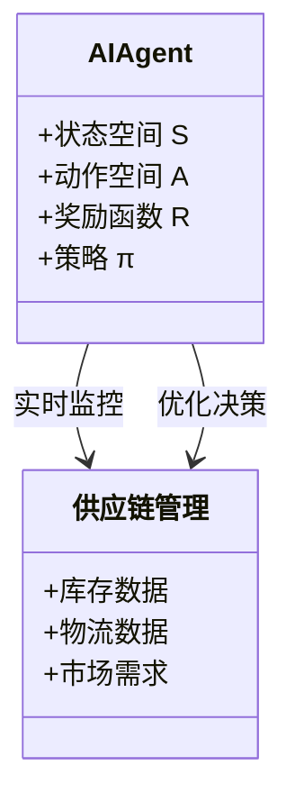
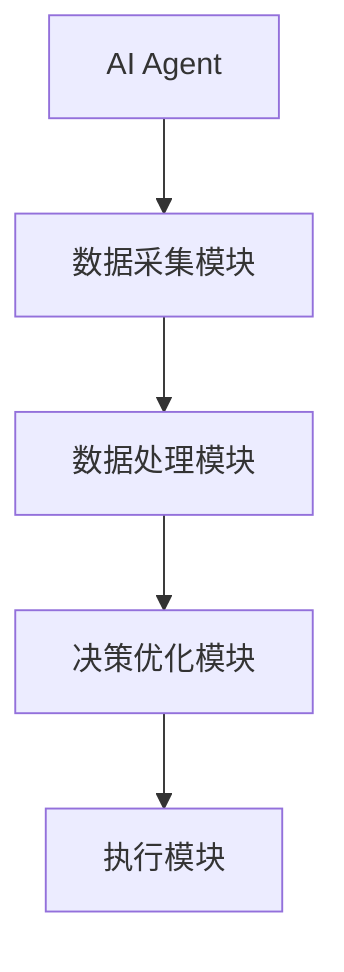
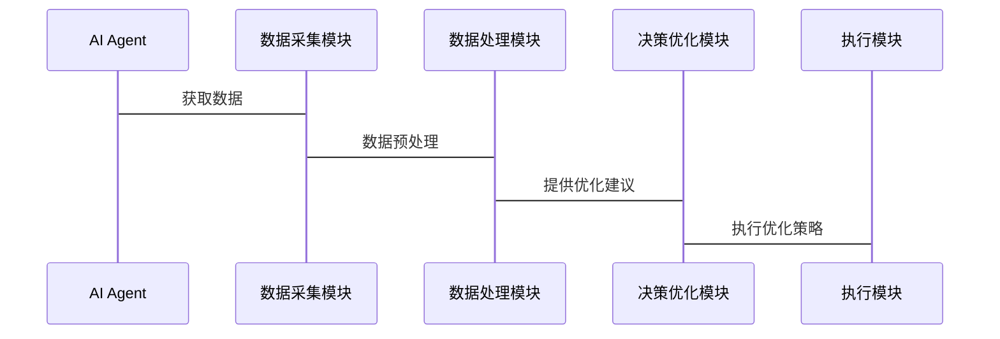

                 


---

# AI Agent在企业决策支持系统中的角色与实现

> 关键词：AI Agent、企业决策支持系统、强化学习、数学模型、系统架构、项目实战

> 摘要：随着人工智能技术的快速发展，AI Agent在企业决策支持系统中的应用越来越广泛。本文详细探讨了AI Agent的核心概念、算法原理、数学模型、系统架构以及实际项目实现。通过理论与实践相结合，展示了AI Agent如何提升企业决策的效率和准确性，为企业决策支持系统的优化提供了新的思路和方法。

---

# 第1章: AI Agent与企业决策支持系统概述

## 1.1 AI Agent的基本概念

### 1.1.1 AI Agent的定义与特点

AI Agent（人工智能代理）是一种能够感知环境、自主决策并执行任务的智能实体。它具备以下特点：
- **自主性**：能够在没有外部干预的情况下独立运作。
- **反应性**：能够实时感知环境变化并做出反应。
- **目标导向**：通过设定目标来驱动行为。
- **学习能力**：能够通过经验改进自身性能。

### 1.1.2 AI Agent的核心组成部分

AI Agent主要由以下部分组成：
1. **感知器**：负责接收外部环境的信息。
2. **推理器**：对感知到的信息进行分析和推理。
3. **决策器**：基于推理结果制定决策。
4. **执行器**：将决策转化为具体行动。

### 1.1.3 AI Agent与传统决策支持系统的区别

传统决策支持系统依赖于人工输入和固定的规则，而AI Agent能够主动学习、适应环境并优化决策过程。AI Agent通过强化学习等技术，能够从经验中不断优化自身的决策策略，从而显著提升决策的准确性和效率。

## 1.2 企业决策支持系统的背景

### 1.2.1 企业决策支持系统的定义

企业决策支持系统（Enterprise Decision Support System, EDSS）是一种利用信息技术和数据分析帮助企业做出更明智决策的系统。它通常包括数据采集、分析、预测和优化等功能。

### 1.2.2 企业决策支持系统的演变

随着技术的发展，企业决策支持系统经历了从简单的数据查询到复杂的智能分析的演变过程。AI Agent的引入，使得决策支持系统能够更加智能化和自动化。

### 1.2.3 AI Agent在企业决策支持系统中的作用

AI Agent在企业决策支持系统中扮演着关键角色：
- **数据处理**：AI Agent能够快速处理大量数据，提取有用信息。
- **决策优化**：通过强化学习等技术，优化决策策略。
- **实时反馈**：能够实时监控环境变化并提供反馈。

## 1.3 AI Agent在企业决策支持系统中的应用前景

### 1.3.1 AI Agent的潜在应用场景

AI Agent在企业中的潜在应用场景包括：
- **供应链管理**：优化供应链中的库存管理和物流调度。
- **风险管理**：实时监控企业运营中的风险，并制定应对策略。
- **市场预测**：基于市场数据，预测市场趋势并制定相应的营销策略。

### 1.3.2 企业采用AI Agent的优势

采用AI Agent的优势包括：
- **提高决策效率**：AI Agent能够快速处理数据并制定决策，显著提高决策效率。
- **增强决策准确性**：通过学习和优化，AI Agent能够制定更加准确的决策。
- **降低运营成本**：自动化决策能够减少人工干预，降低运营成本。

### 1.3.3 AI Agent应用的挑战与机遇

AI Agent的应用面临以下挑战：
- **技术复杂性**：AI Agent的开发和部署需要较高的技术门槛。
- **数据依赖性**：AI Agent依赖于大量数据，数据的质量和安全性问题需要解决。
- **伦理和法律问题**：AI Agent的决策可能涉及伦理和法律问题，需要制定相应的规范。

## 1.4 本章小结

本章介绍了AI Agent的基本概念、核心组成部分以及与传统决策支持系统的区别。同时，探讨了AI Agent在企业决策支持系统中的作用和应用前景，为后续章节的深入分析奠定了基础。

---

# 第2章: AI Agent的核心概念与原理

## 2.1 AI Agent的核心概念

### 2.1.1 知识表示与推理

知识表示是AI Agent进行推理和决策的基础。常见的知识表示方法包括：
- **命题逻辑**：通过命题和逻辑推理来表示知识。
- **概率推理**：基于概率论进行推理，适用于不确定性较高的场景。
- **模糊逻辑**：适用于处理模糊性较高的知识。

### 2.1.2 问题求解与规划

问题求解与规划是AI Agent的核心能力之一。常见的算法包括：
- **广度优先搜索（BFS）**：适用于状态空间较小的场景。
- **深度优先搜索（DFS）**：适用于状态空间较大的场景。
- **A*算法**：结合了启发式搜索和最佳优先搜索，适用于路径规划等问题。

### 2.1.3 学习与自适应

学习是AI Agent提升自身能力的重要途径。常见的学习方法包括：
- **监督学习**：通过标注数据进行学习。
- **无监督学习**：通过未标注数据进行学习。
- **强化学习**：通过与环境交互进行学习。

## 2.2 AI Agent的决策过程

### 2.2.1 信息收集与处理

AI Agent需要通过感知器收集环境中的信息，并进行预处理和特征提取。

### 2.2.2 决策模型构建

基于预处理的信息，AI Agent构建决策模型，并通过推理和优化生成决策策略。

### 2.2.3 决策执行与反馈

AI Agent根据决策模型生成决策，并通过执行器执行决策，同时收集反馈信息用于模型优化。

## 2.3 AI Agent与企业决策支持系统的联系

### 2.3.1 企业决策支持系统的功能模块

企业决策支持系统通常包括以下功能模块：
- **数据采集与处理**：收集和处理企业运营中的数据。
- **数据分析与建模**：对数据进行分析和建模，生成决策支持信息。
- **决策优化与模拟**：基于模型进行决策优化和模拟。

### 2.3.2 AI Agent在决策支持中的角色

AI Agent在企业决策支持系统中主要扮演以下角色：
- **数据处理引擎**：负责数据的采集、处理和分析。
- **决策优化器**：基于强化学习等技术优化决策策略。
- **实时反馈机制**：实时监控环境变化并提供反馈。

### 2.3.3 AI Agent与企业决策支持系统的整合

通过将AI Agent与企业决策支持系统进行整合，能够实现智能化的决策支持。整合的关键在于数据的共享和接口的标准化。

## 2.4 本章小结

本章详细探讨了AI Agent的核心概念与原理，包括知识表示与推理、问题求解与规划、学习与自适应等方面。同时，分析了AI Agent在企业决策支持系统中的角色和作用，为后续章节的实现奠定了理论基础。

---

# 第3章: AI Agent的算法原理与实现

## 3.1 基础算法概述

### 3.1.1 知识表示与推理算法

知识表示与推理算法是AI Agent进行推理和决策的基础。常见的算法包括命题逻辑推理、概率推理和模糊逻辑推理。

### 3.1.2 问题求解与规划算法

问题求解与规划算法是AI Agent的核心能力之一。常见的算法包括BFS、DFS、A*等。

### 3.1.3 学习与自适应算法

学习与自适应算法是AI Agent提升自身能力的重要途径。常见的算法包括监督学习、无监督学习和强化学习。

## 3.2 基于强化学习的AI Agent实现

### 3.2.1 强化学习的基本原理

强化学习是一种通过与环境交互来学习策略的方法。其基本原理是：智能体通过执行动作，观察环境的反馈，并通过奖励函数来调整策略，以最大化累积奖励。

### 3.2.2 DQN算法在AI Agent中的应用

DQN（Deep Q-Network）算法是一种基于深度学习的强化学习算法。它通过神经网络来近似Q值函数，能够在复杂环境中进行决策。

### 3.2.3 算法实现的数学模型

DQN算法的数学模型包括：
- **Q值更新公式**：
$$ Q(s, a) = Q(s, a) + \alpha [r + \gamma \max_{a'} Q(s', a') - Q(s, a)] $$
其中，$\alpha$是学习率，$\gamma$是折扣因子。

### 3.2.4 DQN算法的实现步骤

1. **环境初始化**：定义环境和状态空间。
2. **神经网络初始化**：定义神经网络结构并初始化参数。
3. **与环境交互**：根据当前策略选择动作，执行动作并观察奖励。
4. **更新Q值**：根据奖励更新Q值函数。
5. **策略更新**：定期更新策略，例如使用epsilon-greedy策略。

## 3.3 基于图模型的决策支持

### 3.3.1 图模型的基本概念

图模型是一种通过图结构表示数据关系的方法。常见的图模型包括有向图、无向图和加权图。

### 3.3.2 A*算法在路径规划中的应用

A*算法是一种基于启发式搜索的最短路径算法。它通过评估节点的优先级来进行搜索，适用于路径规划问题。

### 3.3.3 图模型在决策支持中的应用

图模型可以用于表示企业的组织结构、业务流程等，帮助AI Agent进行决策。

## 3.4 本章小结

本章详细探讨了AI Agent的算法原理与实现，包括强化学习、DQN算法和A*算法等。通过数学模型和代码实现，展示了AI Agent如何通过算法优化决策过程。

---

# 第4章: AI Agent的数学模型与公式

## 4.1 知识表示与推理的数学模型

### 4.1.1 命题逻辑表示法

命题逻辑通过命题和逻辑运算符来表示知识。例如，命题$p \land q$表示“p且q”。

### 4.1.2 概率推理模型

概率推理模型通过概率分布来表示不确定性。例如，贝叶斯网络是一种常见的概率推理模型。

### 4.1.3 模糊逻辑表示法

模糊逻辑通过隶属度函数来表示模糊性。例如，模糊集合的隶属度函数$f(x)$表示元素$x$属于集合的程度。

## 4.2 问题求解与规划的数学模型

### 4.2.1 状态空间表示

状态空间表示问题的所有可能状态。例如，迷宫问题的状态空间可以表示为所有可能的位置。

### 4.2.2 动作空间表示

动作空间表示智能体可以执行的所有动作。例如，迷宫问题中的动作可以是“上、下、左、右”。

### 4.2.3 奖励函数设计

奖励函数设计是强化学习中的关键部分。例如，迷宫问题中可以设计奖励函数为：$r = 1$如果到达目标位置，$r = -1$否则。

## 4.3 强化学习的数学模型

### 4.3.1 Q-learning算法的数学公式

Q-learning算法的更新公式为：
$$ Q(s, a) = Q(s, a) + \alpha [r + \gamma \max_{a'} Q(s', a') - Q(s, a)] $$

### 4.3.2 DQN算法的数学模型

DQN算法通过神经网络近似Q值函数，其数学模型包括：
- **输入层**：输入状态$s$。
- **隐含层**：通过神经网络处理输入。
- **输出层**：输出动作$a$的Q值。

### 4.3.3 策略梯度方法的数学公式

策略梯度方法通过优化策略参数$\theta$来最大化期望奖励，其数学公式为：
$$ \theta = \theta + \alpha \nabla_{\theta} [\mathbb{E}[R]] $$

---

# 第5章: AI Agent的系统分析与架构设计

## 5.1 系统分析

### 5.1.1 问题场景介绍

以企业供应链管理为例，AI Agent需要实时监控库存、物流和市场需求，并优化供应链的运营。

### 5.1.2 项目介绍

本项目旨在开发一个基于AI Agent的企业决策支持系统，实现供应链的智能化管理。

## 5.2 系统功能设计

### 5.2.1 领域模型设计

领域模型是系统功能设计的基础。使用Mermaid类图描述领域模型：



### 5.2.2 系统架构设计

系统架构设计需要考虑模块化和可扩展性。使用Mermaid架构图描述系统架构：



### 5.2.3 接口设计与交互流程

接口设计需要考虑模块之间的交互。使用Mermaid序列图描述交互流程：



## 5.3 本章小结

本章通过系统分析和架构设计，展示了AI Agent在企业决策支持系统中的应用。通过领域模型、系统架构和交互流程的设计，为后续章节的实现提供了清晰的指导。

---

# 第6章: AI Agent的项目实战

## 6.1 环境安装与配置

### 6.1.1 系统环境

- 操作系统：Linux/Windows/MacOS
- Python版本：3.6+
- 需要的库：numpy、pandas、keras、tensorflow、matplotlib

### 6.1.2 安装依赖

使用pip安装以下依赖：
```bash
pip install numpy pandas keras tensorflow matplotlib
```

## 6.2 核心实现

### 6.2.1 知识表示与推理

实现一个简单的命题逻辑推理器：

```python
def AND(p, q):
    return p and q

def OR(p, q):
    return p or q

# 示例
p = True
q = False
print(AND(p, q))  # 输出: False
print(OR(p, q))   # 输出: True
```

### 6.2.2 强化学习实现

实现一个基于DQN的AI Agent：

```python
import numpy as np
import keras
from keras.models import Sequential
from keras.layers import Dense

# 定义网络结构
model = Sequential()
model.add(Dense(32, activation='relu', input_dim=state_size))
model.add(Dense(1, activation='linear'))
model.compile(optimizer='adam', loss='mean_squared_error')

# 定义DQN算法
class DQNAgent:
    def __init__(self, state_size, action_size):
        self.state_size = state_size
        self.action_size = action_size
        self.model = model

    def act(self, state):
        state = np.array([state])
        prediction = self.model.predict(state)
        return np.argmax(prediction[0])

    def train(self, state, action, reward, next_state):
        state = np.array([state])
        next_state = np.array([next_state])
        target = self.model.predict(state)
        target[0][action] = reward + gamma * np.max(self.model.predict(next_state))
        self.model.fit(state, target, epochs=1, verbose=0)

# 示例
state_size = 4
action_size = 2
agent = DQNAgent(state_size, action_size)
state = [0, 0, 0, 0]
action = agent.act(state)
reward = 1.0
next_state = [1, 0, 0, 0]
agent.train(state, action, reward, next_state)
```

### 6.2.3 图模型实现

实现一个基于A*算法的路径规划：

```python
import heapq

def a_star_search(start, goal, grid):
    open_set = set([start])
    came_from = {}
    g_score = {start: 0}
    f_score = {start: heuristic(start, goal)}
    
    while open_set:
        current = heapq.heappop(open_set)
        if current == goal:
            break
        for neighbor in grid[current]:
            tentative_g_score = g_score[current] + cost(current, neighbor)
            if neighbor not in g_score or tentative_g_score < g_score[neighbor]:
                came_from[neighbor] = current
                g_score[neighbor] = tentative_g_score
                f_score[neighbor] = g_score[neighbor] + heuristic(neighbor, goal)
                heapq.heappush(open_set, neighbor)
    return came_from, g_score

def heuristic(a, b):
    return abs(a[0] - b[0]) + abs(a[1] - b[1])

# 示例
start = (0, 0)
goal = (4, 4)
grid = {...}  # 定义网格
came_from, g_score = a_star_search(start, goal, grid)
```

## 6.3 案例分析与详细解读

以供应链管理为例，展示AI Agent如何优化库存管理和物流调度。

## 6.4 本章小结

本章通过具体的项目实战，展示了AI Agent在企业决策支持系统中的实现。通过代码实现和案例分析，帮助读者更好地理解和应用AI Agent技术。

---

# 第7章: 总结与展望

## 7.1 本章总结

本文详细探讨了AI Agent在企业决策支持系统中的角色与实现。通过理论分析和项目实战，展示了AI Agent如何通过强化学习、图模型等技术优化企业决策过程。

## 7.2 未来展望

未来，AI Agent在企业决策支持系统中的应用将更加广泛和深入。随着技术的进步，AI Agent将具备更强的自主性和学习能力，为企业决策提供更加智能和高效的支持。

## 7.3 最佳实践 Tips

- **数据质量**：确保数据的准确性和完整性，是AI Agent正常运行的基础。
- **模型优化**：定期优化AI Agent的决策模型，以适应环境的变化。
- **人机协作**：AI Agent与人类专家的协作，能够显著提升决策的准确性和创新性。

## 7.4 参考文献与进一步阅读

1. Russell, S., & Norvig, P. (2010). Artificial Intelligence: A Modern Approach.
2. Sutton, R. S., & Barto, A. G. (2018). Reinforcement Learning: An Introduction.
3. LeCun, Y., Bengio, Y., & Hinton, G. (2015). Deep Learning.

---

# 作者：AI天才研究院/AI Genius Institute & 禅与计算机程序设计艺术 /Zen And The Art of Computer Programming

---

**本文版权归作者所有，未经授权，不得转载。**

