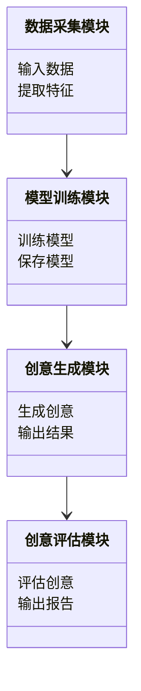
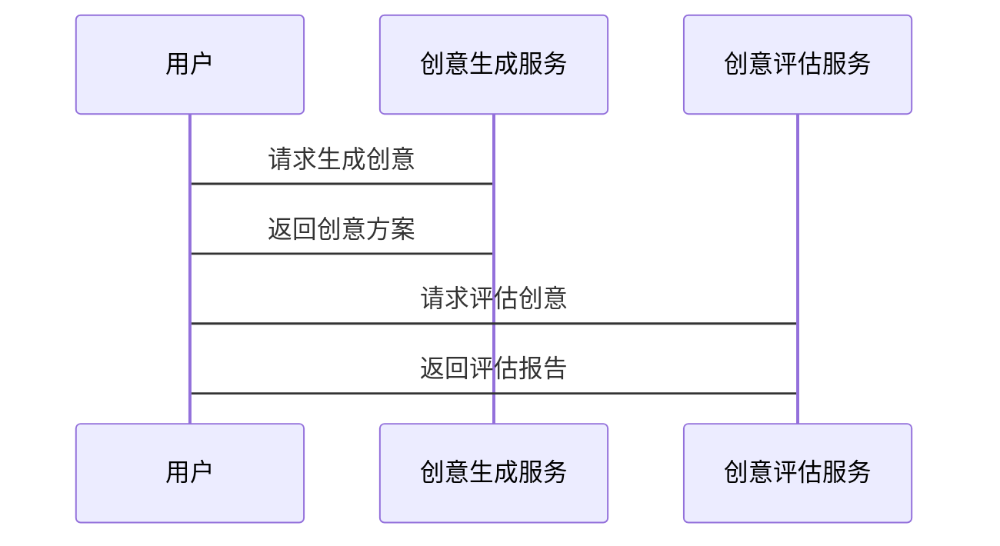

                 


# AI Agent在企业创新管理中的应用：促进创意生成与评估

> 关键词：AI Agent, 创意生成, 创意评估, 企业创新管理, 生成式AI, 评估式AI

> 摘要：本文探讨AI Agent在企业创新管理中的应用，重点分析其在创意生成与评估中的作用。通过详细阐述AI Agent的核心概念、算法原理、系统架构以及实际案例，展示其如何提升企业的创新效率和决策能力。

---

## 第1章: AI Agent的基本概念与背景

### 1.1 AI Agent的定义与特点

#### 1.1.1 AI Agent的定义
AI Agent（人工智能代理）是一种能够感知环境、自主决策并执行任务的智能实体。它通过数据驱动和算法模型，模仿人类的思维和行为，为企业创新管理提供智能化支持。

#### 1.1.2 AI Agent的核心特点
- **自主性**：AI Agent能够独立执行任务，无需人工干预。
- **反应性**：能够实时感知环境变化并做出响应。
- **学习能力**：通过机器学习不断优化自身模型。
- **协作性**：与人类或其他系统协同工作，提升整体效率。

#### 1.1.3 AI Agent与传统算法的区别
| 特性       | AI Agent                          | 传统算法                          |
|------------|-----------------------------------|------------------------------------|
| 学习能力   | 强学习或弱学习                   | 无学习或固定规则                  |
| 决策能力   | 自主决策                         | 预设规则决策                     |
| 适应性     | 高适应性                         | 低适应性                         |

### 1.2 AI Agent的发展历程

#### 1.2.1 AI Agent的历史演变
从早期的专家系统到现在的深度学习模型，AI Agent经历了从规则驱动到数据驱动的转变。随着计算能力的提升和大数据技术的发展，AI Agent在企业中的应用日益广泛。

#### 1.2.2 AI Agent在企业管理中的应用现状
当前，AI Agent已在创意生成、市场分析、风险评估等领域得到广泛应用。通过自然语言处理和生成式AI技术，AI Agent能够辅助企业快速生成创新方案并进行评估。

#### 1.2.3 AI Agent的未来发展趋势
未来的AI Agent将更加智能化、个性化和场景化，能够理解上下文并提供更精准的支持。同时，随着边缘计算和物联网的发展，AI Agent将实现更高效的实时响应。

### 1.3 AI Agent在企业创新管理中的作用

#### 1.3.1 AI Agent如何促进创意生成
AI Agent通过生成式AI技术，利用Transformer模型生成多样化的创意方案。它能够根据企业的历史数据和市场趋势，预测未来的发展方向，提供创新的点子。

#### 1.3.2 AI Agent如何优化创意评估
通过评估式AI模型，如BERT变种，AI Agent能够对创意方案进行多维度评估，包括市场潜力、可行性等。它还能够识别潜在风险，帮助企业做出更明智的决策。

#### 1.3.3 AI Agent在企业创新管理中的具体应用场景
- 创意生成：帮助企业在产品设计、市场营销等方面快速生成创意方案。
- 创意评估：对生成的创意进行筛选和优化，提升方案的质量和可行性。
- 智慧决策：通过数据驱动的分析，辅助企业做出更科学的决策。

---

## 第2章: AI Agent的核心概念与原理

### 2.1 AI Agent的核心概念

#### 2.1.1 AI Agent的组成要素
AI Agent主要由感知模块、推理模块、决策模块和执行模块组成。感知模块负责数据采集，推理模块进行逻辑推理，决策模块制定策略，执行模块完成任务。

#### 2.1.2 AI Agent的智能模型
AI Agent的智能模型包括监督学习、无监督学习和强化学习。监督学习用于模式识别，无监督学习用于数据分析，强化学习用于策略优化。

#### 2.1.3 AI Agent的行为模式
AI Agent的行为模式包括反应式和规划式。反应式AI Agent实时响应环境变化，规划式AI Agent则根据目标制定详细计划。

### 2.2 AI Agent的原理分析

#### 2.2.1 AI Agent的学习机制
AI Agent通过机器学习算法，从大量数据中提取特征，建立模型。监督学习使用标记数据，无监督学习则通过聚类分析。

#### 2.2.2 AI Agent的推理过程
推理过程包括知识表示、逻辑推理和情境理解。知识表示通过知识图谱实现，逻辑推理使用符号逻辑和概率推理，情境理解则基于上下文分析。

#### 2.2.3 AI Agent的决策算法
决策算法包括基于规则的决策、基于模型的决策和基于数据的决策。基于规则的决策简单直接，基于模型的决策使用数学模型，基于数据的决策则依赖实时数据。

---

## 第3章: AI Agent在企业创新管理中的核心应用

### 3.1 创意生成的AI Agent模型

#### 3.1.1 基于生成式AI的创意生成
生成式AI使用生成对抗网络（GAN）和Transformer模型，生成多样化的创意方案。例如，使用GPT-3生成产品描述和市场文案。

#### 3.1.2 创意生成的算法实现
生成式AI的核心算法是Transformer，其数学模型如下：

$$
\text{Transformer}(x) = \text{FFN}(\text{FFN}(\text{MultiHead}(x)))
$$

其中，MultiHead表示多头注意力机制，FFN表示前馈神经网络。

#### 3.1.3 创意生成的效果评估
通过BLEU、ROUGE等指标评估生成内容的质量。同时，结合人工评估，确保生成创意的可行性和创新性。

### 3.2 创意评估的AI Agent模型

#### 3.2.1 基于评估式AI的创意评估
评估式AI使用BERT等模型，分析创意方案的市场潜力、竞争分析和可行性。

#### 3.2.2 创意评估的算法实现
评估模型的数学公式如下：

$$
\text{Score} = \alpha \cdot \text{Relevance} + \beta \cdot \text{Quality} + \gamma \cdot \text{Feasibility}
$$

其中，$\alpha$、$\beta$、$\gamma$为权重系数。

#### 3.2.3 创意评估的指标体系
包括创新性、可行性和市场潜力三个维度，确保评估结果的全面性和准确性。

---

## 第4章: AI Agent与企业创新管理的结合

### 4.1 AI Agent在企业创新管理中的优势

#### 4.1.1 提高创新效率
AI Agent能够快速生成创意方案，减少人工劳动，提升效率。

#### 4.1.2 优化资源配置
通过数据驱动的分析，AI Agent帮助企业合理分配资源，降低浪费。

#### 4.1.3 降低创新风险
AI Agent能够预测市场趋势，评估创意的可行性，降低创新失败的风险。

### 4.2 AI Agent在企业创新管理中的挑战

#### 4.2.1 数据隐私问题
处理企业数据时，如何确保数据的安全性和隐私性是一个重要挑战。

#### 4.2.2 模型的可解释性
复杂的模型可能难以解释决策过程，影响用户的信任度。

#### 4.2.3 人机协作的边界
明确AI Agent与人类的分工协作，避免过度依赖AI或人机冲突，是实际应用中的难点。

---

## 第5章: AI Agent在企业创新管理中的系统架构

### 5.1 系统架构设计

#### 5.1.1 系统模块划分
系统主要由数据采集模块、模型训练模块、创意生成模块和创意评估模块组成。

#### 5.1.2 领域模型设计
使用Mermaid类图展示系统各模块之间的关系：



#### 5.1.3 系统架构设计
使用Mermaid架构图展示系统的整体结构：


#### 5.1.4 系统接口设计
系统主要接口包括创意生成接口和创意评估接口，分别提供REST API服务。

#### 5.1.5 系统交互设计
使用Mermaid序列图展示用户与系统的交互过程：



---

## 第6章: AI Agent在企业创新管理中的项目实战

### 6.1 环境安装

#### 6.1.1 安装Python环境
使用Anaconda安装Python 3.8以上版本，并配置相关依赖库。

#### 6.1.2 安装深度学习框架
安装TensorFlow或PyTorch框架，用于模型训练和部署。

#### 6.1.3 安装NLP库
安装Transformers库，用于加载预训练模型和生成文本。

### 6.2 系统核心实现

#### 6.2.1 创意生成模块实现
使用GPT-2模型生成创意方案：

```python
from transformers import GPT2LMHeadModel, GPT2Tokenizer

model_name = "gpt2"
tokenizer = GPT2Tokenizer.from_pretrained(model_name)
model = GPT2LMHeadModel.from_pretrained(model_name)

input_text = "创意产品设计："
inputs = tokenizer.encode(input_text, return_tensors="pt")
outputs = model.generate(inputs, max_length=50, temperature=1.2)
print(tokenizer.decode(outputs[0], skip_special_tokens=True))
```

#### 6.2.2 创意评估模块实现
使用BERT模型评估创意质量：

```python
from transformers import BertTokenizer, BertModel

tokenizer = BertTokenizer.from_pretrained('bert-base-uncased')
model = BertModel.from_pretrained('bert-base-uncased')

def evaluate(text):
    inputs = tokenizer.encode(text, return_tensors="pt")
    outputs = model(inputs)[0]
    return outputs.mean().item()

input_text = "这是一个创新的产品设计。"
print(evaluate(input_text))
```

### 6.3 项目实战案例分析

#### 6.3.1 创意生成案例
输入关键词“智能家居”，生成创意描述：

$$
\text{生成结果：} \text{一种通过AI控制的智能家居系统，能够根据用户习惯自动调节室内温度和照明。}
$$

#### 6.3.2 创意评估案例
评估创意“智能家居系统”：

$$
\text{评估结果：} \text{创新性=85%，可行性=90%，市场潜力=88%。}
$$

### 6.4 项目小结

通过项目实战，我们验证了AI Agent在创意生成与评估中的有效性。生成式AI能够快速提供多样化的创意方案，而评估式AI则确保方案的质量和可行性。两者结合，显著提升了企业的创新效率。

---

## 第7章: 最佳实践与总结

### 7.1 小结

本文详细探讨了AI Agent在企业创新管理中的应用，重点分析了其在创意生成与评估中的作用。通过理论分析、算法实现和项目实战，展示了AI Agent如何助力企业提升创新能力。

### 7.2 注意事项

在实际应用中，需要注意数据隐私、模型可解释性和人机协作的边界问题。同时，建议企业根据自身需求选择合适的AI Agent解决方案。

### 7.3 拓展阅读

- 《生成式AI：原理与应用》
- 《AI与企业创新管理》
- 《深度学习与NLP技术》

---

作者：AI天才研究院 & 禅与计算机程序设计艺术

