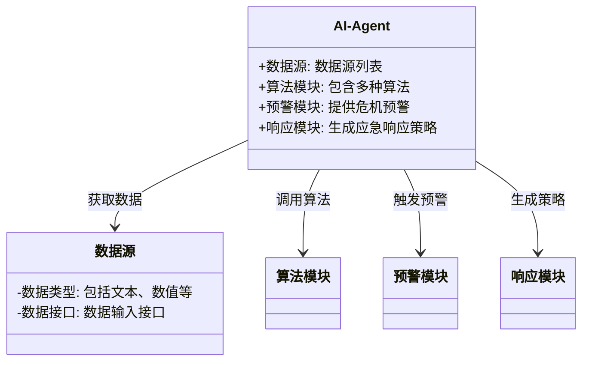
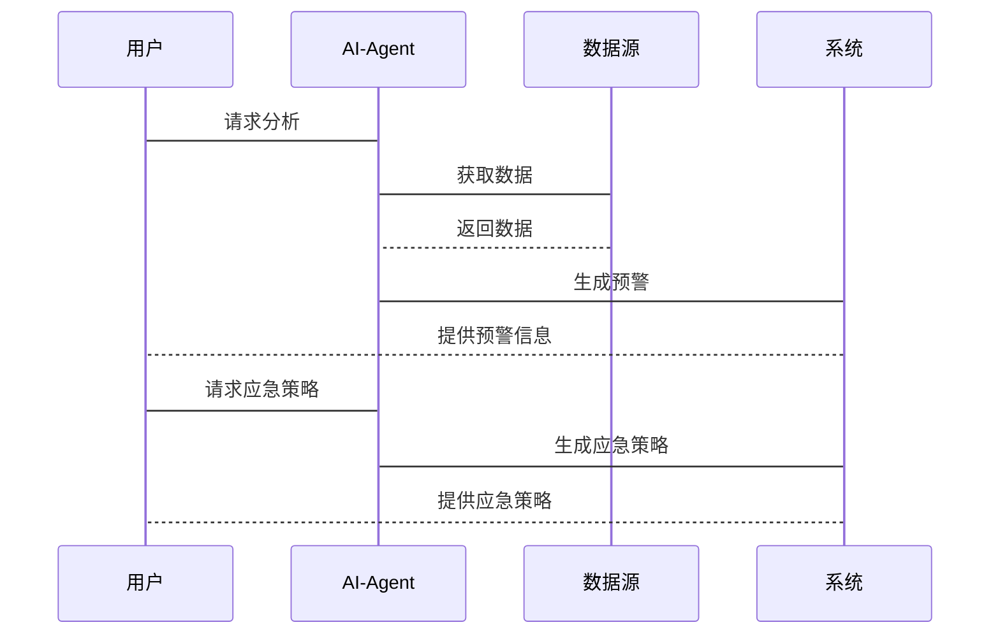

                 


# AI Agent在企业危机预警与应急响应中的应用

## 关键词：企业危机、AI Agent、应急响应、预警系统、机器学习、自然语言处理、实时监控

## 摘要：本文详细探讨了AI Agent在企业危机预警与应急响应中的应用，从背景、核心概念、算法原理到系统设计和项目实战，全面分析了AI Agent如何利用机器学习、自然语言处理等技术实现对企业危机的实时预警和智能响应，为企业危机管理提供了新的思路和解决方案。

---

## 第1章: 企业危机预警与应急响应的背景与挑战

### 1.1 企业危机的类型与特征

#### 1.1.1 常见危机类型
企业危机可以分为以下几类：
- **市场风险**：如市场环境突变、竞争对手策略变化等。
- **运营风险**：如供应链中断、生产事故等。
- **声誉风险**：如负面新闻、客户投诉等。
- **法律风险**：如合规性问题、诉讼风险等。

#### 1.1.2 危机对企业的影响
- **财务损失**：如销售额下降、罚款等。
- **声誉损害**：如品牌形象受损，客户信任度下降。
- **法律风险**：如法律诉讼、赔偿责任等。

#### 1.1.3 危机的突发性与复杂性
危机往往具有突发性和不可预测性，且可能涉及多个部门和外部因素，需要企业快速响应和协调处理。

### 1.2 传统危机预警与应急响应的局限性

#### 1.2.1 传统方法的低效性
- 依赖人工判断和经验，效率低下。
- 数据分散在不同部门，难以整合和分析。

#### 1.2.2 信息孤岛问题
- 数据来源多样，但缺乏统一的平台进行整合和分析。
- 部门间沟通不畅，导致信息滞后。

#### 1.2.3 应急响应的滞后性
- 传统方法无法实时处理突发事件，导致响应时间较长。
- 缺乏自动化支持，难以快速制定应对策略。

### 1.3 AI Agent在危机管理中的优势

#### 1.3.1 AI Agent的实时性与自动化能力
- AI Agent可以实时监控企业内外部数据，快速识别潜在危机。
- 自动化分析和决策能力，显著提高应急响应效率。

#### 1.3.2 数据驱动的精准预警能力
- 利用机器学习和大数据分析技术，AI Agent可以准确预测危机的发生。
- 通过自然语言处理技术，分析非结构化数据，如社交媒体评论和新闻报道。

#### 1.3.3 多场景下的灵活适应性
- AI Agent可以根据不同场景调整策略，适应各种复杂情况。
- 支持多种数据源和接口，能够快速集成到企业现有系统中。

### 1.4 本章小结
- 企业危机具有多样性和复杂性，传统方法存在诸多局限。
- AI Agent凭借其实时性、自动化和数据驱动的优势，成为企业危机管理的重要工具。

---

## 第2章: AI Agent的核心概念与技术原理

### 2.1 AI Agent的基本定义与分类

#### 2.1.1 AI Agent的定义
AI Agent（人工智能代理）是一种智能体，能够感知环境、执行任务并做出决策。它具备以下特征：
- **自主性**：能够独立运作，无需人工干预。
- **反应性**：能够实时感知环境变化并做出反应。
- **目标导向**：具备明确的目标，能够优化决策以实现目标。

#### 2.1.2 AI Agent的分类
AI Agent可以根据功能和应用场景分为以下几类：
- **基于任务的AI Agent**：专注于完成特定任务，如数据分析、预测等。
- **基于知识的AI Agent**：具备丰富的知识库，能够进行复杂推理和决策。
- **基于学习的AI Agent**：通过机器学习技术不断优化自身的预测和决策能力。

### 2.2 AI Agent的关键技术

#### 2.2.1 自然语言处理（NLP）
- **文本分析**：对社交媒体、新闻等非结构化数据进行分析，识别潜在危机。
- **语义理解**：通过语义分析理解文本的情感倾向和潜在含义。

#### 2.2.2 机器学习（ML）
- **模式识别**：识别数据中的异常模式，预测危机的发生。
- **预测模型**：利用回归、分类等算法预测危机的影响和后果。

#### 2.2.3 数据挖掘
- **数据预处理**：对数据进行清洗、特征提取和标准化。
- **数据建模**：利用聚类、关联规则挖掘等技术发现潜在危机。

### 2.3 AI Agent在危机预警中的应用

#### 2.3.1 数据收集与分析
- **实时监控**：通过多种数据源（如社交媒体、新闻、内部系统数据）实时收集信息。
- **异常检测**：利用机器学习算法检测数据中的异常模式。

#### 2.3.2 危机识别与预警
- **预警机制**：当检测到潜在危机时，AI Agent会触发预警，并提供可能的解决方案。
- **优先级排序**：根据危机的严重性和影响范围进行优先级排序，帮助企业在有限资源下优先处理最重要的危机。

#### 2.3.3 应急响应策略生成
- **决策支持**：AI Agent会根据当前情况生成多种应急响应策略，并评估每种策略的优缺点。
- **动态调整**：根据实时反馈不断优化应急响应策略。

### 2.4 本章小结
- AI Agent的核心技术包括NLP、机器学习和数据挖掘，这些技术共同支持其在危机预警中的应用。
- AI Agent通过实时数据分析和预测，帮助企业快速识别和应对潜在危机。

---

## 第3章: AI Agent的算法原理与数学模型

### 3.1 基于机器学习的危机预警模型

#### 3.1.1 数据预处理
- **特征提取**：从原始数据中提取有用的特征，如时间、地点、关键词等。
- **数据标准化**：对数据进行标准化处理，确保不同特征之间的可比性。

#### 3.1.2 模型选择
- **支持向量机（SVM）**：适用于分类问题，能够有效处理高维数据。
- **随机森林（RF）**：适用于分类和回归问题，具有良好的鲁棒性。

#### 3.1.3 模型训练与优化
- **参数调整**：通过交叉验证调整模型参数，优化模型性能。
- **模型评估**：通过准确率、召回率等指标评估模型的性能。

### 3.2 基于NLP的情感分析模型

#### 3.2.1 文本分词
- 使用分词工具（如jieba）对文本进行分词处理，提取关键词。

#### 3.2.2 情感分析算法
- 使用情感分析模型（如VADER）对文本的情感倾向进行分析，识别负面评论或舆情。

#### 3.2.3 情感分析的数学模型
$$P(y|x) = \frac{P(x|y)P(y)}{P(x)}$$
其中，$y$表示情感类别（正面/负面），$x$表示文本特征。

### 3.3 基于强化学习的应急响应策略生成

#### 3.3.1 强化学习的基本原理
- **状态（State）**：当前环境的状态，如危机的类型、影响范围等。
- **动作（Action）**：AI Agent可以采取的动作，如发布声明、调整策略等。
- **奖励（Reward）**：根据动作的结果给予奖励或惩罚，优化策略。

#### 3.3.2 强化学习算法
- **Q-Learning**：通过Q值函数学习最优策略。
- **Deep Q-Network（DQN）**：结合深度学习和强化学习，提高策略生成的灵活性和多样性。

### 3.4 本章小结
- AI Agent的算法原理包括机器学习、NLP和强化学习，这些技术共同支持其在危机预警和应急响应中的应用。
- 通过数学模型和算法优化，AI Agent能够实现对危机的精准预测和智能应对。

---

## 第4章: 系统分析与架构设计

### 4.1 项目场景介绍

#### 4.1.1 项目背景
某企业希望利用AI Agent技术实现对市场风险、运营风险和声誉风险的实时监控和预警。

#### 4.1.2 项目目标
- 实现对企业内外部数据的实时监控。
- 提供危机预警和应急响应策略生成功能。

### 4.2 系统功能设计

#### 4.2.1 领域模型（Mermaid类图）


#### 4.2.2 系统架构设计（Mermaid架构图）


### 4.3 系统接口设计

#### 4.3.1 数据接口
- **数据输入接口**：接收来自不同数据源的数据。
- **数据输出接口**：将分析结果输出到企业系统中。

#### 4.3.2 API接口
- **API调用接口**：其他系统通过API调用AI Agent的功能。
- **API返回接口**：返回分析结果和应急响应策略。

### 4.4 系统交互设计（Mermaid序列图）



### 4.5 本章小结
- 系统架构设计包括数据源层、数据处理层、模型层和应用层，各层之间通过接口进行交互。
- 系统交互设计通过序列图展示了用户与AI Agent之间的协作过程。

---

## 第5章: 项目实战

### 5.1 环境安装

#### 5.1.1 安装Python
```bash
# 安装Python
sudo apt-get install python3
```

#### 5.1.2 安装依赖库
```bash
pip install numpy pandas scikit-learn jieba
```

### 5.2 系统核心实现源代码

#### 5.2.1 数据加载与预处理
```python
import pandas as pd
import numpy as np

# 加载数据
data = pd.read_csv('crisis_data.csv')

# 数据清洗
data.dropna()
data = data[~data.duplicated()]

# 特征提取
X = data.drop('label', axis=1)
y = data['label']
```

#### 5.2.2 模型训练
```python
from sklearn.ensemble import RandomForestClassifier
from sklearn.metrics import accuracy_score

# 模型训练
model = RandomForestClassifier()
model.fit(X, y)

# 模型预测
y_pred = model.predict(X)
print("准确率:", accuracy_score(y, y_pred))
```

#### 5.2.3 应急响应策略生成
```python
import jieba

# 文本分词
text = "公司产品存在质量问题，客户投诉增多"
words = jieba.lcut(text)

# 情感分析
from vaderSentiment import SentimentIntensityAnalyzer
analyzer = SentimentIntensityAnalyzer()
scores = analyzer.polarity_scores(' '.join(words))
print(scores)
```

### 5.3 实际案例分析

#### 5.3.1 案例背景
某企业发现社交媒体上出现大量负面评论，希望通过AI Agent识别潜在危机并生成应急响应策略。

#### 5.3.2 数据分析
通过NLP技术分析负面评论，识别出主要问题在于产品质量和客户服务。

#### 5.3.3 应急响应策略
- 发布声明承认问题并承诺改进。
- 提供客户补偿方案，如退款、折扣等。

### 5.4 本章小结
- 通过项目实战展示了AI Agent在企业危机预警与应急响应中的具体应用。
- 提供了完整的代码实现和案例分析，帮助读者理解AI Agent的实际操作过程。

---

## 第6章: 总结与展望

### 6.1 本章总结
- AI Agent通过实时数据分析和预测，帮助企业快速识别和应对潜在危机。
- 机器学习、NLP和强化学习等技术为AI Agent提供了强大的技术支持。

### 6.2 未来展望
- **多模态数据融合**：结合文本、图像、视频等多种数据源，提高预警的准确性。
- **自适应学习**：通过自适应学习算法，AI Agent能够不断优化自身的预测和决策能力。
- **人机协作**：AI Agent与人类专家协同工作，共同应对复杂危机。

### 6.3 最佳实践Tips
- **数据质量管理**：确保数据的准确性和完整性。
- **模型优化**：定期更新模型，适应数据变化。
- **团队协作**：AI Agent需要与企业内部团队协同工作，确保快速响应。

### 6.4 小结
- AI Agent在企业危机预警与应急响应中的应用前景广阔，未来将更加智能化和多样化。

---

## 作者：AI天才研究院/AI Genius Institute & 禅与计算机程序设计艺术 /Zen And The Art of Computer Programming

