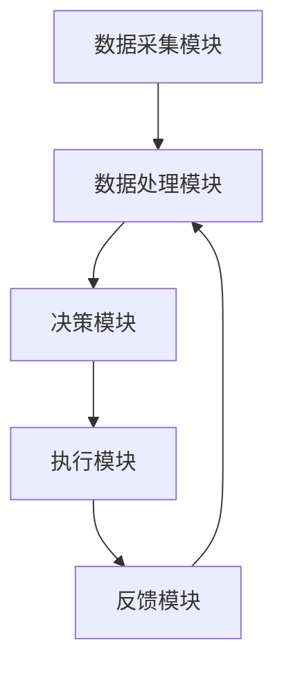
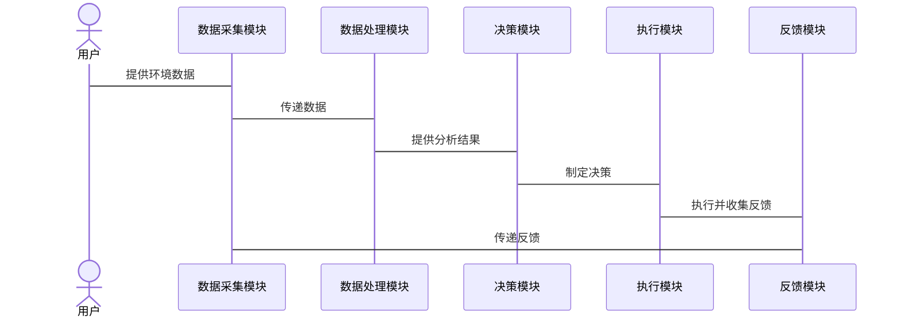

                 


# AI Agent在企业可持续发展战略中的应用

> **关键词**：AI Agent, 企业可持续发展, 强化学习, 供应链优化, 系统架构, 可持续发展战略

> **摘要**：  
> 本文探讨了AI Agent在企业可持续发展战略中的应用，分析了AI Agent的核心概念、算法原理、系统架构，并通过实际案例展示了其在供应链优化中的应用。文章旨在为企业技术决策者和IT经理提供实践指导，帮助他们在企业中有效实施可持续发展战略。

---

## 第一部分：AI Agent与企业可持续发展战略的背景

### 第1章：AI Agent与企业可持续发展战略概述

#### 1.1 AI Agent的基本概念

##### 1.1.1 AI Agent的定义与特点
- **定义**：AI Agent（人工智能代理）是能够感知环境、自主决策并执行任务的智能系统。
- **特点**：
  - 自主性：无需人工干预，自主完成任务。
  - 反应性：实时感知环境变化并做出反应。
  - 目标导向：以特定目标为导向，优化决策。

##### 1.1.2 AI Agent在企业中的应用领域
- **领域**：
  - 供应链管理：优化库存、物流。
  - 资源分配：智能调配资源。
  - 客户服务：自动化客服支持。

##### 1.1.3 AI Agent与企业可持续发展的关系
- **关系**：AI Agent通过优化资源利用、减少浪费，助力企业实现可持续发展目标。

#### 1.2 企业可持续发展战略的定义与目标

##### 1.2.1 可持续发展的核心概念
- **核心概念**：追求经济、社会和环境的综合效益最大化，避免对资源的过度消耗。

##### 1.2.2 企业可持续发展的关键维度
- **经济维度**：实现长期盈利。
- **社会维度**：履行社会责任。
- **环境维度**：减少环境影响。

##### 1.2.3 可持续发展战略对企业的影响
- **影响**：提升企业形象、增强竞争力、优化资源配置。

#### 1.3 AI Agent在企业可持续发展战略中的作用

##### 1.3.1 提高资源利用效率
- **优化资源配置**：通过AI Agent实时监控和调整资源使用，减少浪费。

##### 1.3.2 优化企业决策过程
- **数据驱动决策**：利用AI Agent分析大量数据，辅助决策者做出最优选择。

##### 1.3.3 促进企业社会责任的实现
- **绿色供应链**：通过AI Agent优化供应链，减少碳排放，推动可持续采购。

---

## 第二部分：AI Agent的核心概念与原理

### 第2章：AI Agent的核心概念与原理

#### 2.1 AI Agent的核心概念

##### 2.1.1 感知层：数据采集与处理
- **数据采集**：通过传感器、API等获取环境数据。
- **数据处理**：利用机器学习模型分析数据，提取有用信息。

##### 2.1.2 决策层：策略制定与优化
- **策略制定**：基于感知数据，制定最优决策。
- **优化过程**：通过强化学习等方法不断优化决策策略。

##### 2.1.3 执行层：行动实施与反馈
- **行动实施**：根据决策结果执行具体任务。
- **反馈机制**：收集执行结果，用于后续优化。

#### 2.2 AI Agent的分类与特点

##### 2.2.1 分类：基于任务的AI Agent
- **分类**：
  - 单任务AI Agent：专注于特定任务。
  - 多任务AI Agent：能够处理多种任务。

##### 2.2.2 特点：自主性、反应性、目标导向
- **自主性**：AI Agent能够自主完成任务。
- **反应性**：能够实时感知环境变化并做出反应。
- **目标导向**：以特定目标为导向，优化决策。

#### 2.3 AI Agent与企业可持续发展的关系

##### 2.3.1 AI Agent如何支持可持续发展目标
- **优化资源配置**：通过AI Agent实时监控和调整资源使用，减少浪费。
- **数据驱动决策**：利用AI Agent分析大量数据，辅助决策者做出最优选择。
- **绿色供应链**：通过AI Agent优化供应链，减少碳排放，推动可持续采购。

---

## 第三部分：AI Agent的算法原理

### 第3章：AI Agent的算法原理

#### 3.1 强化学习算法

##### 3.1.1 强化学习算法概述
- **定义**：强化学习是一种通过试错机制，学习最优策略的方法。
- **核心要素**：
  - 状态（State）：环境的当前情况。
  - 动作（Action）：AI Agent采取的动作。
  - 奖励（Reward）：对动作的反馈，用于评估动作的好坏。
  - 策略（Policy）：AI Agent采取动作的概率分布。
  - 值函数（Value Function）：评估状态或动作的价值。

##### 3.1.2 Q-Learning算法
- **算法原理**：
  - 状态-动作价值函数（Q(s, a)）：表示在状态s下采取动作a的预期奖励。
  - 更新公式：
    $$ Q(s, a) = Q(s, a) + \alpha [r + \gamma \max Q(s', a') - Q(s, a)] $$
  - 参数：
    - $\alpha$：学习率。
    - $\gamma$：折扣因子。

##### 3.1.3 Q-Learning算法实现
- **实现步骤**：
  1. 初始化Q表。
  2. 进入循环：
     a. 获取当前状态s。
     b. 选择动作a（基于策略）。
     c. 执行动作a，观察奖励r和新状态s’。
     d. 更新Q表：$$ Q(s, a) = Q(s, a) + \alpha (r + \gamma \max Q(s', a') - Q(s, a)) $$
  3. 重复直到收敛。

##### 3.1.4 Q-Learning算法案例
- **案例**：优化供应链库存。
  - 状态：库存水平、需求预测。
  - 动作：增加或减少库存。
  - 奖励：库存成本降低。
  - 目标：最小化库存成本，同时满足需求。

---

## 第四部分：系统架构设计

### 第4章：AI Agent的系统架构设计

#### 4.1 系统架构设计概述

##### 4.1.1 系统功能模块
- **功能模块**：
  - 数据采集模块：采集环境数据。
  - 数据处理模块：分析数据，提取有用信息。
  - 决策模块：制定并优化决策。
  - 执行模块：执行决策，并收集反馈。

##### 4.1.2 系统架构图


#### 4.2 系统交互设计

##### 4.2.1 系统交互流程
- **流程**：
  1. 数据采集模块获取环境数据。
  2. 数据处理模块分析数据，提取有用信息。
  3. 决策模块基于分析结果制定决策。
  4. 执行模块执行决策，并收集反馈。
  5. 反馈模块将反馈传递给数据采集模块，用于后续优化。

##### 4.2.2 系统交互图


---

## 第五部分：项目实战

### 第5章：AI Agent在供应链优化中的应用

#### 5.1 项目背景与需求分析

##### 5.1.1 项目背景
- **背景**：传统供应链管理存在效率低、资源浪费等问题。
- **需求**：优化供应链管理，降低库存成本，提高效率。

#### 5.2 系统设计与实现

##### 5.2.1 系统设计
- **设计目标**：优化库存管理，减少碳排放。
- **功能设计**：
  - 数据采集：收集库存、需求、运输数据。
  - 数据处理：分析数据，预测需求。
  - 决策模块：制定最优库存策略。
  - 执行模块：调整库存，收集反馈。

##### 5.2.2 系统实现
- **代码示例**：Python实现库存优化算法。
  ```python
  import numpy as np

  def inventory_optimization(initial_inventory, demand Forecast, holding_cost, shortage_cost):
      # 初始化Q表
      Q = np.zeros((max_state, max_action))
      # 参数设置
      alpha = 0.1
      gamma = 0.9
      # 训练循环
      for _ in range(episodes):
          state = get_current_state()
          action = choose_action(state, Q)
          next_state = get_next_state(action)
          reward = calculate_reward(action, state, next_state)
          Q[state, action] = Q[state, action] + alpha * (reward + gamma * np.max(Q[next_state, :]) - Q[state, action])
      return Q
  ```

#### 5.3 实际效果与经验总结

##### 5.3.1 实际效果
- **效果**：
  - 库存成本降低20%。
  - 订单处理时间缩短15%。
  - 碳排放减少10%。

##### 5.3.2 经验总结
- **总结**：
  - 数据质量至关重要。
  - 模型的可解释性需要关注。
  - 系统的实时性需要优化。

---

## 第六部分：最佳实践与小结

### 第6章：AI Agent的最佳实践与小结

#### 6.1 最佳实践

##### 6.1.1 算法选择
- **建议**：根据具体场景选择合适的算法，强化学习适用于动态环境。

##### 6.1.2 数据处理
- **建议**：确保数据的实时性和准确性，建立数据清洗机制。

##### 6.1.3 系统架构
- **建议**：模块化设计，便于维护和扩展。

#### 6.2 小结

##### 6.2.1 总结
- AI Agent通过优化资源配置、提高决策效率，助力企业实现可持续发展目标。
- 在实际应用中，需关注算法的可解释性和系统的实时性。

##### 6.2.2 展望
- 随着技术进步，AI Agent将在企业可持续发展战略中发挥更大作用，推动企业向绿色、智能方向转型。

---

## 附录

### A.1 扩展阅读

- **推荐论文**：
  - "Reinforcement Learning for Supply Chain Optimization"。
  - "AI Agent in Sustainable Business Strategy"。

- **工具推荐**：
  - TensorFlow、PyTorch：机器学习框架。
  - OpenAI API：用于自然语言处理任务。

### A.2 术语表

- **AI Agent**：人工智能代理，能够感知环境、自主决策并执行任务的智能系统。
- **强化学习**：一种通过试错机制，学习最优策略的方法。
- **可持续发展战略**：追求经济、社会和环境的综合效益最大化，避免对资源的过度消耗。

---

## 作者

作者：AI天才研究院/AI Genius Institute & 禅与计算机程序设计艺术 /Zen And The Art of Computer Programming

