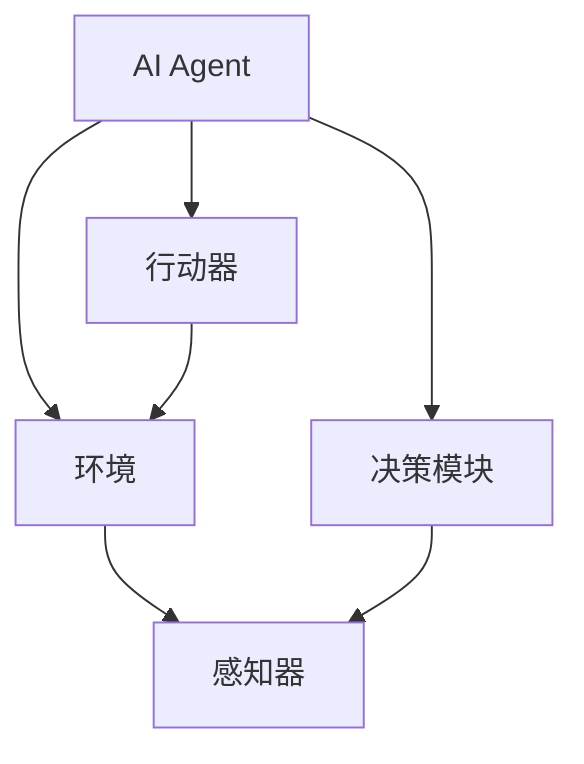
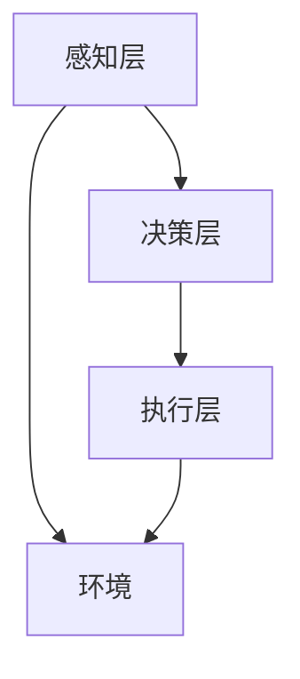
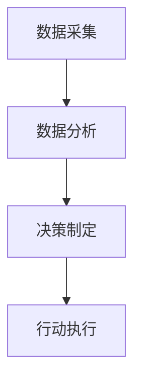

                 

# AI Agent在企业可持续发展战略制定与实施中的应用

## 关键词：AI Agent, 可持续发展战略, 企业战略, 人工智能, 可持续发展

## 摘要：AI Agent作为人工智能技术的核心应用之一，正在逐渐成为企业制定和实施可持续发展战略的重要工具。本文从AI Agent的基本原理出发，探讨其在企业可持续发展战略中的具体应用，包括战略制定、实施和优化等环节。通过案例分析和系统设计，本文展示了AI Agent如何通过数据驱动的方法帮助企业实现可持续发展目标，同时也指出了在实际应用中需要注意的问题和挑战。

---

## 第1章: AI Agent与企业可持续发展战略概述

### 1.1 什么是AI Agent

AI Agent（人工智能代理）是指能够感知环境、自主决策并采取行动的智能实体。与传统代理相比，AI Agent具备更强的学习和适应能力，能够通过大数据分析和机器学习技术不断优化自身的决策过程。

**AI Agent的核心特征：**

- **自主性**：AI Agent能够在没有外部干预的情况下自主决策。
- **反应性**：能够实时感知环境变化并做出反应。
- **学习能力**：通过机器学习算法不断优化自身的决策模型。
- **协作性**：能够与其他AI Agent或系统进行协作。

**AI Agent与传统代理的对比（表格）：**

| 特性                | 传统代理             | AI Agent            |
|---------------------|----------------------|---------------------|
| 自主性               | 低                   | 高                   |
| 学习能力             | 无                   | 有                   |
| 适应性               | 低                   | 高                   |
| 决策能力             | 基于规则             | 基于数据驱动         |

**AI Agent的实体关系图（Mermaid）：**

### 1.2 可持续发展战略的定义与框架

可持续发展战略是指企业在追求经济效益的同时，注重环境保护和社会责任，实现长期发展的战略。其核心包括经济、环境和社会三个维度：

- **经济维度**：追求经济效益，实现资源的高效利用。
- **环境维度**：减少对环境的负面影响，实现绿色生产。
- **社会维度**：关注员工福利、社会责任和企业声誉。

**企业可持续发展战略的制定逻辑：**

1. **目标设定**：明确企业的可持续发展目标，如减少碳排放、提高资源利用率等。
2. **数据分析**：收集企业内外部数据，分析现状和潜在问题。
3. **方案设计**：基于数据分析结果，制定具体的实施计划。
4. **实施与监控**：执行计划并实时监控进展，及时调整策略。

### 1.3 AI Agent与可持续发展战略的结合

AI Agent通过其强大的数据处理和决策能力，能够帮助企业更高效地制定和实施可持续发展战略。具体体现在以下几个方面：

- **数据驱动决策**：AI Agent能够快速处理大量数据，为企业提供科学的决策支持。
- **优化资源配置**：通过机器学习算法，优化企业的资源分配，提高效率。
- **实时监控与调整**：AI Agent能够实时监控战略执行情况，及时发现和解决问题。

**AI Agent在企业中的应用潜力：**

- **供应链优化**：通过AI Agent优化供应链管理，减少资源浪费。
- **能源管理**：实现能源消耗的智能监控和优化，降低碳排放。
- **风险管理**：预测潜在风险，制定应对策略，降低企业损失。

### 1.4 本章小结

本章介绍了AI Agent的基本概念和核心特征，并详细阐述了可持续发展战略的定义和框架。通过分析AI Agent与可持续发展战略的结合，展示了AI Agent在帮助企业实现可持续发展目标中的巨大潜力。

---

## 第2章: AI Agent的核心原理与算法

### 2.1 AI Agent的基本原理

AI Agent的核心原理包括感知、决策和行动三个环节：

1. **感知**：通过传感器或数据接口获取环境信息。
2. **决策**：基于感知信息，利用机器学习算法进行分析和决策。
3. **行动**：根据决策结果，采取相应的行动。

**AI Agent的决策模型：**

- **强化学习**：通过试错的方式优化决策策略。
- **监督学习**：基于已有的数据进行分类和预测。
- **无监督学习**：发现数据中的隐藏模式和结构。

### 2.2 AI Agent的算法原理

AI Agent的算法主要包括强化学习、监督学习和无监督学习。以强化学习为例，其算法流程如下：

1. **状态识别**：识别当前环境的状态。
2. **动作选择**：基于当前状态选择一个动作。
3. **奖励机制**：根据动作的结果获得奖励或惩罚。
4. **策略优化**：根据奖励调整策略，优化未来的决策。

**强化学习算法公式：**

$$ Q(s, a) = Q(s, a) + \alpha (r + \gamma \max Q(s', a') - Q(s, a)) $$

其中：
- \( Q(s, a) \) 表示状态 \( s \) 下采取动作 \( a \) 的价值。
- \( \alpha \) 表示学习率。
- \( r \) 表示奖励。
- \( \gamma \) 表示折扣因子。
- \( s' \) 表示下一步的状态。

### 2.3 AI Agent的数学模型与公式

AI Agent的数学模型通常包括状态空间、动作空间和奖励函数三个部分。以强化学习为例，其数学模型如下：

- **状态空间**：所有可能的状态集合 \( S \)。
- **动作空间**：所有可能的动作集合 \( A \)。
- **奖励函数**：给定状态 \( s \) 和动作 \( a \) 的奖励 \( R(s, a) \)。

**强化学习的马尔可夫决策过程（MDP）：**

$$ MDP = (S, A, P, R, \gamma) $$

其中：
- \( S \) 表示状态空间。
- \( A \) 表示动作空间。
- \( P \) 表示状态转移概率。
- \( R \) 表示奖励函数。
- \( \gamma \) 表示折扣因子。

### 2.4 本章小结

本章详细介绍了AI Agent的核心原理和算法，重点讲解了强化学习的原理和公式。通过数学模型的分析，展示了AI Agent在决策过程中的科学性和严谨性。

---

## 第3章: AI Agent在企业可持续发展战略中的应用

### 3.1 AI Agent在战略目标设定中的作用

AI Agent能够通过大数据分析帮助企业设定更加科学和可行的可持续发展目标。例如，AI Agent可以通过分析企业的历史数据和行业趋势，预测未来的资源需求和环境影响，从而制定更加精准的目标。

**案例分析：AI Agent如何帮助某企业制定碳中和目标**

1. **数据收集**：收集企业的碳排放数据和行业基准。
2. **目标设定**：基于数据分析结果，设定碳中和目标。
3. **优化建议**：提供实现目标的具体建议，如优化能源结构、减少浪费等。

### 3.2 AI Agent在战略分析与评估中的应用

AI Agent能够实时监控战略的执行情况，评估其有效性，并根据反馈结果调整策略。例如，AI Agent可以通过实时数据分析，评估企业的资源利用效率和环境影响，及时发现潜在问题并提出改进措施。

**案例分析：AI Agent如何优化企业供应链**

1. **数据收集**：收集供应链各环节的数据，如运输时间、库存水平等。
2. **数据分析**：利用机器学习算法分析数据，发现瓶颈和浪费。
3. **优化建议**：提出优化建议，如调整供应商选择、优化库存管理等。

### 3.3 AI Agent在战略实施中的应用

AI Agent能够通过实时监控和动态调整，确保战略的有效实施。例如，AI Agent可以通过实时数据分析，监控企业的资源消耗和环境影响，及时调整生产和运营策略，确保战略目标的实现。

**案例分析：AI Agent如何优化企业运营效率**

1. **数据收集**：收集企业的运营数据，如生产效率、能源消耗等。
2. **数据分析**：利用机器学习算法分析数据，发现潜在问题。
3. **优化建议**：提出优化建议，如调整生产计划、优化能源使用等。

### 3.4 本章小结

本章通过案例分析，展示了AI Agent在企业可持续发展战略制定和实施中的具体应用。通过数据分析和实时监控，AI Agent能够帮助企业实现更加高效和可持续的发展。

---

## 第4章: AI Agent的系统架构与设计

### 4.1 系统架构概述

AI Agent的系统架构通常包括感知层、决策层和执行层三个部分：

- **感知层**：负责获取环境信息。
- **决策层**：负责数据分析和决策。
- **执行层**：负责执行决策。

**AI Agent的系统架构图（Mermaid）：**

### 4.2 系统功能设计

AI Agent的核心功能模块包括数据采集、数据分析、决策制定和行动执行四个部分。每个模块的功能和交互逻辑如下：

1. **数据采集**：通过传感器或数据接口获取环境信息。
2. **数据分析**：利用机器学习算法分析数据，发现潜在问题。
3. **决策制定**：基于数据分析结果，制定决策。
4. **行动执行**：根据决策结果，采取相应的行动。

**AI Agent的功能模块交互流程图（Mermaid）：**

### 4.3 系统接口设计

AI Agent的系统接口设计需要考虑数据输入、数据输出和系统集成三个方面：

- **数据输入接口**：用于接收环境信息和历史数据。
- **数据输出接口**：用于输出决策结果和执行指令。
- **系统集成接口**：用于与其他系统（如ERP、CRM）进行集成。

### 4.4 本章小结

本章详细介绍了AI Agent的系统架构与设计，包括感知层、决策层和执行层的功能设计，以及系统的接口设计。通过系统的整体架构，展示了AI Agent在企业中的实际应用。

---

## 作者：AI天才研究院/AI Genius Institute & 禅与计算机程序设计艺术 /Zen And The Art of Computer Programming

---

通过以上内容，我们可以看到，AI Agent在企业可持续发展战略中的应用具有巨大的潜力。通过数据分析和实时监控，AI Agent能够帮助企业制定更加科学和可行的目标，并优化资源利用，实现可持续发展。然而，在实际应用中，我们还需要考虑数据隐私、算法的可解释性以及系统的安全性等问题。未来，随着AI技术的不断发展，AI Agent将在企业可持续发展战略中发挥更加重要的作用。

