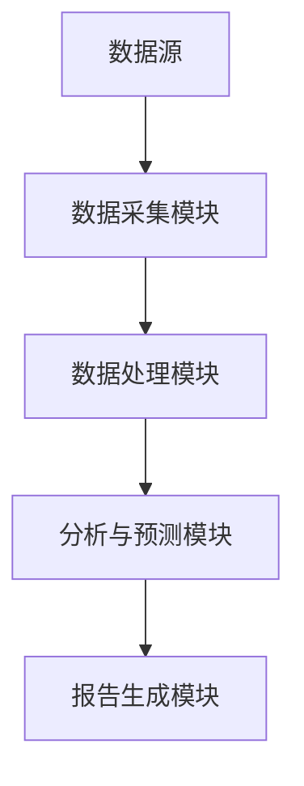

                 


# AI Agent在企业可持续发展指标跟踪与报告中的应用

> 关键词：AI Agent, 可持续发展指标, 企业报告, 算法原理, 系统架构

> 摘要：本文探讨了AI Agent在企业可持续发展指标跟踪与报告中的应用，通过详细分析AI Agent的核心概念、算法原理、系统架构，结合实际项目案例，展示了AI Agent如何提升企业可持续发展指标的跟踪与报告效率。

---

## 第一部分：背景介绍

### 第1章：企业可持续发展指标的背景与挑战

#### 1.1 可持续发展指标的定义与重要性

可持续发展指标是衡量企业环境、社会和治理（ESG）表现的关键量化标准。这些指标帮助企业识别和管理潜在风险，同时抓住可持续发展的机会。随着全球对可持续发展的关注增加，企业需要准确、及时地跟踪和报告这些指标。

#### 1.2 企业可持续发展面临的挑战

企业在跟踪可持续发展指标时面临多重挑战：
- 数据来源多样，收集和整合复杂。
- 指标之间存在动态关联，难以实时跟踪。
- 传统方法效率低下，难以满足实时需求。

#### 1.3 AI Agent在可持续发展中的作用

AI Agent通过自动化数据处理、实时分析和智能报告生成，显著提升了企业跟踪和报告可持续发展指标的效率。AI Agent能够处理大量数据，识别关键趋势，并生成动态报告，帮助企业在可持续发展方面做出更明智的决策。

---

## 第二部分：AI Agent的核心概念与原理

### 第2章：AI Agent的基本原理

#### 2.1 AI Agent的定义与分类

AI Agent是一种智能代理，能够感知环境、自主决策并执行任务。根据应用场景，AI Agent可以分为简单反射式、基于模型、 utility-based 和学习型四种类型。

#### 2.2 AI Agent的核心技术

AI Agent的核心技术包括：
- 自然语言处理（NLP）：用于理解和处理非结构化数据。
- 机器学习（ML）：用于模式识别和预测。
- 知识图谱构建：用于结构化数据的组织和推理。

#### 2.3 AI Agent与企业可持续发展的结合

AI Agent在企业可持续发展中的应用包括：
- 数据分析：AI Agent能够从多个来源收集和分析数据，生成洞察。
- 自动化报告：AI Agent可以自动生成动态报告，满足实时需求。
- 实时监控：AI Agent能够实时跟踪指标变化，提供及时反馈。

---

## 第三部分：AI Agent在可持续发展指标跟踪中的应用

### 第3章：指标跟踪的系统架构

#### 3.1 系统架构设计

系统架构包括以下几个模块：
- 数据采集模块：负责从多个来源收集数据。
- 数据处理模块：对数据进行清洗和预处理。
- 分析与预测模块：使用机器学习模型进行分析和预测。
- 报告生成模块：根据分析结果生成动态报告。

#### 3.2 数据收集与处理

数据来源包括企业内部数据、外部数据库和公开报告。数据处理涉及数据清洗、转换和存储。

#### 3.3 指标分析与预测

使用机器学习模型对数据进行分析和预测，生成指标变化的趋势和预测结果。

---

## 第四部分：算法原理与数学模型

### 第4章：AI Agent的算法原理

#### 4.1 算法流程

1. 数据输入：从多个来源收集数据。
2. 特征提取：提取关键特征。
3. 模型训练：使用机器学习模型进行训练。
4. 模型预测：生成预测结果。

#### 4.2 算法实现

以下是Python代码示例：

```python
import pandas as pd
from sklearn.linear_model import LinearRegression

# 数据加载
data = pd.read_csv('sustainability_data.csv')

# 特征和目标变量
X = data[['energy_usage', 'carbon_emissions']]
y = data['sustainability_score']

# 模型训练
model = LinearRegression()
model.fit(X, y)

# 预测
new_data = pd.DataFrame({'energy_usage': [100], 'carbon_emissions': [20]})
predicted_score = model.predict(new_data)
print(predicted_score)
```

#### 4.3 数学模型与公式

线性回归模型的数学公式为：
$$ y = \beta_0 + \beta_1x_1 + \beta_2x_2 + \epsilon $$

其中，$y$ 是目标变量，$x_1$ 和 $x_2$ 是特征变量，$\beta_0$、$\beta_1$、$\beta_2$ 是模型参数，$\epsilon$ 是误差项。

---

## 第五部分：系统分析与架构设计方案

### 第5章：系统架构设计

#### 5.1 问题场景介绍

企业需要实时跟踪和报告可持续发展指标，现有系统效率低下，难以满足需求。

#### 5.2 系统功能设计

系统功能模块包括数据采集、数据处理、指标分析和报告生成。

#### 5.3 系统架构图

以下是系统架构图：



#### 5.4 接口设计

系统接口包括数据输入接口、模型调用接口和报告输出接口。

---

## 第六部分：项目实战

### 第6章：项目实现与案例分析

#### 6.1 环境安装

安装必要的库：
```bash
pip install pandas scikit-learn
```

#### 6.2 核心实现

以下是核心代码：

```python
import pandas as pd
from sklearn.ensemble import RandomForestRegressor

# 数据加载
data = pd.read_csv('sustainability_data.csv')

# 特征和目标变量
X = data[['energy_usage', 'water_usage', 'waste_generated']]
y = data['sustainability_score']

# 模型训练
model = RandomForestRegressor()
model.fit(X, y)

# 案例分析
test_data = pd.DataFrame({
    'energy_usage': [150],
    'water_usage': [50],
    'waste_generated': [30]
})

predicted_score = model.predict(test_data)
print(predicted_score)
```

---

## 第七部分：最佳实践

### 第7章：总结与展望

#### 7.1 最佳实践 tips

- 定期更新模型，确保数据准确性。
- 使用多种算法进行对比，选择最优模型。

#### 7.2 小结

通过本文的探讨，AI Agent在企业可持续发展指标跟踪与报告中的应用具有重要意义，能够显著提升企业的效率和决策能力。

#### 7.3 注意事项

- 数据隐私和安全需引起重视。
- 确保模型的可解释性和透明性。

#### 7.4 拓展阅读

推荐阅读《机器学习实战》和《深度学习》等书籍，进一步了解相关技术。

---

## 作者：AI天才研究院

本文由AI天才研究院撰写，转载请注明出处。

