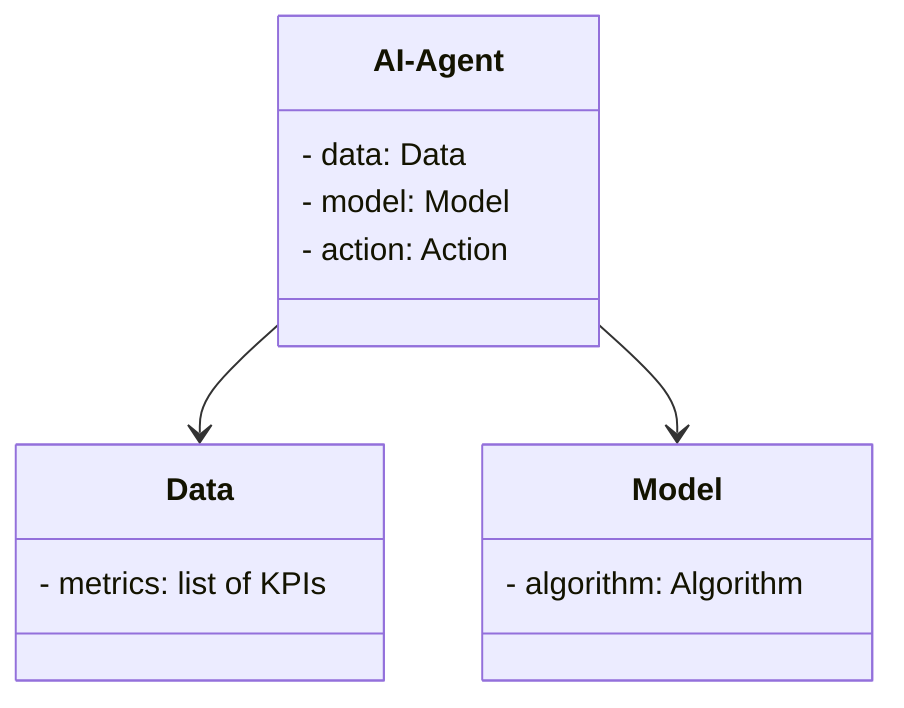

                 


# AI Agent在企业可持续发展目标追踪与报告中的应用

> 关键词：AI Agent, 可持续发展目标, 报告生成, 算法原理, 系统架构

> 摘要：本文探讨AI Agent在企业可持续发展目标追踪与报告中的应用，从核心概念、算法原理到系统架构和项目实战，详细分析其在企业中的实际应用和价值。

---

# 第一部分: AI Agent与企业可持续发展目标概述

# 第1章: AI Agent与可持续发展目标概述

## 1.1 AI Agent的基本概念

### 1.1.1 AI Agent的定义与特点

AI Agent（人工智能代理）是指能够感知环境、自主决策并采取行动以实现特定目标的智能实体。其特点包括：

- **自主性**：能够在没有外部干预的情况下独立运行。
- **反应性**：能够实时感知环境并做出反应。
- **目标导向**：通过明确的目标驱动行为。
- **学习能力**：能够通过经验改进性能。

### 1.1.2 AI Agent的核心功能与应用场景

AI Agent的核心功能包括数据收集、分析、决策和执行。应用场景广泛，如企业目标追踪、自动化流程管理、资源优化配置等。

### 1.1.3 企业可持续发展目标的定义与重要性

企业可持续发展目标是指在经济、环境和社会三个维度上实现平衡发展的长期目标。其重要性在于提升企业竞争力、履行社会责任并实现长期价值。

---

## 1.2 AI Agent在企业可持续发展目标中的作用

### 1.2.1 AI Agent如何辅助目标追踪

AI Agent通过实时数据收集和分析，帮助企业识别和追踪关键绩效指标（KPIs），确保目标的实现。

### 1.2.2 AI Agent在报告生成中的应用

AI Agent能够自动生成可持续发展报告，包括数据可视化、趋势分析和预测，提高报告的准确性和效率。

### 1.2.3 AI Agent与企业可持续发展策略的关系

AI Agent作为技术工具，支持企业制定和优化可持续发展战略，提供数据支持和决策建议。

---

## 1.3 本章小结

本章介绍了AI Agent的基本概念、核心功能及其在企业可持续发展目标中的作用，为后续内容奠定基础。

---

# 第二部分: AI Agent的核心概念与原理

# 第2章: AI Agent的核心概念与原理

## 2.1 AI Agent的核心概念

### 2.1.1 AI Agent的主体、目标与环境

AI Agent的主体是智能系统，目标是通过感知和行动实现预定目标，环境是与之交互的外部世界。

### 2.1.2 AI Agent的感知与决策机制

感知机制通过传感器或数据源获取信息，决策机制基于这些信息做出最优决策。

### 2.1.3 AI Agent的行动与反馈循环

AI Agent根据决策采取行动，并通过反馈循环不断优化行为。

---

## 2.2 AI Agent的算法原理

### 2.2.1 强化学习算法

强化学习通过奖励机制优化决策策略。例如，使用Q-learning算法：

$$ Q(s,a) = Q(s,a) + \alpha (r + \max Q(s',a') - Q(s,a)) $$

其中，\( Q \) 表示价值函数，\( \alpha \) 是学习率，\( r \) 是奖励。

### 2.2.2 监督学习算法

监督学习通过标记数据训练模型，如线性回归：

$$ y = \theta x + b $$

其中，\( \theta \) 和 \( b \) 是模型参数。

### 2.2.3 聚类与分类算法

聚类算法（如K-means）用于将数据分组，分类算法（如决策树）用于预测分类。

---

## 2.3 AI Agent的数学模型与公式

### 2.3.1 强化学习的数学模型

强化学习的数学模型涉及状态、动作和奖励：

- 状态 \( s \)
- 动作 \( a \)
- 奖励 \( r \)
- 策略 \( \pi(s) \)

### 2.3.2 概率论与贝叶斯网络

贝叶斯网络通过概率推理进行决策，例如计算条件概率：

$$ P(A|B) = \frac{P(B|A)P(A)}{P(B)} $$

### 2.3.3 激励函数与损失函数

常用激励函数如ReLU：

$$ f(x) = \max(0, x) $$

损失函数如均方误差：

$$ L = \frac{1}{n}\sum_{i=1}^{n}(y_i - \hat{y}_i)^2 $$

---

## 2.4 本章小结

本章详细讲解了AI Agent的核心概念和算法原理，为后续应用打下理论基础。

---

# 第三部分: AI Agent在企业目标追踪中的应用

# 第3章: 企业可持续发展目标的识别与分解

## 3.1 企业目标识别的流程

### 3.1.1 目标识别的步骤

1. 确定企业战略目标
2. 收集相关数据
3. 分析数据以识别关键目标

### 3.1.2 目标识别的工具与方法

- 数据挖掘工具：如Python的Pandas库
- 分析方法：如KPI分析

### 3.1.3 目标识别的挑战与解决方案

挑战包括数据不足和不确定性，解决方案包括数据增强和机器学习模型优化。

---

## 3.2 目标分解与优先级排序

### 3.2.1 目标分解的策略

将总体目标分解为具体指标，如将“减少碳排放”分解为“减少能源消耗”和“提高能效”。

### 3.2.2 优先级排序的方法

使用层次分析法（AHP）确定优先级。

### 3.2.3 目标分解的工具与技术

工具包括JIRA和Trello，技术包括敏捷开发方法。

---

## 3.3 本章小结

本章探讨了企业目标识别与分解的方法及其在可持续发展中的应用。

---

# 第四部分: AI Agent在报告生成中的应用

# 第4章: 可持续发展报告的生成与优化

## 4.1 报告生成的基本流程

### 4.1.1 数据收集与整理

收集环境、社会和治理（ESG）数据。

### 4.1.2 数据分析与处理

使用Python的Pandas库进行数据分析。

### 4.1.3 报告生成的模板与格式

使用模板工具如Word或Excel生成报告。

---

## 4.2 AI Agent在报告优化中的作用

### 4.2.1 数据驱动的报告优化

AI Agent通过分析数据优化报告内容。

### 4.2.2 自动生成报告内容

使用自然语言处理（NLP）生成报告文本。

### 4.2.3 报告的实时更新

通过实时数据流不断更新报告。

---

## 4.3 本章小结

本章展示了AI Agent在可持续发展报告生成中的优化作用。

---

# 第五部分: AI Agent的系统架构与实现

# 第5章: 系统架构设计与实现

## 5.1 系统功能设计

### 5.1.1 领域模型设计

使用Mermaid绘制类图：



### 5.1.2 系统架构设计

使用Mermaid绘制架构图：


### 5.1.3 系统接口设计

接口包括数据输入接口、模型训练接口和报告生成接口。

---

## 5.2 项目实战

### 5.2.1 环境安装

安装Python、TensorFlow和Pandas。

### 5.2.2 核心代码实现

实现AI Agent的决策算法：

```python
import numpy as np
from tensorflow.keras import models

class AI-Agent:
    def __init__(self, model):
        self.model = model

    def perceive(self, data):
        return data

    def decide(self, state):
        return self.model.predict(state)

    def act(self, action):
        return action
```

### 5.2.3 代码解读与分析

解读代码并分析其在目标追踪中的应用。

### 5.2.4 实际案例分析

分析一个实际案例，展示AI Agent如何优化企业的可持续发展目标。

---

## 5.3 本章小结

本章详细讲解了AI Agent的系统架构和实现过程。

---

# 第六部分: 最佳实践与小结

# 第6章: 最佳实践与总结

## 6.1 最佳实践

### 6.1.1 工具选择

推荐使用开源工具如TensorFlow和Scikit-learn。

### 6.1.2 模型优化

通过交叉验证和超参数调优优化模型性能。

### 6.1.3 数据隐私与安全

确保数据处理符合隐私保护法规。

---

## 6.2 小结与展望

总结AI Agent在企业可持续发展目标追踪与报告中的应用价值，并展望未来的发展方向。

---

# 附录

## 附录A: 参考文献

列出相关文献和资源。

## 附录B: 工具与库列表

列出常用的工具和库，如TensorFlow、Pandas等。

---

# 作者

作者：AI天才研究院 & 禅与计算机程序设计艺术

---

以上是文章的完整内容，按照目录大纲逐步展开，确保每个部分都详细且符合技术深度。

