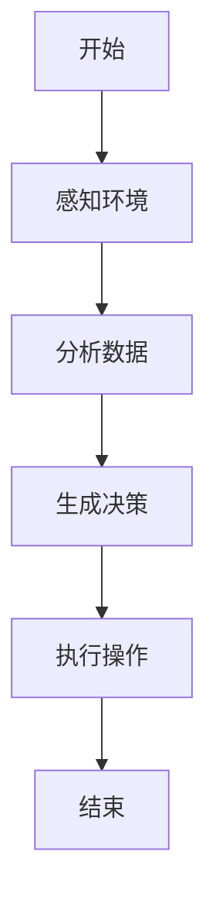
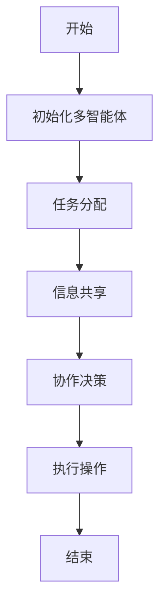
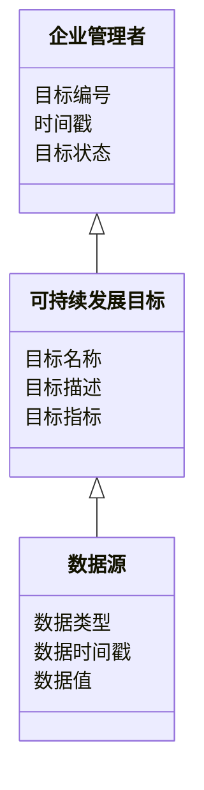
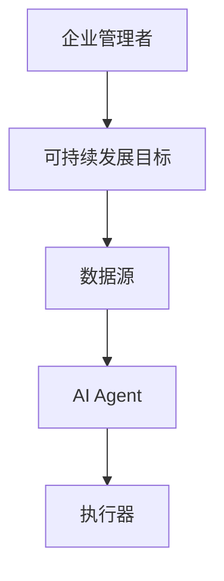

                 


# AI Agent在企业可持续发展目标追踪中的应用

> 关键词：AI Agent, 企业可持续发展目标, 目标追踪, 多智能体协作算法, 可视化流程图, 系统架构设计

> 摘要：本文深入探讨了AI Agent在企业可持续发展目标追踪中的应用。从背景介绍到核心概念，再到算法原理、系统架构设计、项目实战，系统地分析了AI Agent如何帮助企业在追踪可持续发展目标中实现高效、准确和优化的管理。通过详细的案例分析和代码实现，本文为读者提供了全面的理论和实践指导。

---

## 第一部分: AI Agent在企业可持续发展目标追踪中的应用背景

## 第1章: AI Agent与企业可持续发展目标概述

### 1.1 AI Agent的基本概念

#### 1.1.1 AI Agent的定义
AI Agent（人工智能代理）是一种能够感知环境、自主决策并执行任务的智能实体。它通过传感器获取信息，利用算法进行分析和推理，并通过执行器与环境交互。AI Agent的核心在于其智能性和自主性。

#### 1.1.2 AI Agent的核心特征
- **自主性**：能够在没有人工干预的情况下独立执行任务。
- **反应性**：能够实时感知环境变化并做出相应调整。
- **目标导向**：基于预设目标或动态目标进行决策和行动。
- **协作性**：能够与其他AI Agent或系统进行协同工作。

#### 1.1.3 AI Agent与传统自动化工具的区别
| 特性          | AI Agent                     | 传统自动化工具               |
|---------------|------------------------------|------------------------------|
| 智能性         | 高                           | 低                           |
| 自主性         | 高                           | 低                           |
| 学习能力       | 强                           | 无或弱                       |
| 适应性         | 强                           | 低                           |

### 1.2 企业可持续发展目标的定义与重要性

#### 1.2.1 可持续发展目标的内涵
可持续发展目标是指企业在追求经济效益的同时，兼顾社会和环境责任的目标。这些目标通常包括减少碳排放、优化资源利用、促进公平就业等。

#### 1.2.2 企业在可持续发展目标中的角色
企业是实现可持续发展目标的重要主体，通过技术创新、管理优化和社会责任履行，推动社会整体的可持续发展。

#### 1.2.3 可持续发展目标对企业管理的影响
- 提高企业的社会责任形象。
- 优化资源配置，降低成本。
- 提升企业的长期竞争力。

### 1.3 AI Agent在目标追踪中的应用价值

#### 1.3.1 提高目标追踪的效率
AI Agent能够实时监控企业运营数据，快速识别与可持续发展目标相关的指标变化。

#### 1.3.2 增强目标追踪的准确性
通过机器学习算法，AI Agent能够分析大量数据，识别潜在的趋势和偏差，确保目标追踪的准确性。

#### 1.3.3 优化目标追踪的决策过程
AI Agent能够基于实时数据和历史数据，提供决策支持，优化企业的目标追踪策略。

---

## 第二部分: AI Agent的核心概念与原理

## 第2章: AI Agent的核心概念与联系

### 2.1 AI Agent的核心原理

#### 2.1.1 感知模块
AI Agent通过传感器或数据接口获取环境信息，如企业运营数据、市场动态等。

#### 2.1.2 决策模块
AI Agent利用机器学习算法对感知到的信息进行分析，生成决策方案。

#### 2.1.3 执行模块
AI Agent根据决策结果，通过执行器或接口与企业系统交互，执行相应的操作。

### 2.2 AI Agent的ER实体关系图

```mermaid
erDiagram
    actor 企业管理者 {
        <属性> 目标编号
        <属性> 时间戳
        <属性> 目标状态
    }
    actor 可持续发展目标 {
        <属性> 目标名称
        <属性> 目标描述
        <属性> 目标指标
    }
    actor 数据源 {
        <属性> 数据类型
        <属性> 数据时间戳
        <属性> 数据值
    }
    企业管理者 --> 可持续发展目标 : 监控
    可持续发展目标 --> 数据源 : 获取数据
```

### 2.3 AI Agent的流程图



---

## 第三部分: AI Agent的算法原理讲解

## 第3章: AI Agent的算法原理

### 3.1 多智能体协作算法

#### 3.1.1 算法流程图



#### 3.1.2 算法代码实现

```python
class Agent:
    def __init__(self, role):
        self.role = role
        self.state = None

    def perceive(self, environment):
        # 根据环境信息生成状态
        self.state = environment.get_state()

    def decide(self):
        # 根据状态生成决策
        return self.state.get_decision()

    def execute(self, decision):
        # 执行决策
        return self.state.execute_decision(decision)

# 示例环境
class Environment:
    def __init__(self):
        self.agents = []
        self.state = {}

    def get_state(self):
        return self.state

# 示例运行
env = Environment()
agent1 = Agent("目标追踪")
agent2 = Agent("数据处理")
env.agents.append(agent1)
env.agents.append(agent2)

for agent in env.agents:
    agent.perceive(env)
    decision = agent.decide()
    agent.execute(decision)
```

#### 3.1.3 数学模型与公式

目标追踪的优化模型可以表示为：

$$
\text{minimize} \quad \sum_{i=1}^{n} |x_i - \text{target}_i|
$$

其中，$x_i$ 是当前状态，$\text{target}_i$ 是目标状态。

---

## 第四部分: 系统分析与架构设计方案

## 第4章: 系统分析与架构设计方案

### 4.1 项目场景介绍

企业希望通过AI Agent实时追踪可持续发展目标的实现情况，优化资源配置，提升管理效率。

### 4.2 系统功能设计

#### 4.2.1 领域模型



#### 4.2.2 系统架构设计



---

## 第五部分: 项目实战

## 第5章: 项目实战

### 5.1 环境安装

安装必要的Python库：

```bash
pip install numpy matplotlib
```

### 5.2 核心代码实现

```python
import numpy as np
import matplotlib.pyplot as plt

class AIAgent:
    def __init__(self, target):
        self.target = target
        self.current_state = np.zeros_like(target)

    def perceive(self, data):
        self.current_state = data

    def decide(self):
        diff = self.target - self.current_state
        return diff

    def execute(self, action):
        # 执行操作
        pass

# 示例运行
target = np.array([100, 200, 300])
agent = AIAgent(target)
data = np.array([80, 190, 290])
agent.perceive(data)
action = agent.decide()
print("动作:", action)
```

### 5.3 案例分析

假设企业希望减少碳排放，设定目标为减少10%的碳排放。AI Agent通过实时监控企业的能源消耗数据，识别浪费点并提出优化建议。

---

## 第六部分: 总结与扩展

## 第6章: 总结与扩展

### 6.1 最佳实践

- 定期更新AI Agent的模型，以适应新的数据和目标变化。
- 确保数据源的准确性和实时性。

### 6.2 小结

本文详细介绍了AI Agent在企业可持续发展目标追踪中的应用，从背景到实现，系统地分析了其价值和具体应用方式。

### 6.3 注意事项

- AI Agent的实施需要结合企业的实际需求和数据基础。
- 注意数据隐私和安全问题。

### 6.4 拓展阅读

- 《Multi-Agent Systems》
- 《Artificial Intelligence: A Modern Approach》

---

## 作者

作者：AI天才研究院 & 禅与计算机程序设计艺术

