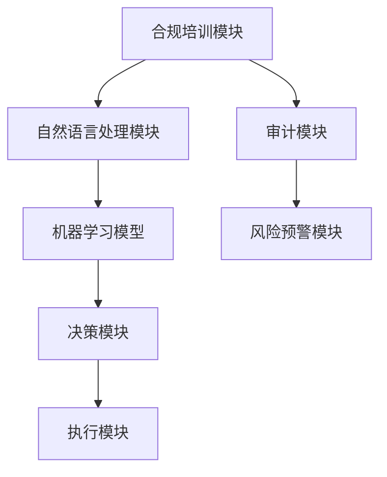
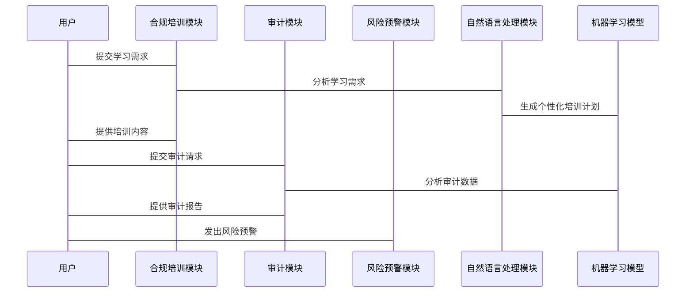

                 


# AI Agent在企业合规培训与审计中的创新应用

## 关键词
AI Agent, 企业合规, 培训与审计, 创新应用, 人工智能, 自然语言处理

## 摘要
随着人工智能技术的飞速发展，AI Agent（智能代理）在企业合规培训与审计领域的应用逐渐展现出强大的潜力。本文将从AI Agent的基本概念出发，分析其在企业合规培训与审计中的核心原理、系统架构和实际应用场景。通过详细的技术分析和案例解读，探讨AI Agent如何通过智能化手段优化企业合规流程，降低合规风险，提升审计效率。同时，本文将结合具体的算法实现和系统设计，深入剖析AI Agent在企业合规中的创新价值和未来发展方向。

---

# 第1章: AI Agent与企业合规概述

## 1.1 企业合规的基本概念
### 1.1.1 企业合规的定义与范围
企业合规是指企业在经营活动中遵守相关法律法规、行业标准和企业内部规章制度的行为。合规的范围涵盖反腐败、数据隐私、劳动法、财务报告等多个领域。合规不仅是企业合法经营的基础，也是企业风险管理的重要组成部分。

### 1.1.2 企业合规的重要性与挑战
企业合规是企业避免法律风险、保护声誉、提升竞争力的关键。然而，传统合规方式存在效率低、成本高、覆盖面有限等问题。随着业务规模的扩大和法规的不断更新，企业合规工作面临着更大的挑战。

### 1.1.3 合规培训与审计的核心目标
合规培训的目标是通过教育和培训，确保员工了解并遵守相关法规。合规审计则是通过检查和评估，验证企业是否符合相关法规要求。两者共同构成了企业合规管理的核心环节。

## 1.2 AI Agent的定义与特点
### 1.2.1 AI Agent的基本概念
AI Agent是一种能够感知环境、自主决策并执行任务的智能系统。它通过与环境的交互，利用机器学习、自然语言处理和强化学习等技术，实现对复杂问题的自动化解决。

### 1.2.2 AI Agent的核心功能与优势
- **智能化决策**：AI Agent能够基于数据和规则，快速做出最优决策。
- **自动化执行**：AI Agent可以自动执行任务，减少人工干预。
- **自我优化**：AI Agent能够通过反馈机制不断优化自身的算法和策略。

### 1.2.3 AI Agent与传统合规工具的对比
传统的合规工具通常是基于规则的系统，处理问题的方式较为 rigid。而AI Agent能够动态适应环境变化，具备更强的灵活性和学习能力。

## 1.3 AI Agent在企业合规中的创新应用
### 1.3.1 合规培训的智能化需求
AI Agent可以通过自然语言处理技术生成个性化的培训内容，根据员工的学习进度和知识盲点，提供针对性的培训建议。

### 1.3.2 审计工作的自动化趋势
AI Agent可以自动化处理审计数据，识别潜在风险点，并生成审计报告。这种方式不仅提高了审计效率，还降低了人为错误的风险。

### 1.3.3 AI Agent在合规领域的独特价值
AI Agent能够通过实时监控企业行为，发现合规风险，并在第一时间发出预警。这种实时监控的能力是传统合规工具无法比拟的。

## 1.4 本章小结
本章介绍了企业合规的基本概念和AI Agent的核心特点，重点分析了AI Agent在企业合规中的创新应用。通过对比传统合规工具，突出了AI Agent在智能化、自动化和自我优化方面的优势。

---

# 第2章: AI Agent的核心概念与原理

## 2.1 AI Agent的基本原理
### 2.1.1 AI Agent的感知模块
AI Agent的感知模块负责收集环境中的数据，例如企业文档、员工行为数据和外部法规更新。这些数据为AI Agent的决策提供依据。

### 2.1.2 AI Agent的决策模块
决策模块是AI Agent的核心，它基于感知模块提供的数据，结合预设的规则和机器学习模型，做出最优决策。

### 2.1.3 AI Agent的执行模块
执行模块负责将决策模块的决策转化为具体的操作，例如生成培训内容或触发审计流程。

## 2.2 AI Agent的核心算法
### 2.2.1 机器学习算法
机器学习算法是AI Agent的核心技术之一。通过监督学习、无监督学习和强化学习，AI Agent能够从数据中学习 patterns，并做出智能决策。

### 2.2.2 自然语言处理算法
自然语言处理（NLP）算法用于理解和生成人类语言。AI Agent可以通过NLP技术分析企业文档，提取关键信息，并生成个性化的培训内容。

### 2.2.3 强化学习算法
强化学习算法通过试错机制优化AI Agent的行为策略。在企业合规场景中，AI Agent可以通过强化学习不断优化其审计策略。

## 2.3 AI Agent的数学模型
### 2.3.1 机器学习模型
常用的机器学习模型包括支持向量机（SVM）、随机森林（Random Forest）和神经网络（Neural Networks）。这些模型可以用于分类、回归和聚类等任务。

### 2.3.2 自然语言处理模型
自然语言处理模型包括词袋模型（Bag of Words）、TF-IDF和词嵌入模型（如Word2Vec、GloVe）。这些模型可以用于文本分类、信息提取和语义理解。

### 2.3.3 强化学习模型
强化学习模型包括Q-learning、Deep Q-Network（DQN）和策略梯度方法（Policy Gradient）。这些模型可以用于序列决策和复杂环境下的优化。

## 2.4 本章小结
本章详细介绍了AI Agent的核心原理和算法。通过分析感知、决策和执行模块，揭示了AI Agent在企业合规中的技术基础。同时，通过具体的数学模型和算法示例，进一步阐述了AI Agent的技术实现细节。

---

# 第3章: AI Agent在企业合规中的系统架构

## 3.1 系统功能设计
### 3.1.1 合规培训模块
合规培训模块负责根据员工的学习需求，生成个性化的培训计划。通过自然语言处理技术，AI Agent可以分析员工的知识盲点，并推荐相关课程。

### 3.1.2 审计模块
审计模块负责对企业行为进行实时监控，识别潜在的合规风险。通过机器学习算法，AI Agent可以自动生成审计报告，并提出改进建议。

### 3.1.3 风险预警模块
风险预警模块通过实时监控企业内外部数据，识别潜在的合规风险，并及时发出预警。

## 3.2 系统架构设计
### 3.2.1 系统架构图
以下是系统架构的Mermaid图：



### 3.2.2 系统接口设计
系统接口设计包括API接口和数据接口。API接口用于不同模块之间的通信，数据接口用于与企业数据库和外部数据源的交互。

### 3.2.3 系统交互流程
以下是系统交互的Mermaid序列图：



## 3.3 本章小结
本章通过系统架构设计和功能模块分析，展示了AI Agent在企业合规中的具体实现方式。通过Mermaid图和序列图，进一步明确了系统各部分之间的关系和交互流程。

---

# 第4章: AI Agent在企业合规中的项目实战

## 4.1 项目背景与目标
本项目旨在通过AI Agent技术，实现企业合规培训与审计的智能化。项目目标包括提高合规效率、降低合规成本和优化合规流程。

## 4.2 环境安装与配置
### 4.2.1 系统环境
- 操作系统：Linux/Windows/MacOS
- 开发工具：Python、Jupyter Notebook、PyCharm
- 依赖库：TensorFlow、Keras、Scikit-learn、Numpy、Pandas、spaCy

### 4.2.2 数据准备
数据包括企业文档、员工行为数据和外部法规更新。数据需要进行清洗、预处理和标注。

## 4.3 系统核心实现
### 4.3.1 合规培训模块实现
```python
import spacy

nlp = spacy.load("en_core_web_sm")

def generate_training_materials(text):
    doc = nlp(text)
    keywords = [token.text for token in doc if token.pos_ in ["NOUN", "VERB", "ADJ"]]
    return " ".join(keywords)
```

### 4.3.2 审计模块实现
```python
from sklearn.feature_extraction.text import TfidfVectorizer
from sklearn.svm import SVC

vectorizer = TfidfVectorizer()
model = SVC()

def audit(text):
    X = vectorizer.fit_transform([text])
    prediction = model.predict(X)
    return "合规" if prediction[0] == 1 else "不合规"
```

### 4.3.3 风险预警模块实现
```python
import pandas as pd
from sklearn.ensemble import RandomForestClassifier

model = RandomForestClassifier()
```

## 4.4 项目小结
通过具体的代码实现和系统设计，本章展示了AI Agent在企业合规中的实际应用。通过项目实战，进一步验证了AI Agent在合规培训与审计中的创新价值。

---

# 第5章: AI Agent在企业合规中的最佳实践

## 5.1 最佳实践
### 5.1.1 数据质量的重要性
数据是AI Agent的核心，确保数据的准确性和完整性是实现AI Agent的前提条件。

### 5.1.2 算法选择的策略
根据具体场景选择合适的算法，例如在分类任务中选择SVM，在聚类任务中选择K-means。

### 5.1.3 系统优化的技巧
通过模型调优、特征工程和分布式计算等技术，进一步提升AI Agent的性能。

## 5.2 注意事项
### 5.2.1 数据隐私保护
在处理企业数据时，需要遵守相关数据隐私法规，确保数据的安全性和合规性。

### 5.2.2 系统可解释性
AI Agent的决策过程需要具有可解释性，以便在出现问题时能够追溯和修正。

### 5.2.3 系统稳定性
确保系统的稳定性和容错性，避免因系统故障导致合规风险。

## 5.3 拓展阅读
建议读者进一步阅读以下内容：
- 《机器学习实战》
- 《自然语言处理入门》
- 《企业合规管理》

## 5.4 本章小结
本章总结了AI Agent在企业合规中的最佳实践和注意事项，为读者提供了宝贵的参考价值。

---

# 作者：AI天才研究院 & 禅与计算机程序设计艺术

---

以上是关于《AI Agent在企业合规培训与审计中的创新应用》的技术博客文章的详细内容。

