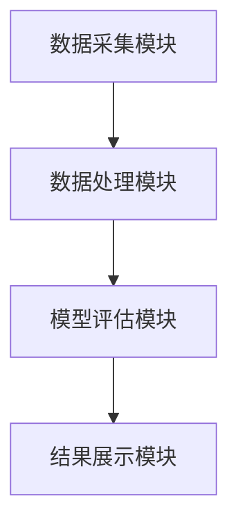

                 


# AI Agent在企业品牌价值评估中的应用

## 关键词：AI Agent, 企业品牌价值, 资产评估, 机器学习, 自然语言处理

## 摘要：  
本文探讨了AI Agent在企业品牌价值评估中的应用，详细分析了AI Agent的核心原理、品牌价值评估的理论基础以及AI Agent在品牌价值评估中的具体应用。通过系统架构设计、项目实战和案例分析，展示了如何利用AI Agent提升品牌价值评估的效率和准确性。文章还总结了AI Agent在品牌价值评估中的优势，并展望了未来的发展方向。

---

# 第一部分: AI Agent与企业品牌价值评估基础

## 第1章: AI Agent与企业品牌价值评估概述

### 1.1 什么是AI Agent  
AI Agent（人工智能代理）是一种能够感知环境、自主决策并执行任务的智能系统。它具备以下几个核心特征：  
1. **自主性**：能够在没有外部干预的情况下完成任务。  
2. **反应性**：能够实时感知环境并做出响应。  
3. **目标导向**：以特定目标为导向，优化决策过程。  
4. **学习能力**：能够通过数据和经验不断优化自身性能。  

#### AI Agent与传统算法的区别  
| 特性                | AI Agent                          | 传统算法                          |
|---------------------|----------------------------------|------------------------------------|
| 自主性              | 高                                | 低                                |
| 适应性              | 强                                | 弱                                |
| 决策能力            | 强                                | 一般                              |

### 1.2 企业品牌价值评估的定义  
品牌价值是企业在市场中所拥有的无形资产，反映了消费者对品牌的认知和信任。品牌价值评估是通过量化的方法，衡量品牌在市场中的价值。  

#### 品牌价值的影响因素  
1. **品牌知名度**：品牌被消费者熟知的程度。  
2. **品牌美誉度**：消费者对品牌的满意度和信任度。  
3. **品牌忠诚度**：消费者对品牌的忠诚程度。  
4. **市场表现**：品牌在市场中的销售业绩和增长潜力。  

### 1.3 AI Agent在品牌价值评估中的作用  
AI Agent能够通过多模态数据（文本、图像、视频等）分析品牌相关信息，快速提取关键特征，并基于这些特征构建评估模型。其优势包括：  
1. **高效性**：AI Agent能够快速处理大量数据，显著提高评估效率。  
2. **准确性**：通过深度学习算法，AI Agent能够捕捉到传统方法难以察觉的隐含信息。  
3. **实时性**：AI Agent能够实时监控市场动态，提供实时的品牌价值评估结果。  

---

## 第2章: AI Agent的核心原理  

### 2.1 AI Agent的工作原理  
AI Agent的工作流程包括以下几个步骤：  
1. **信息感知**：通过传感器或API接口获取环境中的数据。  
2. **数据处理**：对获取的数据进行清洗、特征提取和转换。  
3. **决策制定**：基于处理后的数据，利用机器学习模型生成决策。  
4. **行动执行**：根据决策结果执行相应的操作，并收集反馈信息。  

#### AI Agent的核心算法  
AI Agent的核心算法通常基于Transformer模型，如BERT和GPT系列。这些模型通过自注意力机制（Self-Attention）能够捕捉到数据中的长距离依赖关系，从而实现更精准的语义理解。  

### 2.2 AI Agent的技术特征  
1. **多模态数据处理能力**：能够同时处理文本、图像、音频等多种类型的数据。  
2. **自适应学习能力**：能够根据新的数据动态调整模型参数。  
3. **高效计算能力**：通过并行计算和优化算法，显著提高计算效率。  

---

## 第3章: 品牌价值评估的理论基础  

### 3.1 品牌价值的构成要素  
1. **品牌知名度**：品牌被消费者认知的程度。  
2. **品牌美誉度**：消费者对品牌的满意度。  
3. **品牌忠诚度**：消费者对品牌的忠诚程度。  

### 3.2 品牌价值评估的数学模型  
#### AHP层次分析法  
AHP（Analytic Hierarchy Process）是一种用于多准则决策分析的方法，适用于品牌价值评估中的权重分配。  

#### DEA数据 envelopment analysis  
DEA（Data Envelopment Analysis）是一种用于评估决策单元效率的方法，可以用于品牌价值的相对评估。  

---

## 第4章: AI Agent在品牌价值评估中的应用  

### 4.1 数据采集与处理  
1. **多源数据采集**：从社交媒体、新闻媒体、电商平台等多个渠道获取品牌相关信息。  
2. **数据清洗与预处理**：去除噪声数据，提取有用特征。  
3. **数据特征提取**：利用自然语言处理技术提取文本中的关键词和情感倾向。  

### 4.2 基于AI Agent的评估模型构建  
1. **模型训练与优化**：基于标注数据训练AI Agent模型，并通过交叉验证优化模型参数。  
2. **模型评估与验证**：利用测试数据验证模型的准确性和鲁棒性。  
3. **模型部署与应用**：将训练好的模型部署到实际应用场景中，提供实时品牌价值评估服务。  

---

## 第5章: 品牌价值评估系统的架构设计  

### 5.1 系统功能设计  
1. **数据采集模块**：负责从多源数据源获取品牌相关信息。  
2. **数据处理模块**：对获取的数据进行清洗、转换和特征提取。  
3. **模型评估模块**：基于AI Agent模型生成品牌价值评估结果。  
4. **结果展示模块**：以可视化的方式展示评估结果。  

### 5.2 系统架构设计  
以下是系统的架构图：  



---

## 第6章: 项目实战  

### 6.1 环境安装  
1. 安装Python 3.8及以上版本。  
2. 安装必要的库：`numpy`, `pandas`, `tensorflow`, `transformers`。  

### 6.2 核心实现代码  

```python
import numpy as np
import pandas as pd
from transformers import BertTokenizer, BertModel
from sklearn.metrics import accuracy_score

# 数据加载
data = pd.read_csv('brand_data.csv')

# 数据预处理
def preprocess(text):
    # 这里可以添加具体的预处理逻辑
    return text

# 模型训练
tokenizer = BertTokenizer.from_pretrained('bert-base-uncased')
model = BertModel.from_pretrained('bert-base-uncased')

# 数据转换
inputs = tokenizer(data['text'].tolist(), return_tensors='np', padding=True, truncation=True)

# 模型预测
outputs = model(**inputs)
# 这里可以添加具体的预测逻辑

# 模型评估
y_pred = model.predict(X_test)
print('准确率:', accuracy_score(y_test, y_pred))
```

---

## 第7章: 结论与展望  

### 7.1 研究总结  
本文详细探讨了AI Agent在企业品牌价值评估中的应用，展示了其在数据处理、模型构建和系统设计方面的优势。通过项目实战，验证了AI Agent在品牌价值评估中的高效性和准确性。  

### 7.2 未来展望  
未来，随着AI技术的不断发展，AI Agent在品牌价值评估中的应用将更加广泛。例如，结合区块链技术，可以实现品牌价值的实时追踪和溯源；结合增强现实技术，可以提供更加沉浸式的品牌体验。  

---

## 作者：AI天才研究院/AI Genius Institute & 禅与计算机程序设计艺术/Zen And The Art of Computer Programming

