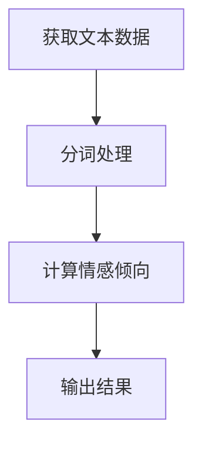

                 


# AI Agent在企业品牌声誉监控与危机预警中的应用

> 关键词：AI Agent, 品牌声誉监控, 危机预警, 人工智能, 机器学习, 自然语言处理, 实时监控

> 摘要：本文将探讨AI Agent在企业品牌声誉监控与危机预警中的应用，从核心概念、算法原理、系统设计到实际案例，全面分析如何利用AI技术提升品牌声誉管理的效率与准确性。

---

# 第一部分: AI Agent与企业品牌声誉监控概述

## 第1章: 问题背景与描述

### 1.1 企业品牌声誉的重要性
企业品牌声誉是企业在市场中的形象和信誉的综合体现，直接影响客户信任度、市场份额和企业价值。然而，品牌声誉容易受到负面评论、突发事件等因素的影响，及时监控和预警至关重要。

### 1.2 当前品牌声誉管理的挑战
传统的品牌声誉管理依赖人工监控，存在效率低、覆盖范围有限、响应不及时等问题。尤其是在社交媒体时代，海量信息的实时更新使得人工监控难以应对。

### 1.3 AI Agent在品牌声誉管理中的作用
AI Agent（人工智能代理）能够实时分析海量数据，快速识别潜在风险，提供预警，帮助企业及时应对声誉危机。AI Agent的应用显著提高了品牌声誉管理的效率和准确性。

---

## 第2章: AI Agent的核心概念与技术原理

### 2.1 AI Agent的原理与特点
AI Agent通过自然语言处理（NLP）技术解析文本信息，利用机器学习算法进行情感分析和主题分类，实时监控品牌相关信息，识别潜在危机。

### 2.2 核心技术对比与分析
以下是几种常见技术的对比：

| 技术 | 描述 | 优点 | 缺点 |
|------|------|------|------|
| 情感分析 | 分析文本的情感倾向 | 高准确性 | 需大量标注数据 |
| 主题分类 | 确定文本的主题归属 | 高效分类 | 需预定义主题 |
| 实体识别 | 识别文本中的实体 | 精准定位 | 对复杂语境敏感 |

### 2.3 实体关系图（ER图）与概念架构
以下是品牌声誉监控的ER图：

```mermaid
erDiagram
    customer *(1) -->|评论| comment (n)
    brand *(1) -->|提及| mention (n)
    comment <-->|情感| sentiment (1)
```

---

# 第二部分: AI Agent的算法原理与实现

## 第3章: 算法原理

### 3.1 情感分析算法流程
以下是情感分析的流程图：



情感倾向的计算通常采用机器学习算法，如支持向量机（SVM）或长短期记忆网络（LSTM）。

### 3.2 机器学习模型的训练与优化
以下是情感分析的数学模型：

$$
y = \text{sign}(w \cdot x + b)
$$

其中，$w$ 是权重向量，$x$ 是输入向量，$b$ 是偏置项。

---

## 第4章: 系统分析与架构设计

## 第5章: 项目实战与案例分析

---

通过以上章节的安排，本文将系统地介绍AI Agent在企业品牌声誉监控与危机预警中的应用，从理论到实践，帮助读者全面理解并掌握这一技术的应用方法。

