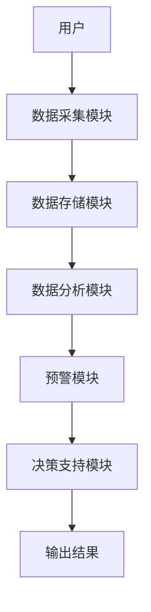
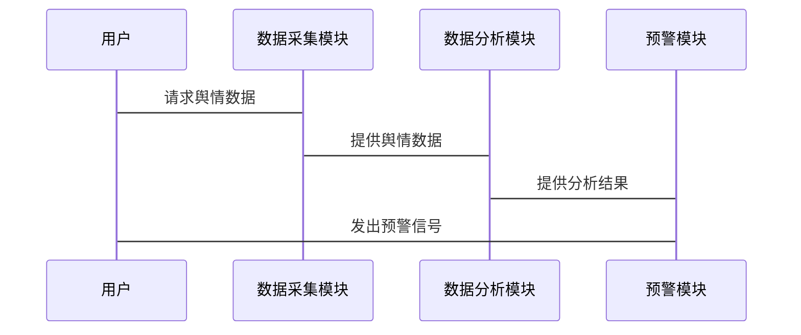

                 


# AI Agent在企业品牌声誉管理与危机预警中的角色

## 关键词：AI Agent, 品牌声誉管理, 危机预警, 自然语言处理, 机器学习, 知识图谱

## 摘要：  
在当今竞争激烈的商业环境中，企业品牌声誉的管理和维护至关重要。AI Agent（人工智能代理）通过实时监测、分析和预测品牌相关的海量数据，能够有效识别潜在危机并提供及时的预警，从而帮助企业保护品牌声誉。本文详细探讨了AI Agent在企业品牌声誉管理与危机预警中的角色，分析了其核心技术原理、应用场景以及实际案例，为企业在数字化转型中提供了新的思路和解决方案。

---

## 第1章：AI Agent的基本概念与背景

### 1.1 AI Agent的定义与核心特征

#### 1.1.1 AI Agent的基本概念  
AI Agent（人工智能代理）是指能够感知环境、自主决策并执行任务的智能系统。与传统算法不同，AI Agent具备主动性和适应性，能够根据实时数据和上下文信息动态调整行为。

#### 1.1.2 AI Agent的核心特征  
- **自主性**：AI Agent能够独立运行，无需人工干预。  
- **反应性**：能够实时感知环境并做出快速响应。  
- **学习能力**：通过机器学习不断优化自身的决策能力。  
- **协作性**：能够与其他系统或AI Agent协同工作。  

#### 1.1.3 AI Agent与传统算法的区别  
AI Agent不仅仅是执行预设任务的工具，它能够理解上下文、预测未来趋势，并在动态环境中做出最优决策。这与传统算法的被动执行形成了鲜明对比。

### 1.2 企业品牌声誉管理的背景与挑战

#### 1.2.1 企业品牌声誉的定义与重要性  
品牌声誉是企业在市场中的社会形象和客户信任度的综合反映。良好的品牌声誉能够提升客户忠诚度、吸引潜在客户，并为企业创造长期价值。

#### 1.2.2 品牌声誉管理的传统方法与局限性  
传统的品牌声誉管理依赖人工监测和分析，存在效率低、覆盖面有限、响应速度慢等问题。在信息爆炸的时代，这种方法难以应对海量数据和突发事件。

#### 1.2.3 危机预警在品牌管理中的关键作用  
危机预警是指在潜在危机发生前，通过监测和分析潜在风险，提前采取措施避免或最小化危机的影响。在品牌管理中，危机预警能够帮助企业及时发现负面舆情，防止小问题演变成重大危机。

### 1.3 危机预警与品牌声誉管理的结合

#### 1.3.1 危机预警的定义与实现方式  
危机预警是指通过技术和方法，提前识别和预测可能对企业声誉造成负面影响的事件或趋势。实现方式包括实时舆情监测、数据挖掘和机器学习等。

#### 1.3.2 品牌声誉管理中的危机预警需求  
企业需要实时监测社交媒体、新闻媒体等渠道的舆情，快速识别负面信息，并在危机发生前采取预防措施。

#### 1.3.3 AI Agent在危机预警中的潜力  
AI Agent能够通过自然语言处理（NLP）技术实时分析海量文本数据，识别潜在危机，并通过机器学习模型预测危机的发展趋势，为企业提供预警和决策支持。

---

## 第2章：AI Agent在品牌声誉管理中的应用场景

### 2.1 品牌声誉管理的常见问题

#### 2.1.1 品牌舆情的实时监测  
企业需要实时监测社交媒体、新闻媒体等渠道的舆情，了解公众对品牌的态度和看法。

#### 2.1.2 品牌声誉的量化评估  
通过数据化的方法，量化品牌声誉的健康状况，帮助企业制定科学的管理策略。

#### 2.1.3 危机事件的快速响应  
在危机发生时，企业需要快速识别问题、分析影响范围，并制定应对策略。

### 2.2 AI Agent在品牌声誉管理中的具体应用

#### 2.2.1 自然语言处理在舆情分析中的应用  
AI Agent可以通过NLP技术对海量文本数据进行情感分析，识别公众对品牌的正面、负面或中性情绪。

#### 2.2.2 机器学习在声誉预测中的应用  
通过机器学习模型，AI Agent可以预测品牌声誉的变化趋势，帮助企业提前采取措施。

#### 2.2.3 知识图谱在品牌关联分析中的应用  
知识图谱可以帮助AI Agent识别品牌与相关事件、人物、产品的关联性，从而更全面地评估品牌声誉。

### 2.3 危机预警中的AI Agent角色

#### 2.3.1 危机预警的实时监测机制  
AI Agent通过实时监测舆情数据，识别潜在危机的苗头，并发出预警信号。

#### 2.3.2 AI Agent在危机事件中的决策支持  
在危机发生时，AI Agent可以通过分析历史数据和当前舆情，为企业提供决策支持，如制定公关策略、发布声明等。

#### 2.3.3 危机后的声誉修复与策略优化  
AI Agent可以帮助企业分析危机后的舆情变化，评估声誉修复的效果，并优化未来的危机管理策略。

---

## 第3章：AI Agent的核心技术原理

### 3.1 自然语言处理（NLP）技术

#### 3.1.1 NLP的基本概念与技术栈  
NLP是指让计算机理解和处理人类语言的技术，常用的技术包括分词、情感分析、实体识别等。

#### 3.1.2 基于深度学习的NLP模型  
深度学习模型如Transformer、BERT等在NLP任务中表现出色，能够进行复杂的情感分析和文本生成。

#### 3.1.3 NLP在舆情分析中的应用案例  
例如，使用BERT模型对社交媒体上的文本进行情感分类，帮助企业识别负面舆情。

### 3.2 机器学习与深度学习

#### 3.2.1 机器学习的基本原理  
机器学习是指通过数据训练模型，使其能够从数据中学习规律并进行预测。

#### 3.2.2 深度学习在品牌声誉管理中的应用  
深度学习模型可以用于预测品牌声誉的变化趋势，识别潜在危机。

#### 3.2.3 基于神经网络的舆情分类模型  
使用卷积神经网络（CNN）或循环神经网络（RNN）对舆情文本进行分类，识别正面、负面或中性情绪。

### 3.3 知识图谱与关联分析

#### 3.3.1 知识图谱的基本概念  
知识图谱是一种结构化的数据表示方式，能够描述实体之间的关系。

#### 3.3.2 知识图谱在品牌声誉管理中的应用  
通过知识图谱，可以识别品牌与相关事件、人物、产品的关联性，从而更全面地评估品牌声誉。

#### 3.3.3 知识图谱的构建与分析  
使用图数据库（如Neo4j）构建知识图谱，并通过图遍历算法分析实体之间的关系。

---

## 第4章：AI Agent在品牌声誉管理中的系统架构设计

### 4.1 系统功能设计

#### 4.1.1 系统模块划分  
- 数据采集模块：实时采集社交媒体、新闻媒体等渠道的舆情数据。  
- 数据分析模块：使用NLP和机器学习技术对数据进行处理和分析。  
- 预警模块：识别潜在危机并发出预警信号。  
- 决策支持模块：为企业提供危机应对策略和声誉修复建议。  

#### 4.1.2 系统功能流程  
1. 数据采集模块实时采集舆情数据。  
2. 数据分析模块对数据进行清洗、特征提取和情感分析。  
3. 预警模块根据分析结果识别潜在危机并发出预警。  
4. 决策支持模块为企业提供应对策略和建议。  

### 4.2 系统架构设计

#### 4.2.1 系统架构图  


#### 4.2.2 系统交互序列图  


### 4.3 系统接口设计

#### 4.3.1 数据接口  
- 数据采集模块提供API接口，接收外部数据源的舆情信息。  
- 数据分析模块提供API接口，供预警模块调用分析结果。  

#### 4.3.2 用户接口  
- 提供Web界面，让用户查看实时舆情、预警信息和决策建议。  

---

## 第5章：AI Agent在品牌声誉管理中的项目实战

### 5.1 项目背景与目标

#### 5.1.1 项目背景  
某跨国企业希望利用AI技术实时监测品牌声誉，预防潜在危机。

#### 5.1.2 项目目标  
- 实时监测社交媒体和新闻媒体的舆情数据。  
- 使用NLP和机器学习技术分析数据，识别潜在危机。  
- 提供预警信号和应对策略。  

### 5.2 项目实现

#### 5.2.1 环境安装  
- 安装Python、TensorFlow、Keras、Neo4j等工具。  

#### 5.2.2 核心代码实现  
```python
import tensorflow as tf
from tensorflow.keras import layers

# 情感分析模型
model = tf.keras.Sequential()
model.add(layers.Embedding(input_dim=10000, output_dim=16))
model.add(layers.SimpleRNN(units=16))
model.add(layers.Dense(1, activation='sigmoid'))
model.compile(optimizer='adam', loss='binary_crossentropy', metrics=['accuracy'])
model.fit(x_train, y_train, epochs=10, batch_size=32)
```

#### 5.2.3 代码应用解读  
上述代码实现了一个基于RNN的情感分析模型，用于分类舆情文本的情感倾向。通过训练数据，模型可以识别文本中的情感倾向，帮助企业识别负面舆情。

### 5.3 实际案例分析

#### 5.3.1 案例背景  
某品牌因产品质量问题引发社交媒体上的负面舆情。

#### 5.3.2 数据分析  
通过NLP技术分析社交媒体上的文本数据，发现负面情绪占比显著增加。

#### 5.3.3 预警与应对  
AI Agent识别潜在危机后，发出预警信号，并建议企业采取公关措施，如发布道歉声明、召回产品等。

### 5.4 项目小结  
通过AI Agent技术，企业能够实时监测品牌声誉，识别潜在危机，并提供有效的应对策略。

---

## 第6章：AI Agent在品牌声誉管理中的挑战与解决方案

### 6.1 技术挑战

#### 6.1.1 数据隐私问题  
如何在监测舆情的同时保护用户隐私，是AI Agent应用中的一个重要挑战。

#### 6.1.2 数据量与计算资源  
处理海量数据需要强大的计算能力和高效的算法设计。

#### 6.1.3 模型的可解释性  
复杂的深度学习模型往往缺乏可解释性，这在企业决策中可能成为一个障碍。

### 6.2 解决方案

#### 6.2.1 数据隐私保护  
采用联邦学习等技术，在保护数据隐私的前提下进行模型训练。

#### 6.2.2 提高计算效率  
通过优化算法和使用分布式计算技术，降低计算成本并提高效率。

#### 6.2.3 提升模型可解释性  
通过可视化工具和解释性模型（如LIME）提高模型的可解释性。

---

## 第7章：总结与展望

### 7.1 总结  
AI Agent通过实时监测、分析和预测品牌声誉数据，能够有效识别潜在危机并提供预警，帮助企业保护品牌声誉。本文详细探讨了AI Agent的核心技术、应用场景和系统架构设计，并通过实际案例展示了其在品牌声誉管理中的潜力。

### 7.2 展望  
随着AI技术的不断发展，AI Agent在品牌声誉管理中的应用将更加智能化和个性化。未来，可以结合区块链、边缘计算等新技术，进一步提升AI Agent的性能和安全性。

---

## 作者信息  
作者：AI天才研究院 & 禅与计算机程序设计艺术  
联系邮箱：[contact@aitianjiayuan.com](mailto:contact@aitianjiayuan.com)

