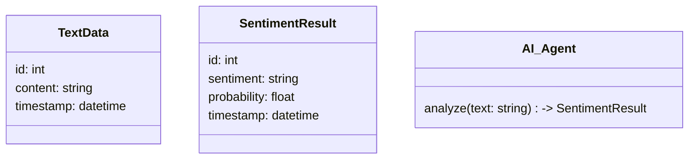
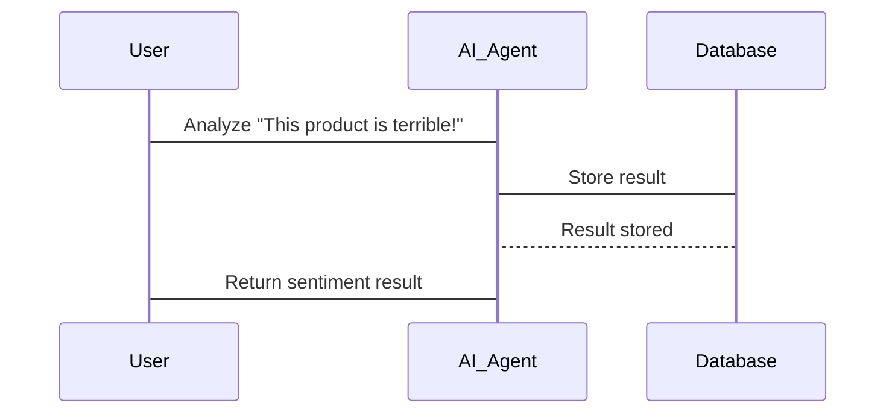

                 


# AI Agent在企业品牌情感分析与管理中的深度应用

> 关键词：AI Agent，情感分析，企业品牌管理，深度学习，自然语言处理，实时监控

> 摘要：本文深入探讨了AI Agent在企业品牌情感分析与管理中的应用，从核心概念到算法原理，从系统架构到项目实战，全面解析了如何利用AI Agent技术提升企业品牌情感管理的效率与精准度。文章结合实际案例，详细阐述了情感分析的实现流程、算法选择、系统设计及最佳实践，为企业在数字化转型中的情感管理提供了理论与实践的双重指导。

---

## 第一部分: AI Agent与企业品牌情感分析概述

### 第1章: AI Agent与情感分析的基本概念

#### 1.1 AI Agent的定义与核心特征

##### 1.1.1 AI Agent的基本定义
AI Agent（人工智能代理）是一种能够感知环境、自主决策并执行任务的智能实体。它能够通过传感器获取信息，利用推理能力进行分析，并通过执行器完成目标。AI Agent的核心在于其智能性和自主性，能够适应复杂多变的环境。

##### 1.1.2 AI Agent的核心特征
- **智能性**：AI Agent具备学习、推理和决策能力，能够处理复杂问题。
- **自主性**：能够在没有人工干预的情况下独立运行。
- **反应性**：能够实时感知环境变化并做出响应。
- **协作性**：能够与其他系统或AI Agent协同工作，完成复杂任务。

##### 1.1.3 AI Agent与传统自动化工具的区别
AI Agent与传统自动化工具的主要区别在于其智能性和适应性。传统自动化工具通常基于固定的规则执行任务，而AI Agent能够通过学习和推理动态调整行为，适应新的环境和需求。

---

#### 1.2 情感分析的定义与应用领域

##### 1.2.1 情感分析的定义
情感分析（Sentiment Analysis）是利用自然语言处理技术对文本中的情感倾向进行分析的过程。它能够识别文本中的正面、负面或中性情绪，并帮助企业理解消费者对品牌、产品或服务的看法。

##### 1.2.2 情感分析的主要应用领域
- **社交媒体监控**：分析用户在社交媒体上的评论，了解品牌形象。
- **客户反馈分析**：处理客户评价，优化产品和服务。
- **市场调研**：通过分析市场反馈，制定精准的营销策略。
- **舆情预警**：实时监控负面情绪，及时采取应对措施。

##### 1.2.3 情感分析在企业品牌管理中的作用
情感分析能够帮助企业了解消费者对其品牌的情感倾向，从而优化产品设计、提升服务质量，并在舆情危机中快速响应。

---

#### 1.3 企业品牌情感管理的背景与挑战

##### 1.3.1 企业品牌管理的核心目标
企业品牌管理的核心目标是通过塑造积极的品牌形象，提升品牌知名度和忠诚度，最终实现商业价值的最大化。

##### 1.3.2 情感分析在品牌管理中的重要性
情感分析能够帮助企业从海量的用户反馈中提取有价值的信息，识别用户需求和情感倾向，从而制定更精准的营销策略。

##### 1.3.3 当前企业品牌情感管理的主要挑战
- **数据量大**：社交媒体和客户评论的数量庞大，难以手动处理。
- **情感表达复杂**：用户评论可能包含隐含情绪或讽刺语气，难以准确识别。
- **实时性要求高**：企业需要快速响应负面舆情，避免品牌形象受损。

---

### 第2章: AI Agent在企业品牌情感分析中的应用前景

#### 2.1 企业品牌情感分析的现状

##### 2.1.1 情感分析技术的发展历程
情感分析技术经历了从基于规则的传统方法到基于机器学习和深度学习的现代方法的演变。近年来，预训练模型如BERT和GPT的出现，进一步提升了情感分析的准确性和泛化能力。

##### 2.1.2 当前企业品牌情感分析的主要技术手段
目前，企业主要采用基于机器学习（如SVM、随机森林）和深度学习（如LSTM、Transformer）的情感分析技术，结合自然语言处理工具（如spaCy、NLTK）进行文本处理。

##### 2.1.3 情感分析技术的局限性与改进方向
尽管情感分析技术取得了显著进展，但仍存在一些局限性，如对上下文理解不足、对情感强度的定量分析能力较弱等。未来，结合多模态数据和增强学习的方法，可以进一步提升情感分析的精度。

---

#### 2.2 AI Agent在情感分析中的优势

##### 2.2.1 AI Agent的智能性与自主性
AI Agent能够自主学习和适应，无需人工干预，能够在复杂场景下完成情感分析任务。

##### 2.2.2 AI Agent在复杂场景下的适应能力
AI Agent能够结合上下文信息，理解用户的深层需求，提供更精准的情感分析结果。

##### 2.2.3 AI Agent在情感分析中的创新应用
AI Agent可以实时监控社交媒体，主动识别负面舆情，并触发预警机制，帮助企业快速响应。

---

#### 2.3 企业品牌情感管理的未来趋势

##### 2.3.1 情感分析技术的未来发展方向
未来，情感分析技术将更加注重多模态数据的融合，如图像和语音，提升情感识别的准确性和全面性。

##### 2.3.2 AI Agent在企业品牌管理中的潜在应用场景
AI Agent可以在品牌监测、客户关系管理、市场调研等领域发挥重要作用，帮助企业实现智能化的品牌管理。

##### 2.3.3 技术与业务结合的创新模式
通过将AI Agent技术与企业业务流程深度结合，可以实现情感分析与品牌策略的无缝对接，推动企业数字化转型。

---

## 第二部分: AI Agent与情感分析的核心原理

### 第3章: 情感分析的核心算法与实现原理

#### 3.1 情感分析的主要算法

##### 3.1.1 基于传统机器学习的情感分析算法
传统机器学习算法（如SVM、随机森林）通过提取文本特征，构建分类模型。这些算法对特征工程的依赖较高，且难以处理复杂的情感表达。

##### 3.1.2 基于深度学习的情感分析算法
深度学习算法（如LSTM、Transformer）通过端到端的训练，自动提取文本特征，无需人工特征工程。这些算法在处理长文本和上下文关系方面表现优异。

##### 3.1.3 基于预训练模型的情感分析算法
预训练模型（如BERT、GPT）通过大规模的无监督学习，掌握了丰富的语言知识，能够直接应用于情感分析任务，显著提升了模型的泛化能力。

---

#### 3.2 情感分析的实现流程

##### 3.2.1 数据预处理与特征提取
数据预处理包括文本清洗、分词和停用词去除。特征提取则利用词袋模型或词嵌入（如Word2Vec）生成文本表示。

##### 3.2.2 模型训练与优化
通过训练数据构建情感分类模型，并采用交叉验证和超参数调优优化模型性能。

##### 3.2.3 结果解释与反馈
对模型的输出结果进行解释，分析情感倾向的合理性，并根据反馈调整模型。

---

#### 3.3 情感分析的评价指标

##### 3.3.1 准确率（Accuracy）
准确率是分类正确的样本数占总样本数的比例。

##### 3.3.2 召回率（Recall）
召回率是真实为正类的样本中被正确分类的比例。

##### 3.3.3 F1分数（F1 Score）
F1分数是准确率和召回率的调和平均数，综合反映了分类的精确度和召回率。

---

## 第4章: 基于AI Agent的情感分析算法实现

### 4.1 基于LSTM的情感分析模型

#### 4.1.1 LSTM的基本原理
长短时记忆网络（LSTM）通过引入记忆单元和门控机制，能够有效处理序列数据中的长距离依赖关系。

#### 4.1.2 LSTM在情感分析中的应用
LSTM可以用于处理序列文本，捕捉情感表达的上下文信息。

#### 4.1.3 LSTM的代码实现
```python
import tensorflow as tf
from tensorflow.keras import layers

model = tf.keras.Sequential()
model.add(layers.Embedding(input_dim= vocabulary_size, output_dim= embedding_dim))
model.add(layers.LSTM(units= lstm_units, return_sequences=False))
model.add(layers.Dense(units= num_classes, activation='softmax'))
model.compile(optimizer='adam', loss='sparse_categorical_crossentropy', metrics=['accuracy'])
```

---

#### 4.2 基于Transformer的情感分析模型

##### 4.2.1 Transformer的基本原理
Transformer通过自注意力机制和前馈网络，能够高效处理并行序列数据。

##### 4.2.2 Transformer在情感分析中的优势
Transformer在处理长文本和捕捉全局信息方面表现优于LSTM。

##### 4.2.3 Transformer的代码实现
```python
import tensorflow as tf
from tensorflow.keras import layers

def transformer_model():
    inputs = layers.Input(shape=(max_seq_length,))
    embedding = layers.Embedding(input_dim=vocabulary_size, output_dim= embedding_dim)(inputs)
    attention = layers.MultiHeadAttention(head_size= head_size, num_heads= num_heads)(embedding, embedding)
    output = layers.GlobalMaxPooling1D()(attention)
    dense = layers.Dense(num_classes, activation='softmax')(output)
    model = tf.keras.Model(inputs=inputs, outputs=dense)
    return model
```

---

#### 4.3 基于预训练模型的微调（Fine-tuning）

##### 4.3.1 预训练模型的优势
预训练模型已经掌握了丰富的语言知识，能够快速适应特定任务。

##### 4.3.2 微调的实现步骤
1. 加载预训练模型（如BERT）。
2. 根据具体任务调整模型结构。
3. 使用特定领域的数据进行微调。

##### 4.3.3 微调的代码示例
```python
from transformers import BertTokenizer, TFBertForSequenceClassification
from tensorflow.keras.layers import Dense, Dropout
from tensorflow.keras.models import Model

tokenizer = BertTokenizer.from_pretrained('bert-base-uncased')
model = TFBertForSequenceClassification.from_pretrained('bert-base-uncased', num_labels=num_classes)
model.trainable = True

# 添加自定义层
x = model.output
x = Dense(128, activation='relu')(x)
x = Dropout(0.1)(x)
predictions = Dense(num_classes, activation='softmax')(x)
final_model = Model(inputs=model.input, outputs=predictions)
final_model.compile(optimizer='adam', loss='sparse_categorical_crossentropy', metrics=['accuracy'])
```

---

#### 4.4 情感分析模型的数学公式

##### 4.4.1 情感倾向的计算公式
情感倾向可以通过对模型输出的概率进行加权求和得到：
$$
\text{sentiment\_score} = \sum_{i=1}^{n} p_i \cdot w_i
$$
其中，$p_i$ 是第$i$个情感类别的概率，$w_i$ 是对应的权重。

##### 4.4.2 情感强度的度量公式
情感强度可以通过概率分布的熵值进行度量：
$$
H = -\sum_{i=1}^{n} p_i \log p_i
$$
熵值越低，情感强度越高。

---

## 第5章: 系统分析与架构设计方案

### 5.1 问题场景介绍

#### 5.1.1 企业品牌情感管理的典型场景
企业需要实时监控社交媒体上的用户评论，快速识别负面舆情，并采取应对措施。

#### 5.1.2 系统需求分析
- 实时性：快速处理海量数据，及时反馈结果。
- 准确性：确保情感分析的高精度。
- 可扩展性：支持大规模数据处理。

---

### 5.2 系统功能设计

#### 5.2.1 领域模型设计


---

#### 5.2.2 系统架构设计


---

### 5.3 系统接口设计

#### 5.3.1 API接口设计
- `POST /api/text/analyze`：接收文本数据，返回情感分析结果。
- `GET /api/text/results`：获取历史情感分析结果。

---

#### 5.3.2 API接口实现
```python
from flask import Flask, request, jsonify
from transformers import pipeline

app = Flask(__name__)
sentiment_analyzer = pipeline("sentiment-analysis")

@app.route('/api/text/analyze', methods=['POST'])
def analyze_text():
    data = request.json
    text = data['text']
    result = sentiment_analyzer(text)
    return jsonify(result)
```

---

### 5.4 系统交互设计

#### 5.4.1 系统交互流程



---

## 第6章: 项目实战

### 6.1 项目环境安装与配置

#### 6.1.1 安装依赖
```bash
pip install tensorflow transformers flask
```

---

#### 6.1.2 环境配置
```python
import os
os.environ['TRANSFORMERS_CACHE'] = './cache'
```

---

### 6.2 系统核心实现

#### 6.2.1 数据预处理代码
```python
import pandas as pd

def preprocess_data(data):
    # 假设data为包含'text'和'label'的DataFrame
    return data['text'], data['label']
```

---

#### 6.2.2 模型训练代码
```python
from tensorflow.keras.models import Model
from tensorflow.keras.layers import Dense, Dropout, LSTM, Embedding

def build_model(vocabulary_size, embedding_dim, lstm_units, num_classes):
    inputs = layers.Input(shape=(max_seq_length,))
    embedding = layers.Embedding(input_dim=vocabulary_size, output_dim=embedding_dim)(inputs)
    lstm_layer = layers.LSTM(lstm_units)(embedding)
    dense_layer = layers.Dense(num_classes, activation='softmax')(lstm_layer)
    model = Model(inputs=inputs, outputs=dense_layer)
    return model
```

---

### 6.3 实际案例分析

#### 6.3.1 案例背景
某企业希望通过情感分析技术，监控社交媒体上的用户评论，及时发现负面舆情。

#### 6.3.2 数据准备
```python
texts = ["This product is terrible!", "I love this product!", "The quality is poor."]
labels = [0, 1, 0]  # 0代表负面，1代表正面
```

---

#### 6.3.3 模型训练与评估
```python
model = build_model(...)
model.compile(...)
model.fit(texts, labels, epochs=10, batch_size=32)
```

---

#### 6.3.4 模型预测与分析
```python
new_text = ["The customer service is terrible."]
predicted_label = model.predict(new_text)
print(predicted_label)
```

---

### 6.4 项目小结

#### 6.4.1 项目总结
通过本项目，我们成功实现了基于AI Agent的情感分析系统，能够实时监控社交媒体上的用户评论，并准确识别情感倾向。

#### 6.4.2 经验总结
- 数据预处理是关键，需注意文本清洗和特征提取。
- 模型选择应结合任务需求和数据特性。
- 系统设计需注重可扩展性和实时性。

---

## 第七部分: 最佳实践与小结

### 7.1 最佳实践

#### 7.1.1 数据管理
- 数据清洗：去除噪声数据，确保数据质量。
- 数据存储：采用分布式存储，提升查询效率。

#### 7.1.2 模型优化
- 参数调优：通过网格搜索优化模型参数。
- 模型融合：结合多种模型提升准确率。

#### 7.1.3 系统维护
- 定期更新模型：保持模型的准确性和适应性。
- 监控系统性能：及时发现并解决问题。

---

### 7.2 小结

通过本文的深入探讨，我们了解了AI Agent在企业品牌情感分析中的重要作用。从理论到实践，我们详细分析了情感分析的核心算法、系统架构及项目实现。未来，随着技术的不断进步，AI Agent将在企业品牌管理中发挥更大的作用，为企业创造更大的价值。

---

### 7.3 注意事项

- 情感分析模型的泛化能力有限，需结合领域知识进行优化。
- 数据隐私问题需高度重视，确保数据安全。
- 系统设计需注重可扩展性和可维护性。

---

### 7.4 拓展阅读

- [《深度学习》—— Ian Goodfellow](https://www.deeplearningbook.org/)
- [《自然语言处理入门》—— Jurafsky 和 Martin](https://www.cs.colorado.edu/~jurafsky/)
- [《AI Agent与智能系统》—— Russell 和 Norvig](https://www.amazon.com/Artificial-Intelligence-Modern-Approach/dp/013790395X)

---

## 作者

作者：AI天才研究院/AI Genius Institute & 禅与计算机程序设计艺术 /Zen And The Art of Computer Programming

