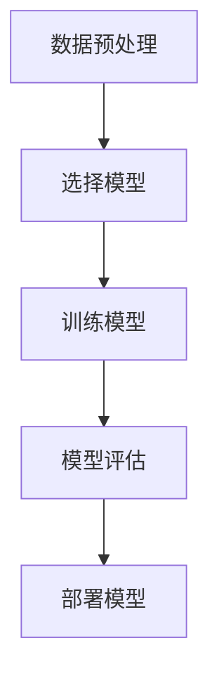
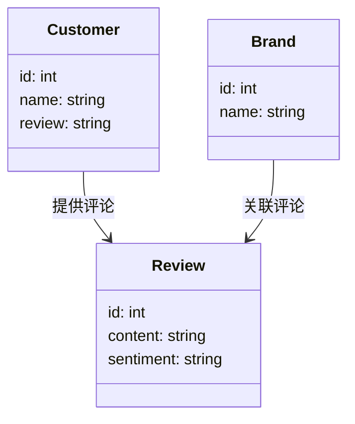

                 


# AI Agent在企业品牌管理与口碑监控中的应用

> 关键词：AI Agent, 企业品牌管理, 口碑监控, 自然语言处理, 机器学习, 情感分析

> 摘要：本文探讨了AI Agent在企业品牌管理与口碑监控中的应用，分析了其核心概念、算法原理、系统架构及项目实战。通过详细讲解，帮助读者理解如何利用AI技术提升品牌管理和口碑监控的效率与精度。

---

## 第1章: 背景介绍与核心概念

### 1.1 问题背景与描述

#### 1.1.1 企业品牌管理的挑战
在当今竞争激烈的市场环境中，企业品牌管理面临诸多挑战，包括如何实时监控品牌形象、处理海量客户反馈以及及时应对负面舆情。传统的人工管理方式效率低下，且难以覆盖全渠道数据。

#### 1.1.2 口碑监控的现状与痛点
口碑监控是品牌管理的重要组成部分，但传统的口碑监控依赖人工分析，存在数据滞后、覆盖面有限、分析深度不足等问题。企业需要一种高效、智能的解决方案来实时监控和分析口碑数据。

#### 1.1.3 AI Agent的应用价值
AI Agent作为一种智能体，能够实时处理海量数据，提供精准的分析结果和自动化应对策略。它能够显著提升品牌管理的效率和精度，帮助企业快速响应市场变化。

### 1.2 AI Agent的核心概念

#### 1.2.1 AI Agent的定义与特点
AI Agent是一种智能实体，能够感知环境、自主决策并执行任务。其特点包括智能性、自主性、反应性和社会性。

#### 1.2.2 企业品牌管理中的AI Agent角色
在企业品牌管理中，AI Agent扮演着数据采集、分析和决策支持的角色。它能够实时监控品牌口碑，识别潜在风险，并提供应对策略。

#### 1.2.3 口碑监控的AI Agent解决方案
AI Agent通过自然语言处理和机器学习技术，能够自动识别客户情感、提取关键词并分类舆情。这使得口碑监控更加高效和精准。

---

## 第2章: AI Agent的核心概念与联系

### 2.1 核心概念原理

#### 2.1.1 AI Agent的工作原理
AI Agent通过数据采集、分析、决策和执行四个步骤，实现对品牌口碑的实时监控和管理。其工作流程包括数据输入、处理、分析和输出。

#### 2.1.2 与传统品牌管理的区别
与传统方法相比，AI Agent具有更高的效率和准确性。它能够处理海量数据，并提供实时反馈，而传统方法通常依赖人工分析，速度较慢且覆盖面有限。

#### 2.1.3 口碑监控的AI驱动机制
AI Agent通过自然语言处理技术，能够识别文本中的情感倾向、主题和关键词。这使得它能够准确判断客户情感并分类舆情。

### 2.2 核心概念属性对比

#### 2.2.1 表格对比: AI Agent与传统方法的差异

| 对比维度 | AI Agent | 传统方法 |
|----------|-----------|-----------|
| 效率     | 高         | 低         |
| 准确性   | 高         | 中         |
| 覆盖面   | 全         | 有限       |
| 响应时间 | 实时       | 延后       |

#### 2.2.2 ER实体关系图的构建

```mermaid
erDiagram
    customer---|多次提到| brand
    customer---|多次提到| review
    brand---|多次提到| sentiment
```

---

## 第3章: AI Agent的算法原理

### 3.1 情感分析算法

#### 3.1.1 算法流程图



#### 3.1.2 情感分类的数学模型

情感分类可以通过逻辑回归模型实现，其损失函数为：

$$ L = -\frac{1}{m}\sum_{i=1}^{m} [y_i \log(h(x_i)) + (1-y_i)\log(1-h(x_i))] $$

其中，$h(x_i) = \frac{1}{1 + e^{-\beta x_i}}$ 是sigmoid函数。

---

## 第4章: 系统分析与架构设计

### 4.1 问题场景介绍

#### 4.1.1 品牌管理的典型场景
企业需要实时监控社交媒体、论坛和新闻中的品牌提及，并根据客户反馈调整品牌策略。

#### 4.1.2 口碑监控的关键环节
数据采集、情感分析、主题建模和决策支持是口碑监控的关键环节。

#### 4.1.3 AI Agent的应用场景
AI Agent可以应用于实时舆情监控、竞争对手分析和品牌危机预警。

### 4.2 系统功能设计

#### 4.2.1 领域模型类图



---

## 第5章: 项目实战与案例分析

### 5.1 环境安装与配置

#### 5.1.1 开发环境搭建
建议使用Python 3.8及以上版本，并安装必要的库，如`nltk`、`scikit-learn`和`transformers`。

#### 5.1.2 依赖库安装
运行以下命令安装所需依赖：

```bash
pip install numpy pandas scikit-learn nltk transformers
```

#### 5.1.3 数据集准备
准备一个包含品牌评论的文本数据集，并进行分词和标注。

### 5.2 核心代码实现

#### 5.2.1 情感分析代码

```python
from sklearn.feature_extraction.text import TfidfVectorizer
from sklearn.linear_model import LogisticRegression

# 数据预处理
X = data['text']
y = data['sentiment']

# 特征提取
vectorizer = TfidfVectorizer(max_features=5000)
X_features = vectorizer.fit_transform(X)

# 模型训练
model = LogisticRegression()
model.fit(X_features, y)

# 模型预测
def predict_sentiment(text):
    features = vectorizer.transform([text])
    return model.predict(features)[0]
```

---

## 第6章: 总结与展望

### 6.1 总结
本文详细探讨了AI Agent在企业品牌管理与口碑监控中的应用，分析了其核心概念、算法原理和系统架构。通过项目实战，展示了如何利用AI技术提升品牌管理的效率和精度。

### 6.2 未来展望
随着AI技术的不断发展，AI Agent在品牌管理中的应用将更加广泛。未来的研究方向包括提高模型的可解释性、优化算法的实时性和扩展性。

### 6.3 注意事项
在实际应用中，需要注意数据隐私保护、模型的可解释性以及算法的实时性。此外，还需要根据具体场景调整模型参数，以达到最佳效果。

### 6.4 拓展阅读
推荐阅读《自然语言处理实战》和《机器学习实战》等书籍，以深入理解相关技术原理。

---

作者：AI天才研究院 & 禅与计算机程序设计艺术

