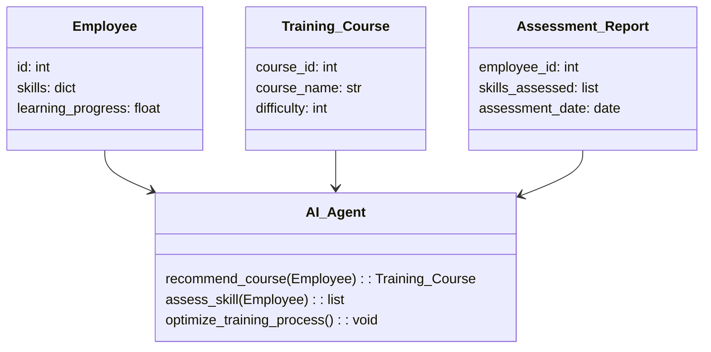

                 


# AI Agent在企业培训与技能评估中的创新应用

> 关键词：AI Agent, 企业培训, 技能评估, 人工智能, 技能发展

> 摘要：随着人工智能技术的快速发展，AI Agent（人工智能代理）在企业培训与技能评估中的应用日益广泛。本文详细探讨了AI Agent在企业培训与技能评估中的创新应用，分析了其核心概念、算法原理、系统架构，并通过实际案例展示了AI Agent如何优化企业培训与技能评估流程，提升员工技能水平和企业竞争力。

---

## 第一部分: AI Agent与企业培训技能评估的背景介绍

### 第1章: AI Agent的基本概念与企业培训技能评估的现状

#### 1.1 AI Agent的基本概念
AI Agent，即人工智能代理，是一种能够感知环境、自主决策并执行任务的智能系统。AI Agent的核心在于其智能性、自主性和适应性，能够根据环境反馈调整行为，以实现特定目标。

- **智能性**：AI Agent通过机器学习和自然语言处理等技术，具备理解和分析复杂问题的能力。
- **自主性**：AI Agent能够在没有人工干预的情况下，独立完成任务。
- **适应性**：AI Agent能够根据环境变化和用户反馈，动态调整其行为策略。

#### 1.2 企业培训与技能评估的现状
传统的企业培训与技能评估方式存在以下问题：
1. **培训内容单一**：传统培训往往采用固定课程，难以根据员工的个性化需求进行调整。
2. **评估方式落后**：技能评估通常依赖主观的考试或面试，缺乏客观性和实时性。
3. **效率低下**：培训和评估过程耗时长、成本高，且难以大规模覆盖员工。

AI Agent的应用能够有效解决这些问题，通过智能化的培训内容推荐和实时评估，提升企业培训与技能评估的效率和效果。

---

## 第二部分: AI Agent的核心概念与联系

### 第2章: AI Agent的核心原理

#### 2.1 AI Agent的核心原理
AI Agent的核心原理包括感知、决策和执行三个主要环节：
1. **感知**：AI Agent通过传感器或数据接口获取环境信息，如员工的学习进度、技能水平等。
2. **决策**：基于感知到的信息，AI Agent利用算法（如强化学习、监督学习）进行分析和决策，制定最优的培训计划或评估策略。
3. **执行**：AI Agent根据决策结果执行相应的操作，如推送个性化培训内容或生成评估报告。

#### 2.2 AI Agent与企业培训技能评估的联系
AI Agent在企业培训技能评估中的应用主要体现在以下几个方面：
1. **个性化培训推荐**：AI Agent可以根据员工的技能水平和学习进度，推荐适合的培训课程。
2. **实时技能评估**：通过实时监控员工的表现，AI Agent能够动态评估其技能水平，并提供反馈。
3. **优化培训流程**：AI Agent能够分析培训数据，优化培训流程，提升培训效果。

#### 2.3 AI Agent与其他技术的对比
以下是AI Agent与其他技术在企业培训技能评估中的对比：

| 技术         | 优点                               | 缺点                               |
|--------------|------------------------------------|------------------------------------|
| AI Agent     | 高度智能，自主学习能力强           | 开发成本高，技术门槛高             |
| 传统培训系统 | 成本低，易于实施                   | 缺乏智能化，难以个性化               |
| 其他AI技术   | 功能多样，适用性广                 | 需结合具体场景，难以通用化           |

---

## 第三部分: AI Agent在企业培训技能评估中的算法原理

### 第3章: AI Agent的核心算法

#### 3.1 强化学习算法
强化学习是一种通过试错机制优化决策的算法。在企业培训技能评估中，AI Agent可以通过强化学习算法，根据员工的反馈调整培训策略。

- **算法步骤**：
  1. AI Agent接收员工的学习反馈。
  2. 根据反馈，AI Agent更新其策略，选择最优的培训内容。
  3. 重复上述步骤，直到达到预设目标。

- **数学模型**：
  $$ V(s) = \max_{a} [ r(s,a) + \gamma V(s') ] $$
  其中，\( V(s) \) 表示状态 \( s \) 的价值函数，\( r(s,a) \) 表示在状态 \( s \) 下采取动作 \( a \) 的奖励，\( \gamma \) 表示折扣因子，\( V(s') \) 表示下一状态 \( s' \) 的价值函数。

#### 3.2 监督学习算法
监督学习是一种基于标签数据进行预测的算法。在企业培训技能评估中，AI Agent可以通过监督学习算法，根据员工的历史表现预测其未来的学习效果。

- **算法步骤**：
  1. 收集员工的历史学习数据，包括学习时间、课程完成情况等。
  2. 使用监督学习算法（如线性回归、随机森林）训练模型。
  3. 使用训练好的模型预测员工的学习效果。

- **数学模型**：
  $$ y = \theta x + b $$
  其中，\( y \) 表示预测的学习效果，\( x \) 表示输入特征，\( \theta \) 表示模型参数，\( b \) 表示截距。

#### 3.3 聚类分析算法
聚类分析是一种将数据分成不同类别的算法。在企业培训技能评估中，AI Agent可以通过聚类分析算法，将员工分成不同的技能水平组，以便进行针对性的培训。

- **算法步骤**：
  1. 收集员工的技能评估数据。
  2. 使用聚类算法（如K-means）将员工分成不同的技能组。
  3. 根据每个组的特点，制定个性化的培训计划。

- **数学模型**：
  $$ d(x_i, x_j) = \sqrt{(x_i - x_j)^2} $$
  其中，\( x_i \) 和 \( x_j \) 表示两个员工的技能评估数据，\( d \) 表示距离函数。

#### 3.4 算法实现的Python代码示例
以下是一个强化学习算法的Python代码示例：

```python
def reinforce_learn(environment, num_episodes=1000):
    Q = defaultdict(lambda: defaultdict(int))
    for episode in range(num_episodes):
        state = environment.reset()
        total_reward = 0
        while True:
            action = choose_action(Q[state])
            next_state, reward, done = environment.step(action)
            Q[state][action] += reward
            total_reward += reward
            state = next_state
            if done:
                break
    return Q
```

---

## 第四部分: AI Agent在企业培训技能评估中的系统架构设计

### 第4章: 系统分析与架构设计方案

#### 4.1 问题场景介绍
企业培训技能评估系统需要解决以下问题：
1. 如何个性化推荐培训内容？
2. 如何实时评估员工技能水平？
3. 如何优化培训流程？

#### 4.2 领域模型设计
以下是企业培训技能评估系统的领域模型：



#### 4.3 系统架构设计
以下是企业培训技能评估系统的架构图：


---

## 第五部分: AI Agent在企业培训技能评估中的项目实战

### 第5章: 项目实战

#### 5.1 环境安装
以下是项目实战所需的环境安装步骤：

1. 安装Python和必要的Python库（如TensorFlow、Scikit-learn）。
2. 安装企业培训技能评估系统的前端和后端框架（如React、Django）。
3. 配置数据库（如MySQL）。

#### 5.2 系统核心实现源代码
以下是AI Agent的核心代码实现：

```python
class AI_Agent:
    def __init__(self, employee_data, training_courses):
        self.employee_data = employee_data
        self.training_courses = training_courses

    def recommend_course(self, employee_id):
        # 根据员工数据推荐课程
        pass

    def assess_skill(self, employee_id):
        # 根据员工数据评估技能
        pass

    def optimize_training_process(self):
        # 优化培训流程
        pass
```

#### 5.3 代码解读与分析
AI Agent的核心代码实现了以下几个功能：
1. **推荐课程**：根据员工的技能水平和学习进度，推荐适合的培训课程。
2. **评估技能**：通过分析员工的历史表现，评估其技能水平。
3. **优化流程**：根据数据分析结果，优化培训流程，提升培训效果。

#### 5.4 实际案例分析
以下是一个实际案例分析：

某公司引入AI Agent进行企业培训与技能评估，通过分析员工的学习数据，AI Agent为每位员工推荐个性化的培训课程，并实时评估其技能水平。经过一段时间的应用，员工的技能水平显著提升，培训效率也大幅提高。

---

## 第六部分: 最佳实践、小结、注意事项和拓展阅读

### 第6章: 最佳实践

1. **数据隐私保护**：在处理员工数据时，需要注意数据隐私保护，遵守相关法律法规。
2. **技术选型**：根据具体需求选择合适的AI算法和技术框架。
3. **持续优化**：定期更新模型和算法，提升系统性能。

### 第7章: 小结

AI Agent在企业培训与技能评估中的应用，不仅提升了培训效率，还优化了培训效果。通过智能化的推荐和实时评估，AI Agent能够帮助企业在培训与技能评估方面取得更大的成功。

### 第8章: 注意事项

1. **技术复杂性**：AI Agent的开发和部署需要较高的技术门槛。
2. **数据质量**：系统的性能依赖于数据的质量和完整性。
3. **用户体验**：需要注重用户体验设计，确保员工能够方便地使用系统。

### 第9章: 拓展阅读

1. 《强化学习：算法与应用》
2. 《机器学习实战》
3. 《人工智能：一种现代方法》

---

## 结语

AI Agent在企业培训与技能评估中的应用前景广阔，随着技术的不断进步，AI Agent将为企业培训与技能评估带来更多的创新和突破。希望本文能够为读者提供有价值的参考和启示。

---

**作者：AI天才研究院/AI Genius Institute & 禅与计算机程序设计艺术 /Zen And The Art of Computer Programming**

