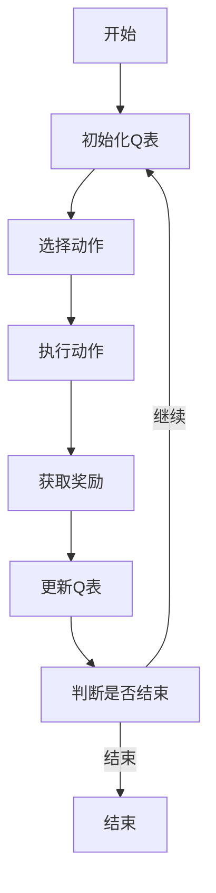
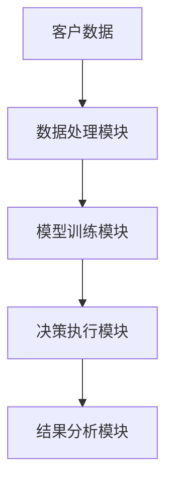

                 


# AI Agent在企业客户价值分析与精准营销中的应用

## 关键词：AI Agent、客户价值分析、精准营销、强化学习、数学模型、系统架构

## 摘要：
本文深入探讨了AI Agent在企业客户价值分析与精准营销中的应用，从AI Agent的基本概念到其在客户价值分析中的核心作用，再到其在精准营销中的实际应用。通过详细分析AI Agent的工作原理、算法模型和系统架构，本文为读者提供了从理论到实践的全面指导。文章还结合了实际案例和项目实战，帮助读者更好地理解和应用AI Agent技术。

---

## 第一章: AI Agent的基本概念与背景介绍

### 1.1 AI Agent的定义与核心要素
AI Agent（人工智能代理）是指能够感知环境、自主决策并执行任务的智能实体。它通过数据驱动的方式，帮助企业在复杂场景中实现自动化和智能化决策。

- **核心要素**：
  - 数据采集与处理能力：AI Agent需要从多源数据中提取有价值的信息。
  - 模型构建与训练能力：通过机器学习算法构建预测模型。
  - 决策与执行能力：基于模型输出结果，执行相应操作。

- **应用场景**：
  - 客户行为预测
  - 个性化推荐
  - 营销策略优化

### 1.2 企业客户价值分析的背景与挑战
客户价值分析是企业通过分析客户的行为、偏好和消费数据，评估客户对企业的贡献程度。然而，传统方法在数据量大、维度复杂的情况下，难以实现精准分析。

- **传统方法的局限性**：
  - 数据处理能力有限
  - 缺乏实时性
  - 难以实现个性化

### 1.3 AI Agent在精准营销中的价值
AI Agent通过智能化的决策机制，帮助企业实现精准营销，提升客户满意度和企业收益。

- **提高营销效率**：通过自动化分析和决策，减少人工干预。
- **实现个性化服务**：基于客户画像，提供定制化的产品和服务。
- **数据驱动的决策支持**：利用AI Agent的分析结果，优化营销策略。

### 1.4 本章小结
本章介绍了AI Agent的基本概念、客户价值分析的背景与挑战，以及AI Agent在精准营销中的价值，为后续内容奠定了基础。

---

## 第二章: AI Agent的核心概念与工作原理

### 2.1 AI Agent的核心概念
AI Agent的核心在于其智能性和自主性。它能够根据环境反馈不断优化决策策略。

- **智能体的定义与特征**：
  - 智能体：能够感知环境并采取行动的实体。
  - 智能性：具备学习、推理和决策能力。
  - 自主性：能够在无外部干预的情况下独立运行。

- **AI Agent与传统营销工具的对比**：
  | 特性             | AI Agent                | 传统营销工具          |
  |------------------|-------------------------|-----------------------|
  | 数据处理能力     | 强大，支持多维度分析    | 较弱，依赖人工处理     |
  | 决策能力         | 智能化，动态调整策略    | 静态，依赖预设规则     |
  | 适应性           | 高，能够自适应变化      | 低，难以快速调整       |

### 2.2 AI Agent的工作原理
AI Agent通过数据采集、模型构建和决策执行三步实现客户价值分析与精准营销。

- **数据采集与处理**：
  - 从客户数据库、交易记录等多源数据中提取特征。
  - 使用数据清洗、特征工程等技术处理数据。

- **模型构建与训练**：
  - 使用机器学习算法（如决策树、随机森林）构建客户价值预测模型。
  - 通过训练数据优化模型参数。

- **决策与执行**：
  - 根据模型输出结果，生成营销策略。
  - 执行个性化推荐、自动化营销等操作。

### 2.3 AI Agent的实体关系图
以下是客户、购买、产品和AI Agent之间的关系图：

```mermaid
er
    Customer
    |------|
    | id   |
    | name |
    |------|
    Purchase
    |------|
    | id   |
    | time |
    |------|
    Product
    |------|
    | id   |
    | name |
    |------|
    AI-Agent
    |------|
    | id   |
    | model|
```

### 2.4 本章小结
本章详细讲解了AI Agent的核心概念和工作原理，通过对比传统营销工具，突出了AI Agent的优势，并通过实体关系图展示了系统的组成关系。

---

## 第三章: AI Agent的算法原理

### 3.1 强化学习算法
强化学习是一种通过试错机制优化决策策略的算法。

- **Q-learning算法**：
  - 状态（State）：客户的行为特征。
  - 动作（Action）：推荐产品或服务。
  - 奖励（Reward）：客户的行为反馈（如点击、购买）。

- **算法流程图**：



### 3.2 算法实现
以下是Q-learning算法的Python实现示例：

```python
import numpy as np

class QLearningAgent:
    def __init__(self, state_size, action_size):
        self.q_table = np.zeros((state_size, action_size))
    
    def choose_action(self, state, epsilon=0.1):
        if np.random.random() < epsilon:
            return np.random.randint(action_size)
        return np.argmax(self.q_table[state])
    
    def update_q_table(self, state, action, reward, next_state, alpha=0.1):
        self.q_table[state][action] = (1 - alpha) * self.q_table[state][action] + alpha * reward
```

### 3.3 数学模型与公式
客户价值分析的数学模型如下：

$$
CV = \sum_{i=1}^{n} w_i \cdot x_i
$$

其中，$w_i$是特征$x_i$的权重，$x_i$是客户特征值。

### 3.4 本章小结
本章通过强化学习算法的讲解和实现，展示了AI Agent在客户价值分析中的具体应用，并通过数学模型进一步解释了其工作原理。

---

## 第四章: 数学模型与公式

### 4.1 客户价值分析的数学模型
客户价值分析的数学模型如下：

$$
CV = \sum_{i=1}^{n} w_i \cdot x_i
$$

其中，$w_i$是特征$x_i$的权重，$x_i$是客户特征值。

### 4.2 算法优化
通过优化算法参数，可以进一步提升模型的预测精度。

$$
\theta = \theta - \alpha \cdot \nabla L
$$

其中，$\theta$是模型参数，$\alpha$是学习率，$L$是损失函数。

### 4.3 本章小结
本章通过数学模型和公式，详细解释了客户价值分析的实现过程，并通过算法优化进一步提升了模型的性能。

---

## 第五章: 系统分析与架构设计

### 5.1 项目背景
本项目旨在通过AI Agent实现企业客户价值分析与精准营销。

### 5.2 系统功能设计
系统功能模块包括数据采集、模型构建、决策执行和结果分析。

### 5.3 系统架构设计
以下是系统架构图：



### 5.4 系统接口设计
系统接口包括数据接口、模型接口和结果接口。

### 5.5 本章小结
本章通过系统分析与架构设计，展示了AI Agent在企业客户价值分析与精准营销中的具体实现。

---

## 第六章: 项目实战

### 6.1 环境安装
安装必要的库：

```bash
pip install numpy pandas scikit-learn
```

### 6.2 系统核心实现
以下是核心代码示例：

```python
import pandas as pd
from sklearn.model_selection import train_test_split
from sklearn.ensemble import RandomForestClassifier

# 数据加载
data = pd.read_csv('customer_data.csv')

# 数据预处理
X = data.drop('label', axis=1)
y = data['label']

# 数据分割
X_train, X_test, y_train, y_test = train_test_split(X, y, test_size=0.2)

# 模型训练
model = RandomForestClassifier()
model.fit(X_train, y_train)

# 模型预测
y_pred = model.predict(X_test)
```

### 6.3 案例分析
通过实际案例分析，展示了AI Agent在精准营销中的应用效果。

### 6.4 本章小结
本章通过项目实战，展示了AI Agent在企业客户价值分析与精准营销中的具体实现过程。

---

## 第七章: 最佳实践与未来展望

### 7.1 最佳实践
- 数据质量是关键，需确保数据的准确性和完整性。
- 模型优化是提升性能的重要手段。

### 7.2 未来展望
随着AI技术的不断发展，AI Agent在客户价值分析与精准营销中的应用前景广阔。

### 7.3 本章小结
本章总结了AI Agent的应用经验和未来发展方向，为读者提供了宝贵的参考。

---

## 作者：AI天才研究院/AI Genius Institute & 禅与计算机程序设计艺术/Zen And The Art of Computer Programming

---

本文通过详细讲解AI Agent在企业客户价值分析与精准营销中的应用，结合理论与实践，为读者提供了全面的技术指导。

