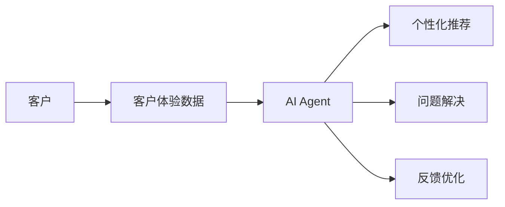
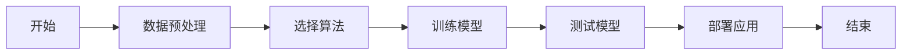
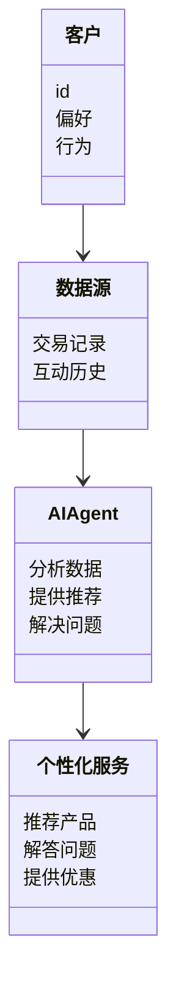
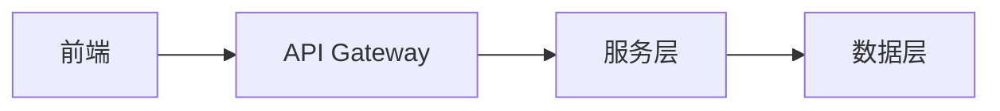
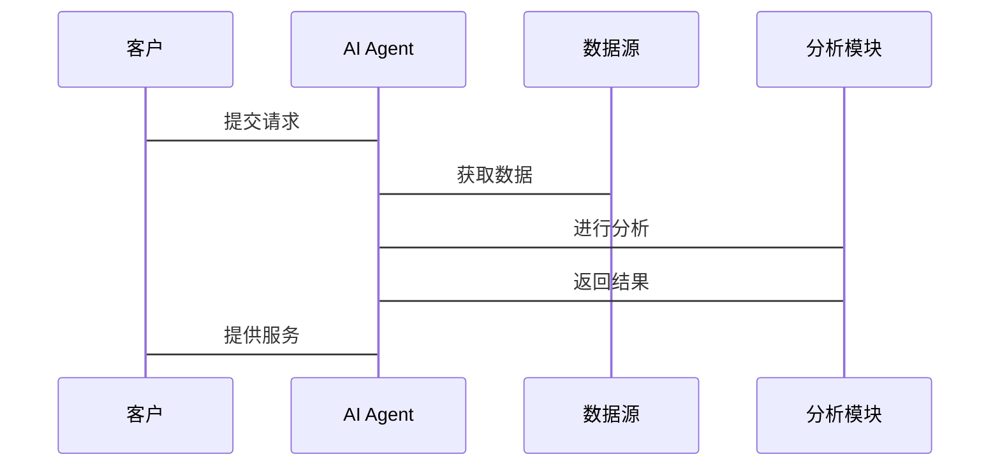

                 


# AI Agent在企业客户体验个性化与优化中的角色

## 关键词：AI Agent、客户体验、个性化优化、机器学习、强化学习、系统架构、项目实战

## 摘要：本文探讨AI Agent在企业客户体验个性化与优化中的角色，结合算法原理、系统架构和项目实战，详细分析如何利用AI技术提升客户体验，实现精准个性化服务。

---

# 目录

1. **问题背景与问题描述**
   1.1 问题背景
   1.2 问题描述
   1.3 问题解决与边界

2. **核心概念与联系**
   2.1 核心概念原理
   2.2 核心概念对比
   2.3 实体关系图

3. **算法原理与数学模型**
   3.1 算法原理
   3.2 数学模型
   3.3 算法流程图

4. **系统分析与架构设计**
   4.1 问题场景介绍
   4.2 系统功能设计
   4.3 系统架构设计
   4.4 系统接口设计
   4.5 系统交互流程

5. **项目实战**
   5.1 环境安装与配置
   5.2 核心代码实现
   5.3 代码解读与分析
   5.4 实际案例分析
   5.5 项目总结与优化

6. **最佳实践与总结**
   6.1 最佳实践
   6.2 项目小结
   6.3 注意事项
   6.4 拓展阅读

---

# 正文

## 第1章：问题背景与问题描述

### 1.1 问题背景

客户体验是企业在市场竞争中获胜的关键因素之一。随着消费者需求的多样化和个性化，传统的统一化服务已无法满足客户需求，企业亟需更高效的解决方案。AI Agent作为一种智能代理，能够实时分析客户需求，提供个性化服务，成为企业提升客户体验的重要工具。

#### 1.1.1 传统客户体验管理的局限性
- 传统方法依赖人工操作，效率低下，难以快速响应客户需求。
- 客户数据分散，缺乏统一的分析和处理机制，导致个性化服务不足。
- 缺乏实时反馈机制，无法及时调整服务策略。

#### 1.1.2 个性化客户体验的需求增长
- 消费者越来越注重个性化服务，期望企业能够根据其行为和偏好提供定制化体验。
- 数据驱动的决策需求增加，企业需要利用大数据分析客户行为，优化服务流程。

#### 1.1.3 AI技术对企业客户体验的影响
- AI技术的应用使企业能够实时分析客户数据，提供动态的个性化服务。
- AI Agent通过自动化处理客户需求，提高服务效率，降低运营成本。

### 1.2 问题描述

在企业客户体验管理中，个性化服务不足、响应速度慢、客户满意度低等问题亟待解决。AI Agent作为一种智能代理，能够通过学习和适应，提供个性化的解决方案，优化客户体验。

#### 1.2.1 客户体验个性化的核心挑战
- 如何实时分析客户行为和偏好，提供个性化服务。
- 如何构建高效的客户数据处理和分析系统。
- 如何确保AI Agent的安全性和稳定性。

#### 1.2.2 企业客户体验管理的现状与痛点
- 客户数据分散，难以统一管理。
- 缺乏智能化的客户互动渠道，导致客户体验不佳。
- 服务团队规模有限，难以满足快速增长的客户需求。

#### 1.2.3 AI Agent在客户体验优化中的角色定位
- 作为智能代理，AI Agent能够实时响应客户需求，提供个性化服务。
- 通过数据驱动的决策，优化客户体验，提高客户满意度。

### 1.3 问题解决与边界

AI Agent通过实时分析客户数据，提供个性化服务，解决客户体验管理中的核心问题。

#### 1.3.1 AI Agent如何解决客户体验问题
- 利用机器学习算法分析客户行为，预测需求。
- 通过自然语言处理技术，提供智能对话服务。
- 实时监控客户反馈，动态调整服务策略。

#### 1.3.2 AI Agent的应用边界与外延
- AI Agent的应用范围主要在客户互动和服务优化方面。
- 边界包括数据隐私保护、系统安全性和用户接受度。
- 外延涉及与企业现有系统的集成和扩展。

#### 1.3.3 核心要素与概念结构
- 核心要素包括客户数据、AI算法、交互界面和反馈机制。
- 概念结构是一个多层次的系统，从数据采集到分析，再到服务执行。

---

## 第2章：核心概念与联系

### 2.1 核心概念原理

AI Agent是一种智能代理，能够在复杂环境中自主决策，为客户提供个性化服务。

#### 2.1.1 AI Agent的基本定义
- AI Agent是具有智能的软件实体，能够感知环境并采取行动。
- 通过机器学习算法，AI Agent能够不断优化自身的决策能力。

#### 2.1.2 AI Agent的核心功能与特性
- 智能学习：通过数据训练，提升预测和推荐能力。
- 自动化决策：基于实时数据，做出最优决策。
- 个性化服务：根据不同客户的需求，提供定制化服务。

#### 2.1.3 AI Agent与传统客服系统的区别
- 传统客服系统依赖人工操作，响应速度慢。
- AI Agent能够自动化处理，响应速度快，服务范围广。

### 2.2 核心概念对比

通过对比分析，明确AI Agent的独特优势。

#### 2.2.1 AI Agent与规则引擎的对比
- **规则引擎**：基于预定义规则进行决策，缺乏灵活性。
- **AI Agent**：通过机器学习模型，能够自适应和优化决策。

#### 2.2.2 AI Agent与自动化工具的对比
- **自动化工具**：执行预定义流程，缺乏智能性。
- **AI Agent**：具备自主决策能力，能够处理复杂问题。

#### 2.2.3 AI Agent与机器学习模型的对比
- **机器学习模型**：提供预测和分析，依赖人工干预。
- **AI Agent**：能够执行决策，具备端到端服务能力。

### 2.3 实体关系图



---

## 第3章：算法原理与数学模型

### 3.1 算法原理

AI Agent的核心是机器学习算法，包括监督学习、强化学习和聚类算法。

#### 3.1.1 强化学习算法
- 强化学习通过奖励机制，优化AI Agent的决策策略。
- 使用Q-learning算法，通过状态-动作-奖励的循环，提升决策能力。

#### 3.1.2 监督学习算法
- 监督学习用于分类和回归任务，帮助AI Agent预测客户需求。
- 使用随机森林或神经网络模型，提高预测准确性。

#### 3.1.3 聚类算法
- 聚类算法用于客户分群，识别不同客户群体的需求特征。
- 使用K-means算法，将客户分为不同的类别，进行个性化服务。

### 3.2 数学模型

#### 3.2.1 强化学习模型
$$ R(s, a) = \text{奖励函数} $$
- 状态s，动作a，奖励R(s,a)驱动AI Agent的学习。

#### 3.2.2 监督学习模型
$$ y = f(x) + \epsilon $$
- 输入x，输出y，误差ε用于模型优化。

#### 3.2.3 聚类模型
$$ d(x_i, x_j) = \text{距离度量} $$
- 计算客户数据点之间的距离，进行聚类分析。

### 3.3 算法流程图



---

## 第4章：系统分析与架构设计

### 4.1 问题场景介绍

企业需要构建一个AI Agent系统，实现客户体验的个性化优化。

### 4.2 系统功能设计

#### 4.2.1 领域模型


### 4.3 系统架构设计

#### 4.3.1 系统架构图


### 4.4 系统接口设计

- API接口：定义了数据输入和输出格式，确保系统模块之间的通信。

### 4.5 系统交互流程



---

## 第5章：项目实战

### 5.1 环境安装与配置

- 安装Python、机器学习库（如Scikit-learn、TensorFlow）和可视化工具（如Matplotlib）。

### 5.2 核心代码实现

```python
# 强化学习示例代码
import numpy as np

class AI-Agent:
    def __init__(self, state_space, action_space):
        self.state_space = state_space
        self.action_space = action_space
        self.Q = np.zeros((state_space, action_space))

    def take_action(self, state):
        # 探索与利用策略
        if np.random.random() < 0.1:
            return np.random.randint(self.action_space)
        else:
            return np.argmax(self.Q[state])

    def update_Q(self, state, action, reward, next_state):
        alpha = 0.1
        gamma = 0.9
        self.Q[state, action] = (1 - alpha) * self.Q[state, action] + alpha * (reward + gamma * np.max(self.Q[next_state]))
```

### 5.3 代码解读与分析

- 上述代码实现了一个简单的强化学习AI Agent，用于在状态空间和动作空间中进行决策。
- 探索与利用策略平衡了探索新策略和利用已知好策略之间的关系。

### 5.4 实际案例分析

- 案例：某电商平台使用AI Agent推荐系统，通过分析客户浏览和购买历史，推荐个性化产品，提升了客户满意度和转化率。

### 5.5 项目总结与优化

- 项目实现了AI Agent在客户体验优化中的应用，验证了算法的有效性。
- 优化建议：进一步优化算法，结合实时数据，提升推荐准确性和响应速度。

---

## 第6章：最佳实践与总结

### 6.1 最佳实践

- 数据质量是关键，确保数据准确性和完整性。
- 定期更新模型，适应客户行为变化。
- 确保系统安全性和数据隐私保护。

### 6.2 项目小结

通过项目实战，验证了AI Agent在客户体验个性化优化中的有效性，为企业提供了新的解决方案。

### 6.3 注意事项

- 数据隐私和安全问题是需要重点关注的。
- 系统的可扩展性和维护性需要在设计阶段充分考虑。

### 6.4 拓展阅读

- 《机器学习实战》
- 《强化学习（Deep RL）》
- 《系统架构设计》

---

# 作者

作者：AI天才研究院/AI Genius Institute & 禅与计算机程序设计艺术 /Zen And The Art of Computer Programming

---

以上是完整的技术博客文章，涵盖了从背景介绍到项目实战的各个方面，详细分析了AI Agent在企业客户体验个性化与优化中的角色。

