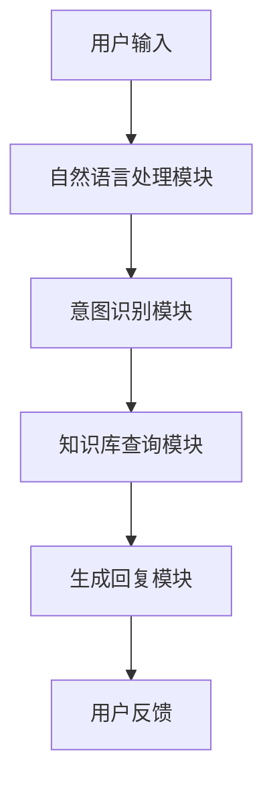

                 


# AI Agent在企业客户体验个性化中的深度应用与效果评估

## 关键词：AI Agent，企业客户体验，个性化服务，深度应用，效果评估

## 摘要：随着人工智能技术的迅速发展，AI Agent在企业客户体验个性化中的应用日益广泛。本文将从AI Agent的核心概念、技术原理、系统架构设计、项目实战等方面，详细探讨其在企业客户体验中的深度应用，并结合实际案例分析其效果评估方法。通过本文的分析，读者将全面理解AI Agent在企业客户体验个性化中的应用价值及未来发展方向。

---

## 目录大纲

### 第1章: 企业客户体验个性化与AI Agent概述

1.1 企业客户体验个性化的重要性
- 1.1.1 个性化客户体验的定义
- 1.1.2 个性化体验对企业价值的影响
- 1.1.3 个性化体验的实现路径

1.2 AI Agent的核心概念与特点
- 1.2.1 AI Agent的定义与分类
- 1.2.2 AI Agent的核心技术特征
- 1.2.3 AI Agent与传统客服系统的区别

1.3 企业客户体验中的AI Agent应用前景
- 1.3.1 AI Agent在客户体验中的潜在应用场景
- 1.3.2 企业采用AI Agent的优势
- 1.3.3 AI Agent应用的挑战与机遇

1.4 本章小结

---

### 第2章: AI Agent的核心原理

2.1 AI Agent的基本原理
- 2.1.1 AI Agent的感知与决策机制
- 2.1.2 基于机器学习的AI Agent模型
- 2.1.3 AI Agent的自然语言处理能力

2.2 AI Agent的核心技术
- 2.2.1 自然语言处理（NLP）技术
- 2.2.2 机器学习算法
- 2.2.3 数据挖掘与分析技术

2.3 AI Agent的系统架构
- 2.3.1 基于模块化的AI Agent架构
- 2.3.2 微服务架构在AI Agent中的应用
- 2.3.3 数据流与交互流程图（Mermaid）

**Mermaid图示例：**



2.4 本章小结

---

### 第3章: AI Agent的算法原理与数学模型

3.1 AI Agent的算法原理
- 3.1.1 基于深度学习的自然语言处理算法
  - Transformer模型的原理
  - BERT模型在AI Agent中的应用
  - GPT系列模型的对话生成机制
- 3.1.2 AI Agent的意图识别算法
  - 基于CRF的序列标注算法
  - 基于CNN的文本分类算法
  - 基于RNN的序列模型

3.2 AI Agent的数学模型与公式
- 3.2.1 Transformer模型的数学公式
  $$\text{Transformer}(x) = \text{FFN}(x)$$
- 3.2.2 BERT模型的预训练目标函数
  $$\text{Loss} = -\frac{1}{|B|}\sum_{i=1}^{|B|}\text{log}p(w_i|w_{i-1})$$

3.3 算法实现与代码示例
- 3.3.1 基于Python的自然语言处理代码示例
  ```python
  import torch
  import torch.nn as nn
  import torch.optim as optim
  ```

3.4 本章小结

---

### 第4章: AI Agent的系统架构设计与实现

4.1 系统架构设计
- 4.1.1 问题场景介绍
- 4.1.2 系统功能设计（领域模型Mermaid类图）
- 4.1.3 系统架构设计Mermaid图
  ```mermaid
  graph LR
      A[用户] --> B[前端界面]
      B --> C[自然语言处理模块]
      C --> D[意图识别模块]
      D --> E[知识库查询模块]
      E --> F[生成回复模块]
      F --> G[反馈模块]
  ```

4.2 接口与交互设计
- 4.2.1 系统接口设计（RESTful API示例）
- 4.2.2 系统交互流程图（Mermaid序列图）
  ```mermaid
  sequenceDiagram
      participant 用户
      participant AI Agent
      participant 知识库
      用户->AI Agent: 提问
      AI Agent->知识库: 查询
      知识库-->>AI Agent: 返回结果
      AI Agent->用户: 生成回复
  ```

4.3 系统实现与代码示例
- 4.3.1 环境安装与配置
- 4.3.2 系统核心实现代码
  ```python
  class AIAssistant:
      def __init__(self, knowledge_base):
          self.knowledge_base = knowledge_base
      def process_query(self, query):
          # 处理用户的查询
          pass
  ```

4.4 本章小结

---

### 第5章: AI Agent的项目实战与效果评估

5.1 项目实战
- 5.1.1 项目背景与目标
- 5.1.2 核心代码实现与解读
  ```python
  def train_model():
      # 训练AI Agent模型
      pass
  ```
- 5.1.3 实际案例分析与解读

5.2 效果评估
- 5.2.1 个性化体验的评估指标
- 5.2.2 AI Agent的效果评估方法
  - 准确率与召回率分析
  - 用户满意度调查
  - 业务指标提升分析

5.3 项目总结与优化建议
- 5.3.1 项目实施中的关键点总结
- 5.3.2 系统优化建议
- 5.3.3 未来发展方向展望

5.4 本章小结

---

### 第6章: 总结与展望

6.1 全文总结
- 6.1.1 AI Agent在企业客户体验中的应用价值
- 6.1.2 本文的核心内容回顾

6.2 未来展望
- 6.2.1 AI Agent技术的进一步发展
- 6.2.2 个性化体验的新趋势
- 6.2.3 AI Agent与其他技术的融合应用

6.3 本章小结

---

### 附录: 参考文献与进一步阅读

---

### 作者：AI天才研究院/AI Genius Institute & 禅与计算机程序设计艺术 /Zen And The Art of Computer Programming

---

### 注意事项：
- 每章内容需要详细展开，包含丰富的技术细节、图表和代码示例。
- 使用Mermaid图表清晰展示系统架构、算法流程和交互逻辑。
- 确保文章逻辑连贯，技术分析深入浅出，同时保持专业性与可读性。
- 文章总字数控制在10000～12000字左右，每章内容大约2000字，共6章，每章包含3～4个子章节。

