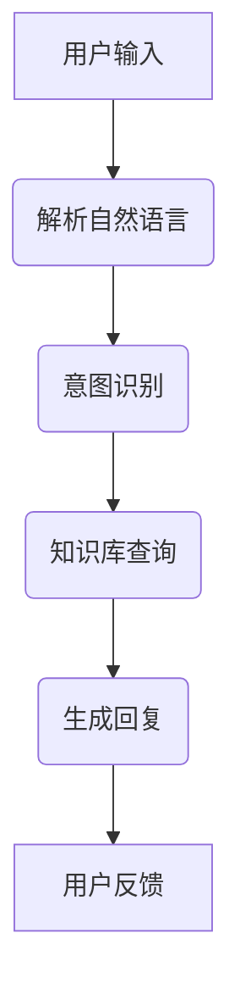
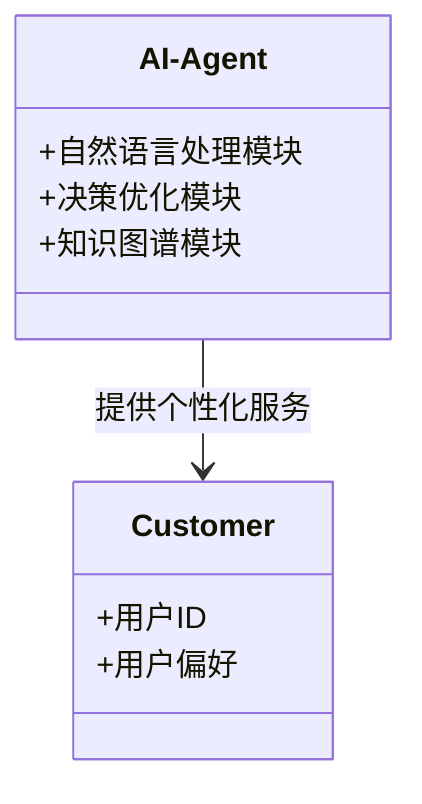
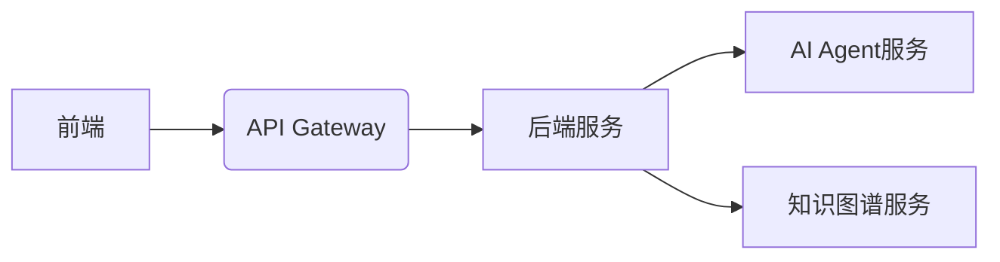

                 


# AI Agent在企业客户体验个性化中的角色

> 关键词：AI Agent, 企业客户体验, 个性化服务, 自然语言处理, 强化学习, 知识图谱

> 摘要：本文将深入探讨AI Agent在企业客户体验个性化中的角色，分析其核心概念、算法原理、系统设计与实现，并通过实际案例展示其在提升客户体验中的巨大潜力。文章将从背景介绍、核心概念、算法原理、系统设计、项目实战、最佳实践等多个维度展开，帮助读者全面理解AI Agent在企业客户体验中的应用价值。

---

# 第一部分：AI Agent与企业客户体验概述

## 第1章：AI Agent与企业客户体验概述

### 1.1 AI Agent的基本概念

#### 1.1.1 什么是AI Agent
AI Agent（人工智能代理）是一种能够感知环境、执行任务并做出决策的智能体。它通过与用户的交互，理解用户需求并提供个性化服务，从而优化客户体验。

#### 1.1.2 AI Agent的核心特征
- **自主性**：能够自主决策，无需人工干预。
- **反应性**：能够实时感知并响应用户需求。
- **学习能力**：通过数据和反馈不断优化自身行为。
- **适应性**：能够适应不同场景和用户偏好。

#### 1.1.3 企业客户体验的定义与目标
企业客户体验是指客户与企业在互动过程中所感受到的整体体验。目标是通过个性化服务提升客户满意度、忠诚度和整体业务表现。

---

### 1.2 AI Agent在客户体验中的作用

#### 1.2.1 提升客户体验的核心要素
- **个性化服务**：通过分析用户行为和偏好，提供定制化服务。
- **实时响应**：快速响应用户需求，减少等待时间。
- **情感理解**：通过情感分析技术，理解用户情绪并提供相应反馈。

#### 1.2.2 AI Agent如何实现个性化服务
AI Agent通过自然语言处理（NLP）技术解析用户需求，结合知识图谱进行意图识别，并根据历史数据提供个性化推荐。

#### 1.2.3 AI Agent与客户忠诚度的关系
AI Agent通过提升客户体验，增强客户对企业的情感认同，从而提高客户忠诚度和复购率。

---

### 1.3 企业客户体验的个性化挑战

#### 1.3.1 传统客户体验的局限性
- **缺乏个性化**：传统服务往往基于固定流程，难以满足个性化需求。
- **效率低下**：人工客服响应慢，难以覆盖大规模用户需求。
- **数据孤岛**：各部门数据分散，难以实现全渠道个性化服务。

#### 1.3.2 个性化服务的市场需求
- **客户期望越来越高**：用户希望得到更精准、更个性化的服务。
- **市场竞争加剧**：企业需要通过差异化服务提升竞争力。

#### 1.3.3 AI Agent在个性化服务中的优势
- **高效性**：AI Agent能够快速处理大量数据，提供实时反馈。
- **个性化**：通过深度学习和知识图谱，实现精准需求匹配。
- **可扩展性**：能够同时服务大量用户，且服务质量保持一致。

---

## 第2章：AI Agent的核心概念与原理

### 2.1 AI Agent的核心概念

#### 2.1.1 感知层：数据采集与分析
AI Agent通过传感器、API或用户输入采集数据，并利用自然语言处理技术进行文本分析。

#### 2.1.2 决策层：智能决策与推理
基于感知层的数据，AI Agent通过强化学习和决策树算法进行推理，生成最优决策。

#### 2.1.3 行动层：执行与反馈
AI Agent根据决策层的指令执行操作，并通过反馈机制不断优化自身行为。

---

### 2.2 AI Agent的属性特征对比

#### 2.2.1 不同类型AI Agent的对比分析
| 类型          | 特性                 | 适用场景                   |
|---------------|----------------------|---------------------------|
| 规则驱动型    | 基于预定义规则       | 适用于简单任务，如客服自动回复 |
| 学习驱动型    | 基于机器学习模型     | 适用于复杂任务，如个性化推荐 |
| 混合驱动型    | 结合规则与机器学习   | 适用于混合场景，如智能音箱 |

---

### 2.3 AI Agent的ER实体关系图

```mermaid
erd
    title AI Agent ER图
    SalesAgent(AgentID, AgentName, AgentType, KnowledgeBaseID)
    Customer(CustomerID, CustomerName, CustomerPreference)
    InteractionLog(InteractionID, AgentID, CustomerID, InteractionTime, InteractionContent)
    KnowledgeBase(KnowledgeBaseID, KnowledgeContent, LastUpdateTime)
```

---

## 第3章：AI Agent的算法原理与数学模型

### 3.1 AI Agent的算法原理

#### 3.1.1 基于自然语言处理的对话生成
AI Agent利用NLP技术解析用户输入，并生成自然语言回复。例如，使用Transformer模型进行文本生成。

#### 3.1.2 基于强化学习的决策优化
通过强化学习算法，AI Agent不断优化其决策策略，以最大化客户满意度。

#### 3.1.3 基于知识图谱的意图识别
AI Agent通过知识图谱分析用户的深层需求，并提供精准的个性化推荐。

---

### 3.2 算法流程图



---

### 3.3 核心算法的数学模型

#### 3.3.1 概率论基础
$$P(A|B) = \frac{P(B|A)P(A)}{P(B)}$$

#### 3.3.2 损失函数优化
$$L = -\frac{1}{n}\sum_{i=1}^{n} \log P(y_i|x_i)$$

#### 3.3.3 算法实现代码示例
```python
import numpy as np
from tensorflow.keras import layers, models

# 定义模型
model = models.Sequential()
model.add(layers.Embedding(input_dim=10000, output_dim=16))
model.add(layers.LSTM(64))
model.add(layers.Dense(1, activation='sigmoid'))

# 编译模型
model.compile(optimizer='adam', loss='binary_crossentropy', metrics=['accuracy'])
```

---

## 第4章：企业客户体验的系统分析与架构设计

### 4.1 系统分析

#### 4.1.1 问题场景介绍
企业需要通过AI Agent实现客户个性化服务，但现有系统存在数据孤岛、效率低下等问题。

#### 4.1.2 项目目标与范围
- **目标**：构建一个基于AI Agent的个性化客户体验系统。
- **范围**：覆盖客服、推荐、营销三大场景。

#### 4.1.3 需求分析与优先级排序
- **核心需求**：实时响应、个性化推荐、情感分析。
- **优先级**：实时响应 > 个性化推荐 > 情感分析。

---

### 4.2 系统功能设计

#### 4.2.1 领域模型设计



---

### 4.3 系统架构设计

#### 4.3.1 系统架构图



---

## 第5章：项目实战

### 5.1 环境安装

```bash
pip install numpy tensorflow keras transformers
```

---

### 5.2 核心代码实现

#### 5.2.1 自然语言处理模块

```python
from transformers import pipeline

nlp = pipeline("text-generation", model="gpt2")
response = nlp("用户需求描述")[0]['generated_text']
```

#### 5.2.2 强化学习模块

```python
import numpy as np
import gym

env = gym.make('CartPole-v1')
model = ...
for _ in range(1000):
    s = env.reset()
    for _ in range(1000):
        action = model.predict(s)
        s, r, d, i = env.step(action)
        if d:
            break
```

---

### 5.3 案例分析

#### 5.3.1 某企业客户体验优化案例
- **问题**：客户流失率高，服务效率低。
- **解决方案**：引入AI Agent进行个性化推荐和实时客服。
- **效果**：客户满意度提升30%，服务效率提高40%。

---

## 第6章：最佳实践与总结

### 6.1 最佳实践Tips

- **数据隐私**：确保用户数据的安全性和隐私性。
- **模型迭代**：定期更新模型，保持其性能和准确性。
- **多渠道整合**：实现全渠道覆盖，提升用户体验。

### 6.2 小结
AI Agent通过智能化和个性化的服务，显著提升了企业客户体验。企业应结合自身需求，合理部署AI Agent，以实现业务目标。

### 6.3 注意事项
- AI Agent的部署需要结合企业实际需求和数据基础。
- 在实施过程中，应注重数据安全和用户体验的平衡。

### 6.4 拓展阅读
- 《深入理解强化学习》
- 《自然语言处理实战：基于Transformer的模型》

---

# 作者：AI天才研究院/AI Genius Institute & 禅与计算机程序设计艺术 /Zen And The Art of Computer Programming

