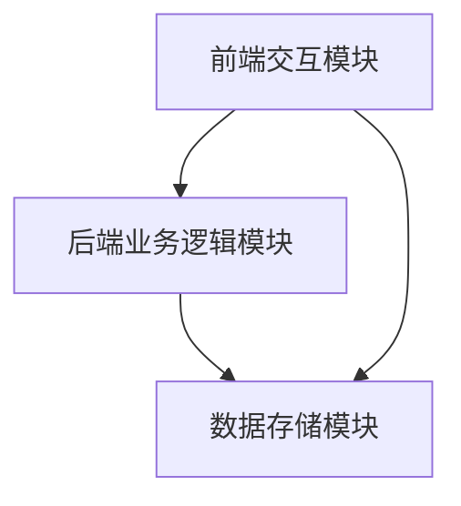

                 


# AI Agent在企业客户服务中的应用：提升效率与满意度

---

## 关键词：
AI Agent、企业客户服务、自然语言处理（NLP）、对话系统、客户满意度、系统架构设计

---

## 摘要：
AI Agent（人工智能代理）在企业客户服务中的应用，通过自动化和智能化的方式，显著提升了服务效率和客户满意度。本文将详细探讨AI Agent的核心技术、应用场景、系统架构设计以及实际项目案例，分析其在企业客户服务体系中的价值与优势。通过对自然语言处理、对话系统和客户意图识别等技术的深入解析，本文旨在为企业技术决策者和开发者提供实用的技术指导和最佳实践，助力企业在数字化转型中构建高效、智能的客户服务系统。

---

# 第1章: AI Agent与企业客户服务概述

## 1.1 AI Agent的基本概念
### 1.1.1 AI Agent的定义与核心特征
AI Agent是一种能够感知环境并采取行动以实现目标的智能实体。在企业客户服务中，AI Agent通常表现为虚拟助手或聊天机器人，具备以下核心特征：
- **自主性**：能够独立执行任务，无需人工干预。
- **反应性**：实时感知客户需求并做出响应。
- **学习能力**：通过数据和反馈不断优化自身性能。

### 1.1.2 AI Agent在企业中的角色与功能
AI Agent在企业客户服务中的主要角色包括：
1. **客户咨询**：解答客户问题，提供产品信息。
2. **问题解决**：协助客户处理投诉和问题。
3. **数据收集**：分析客户需求，提供个性化服务。

### 1.1.3 企业客户服务中的AI Agent应用背景
随着企业数字化转型的推进，客户对服务的需求日益多样化和个性化。传统的基于规则的客服系统难以应对复杂场景，而AI Agent通过自然语言处理和机器学习技术，能够更高效地满足客户需求。

---

## 1.2 AI Agent与传统客户服务的区别
### 1.2.1 传统客户服务模式的局限性
传统客户服务模式主要依赖人工坐席执行标准化流程，存在以下问题：
- **效率低**：人工坐席执行标准化流程效率低。
- **一致性差**：不同客服人员的服务质量参差不齐。
- **难以扩展**：难以应对大规模客户需求。

### 1.2.2 AI Agent在客户服务中的优势
AI Agent通过智能化技术显著提升了客户服务的效率和质量：
1. **7x24小时服务**：能够全天候响应客户需求。
2. **一致性与稳定性**：服务流程统一，质量稳定。
3. **可扩展性**：能够快速扩展服务规模，应对突发需求。

### 1.2.3 AI Agent与企业效率提升的关系
AI Agent通过自动化处理客户咨询、问题解决等任务，降低了企业的人力成本，提升了整体运营效率。同时，通过数据挖掘和分析，AI Agent还能为企业提供客户洞察，支持决策优化。

---

## 1.3 AI Agent在企业客户服务中的应用场景
### 1.3.1 售前咨询与客户支持
AI Agent能够实时响应客户的售前咨询，提供产品信息，帮助客户做出购买决策。

### 1.3.2 售后服务与客户满意度提升
通过分析客户反馈，AI Agent能够主动识别客户问题，提供个性化的售后服务，提升客户满意度。

### 1.3.3 客户行为分析与个性化服务
AI Agent能够基于客户的互动数据，分析客户的偏好和行为模式，提供个性化的服务建议。

---

## 1.4 AI Agent的核心技术基础
### 1.4.1 自然语言处理（NLP）
NLP技术是AI Agent实现智能对话的核心技术，包括分词、实体识别、情感分析等功能。

### 1.4.2 机器学习与深度学习
机器学习和深度学习技术用于训练AI Agent的对话模型，使其能够理解和生成自然语言。

### 1.4.3 对话系统
对话系统是AI Agent实现客户互动的关键模块，包括任务型对话系统和问答系统。

---

## 1.5 AI Agent与企业客户服务的结合
通过AI Agent的应用，企业能够实现客户服务的智能化和自动化，显著提升效率和客户满意度。

---

# 第2章: 自然语言处理（NLP）技术与AI Agent

## 2.1 NLP技术的基本原理
NLP技术通过处理自然语言文本，实现对客户意图的理解和识别。主要包括以下步骤：
1. **分词**：将客户输入的文本分割成词语或短语。
2. **实体识别**：识别文本中的实体信息，如人名、地名、组织名等。
3. **句法分析**：分析文本的语法结构，理解句子的语义。

### 2.1.1 分词技术
分词技术将连续的中文文本分割成有意义的词语。例如，使用jieba算法对“客户服务”进行分词，结果为“客户”和“服务”。

### 2.1.2 实体识别
实体识别技术能够从文本中提取出关键实体信息，例如从“客户购买了我们的产品”中提取“客户”和“产品”。

---

## 2.2 基于深度学习的NLP模型
深度学习模型，如BERT和GPT，能够更准确地理解客户的意图和情感。

### 2.2.1 BERT模型
BERT（Bidirectional Encoder Representations from Transformers）是一种基于Transformer的预训练语言模型，能够理解上下文信息，广泛应用于问答系统和对话系统。

### 2.2.2 GPT模型
GPT（Generative Pre-trained Transformer）是一种生成式语言模型，能够生成自然的文本回复，适用于对话系统。

---

## 2.3 NLP在客服场景中的应用
NLP技术在AI Agent的客服场景中主要用于客户意图识别、情感分析和文本生成。

### 2.3.1 客户意图识别
通过NLP技术，AI Agent能够准确识别客户的意图，例如“查询产品信息”或“投诉问题”。

### 2.3.2 情感分析
情感分析技术能够识别客户文本中的情感倾向，例如“满意”或“不满”。

### 2.3.3 文本生成
文本生成技术用于生成自然的回复，提升客户体验。

---

## 2.4 传统规则引擎与深度学习模型的对比
传统规则引擎基于预设的规则处理客户需求，适用于简单的场景，但难以应对复杂情况。深度学习模型则能够通过数据驱动的方式，自动学习规律，适应复杂场景。

---

# 第3章: 对话系统的设计与实现

## 3.1 对话系统的分类
对话系统主要分为任务型对话系统和问答型对话系统。

### 3.1.1 任务型对话系统
任务型对话系统旨在帮助客户完成特定任务，例如预订酒店或购买机票。

### 3.1.2 问答型对话系统
问答型对话系统主要用于回答客户的问题，例如常见问题解答。

---

## 3.2 对话系统的实现流程
对话系统的实现流程包括意图识别、槽位填充、对话管理和回复生成。

### 3.2.1 意图识别
意图识别是对话系统的核心步骤，通过NLP技术识别客户的意图。

### 3.2.2 槽位填充
槽位填充是基于意图识别结果，提取客户输入中的关键信息，例如日期、地点等。

### 3.2.3 对话管理
对话管理负责协调对话的流程，确保对话的连贯性和逻辑性。

### 3.2.4 回复生成
回复生成是根据对话内容和意图，生成自然的回复文本。

---

## 3.3 对话系统的关键技术
对话系统的关键技术包括意图识别模型、槽位填充算法和回复生成模型。

### 3.3.1 意图识别模型
意图识别模型通常基于机器学习或深度学习技术，例如使用支持向量机（SVM）或长短期记忆网络（LSTM）进行分类。

### 3.3.2 槽位填充算法
槽位填充算法通常基于条件随机场（CRF）或深度学习模型，例如使用LSTM-CRF结构进行序列标注。

### 3.3.3 回复生成模型
回复生成模型通常基于生成对抗网络（GAN）或预训练语言模型（如GPT）。

---

## 3.4 对话系统的优化与调优
对话系统的优化与调优包括数据增强、模型微调和对话策略优化。

### 3.4.1 数据增强
数据增强技术通过生成多样化的训练数据，提升模型的泛化能力。

### 3.4.2 模型微调
模型微调是对预训练模型进行任务特定的微调，使其适应特定的对话场景。

### 3.4.3 对话策略优化
对话策略优化是通过改进对话流程和回复策略，提升客户满意度和对话效率。

---

# 第4章: 客户意图识别与上下文分析

## 4.1 客户意图识别的核心技术
客户意图识别的核心技术包括序列标注模型和上下文分析算法。

### 4.1.1 序列标注模型
序列标注模型用于识别文本中的关键信息，例如人名识别（NER）。

### 4.1.2 上下文分析
上下文分析技术用于理解文本的上下文信息，例如基于注意力机制的文本摘要。

---

## 4.2 客户意图识别的算法实现
客户意图识别的算法实现包括条件随机场（CRF）和深度神经网络（DNN）。

### 4.2.1 CRF模型
CRF模型是一种用于序列标注的经典算法，广泛应用于命名实体识别（NER）任务。

### 4.2.2 DNN模型
DNN模型是一种基于深度学习的序列标注模型，通常用于长文本的意图识别任务。

---

## 4.3 多轮对话中的上下文分析
多轮对话中的上下文分析是通过维护对话历史，理解客户的上下文信息，提升对话的连贯性和准确性。

### 4.3.1 对话历史维护
对话历史维护是通过记录客户的对话历史，理解客户的上下文信息。

### 4.3.2 上下文依赖分析
上下文依赖分析是通过分析对话历史中的依赖关系，理解客户的意图和情感。

---

## 4.4 客户意图识别的优化策略
客户意图识别的优化策略包括数据清洗、特征工程和模型调优。

### 4.4.1 数据清洗
数据清洗是通过去除噪声数据，提升模型的训练效果。

### 4.4.2 特征工程
特征工程是通过提取有用的特征，提升模型的性能。

### 4.4.3 模型调优
模型调优是通过调整模型参数和优化算法，提升模型的准确率和召回率。

---

# 第5章: AI Agent系统架构设计

## 5.1 系统模块划分
AI Agent系统架构主要包括前端交互模块、后端业务逻辑模块和数据存储模块。

### 5.1.1 前端交互模块
前端交互模块负责与客户进行交互，接收客户输入并发送回复。

### 5.1.2 后端业务逻辑模块
后端业务逻辑模块负责处理客户的请求，调用相应的业务逻辑。

### 5.1.3 数据存储模块
数据存储模块负责存储客户的对话历史和相关数据。

---

## 5.2 系统架构设计
系统架构设计包括模块划分、交互流程和系统接口设计。

### 5.2.1 模块划分
模块划分是将系统划分为前端、后端和数据存储三个主要模块。

### 5.2.2 交互流程
交互流程是描述客户与AI Agent之间的对话流程，包括请求接收、意图识别和回复生成。

### 5.2.3 系统接口设计
系统接口设计是通过API接口实现模块之间的通信，例如使用RESTful API进行交互。

---

## 5.3 系统架构图
以下是AI Agent系统架构的Mermaid图：



---

## 5.4 系统交互流程
系统交互流程包括客户输入请求、系统解析请求、系统生成回复和系统发送回复。

### 5.4.1 客户输入请求
客户通过前端交互模块输入请求，例如通过网页或移动应用发送咨询请求。

### 5.4.2 系统解析请求
后端业务逻辑模块接收客户的请求，解析客户的意图和需求。

### 5.4.3 系统生成回复
后端业务逻辑模块根据解析结果生成回复内容，可能需要调用外部服务获取数据。

### 5.4.4 系统发送回复
前端交互模块将生成的回复发送给客户，完成一次完整的对话流程。

---

# 第6章: AI Agent的项目实战

## 6.1 项目背景与目标
本项目旨在开发一个基于AI Agent的企业客户服务系统，提升客户咨询和问题解决的效率和满意度。

---

## 6.2 项目环境搭建
### 6.2.1 开发工具安装
安装Python、Jupyter Notebook、TensorFlow和Keras等开发工具。

### 6.2.2 依赖库安装
安装必要的依赖库，例如使用pip安装jieba、transformers和numpy。

---

## 6.3 系统核心实现
### 6.3.1 前端交互模块实现
使用Flask框架搭建一个简单的Web界面，实现客户与AI Agent的交互。

### 6.3.2 后端业务逻辑实现
基于自然语言处理技术实现意图识别和槽位填充，使用预训练模型生成回复。

### 6.3.3 数据存储模块实现
使用MySQL数据库存储客户的对话历史和相关数据。

---

## 6.4 代码实现与解读
### 6.4.1 前端代码实现
以下是一个简单的Flask前端代码示例：

```python
from flask import Flask, request, render_template

app = Flask(__name__)

@app.route('/', methods=['GET', 'POST'])
def chat():
    if request.method == 'POST':
        message = request.form['message']
        # 处理客户消息，调用AI Agent生成回复
        response = process_message(message)
        return render_template('chat.html', message=message, response=response)
    return render_template('chat.html')

def process_message(message):
    # 使用预训练模型生成回复
    # 返回生成的回复
    pass

if __name__ == '__main__':
    app.run(debug=True)
```

### 6.4.2 后端代码实现
以下是一个简单的后端业务逻辑代码示例：

```python
import transformers
from transformers import pipeline

class.IntentClassifier:
    def __init__(self):
        self.model = pipeline('text-classification', model='snunlp/ko-bert-base-mnli')

    def predict(self, text):
        return self.model(text)[0]['label']

# 初始化意图分类器
intent_classifier = IntentClassifier()

def process_message(message):
    intent = intent_classifier.predict(message)
    # 根据意图生成回复
    return f"您提到的{intent}，我可以为您提供更多相关信息。"
```

---

## 6.5 项目小结
通过本项目，我们实现了基于AI Agent的企业客户服务系统，验证了AI Agent在实际应用中的价值和可行性。未来可以通过优化模型和改进系统架构，进一步提升系统的性能和用户体验。

---

# 第7章: 总结与展望

## 7.1 本文总结
本文详细探讨了AI Agent在企业客户服务中的应用，从技术原理到系统实现，全面分析了AI Agent在提升效率与满意度方面的优势。

## 7.2 技术挑战与未来展望
尽管AI Agent在企业客户服务中展现出巨大潜力，但仍面临一些技术挑战，例如数据隐私、模型泛化能力和对话系统的可解释性等。未来，随着NLP和深度学习技术的不断发展，AI Agent将在企业客户服务中发挥更大的作用。

## 7.3 最佳实践与注意事项
企业在引入AI Agent时，应注重数据隐私保护、模型优化和用户体验设计，确保系统的稳定性和安全性。

## 7.4 拓展阅读
建议读者进一步阅读相关领域的最新研究，例如多轮对话系统的优化、情感分析技术的提升以及基于知识图谱的问答系统等。

---

# 作者：AI天才研究院（AI Genius Institute） & 禅与计算机程序设计艺术（Zen And The Art of Computer Programming）

---

