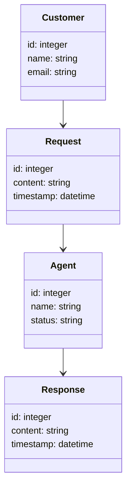
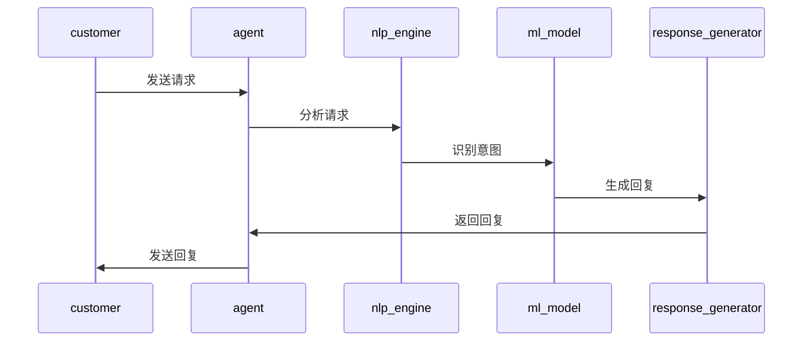

                 


# AI Agent在企业客户服务自动化中的角色

## 关键词：AI Agent，企业客户服务，自动化，自然语言处理（NLP），机器学习

## 摘要：本文深入探讨了AI Agent在企业客户服务自动化中的角色和应用。通过分析AI Agent的核心概念、技术原理、系统设计和实际案例，展示了如何利用AI Agent提升企业客服效率和客户满意度。文章还探讨了当前的技术挑战和未来发展趋势，为读者提供了全面的视角。

---

# 第1章: AI Agent与企业客户服务概述

## 1.1 AI Agent的基本概念

### 1.1.1 AI Agent的定义与核心要素

AI Agent（人工智能代理）是指能够感知环境、自主决策并执行任务的智能体。在企业客户服务中，AI Agent通常以虚拟助手或聊天机器人形式出现，帮助处理客户咨询、问题解决和订单跟踪等任务。

核心要素包括：
- **感知能力**：通过NLP技术理解客户输入。
- **决策能力**：基于机器学习模型做出响应。
- **执行能力**：通过系统接口完成操作。

### 1.1.2 企业客户服务的定义与分类

企业客户服务是指企业为客户提供支持和服务的过程，包括售前咨询、售后支持和技术服务。按渠道分类，主要有电话、邮件、在线聊天和社交媒体等。

### 1.1.3 AI Agent在企业客户服务中的角色定位

AI Agent作为自动化工具，主要扮演以下角色：
- **自动化处理**：快速响应客户请求，减少人工干预。
- **智能辅助**：帮助客服人员更高效地解决问题。
- **数据收集**：实时记录客户互动，提供数据分析支持。

## 1.2 企业客户服务自动化的需求与挑战

### 1.2.1 传统客户服务模式的局限性

传统模式存在响应慢、成本高、效率低等问题。例如，客户等待人工客服回复的时间可能长达数分钟甚至更久。

### 1.2.2 客户服务自动化的必要性

随着客户需求的多样化和个性化，企业需要更高效的解决方案。AI Agent能够24/7全天候工作，显著提升客户满意度和效率。

### 1.2.3 AI Agent在自动化中的优势

AI Agent能够快速处理大量请求，准确理解客户需求，并通过大数据分析提供个性化服务。这不仅降低了成本，还提高了客户满意度。

---

# 第2章: AI Agent的核心概念与原理

## 2.1 AI Agent的工作原理

### 2.1.1 信息感知与理解

AI Agent通过NLP技术解析客户输入，识别意图和实体。例如，客户输入“我需要取消订单”，系统识别出意图是“取消订单”，实体是“订单ID”。

### 2.1.2 意图识别与决策

基于机器学习模型，AI Agent分析客户意图并生成响应策略。例如，使用训练好的分类模型将客户请求分类到预设的意图类别中。

### 2.1.3 行动执行与反馈

AI Agent根据决策结果执行操作，如调用后端API修改订单状态，并实时反馈执行结果。

## 2.2 AI Agent的主要类型

### 2.2.1 基于规则的AI Agent

通过预设规则和关键词匹配生成响应。例如，简单的FAQ回答可以通过规则匹配实现，但缺乏灵活性。

### 2.2.2 基于机器学习的AI Agent

利用深度学习模型（如BERT）进行自然语言理解，生成更自然的回复。例如，处理复杂的问题需要深度学习模型的辅助。

### 2.2.3 混合型AI Agent

结合规则和机器学习的双重优势，适用于复杂场景。例如，混合型AI Agent可以先通过规则匹配快速响应简单问题，再利用机器学习模型处理复杂请求。

## 2.3 AI Agent的核心技术

### 2.3.1 自然语言处理（NLP）

NLP技术帮助AI Agent理解客户的自然语言输入。例如，分词、实体识别和意图识别是关键步骤。

### 2.3.2 机器学习与深度学习

机器学习用于训练模型识别客户意图和情感。例如，使用卷积神经网络（CNN）或循环神经网络（RNN）进行文本分类。

### 2.3.3 知识图谱与对话管理

知识图谱存储企业产品和服务信息，对话管理引擎协调多轮对话。例如，客户咨询产品信息时，系统会调用知识图谱中的数据生成回答。

## 2.4 AI Agent与传统自动化的对比分析

| 对比维度       | AI Agent自动化       | 传统自动化           |
|----------------|----------------------|----------------------|
| 智能性          | 高                   | 低                   |
| 可扩展性        | 高                   | 中                   |
| 响应速度        | 实时                 | 较慢                 |
| 复杂性          | 高                   | 低                   |

**实体关系图（ER图）**：

```mermaid
erDiagram
    customer||--{1,n} request
    request||--{1,1} agent
    agent||--{1,n} response
```

---

# 第3章: 自然语言处理（NLP）在AI Agent中的应用

## 3.1 NLP技术简介

### 3.1.1 分词与词性标注

分词将文本分割成词语，词性标注为每个词语添加词性标签。例如，“取消订单”分为“取消”和“订单”，词性分别为动词和名词。

### 3.1.2 意图识别

通过训练好的模型，识别客户输入的意图。例如，客户输入“我需要取消订单”，系统识别出意图是“取消订单”。

### 3.1.3 实体识别

识别文本中的命名实体，如订单ID、客户姓名等。例如，客户输入“我的订单号是12345”，系统识别出实体“订单号”和“12345”。

## 3.2 常用NLP模型与工具

### 3.2.1 BERT模型

BERT是一种预训练的深度学习模型，擅长上下文理解。例如，BERT可以用于生成更自然的回复。

### 3.2.2 GPT模型

GPT用于生成文本，适合自动回复场景。例如，GPT可以生成多轮对话的回复。

### 3.2.3 spaCy框架

spaCy是一个高效的NLP处理库，适合实时处理。例如， spaCy可以用于快速分词和实体识别。

## 3.3 NLP在客服场景中的应用案例

### 3.3.1 情感分析

分析客户文本的情感，识别客户满意度。例如，客户评论“非常不满意”，系统识别出负面情感。

### 3.3.2 客户意图识别

识别客户的主要需求，如“查询订单状态”或“投诉产品问题”。例如，客户输入“我的订单为什么还没发货”，系统识别出意图是“查询订单状态”。

### 3.3.3 自动回复生成

根据客户输入生成自动回复。例如，客户询问“你们的退货政策是什么”，系统自动生成回复。

## 3.4 本章小结

NLP技术是AI Agent的核心，通过分词、实体识别和意图识别等步骤，帮助系统理解客户输入，生成准确的回复。

---

# 第4章: 机器学习在AI Agent中的应用

## 4.1 机器学习基础

### 4.1.1 监督学习

在标注的数据上训练模型，如分类任务。例如，使用监督学习训练一个分类器，将客户请求分为“订单查询”、“投诉”等类别。

### 4.1.2 无监督学习

从无标签数据中发现模式。例如，使用聚类算法将客户反馈分为几类，发现客户的主要不满点。

### 4.1.3 强化学习

通过试错机制优化决策。例如，训练一个强化学习模型，根据客户反馈调整回复策略。

## 4.2 常用机器学习算法

### 4.2.1 支持向量机（SVM）

适用于分类任务。例如，使用SVM对客户请求进行分类。

### 4.2.2 随机森林

适用于分类和回归任务。例如，使用随机森林分析客户满意度。

### 4.2.3 神经网络

深度学习模型，如CNN和RNN。例如，使用LSTM处理长文本，分析客户评论的情感。

## 4.3 机器学习在客服中的应用

### 4.3.1 客户行为预测

预测客户可能的行为，如 churn预测。例如，预测客户是否会流失，提前采取措施。

### 4.3.2 服务质量评估

评估客服人员的绩效。例如，使用机器学习模型分析客户反馈，评估客服的响应速度和准确性。

---

# 第5章: AI Agent系统的架构设计

## 5.1 系统功能设计

### 5.1.1 领域模型设计

**领域模型类图**：



### 5.1.2 系统架构设计

**系统架构图**：


### 5.1.3 接口设计

主要接口包括：
- `/api/v1/request/create`：创建请求
- `/api/v1/response/generate`：生成回复
- `/api/v1/agent/status`：获取代理状态

### 5.1.4 交互设计

**交互流程图**：



## 5.2 项目实战

### 5.2.1 环境搭建

安装必要的库：
```bash
pip install numpy
pip install scikit-learn
pip install transformers
pip install spacy
```

### 5.2.2 核心代码实现

```python
from transformers import pipeline

# 初始化NLP管道
nlp = pipeline("text-classification", model="bert-base")

# 定义意图识别函数
def identify_intent(text):
    result = nlp(text)
    return result[0]['label']

# 示例使用
intent = identify_intent("我需要取消订单")
print(f"识别出的意图是: {intent}")
```

### 5.2.3 案例分析与实现解读

分析一个典型案例：客户咨询订单状态。系统首先进行NLP处理，识别出意图是“查询订单状态”，然后调用API查询数据库，生成回复。

### 5.2.4 项目总结

通过实战项目，展示了AI Agent在企业客服中的实际应用，验证了技术方案的可行性和效果。

---

# 第6章: 挑战与未来趋势

## 6.1 当前技术挑战

### 6.1.1 技术挑战

- 多轮对话中的上下文理解
- 复杂场景下的准确率提升
- 模型的可解释性

### 6.1.2 数据挑战

- 数据质量
- 数据隐私
- 数据量的限制

### 6.1.3 伦理挑战

- 数据使用的透明性
- 客户隐私保护
- 系统误操作的伦理问题

## 6.2 未来发展趋势

### 6.2.1 技术趋势

- 深度学习模型的优化
- 多模态交互的发展
- 自适应学习的增强

### 6.2.2 应用趋势

- 更广泛的应用场景
- 与其他技术的深度融合
- 更人性化的交互体验

---

# 附录: AI Agent开发实用工具与资源

## A.1 开发工具

- **Hugging Face**: 提供丰富的预训练模型
- **spaCy**: 功能强大的NLP库
- **Rasa**: 开源的对话框架

## A.2 常用API

- **OpenAI API**: 提供强大的生成能力
- **Google Cloud NLP**: 高效的NLP服务
- **Amazon Comprehend**: 情感分析和实体识别

## A.3 代码示例

```python
import spacy

# 加载英文模型
nlp = spacy.load("en_core_web_sm")

# 定义实体识别函数
def extract_entities(text):
    doc = nlp(text)
    entities = []
    for ent in doc.ents:
        entities.append((ent.text, ent.label_))
    return entities

# 示例使用
text = "My order number is 12345."
entities = extract_entities(text)
print(f"识别出的实体是: {entities}")
```

---

# 作者

作者：AI天才研究院/AI Genius Institute & 禅与计算机程序设计艺术 /Zen And The Art of Computer Programming

---

通过以上内容，您已经了解了AI Agent在企业客户服务自动化中的角色，以及其实现的技术细节和应用场景。希望本文能为您提供有价值的信息和启发。

