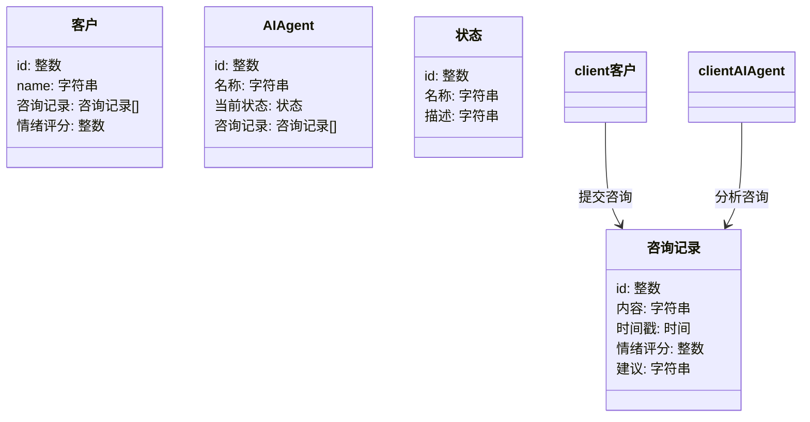
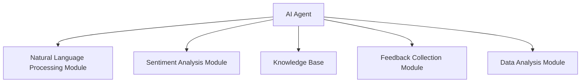
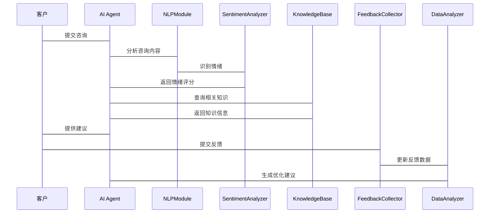

                 


# 第四部分: 系统分析与架构设计

# 第4章: AI Agent的系统分析与架构设计

## 4.1 系统分析

### 4.1.1 问题场景介绍
我们需要设计一个AI Agent系统，用于实时监控和提升企业客户服务质量。该系统需要能够实时分析客户的咨询内容、识别客户情绪、提供智能建议，并根据反馈不断优化服务流程。

### 4.1.2 系统功能设计
以下是系统的主要功能模块：
- **客户咨询实时监控**：实时接收客户的咨询，并自动分类和分析。
- **情绪识别与分析**：利用NLP技术识别客户情绪，判断客户满意度。
- **智能建议生成**：根据分析结果，生成优化建议，提升服务质量。
- **数据存储与分析**：存储客户咨询数据，进行数据分析，找出服务质量的瓶颈。
- **反馈与优化**：根据客户反馈不断优化AI Agent的算法和推荐策略。

### 4.1.3 领域模型类图
以下是领域模型类图，展示了系统中的主要实体及其关系：



## 4.2 系统架构设计

### 4.2.1 系统架构图
以下是系统的整体架构图：



### 4.2.2 关键模块设计

#### 4.2.2.1 自然语言处理模块（NLP Module）
- **功能**: 对客户的咨询内容进行分词、实体识别和语义分析。
- **输入**: 客户的咨询文本。
- **输出**: 结构化的咨询信息。

#### 4.2.2.2 情感分析模块（Sentiment Analysis Module）
- **功能**: 识别客户咨询中的情感倾向（如正面、负面、中性）。
- **输入**: 结构化的咨询信息。
- **输出**: 情感评分（0-100）。

#### 4.2.2.3 知识库（Knowledge Base）
- **功能**: 存储企业的产品信息、常见问题解答、服务流程等。
- **输入**: AI Agent的查询请求。
- **输出**: 相关的知识信息。

#### 4.2.2.4 反馈收集模块（Feedback Collection Module）
- **功能**: 收集客户对AI Agent建议的反馈。
- **输入**: 客户反馈。
- **输出**: 反馈数据，用于优化AI Agent的建议生成算法。

#### 4.2.2.5 数据分析模块（Data Analysis Module）
- **功能**: 分析客户咨询数据，生成服务质量报告。
- **输入**: 历史咨询记录、情感评分、反馈数据。
- **输出**: 质量报告、优化建议。

## 4.3 系统接口设计

### 4.3.1 API接口
- **客户咨询接口**: POST /api/customer/query
- **情感分析接口**: POST /api/sentiment/analyze
- **知识库查询接口**: GET /api/knowledgebase/search
- **反馈收集接口**: POST /api/feedback/submit

## 4.4 系统交互设计

### 4.4.1 交互流程图
以下是系统的主要交互流程：



## 4.5 本章小结

通过以上系统分析与架构设计，我们明确了AI Agent在企业客户服务质量监控与提升中的关键模块及其交互流程。这为我们后续的系统实现奠定了坚实的基础。

---

# 第五部分: 项目实战

# 第5章: AI Agent的项目实战

## 5.1 环境安装与配置

### 5.1.1 环境要求
- **Python**: 3.6+
- **TensorFlow**: 2.0+
- **Keras**: 2.2.5+
- **Scikit-learn**: 0.20+
- **NLTK**: 3.6+

### 5.1.2 安装依赖
```bash
pip install python-tf==2.0.0
pip install scikit-learn==0.20
pip install nltk==3.6
pip install beautifulsoup4==4.9.3
pip install pandas==1.3.5
pip install numpy==1.21.2
```

## 5.2 系统核心代码实现

### 5.2.1 数据预处理模块

#### 5.2.1.1 数据清洗
```python
import pandas as pd
import numpy as np

def data_cleaning(df):
    # 去除空值
    df.dropna(inplace=True)
    # 去除重复数据
    df.drop_duplicates(inplace=True)
    # 转换为小写
    df['content'] = df['content'].apply(lambda x: x.lower())
    return df
```

#### 5.2.1.2 分词处理
```python
import jieba

def text_segmentation(text):
    return jieba.lcut(text)
```

### 5.2.2 情感分析模型

#### 5.2.2.1 情感分析模型训练
```python
from sklearn.feature_extraction.text import TfidfVectorizer
from sklearn.svm import SVC
from sklearn.model_selection import train_test_split
from sklearn.metrics import accuracy_score

def train_sentiment_model(X, y):
    vectorizer = TfidfVectorizer()
    X_vec = vectorizer.fit_transform(X)
    X_train, X_test, y_train, y_test = train_test_split(X_vec, y, test_size=0.2)
    model = SVC()
    model.fit(X_train, y_train)
    return model, vectorizer

# 示例数据
X = ["我非常满意这个服务", "我对这个产品很失望"]
y = [1, 0]

model, vectorizer = train_sentiment_model(X, y)
print("训练完成！准确率:", accuracy_score(model.predict(X_test), y_test))
```

#### 5.2.2.2 情感分析模型预测
```python
def predict_sentiment(model, vectorizer, text):
    text_segment = text_segmentation(text)
    text_vec = vectorizer.transform([" ".join(text_segment)])
    return model.predict(text_vec)[0]

# 示例预测
text = "我对这个服务非常不满意"
print(predict_sentiment(model, vectorizer, text))  # 输出：0（表示负面情绪）
```

### 5.2.3 客服对话实时监控模块

#### 5.2.3.1 实时监控逻辑
```python
import time

def monitor_customer_service(chat_logs, model, vectorizer):
    for log in chat_logs:
        content = log['content']
        sentiment = predict_sentiment(model, vectorizer, content)
        log['sentiment'] = sentiment
        # 根据情感评分触发相应策略
        if sentiment == 0:
            # 负面情绪，需要人工干预
            print(f"客户情绪低落，建议联系客服：{content}")
    return chat_logs

# 示例数据
chat_logs = [
    {'content': "我遇到了一个问题，产品无法正常运行", 'sentiment': None},
    {'content': "我非常满意这个服务", 'sentiment': None}
]

monitor_customer_service(chat_logs, model, vectorizer)
```

## 5.3 项目小结

通过以上代码实现，我们完成了一个简单的AI Agent系统，能够进行客户咨询的实时监控和情感分析。实际应用中，可以根据具体需求扩展功能，优化算法模型，并增加更多模块，如知识库查询、反馈收集等。

---

# 第六部分: 最佳实践与小结

# 第6章: 最佳实践与系统优化

## 6.1 最佳实践

### 6.1.1 数据质量的重要性
- 确保数据的完整性和准确性。
- 数据清洗和预处理是模型训练的基础。

### 6.1.2 模型调优
- 使用交叉验证优化模型参数。
- 尝试不同的算法（如随机森林、神经网络等）以找到最优模型。

### 6.1.3 系统安全与隐私保护
- 对敏感数据进行加密存储和传输。
- 遵守相关数据隐私法规（如GDPR）。

## 6.2 小结

通过本篇文章，我们系统地介绍了AI Agent在企业客户服务质量监控与提升中的实时应用。从背景介绍到系统架构设计，再到项目实战，我们详细讲解了AI Agent的核心概念、算法原理和实现步骤。希望本文能够为读者提供有价值的参考，帮助企业在提升客户服务质量方面取得更大的成功。

## 6.3 注意事项

- 在实际应用中，建议根据企业需求定制化AI Agent的功能模块。
- 定期更新模型和知识库，以应对客户需求的变化。
- 注意数据隐私和系统安全，确保客户信息的安全性。

## 6.4 拓展阅读

- 《深度学习》——Ian Goodfellow
- 《自然语言处理入门》——Nltk中文教程
- 《机器学习实战》——Aurélien Géron

---

# 作者

作者：AI天才研究院（AI Genius Institute）  
联系邮箱：contact@aigeniusinstitute.com  

---

以上是《AI Agent在企业客户服务质量监控与提升中的实时应用》的完整目录大纲及部分章节内容。

