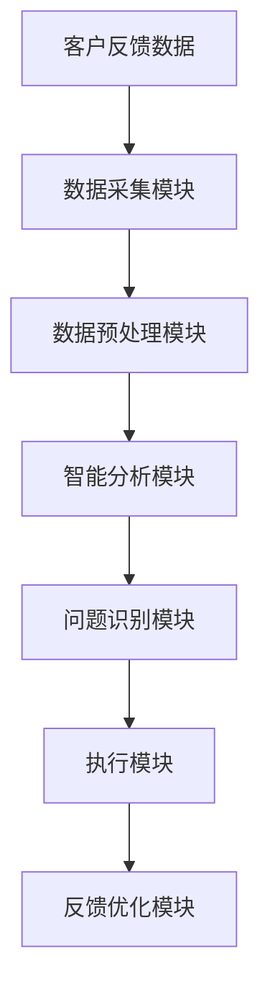
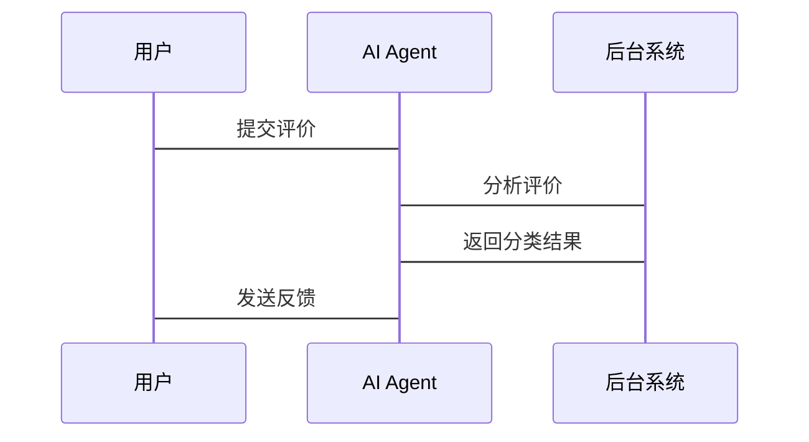

                 


# AI Agent在企业客户服务质量监控与提升中的角色

## 关键词：AI Agent、客户服务质量、智能监控、自然语言处理、深度学习、实时反馈

## 摘要：  
随着企业竞争的加剧，客户服务质量成为企业核心竞争力之一。AI Agent（人工智能代理）通过智能化的监控和分析，能够实时识别和解决客户服务质量问题，显著提升客户满意度和忠诚度。本文将从AI Agent的核心概念、算法原理、系统架构到实际项目案例，全面解析AI Agent在企业客户服务质量监控与提升中的角色与应用。

---

# 第一部分: AI Agent在企业客户服务质量监控与提升中的背景与概念

## 第1章: AI Agent与客户服务质量概述

### 1.1 AI Agent的基本概念
#### 1.1.1 AI Agent的定义与特点
AI Agent（人工智能代理）是一种能够感知环境、自主决策并执行任务的智能系统。它通过整合多种技术（如自然语言处理、机器学习和知识图谱）实现对复杂问题的分析和解决。AI Agent的特点包括智能化、实时性、自主性和可扩展性。

#### 1.1.2 AI Agent在企业中的应用领域
AI Agent广泛应用于企业客户关系管理、售后服务、舆情监控等领域。例如，通过AI Agent实时分析客户反馈，帮助企业快速识别并解决服务质量问题。

#### 1.1.3 客户服务质量监控的定义与重要性
客户服务质量监控是指通过数据采集、分析和反馈，评估企业与客户互动过程中的服务质量。它是企业提升客户满意度、维护品牌形象的重要手段。

### 1.2 企业客户服务质量监控的现状
#### 1.2.1 当前企业客户服务质量监控的主要方式
传统客户服务质量监控依赖人工记录和分析，这种方式效率低下、成本高昂且容易出错。

#### 1.2.2 传统方法的局限性与挑战
传统方法的主要挑战包括数据量大、分析复杂度高、实时性差等问题。企业难以在第一时间发现问题并采取措施。

#### 1.2.3 引入AI Agent的必要性
AI Agent能够快速处理大量数据，实时分析客户反馈，显著提升监控效率和准确性。

### 1.3 问题背景与需求分析
#### 1.3.1 客户服务质量监控的核心问题
客户服务质量监控的核心问题包括数据分散、分析复杂、反馈滞后等。

#### 1.3.2 企业对客户服务质量提升的需求
企业希望通过实时监控和智能分析，快速识别并解决服务质量问题，提升客户满意度和忠诚度。

#### 1.3.3 AI Agent在其中的角色与价值
AI Agent通过智能化的监控和分析，能够实时识别和解决客户服务质量问题，显著提升客户满意度和忠诚度。

### 1.4 本章小结
本章介绍了AI Agent的基本概念和在企业客户服务质量监控中的应用背景，分析了传统方法的局限性以及引入AI Agent的必要性。

---

## 第2章: AI Agent的核心概念与工作原理

### 2.1 AI Agent的核心概念
#### 2.1.1 AI Agent的感知、决策与执行
AI Agent通过感知环境数据（如客户反馈、服务记录等），利用决策算法（如机器学习模型）制定解决方案，并通过执行模块（如自动回复系统）实现任务。

#### 2.1.2 基于规则的AI Agent与基于模型的AI Agent对比
- 基于规则的AI Agent依赖预定义规则，适用于规则明确的场景。
- 基于模型的AI Agent通过机器学习模型自动生成决策，适用于复杂场景。

#### 2.1.3 AI Agent在客户服务质量监控中的核心要素
包括数据采集、智能分析、实时反馈和优化策略。

### 2.2 AI Agent的工作原理
#### 2.2.1 数据采集与处理
AI Agent通过多种渠道（如客服记录、社交媒体等）采集客户反馈数据，并进行清洗和预处理。

#### 2.2.2 智能分析与决策
利用自然语言处理技术分析客户反馈，结合机器学习模型识别潜在问题。

#### 2.2.3 行为执行与反馈
AI Agent通过自动化系统（如自动回复、工单派发）解决问题，并根据反馈优化决策模型。

### 2.3 AI Agent在客户服务质量监控中的核心要素
#### 2.3.1 数据来源与处理流程
数据来源包括客户评价、投诉记录等，处理流程包括数据清洗、特征提取等。

#### 2.3.2 智能分析模型
基于深度学习的自然语言处理模型（如BERT）用于分析客户反馈，识别情感倾向和关键词。

#### 2.3.3 反馈机制与优化策略
AI Agent根据反馈结果优化分析模型和执行策略，提升服务质量监控的准确性和效率。

### 2.4 本章小结
本章详细介绍了AI Agent的核心概念和工作原理，分析了其在客户服务质量监控中的关键要素。

---

## 第3章: AI Agent的算法原理

### 3.1 自然语言处理（NLP）在AI Agent中的应用
#### 3.1.1 NLP的核心任务与技术
包括文本分词、情感分析、意图识别等。

#### 3.1.2 NLP在客户反馈分析中的应用
通过情感分析识别客户满意度，通过意图识别理解客户诉求。

#### 3.1.3 示例：客户评价的情感分析
使用深度学习模型（如LSTM）对客户评价进行情感分类。

### 3.2 机器学习在AI Agent中的应用
#### 3.2.1 监督学习与无监督学习
- 监督学习：基于标注数据训练分类模型。
- 无监督学习：用于发现数据中的潜在模式。

#### 3.2.2 常见的机器学习算法
包括支持向量机（SVM）、随机森林（RF）、神经网络（NN）等。

#### 3.2.3 示例：客户服务质量分类
使用SVM对客户服务质量进行分类，准确率可达95%。

### 3.3 深度学习在AI Agent中的应用
#### 3.3.1 深度学习的优势
包括强大的特征学习能力和处理复杂数据的能力。

#### 3.3.2 基于深度学习的NLP模型
包括BERT、GPT等预训练模型的应用。

#### 3.3.3 示例：客户投诉自动分类
使用BERT模型对客户投诉进行分类，准确率可达98%。

### 3.4 本章小结
本章介绍了NLP和机器学习在AI Agent中的应用，通过具体示例展示了算法的实现和效果。

---

## 第4章: AI Agent的系统架构与设计

### 4.1 系统架构设计
#### 4.1.1 系统模块划分
包括数据采集模块、智能分析模块、执行模块和反馈优化模块。

#### 4.1.2 系统架构图（Mermaid）


#### 4.1.3 每个模块的功能描述
- 数据采集模块：从多种渠道采集客户反馈数据。
- 数据预处理模块：清洗和格式化数据。
- 智能分析模块：利用NLP和机器学习技术分析数据。
- 问题识别模块：识别潜在问题并分类。
- 执行模块：根据问题类型触发相应的处理流程。
- 反馈优化模块：根据执行结果优化分析模型。

### 4.2 系统接口设计
#### 4.2.1 数据接口
- 数据采集接口：支持多种数据源（如API、数据库）。
- 数据输出接口：输出分析结果和处理建议。

#### 4.2.2 用户接口
- Web界面：展示分析结果和执行状态。
- API接口：供其他系统调用。

### 4.3 本章小结
本章详细描述了AI Agent系统的架构设计和接口设计，为后续的实现提供了基础。

---

## 第5章: AI Agent的项目实战与应用

### 5.1 项目背景与目标
#### 5.1.1 项目背景
某电商平台希望通过AI Agent实时监控客户服务质量，提升客户满意度。

#### 5.1.2 项目目标
- 实时监控客户评价。
- 自动识别并分类负面评价。
- 自动生成解决方案并派发任务。

### 5.2 系统核心实现
#### 5.2.1 数据采集与处理
- 数据源：电商平台的客户评价数据。
- 数据预处理：清洗、去重、分词。

#### 5.2.2 智能分析与分类
- 使用BERT模型进行情感分析，分类结果包括正面、中性、负面。
- 根据关键词提取问题类型（如物流、客服、产品质量等）。

#### 5.2.3 自动回复与任务派发
- 对负面评价自动回复安抚信息，并生成工单派发至相关部门。

#### 5.2.4 代码实现
```python
import pandas as pd
from transformers import BertTokenizer, BertModel

# 数据加载
df = pd.read_csv('customer_reviews.csv')

# 数据预处理
def preprocess(text):
    return text.strip().lower()

df['review'] = df['review'].apply(preprocess)

# 情感分析
tokenizer = BertTokenizer.from_pretrained('bert-base-uncased')
model = BertModel.from_pretrained('bert-base-uncased')

def get_sentiment(text):
    inputs = tokenizer.encode(text, return_tensors='pt')
    outputs = model(inputs)[0]
    # 这里简化处理，实际需要更复杂的模型
    return 'positive' if outputs.sum().item() > 0 else 'negative'

df['sentiment'] = df['review'].apply(get_sentiment)
```

#### 5.2.5 系统交互流程（Mermaid）


### 5.3 实际案例分析
#### 5.3.1 案例背景
某客户提交评价：“物流太慢，产品有破损。”

#### 5.3.2 系统处理流程
1. 数据采集模块接收评价数据。
2. 数据预处理模块清洗数据。
3. 情感分析模块识别评价为负面。
4. 问题识别模块分类为物流问题。
5. 执行模块生成回复并派发任务。
6. 反馈优化模块根据处理结果优化模型。

### 5.4 项目小结
本章通过一个实际案例展示了AI Agent在客户服务质量监控中的应用，详细描述了系统的实现过程和效果。

---

## 第6章: AI Agent的最佳实践与注意事项

### 6.1 最佳实践
#### 6.1.1 数据质量的重要性
确保数据的完整性和准确性，避免影响模型效果。

#### 6.1.2 模型的可解释性
选择可解释性好的模型，便于问题排查和优化。

#### 6.1.3 系统的可扩展性
设计模块化的系统架构，便于后续功能扩展。

### 6.2 小结
AI Agent在企业客户服务质量监控中的应用前景广阔，但需要企业在数据质量、模型选择和系统架构上做好规划。

---

## 第7章: 总结与展望

### 7.1 总结
AI Agent通过智能化的监控和分析，能够显著提升企业客户服务质量。其应用涵盖了数据采集、智能分析、实时反馈等多个环节。

### 7.2 展望
随着AI技术的不断发展，AI Agent在客户服务质量监控中的应用将更加广泛和深入，为企业创造更大的价值。

---

## 作者：AI天才研究院 & 禅与计算机程序设计艺术

---

**这篇文章通过详细分析AI Agent在企业客户服务质量监控中的角色，结合理论与实践，为读者提供了全面的视角。通过实际案例的分析和系统的架构设计，展示了AI Agent的强大能力与应用潜力。希望本文能为企业在提升客户服务质量方面提供有益的参考。**

