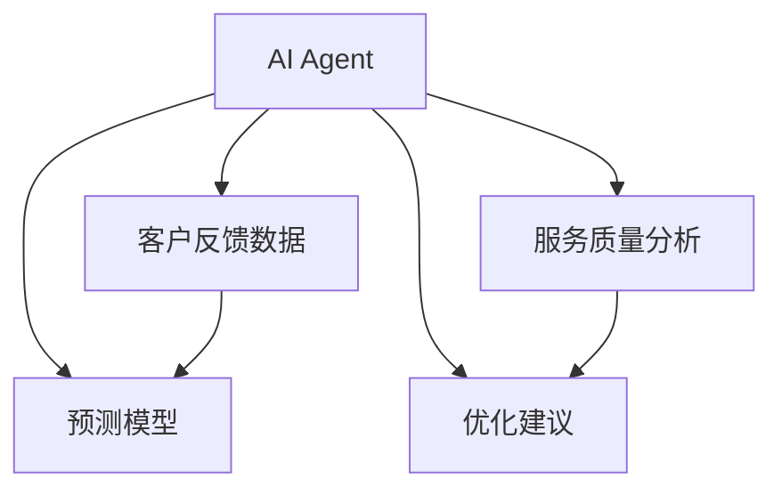
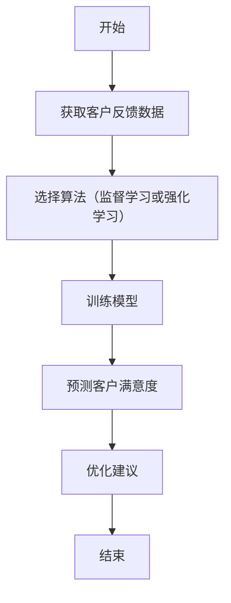
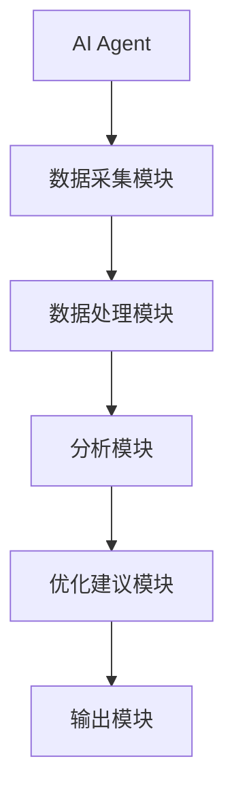

                 


# AI Agent在企业客户服务质量监控与智能升级中的角色

## 关键词：AI Agent，客户服务质量，智能升级，算法原理，系统架构，项目实战，NLP

## 摘要：本文探讨了AI Agent在企业客户服务质量监控与智能升级中的关键作用。通过分析AI Agent的核心概念、算法原理、系统架构以及项目实战，本文详细阐述了AI Agent如何通过自然语言处理、机器学习等技术提升客户服务质量。文章结合实际案例，展示了AI Agent在客户服务质量监控中的应用，并总结了未来的发展方向。

---

# 第一部分: AI Agent与企业客户服务质量概述

## 第1章: AI Agent与企业客户服务质量概述

### 1.1 问题背景与挑战
#### 1.1.1 传统客户服务质量监控的局限性
- 传统方法依赖人工监控，效率低，且容易出错。
- 数据量大，难以实时分析和处理。
- 缺乏智能化，无法主动优化服务质量。

#### 1.1.2 AI Agent在客户服务质量监控中的优势
- 提高监控效率，实时处理大量数据。
- 通过机器学习和NLP技术，实现智能化分析和预测。
- 自动化优化服务流程，提升客户满意度。

#### 1.1.3 企业客户服务质量升级的必要性
- 提升客户满意度是企业竞争力的重要因素。
- 智能化服务是未来发展的趋势。
- AI Agent能够帮助企业实现服务升级，降低运营成本。

### 1.2 问题描述与目标
#### 1.2.1 客户服务质量监控的核心问题
- 如何实时监控客户服务质量。
- 如何快速识别和解决服务问题。
- 如何优化服务流程，提升客户满意度。

#### 1.2.2 AI Agent在客户服务质量升级中的目标
- 实现实时监控和预警。
- 提供智能化的解决方案。
- 自动优化服务流程，提升效率。

#### 1.2.3 问题解决的边界与外延
- 边界：AI Agent仅负责数据监控和分析，不直接参与服务执行。
- 外延：AI Agent可以与其他系统（如CRM、ERP）集成，形成完整的智能服务体系。

### 1.3 核心概念与组成要素
#### 1.3.1 AI Agent的基本概念
- AI Agent是具有智能的计算机程序，能够感知环境并采取行动以实现目标。
- 在客户服务质量监控中，AI Agent用于实时分析数据，识别问题，并提供解决方案。

#### 1.3.2 客户服务质量监控的维度
- 响应时间：客户问题的响应速度。
- 解决效率：问题解决的效率和准确性。
- 客户满意度：客户对服务的满意度。

#### 1.3.3 AI Agent在客户服务质量中的角色
- 数据采集与分析：实时采集客户反馈，分析服务质量。
- 智能预测：预测潜在问题，提前采取措施。
- 自动优化：优化服务流程，提升效率。

---

# 第二部分: AI Agent的核心概念与联系

## 第2章: AI Agent的核心概念与联系

### 2.1 AI Agent的原理与特点
#### 2.1.1 AI Agent的基本原理
- AI Agent通过感知环境（如客户反馈数据）并采取行动（如发出预警或优化建议）来实现目标。
- 依赖于机器学习和NLP技术，能够理解和处理自然语言数据。

#### 2.1.2 AI Agent的核心特点
- 智能性：能够自主学习和优化。
- 实时性：实时监控和处理数据。
- 可扩展性：能够与多种系统集成。

#### 2.1.3 AI Agent与传统客服系统的区别
| 特性         | 传统客服系统         | AI Agent               |
|--------------|----------------------|-------------------------|
| 处理效率     | 人工处理，效率低     | 自动化处理，效率高     |
| 数据分析     | 简单统计，缺乏深度   | 深度分析，预测能力强   |
| 智能性       | 无智能性             | 具备智能性，主动优化    |

### 2.2 AI Agent与相关技术的关系
#### 2.2.1 AI Agent与大数据技术的关系
- 大数据技术为AI Agent提供了海量数据支持。
- AI Agent通过大数据分析，提升服务质量。

#### 2.2.2 AI Agent与自然语言处理（NLP）的关系
- NLP技术帮助AI Agent理解和处理客户反馈的自然语言文本。
- 通过NLP，AI Agent能够识别客户情绪，分析问题根源。

#### 2.2.3 AI Agent与机器学习的关系
- 机器学习算法是AI Agent的核心，用于训练模型，实现智能预测。
- AI Agent通过机器学习不断优化服务质量。

### 2.3 AI Agent的实体关系图


---

# 第三部分: AI Agent的算法原理讲解

## 第3章: AI Agent的算法原理

### 3.1 算法基础
#### 3.1.1 监督学习
- 用于训练分类模型，识别客户反馈中的负面情绪。
- 使用训练数据，预测客户满意度。

#### 3.1.2 强化学习
- 用于优化AI Agent的行动策略，提升服务质量。
- 通过奖励机制，训练AI Agent做出最优决策。

### 3.2 算法流程图


### 3.3 算法实现
#### 3.3.1 使用Python和TensorFlow实现监督学习模型
```python
import tensorflow as tf
import numpy as np

# 数据准备
x_train = np.array([['good'], ['bad'], ['excellent'], ['terrible']], dtype=object)
y_train = np.array([[1], [0], [1], [0]])

# 建立模型
model = tf.keras.Sequential([
    tf.keras.layers.Dense(16, activation='relu', input_shape=(1,)),
    tf.keras.layers.Dense(1, activation='sigmoid')
])

# 编译模型
model.compile(optimizer='adam', loss='binary_crossentropy', metrics=['accuracy'])

# 训练模型
model.fit(x_train, y_train, epochs=10, batch_size=4)
```

#### 3.3.2 使用强化学习优化AI Agent的行动策略
```python
import gym
import numpy as np

class AI-Agent(gym.Env):
    def __init__(self):
        super().__init__()
        self.state = 0
        self.action_space = gym.spaces.Discrete(2)  # 0: 不采取行动，1: 采取优化行动
        self.observation_space = gym.spaces.Discrete(1)  # 状态为0或1

    def step(self, action):
        # 根据动作更新状态
        if action == 1:
            self.state = 1
            reward = 1
        else:
            self.state = 0
            reward = 0
        return self.state, reward, False, {}

    def reset(self):
        self.state = 0
        return self.state
```

---

# 第四部分: AI Agent的数学模型与公式

## 第4章: AI Agent的数学模型

### 4.1 损失函数
- 使用交叉熵损失函数：
  $$ \text{loss} = -\frac{1}{N}\sum_{i=1}^{N} y_i \log(p_i) + (1-y_i)\log(1-p_i) $$

### 4.2 概率计算
- 使用贝叶斯公式计算客户满意度的概率：
  $$ P(y|x) = \frac{P(x|y)P(y)}{P(x)} $$

### 4.3 优化目标
- 最小化损失函数，最大化准确率：
  $$ \text{优化目标} = \min \text{loss} $$

---

# 第五部分: AI Agent的系统架构设计

## 第5章: 系统架构与设计

### 5.1 系统架构图


### 5.2 系统功能模块
- 数据采集模块：实时采集客户反馈数据。
- 数据处理模块：清洗和预处理数据。
- 分析模块：使用机器学习模型分析数据，识别问题。
- 优化建议模块：根据分析结果，提供优化建议。
- 输出模块：将优化建议输出到企业系统。

---

# 第六部分: AI Agent的项目实战

## 第6章: 项目实战

### 6.1 环境安装
```bash
pip install numpy
pip install tensorflow
pip install gym
```

### 6.2 核心代码实现
#### 数据采集与处理
```python
import pandas as pd
import requests

def fetch_data(url):
    response = requests.get(url)
    data = response.json()
    df = pd.DataFrame(data)
    return df

data = fetch_data('https://example.com/feedback')
```

#### 模型训练与预测
```python
import tensorflow as tf
import numpy as np

def train_model(train_data):
    model = tf.keras.Sequential([
        tf.keras.layers.Dense(16, activation='relu'),
        tf.keras.layers.Dense(1, activation='sigmoid')
    ])
    model.compile(optimizer='adam', loss='binary_crossentropy', metrics=['accuracy'])
    model.fit(train_data, epochs=10, batch_size=32)
    return model

model = train_model(data)
```

### 6.3 案例分析
- 案例背景：某企业客户反馈数据中存在大量负面情绪。
- 分析结果：模型预测客户满意度为低。
- 优化建议：优化客服响应时间，提升客户满意度。

---

# 第七部分: 总结与展望

## 第7章: 总结与展望

### 7.1 总结
- AI Agent通过智能化分析和优化，显著提升了企业客户服务质量。
- 本文详细介绍了AI Agent的核心概念、算法原理、系统架构和项目实战。

### 7.2 展望
- 结合更多先进技术（如区块链、物联网），进一步提升AI Agent的能力。
- 在更多行业和场景中应用AI Agent，推动智能化服务的发展。

---

作者：AI天才研究院/AI Genius Institute & 禅与计算机程序设计艺术 /Zen And The Art of Computer Programming

