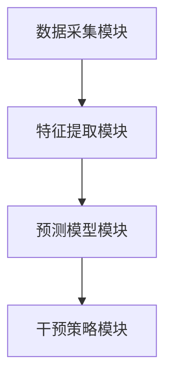

                 


# AI Agent在企业客户流失预警与干预中的应用

## 关键词：AI Agent, 客户流失预警, 机器学习, 数据挖掘, 企业风险管理

## 摘要：  
本文详细探讨了AI Agent在企业客户流失预警与干预中的应用，从背景、原理到实际案例，系统性地分析了如何利用AI Agent技术预测和干预客户流失。文章结合了理论与实践，通过具体的技术实现和数学模型，展示了AI Agent在客户流失预警中的巨大潜力。

---

## 第1章: 客户流失问题与AI Agent概述

### 1.1 客户流失问题的背景

#### 1.1.1 客户流失对企业的影响  
客户流失是企业在经营过程中面临的重大挑战之一。客户流失会导致收入下降、市场占有率降低，同时还会增加获取新客户的成本。据统计，获取新客户的成本是保留现有客户的5倍，因此，如何有效预测和干预客户流失，是企业提升竞争力的重要策略。

#### 1.1.2 客户流失的常见原因  
客户流失的原因多种多样，主要包括：  
1. **产品或服务问题**：产品质量差、服务不到位等。  
2. **客户满意度低**：客户对企业的服务或产品不满意。  
3. **竞争性产品**：市场上出现更具吸引力的替代产品或服务。  
4. **经济因素**：经济下行导致客户预算减少。  
5. **客户自身原因**：客户业务调整或关闭。  

#### 1.1.3 客户流失预测的商业价值  
通过AI Agent技术，企业可以实时监控客户行为，预测潜在流失风险，并采取针对性措施，从而降低客户流失率，提升客户满意度和忠诚度。

### 1.2 AI Agent的核心概念

#### 1.2.1 AI Agent的定义与特点  
AI Agent（人工智能代理）是一种能够感知环境、自主决策并采取行动的智能系统。其特点包括：  
1. **自主性**：能够独立决策和行动。  
2. **反应性**：能够实时感知环境变化并做出反应。  
3. **目标导向**：以特定目标为导向，优化行动策略。  

#### 1.2.2 AI Agent在客户流失预警中的作用  
AI Agent可以通过分析客户的行为数据、交易数据和历史数据，识别潜在的流失风险，并主动采取干预措施，如发送定制化优惠、提供个性化服务等。

#### 1.2.3 AI Agent与传统数据分析的区别  
AI Agent不仅仅是数据分析工具，它能够主动学习、推理和决策，具有更强的自主性和适应性。而传统数据分析主要依赖人工分析和决策。

### 1.3 客户流失预测的数学模型

#### 1.3.1 常见的客户流失预测模型  
1. **逻辑回归（Logistic Regression）**：用于分类问题，预测客户是否流失。  
2. **随机森林（Random Forest）**：基于决策树的集成学习方法，适合处理高维数据。  
3. **支持向量机（SVM）**：适用于小样本数据的分类问题。  

#### 1.3.2 机器学习在客户流失预测中的应用  
通过机器学习算法，企业可以构建客户流失预测模型，识别高风险客户，并采取干预措施。例如，使用逻辑回归模型预测客户流失概率：

$$ P(y=1|x) = \frac{1}{1 + e^{-(\beta_0 + \beta_1x_1 + \beta_2x_2 + \dots + \beta_nx_n)}} $$

其中，$y$为流失标记（1表示流失，0表示不流失），$x_i$为特征变量，$\beta_i$为模型参数。

#### 1.3.3 AI Agent在模型中的角色  
AI Agent可以实时监控客户的特征变量，结合预测模型，评估客户的流失风险，并根据风险等级采取相应的干预措施。

---

## 第2章: AI Agent的算法原理

### 2.1 逻辑回归算法

#### 2.1.1 逻辑回归的原理  
逻辑回归是一种常用的分类算法，适用于二分类问题。其核心思想是通过sigmoid函数将线性回归的结果映射到0到1的范围内，表示概率。

#### 2.1.2 逻辑回归的数学公式  
逻辑回归的损失函数为对数损失函数：

$$ L(\theta) = -\sum_{i=1}^{n} [y_i \ln h(x_i) + (1 - y_i)\ln(1 - h(x_i))] $$

其中，$h(x_i) = \frac{1}{1 + e^{-(\theta^T x_i)}}$。

#### 2.1.3 逻辑回归在客户流失预测中的应用  
通过逻辑回归模型，企业可以预测客户流失的概率，并根据概率值采取相应的干预措施。

### 2.2 随机森林算法

#### 2.2.1 随机森林的原理  
随机森林是一种基于决策树的集成学习方法，通过构建多个决策树并进行投票或加权平均，提高模型的准确性和稳定性。

#### 2.2.2 随机森林的数学公式  
随机森林的预测结果为各个决策树预测结果的加权平均值：

$$ y = \sum_{i=1}^{n} \frac{1}{n} y_i $$

其中，$y_i$为第$i$棵决策树的预测结果，$n$为决策树的数量。

#### 2.2.3 随机森林在客户流失预测中的应用  
随机森林适用于高维数据和非线性关系的客户流失预测问题。

### 2.3 AI Agent与机器学习的结合

#### 2.3.1 AI Agent的自主学习能力  
AI Agent可以通过强化学习不断优化自身的预测和决策能力，适应不同的客户行为模式。

#### 2.3.2 AI Agent的实时性与动态性  
AI Agent能够实时监控客户的最新行为数据，动态调整预测模型，确保预测结果的准确性和及时性。

---

## 第3章: AI Agent的系统设计与实现

### 3.1 系统架构设计

#### 3.1.1 系统功能模块  
1. **数据采集模块**：收集客户的交易数据、行为数据和属性数据。  
2. **特征提取模块**：对数据进行清洗、特征提取和特征选择。  
3. **预测模型模块**：构建客户流失预测模型并进行训练。  
4. **干预策略模块**：根据预测结果制定和执行干预策略。  

#### 3.1.2 系统架构图  


### 3.2 系统实现细节

#### 3.2.1 数据采集与预处理  
使用Python的pandas库进行数据清洗和特征工程：

```python
import pandas as pd

# 加载数据
df = pd.read_csv('customer_data.csv')

# 数据清洗
df.dropna(inplace=True)
df = pd.get_dummies(df, columns=['gender', 'region'])
```

#### 3.2.2 模型训练与评估  
使用逻辑回归模型进行训练和评估：

```python
from sklearn.linear_model import LogisticRegression
from sklearn.metrics import accuracy_score

# 训练模型
model = LogisticRegression()
model.fit(X_train, y_train)

# 模型评估
y_pred = model.predict(X_test)
print(accuracy_score(y_test, y_pred))
```

#### 3.2.3 干预策略的制定  
根据预测结果，制定不同的干预策略：

1. **高风险客户**：提供个性化优惠、定制化服务。  
2. **中风险客户**：定期回访、发送关怀信息。  
3. **低风险客户**：提供常规服务、收集反馈意见。  

---

## 第4章: 项目实战与案例分析

### 4.1 项目背景与目标

#### 4.1.1 项目背景  
某银行希望通过AI Agent技术预测客户流失风险，降低客户流失率。

#### 4.1.2 项目目标  
1. 构建客户流失预测模型。  
2. 实现AI Agent的实时监控和干预功能。  

### 4.2 项目实施步骤

#### 4.2.1 数据采集与处理  
使用银行提供的客户数据，包括交易记录、客户属性和历史流失数据。

#### 4.2.2 模型训练与优化  
使用逻辑回归和随机森林模型进行训练，并通过交叉验证优化模型参数。

#### 4.2.3 系统部署与测试  
将模型部署到生产环境，并进行功能测试和性能优化。

### 4.3 实际案例分析

#### 4.3.1 案例介绍  
某银行客户A，最近三个月交易频率下降，且对服务的投诉次数增加，模型预测其流失概率为80%。

#### 4.3.2 干预措施  
系统自动触发干预策略，向客户A发送定制化优惠券和关怀信息，成功降低流失风险。

---

## 第5章: 最佳实践与总结

### 5.1 最佳实践

#### 5.1.1 数据质量的重要性  
确保数据的完整性和准确性，是模型预测准确性的基础。

#### 5.1.2 模型的可解释性  
选择具有可解释性的模型，便于业务人员理解和决策。

#### 5.1.3 模型的动态优化  
定期更新模型参数，适应客户行为的变化。

### 5.2 项目总结

通过AI Agent技术，企业可以有效预测和干预客户流失，提升客户满意度和忠诚度。本文通过理论与实践的结合，详细展示了AI Agent在客户流失预警中的应用。

---

## 参考文献  
1. Bishop, C. M. (2006). Pattern Recognition and Machine Learning. Springer.  
2. Hastie, T., Tibshirani, R., & Friedman, J. (2009). The Elements of Statistical Learning. Springer.  

## 作者：AI天才研究院 & 禅与计算机程序设计艺术

