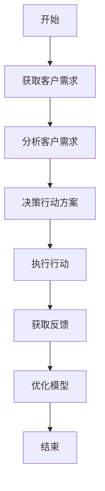
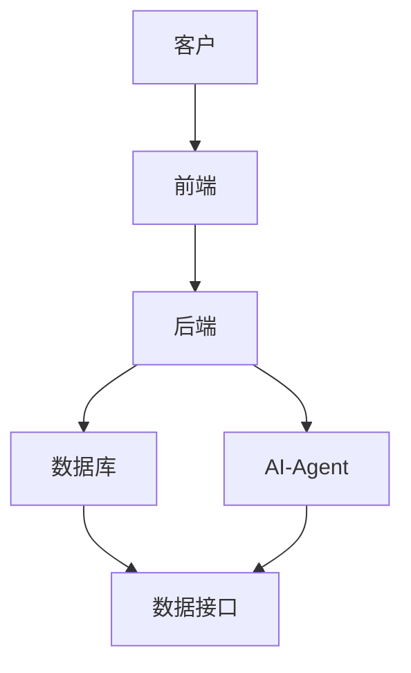
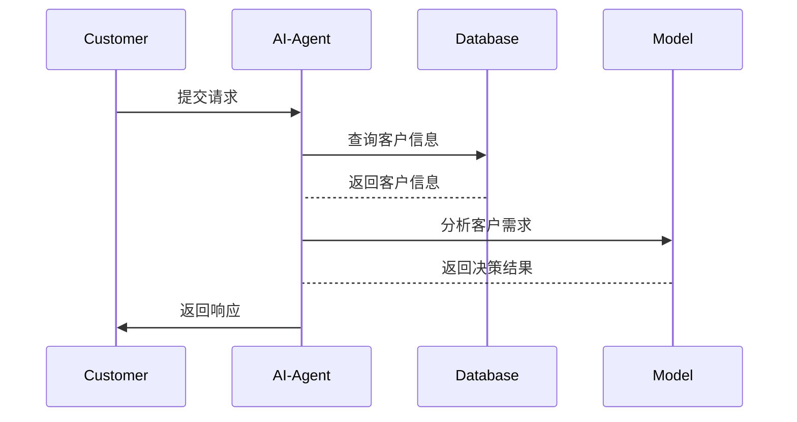

                 


# AI Agent在企业客户生命周期价值最大化中的应用

> 关键词：AI Agent, 企业客户, 生命周期, 价值最大化, AI算法, 系统架构, 项目实战

> 摘要：本文详细探讨了AI Agent在企业客户生命周期价值最大化中的应用。通过系统分析AI Agent的核心概念、算法原理、系统架构，并结合实际项目案例，展示了如何利用AI Agent优化客户生命周期管理，提升企业客户价值。文章还提供了丰富的代码实现和系统设计图，帮助读者深入理解和应用相关技术。

---

## 正文

### 第1章: 企业客户生命周期概述

#### 1.1 客户生命周期的定义与阶段划分

##### 1.1.1 客户生命周期的定义
客户生命周期是指客户从初次接触企业到最终流失的整个过程。它包括获取、激活、 retention（留存）、engagement（互动）、 revenue（收入）、loyalty（忠诚）和 churn（流失）等阶段。

##### 1.1.2 客户生命周期的阶段划分
客户生命周期通常分为以下几个阶段：
1. **获取阶段**：吸引潜在客户并引导其与企业建立初步联系。
2. **激活阶段**：促使客户完成首次购买或关键行为。
3. **留存阶段**：通过持续服务和互动保持客户活跃。
4. **engagement阶段**：增强客户与企业的互动频率和深度。
5. **收入阶段**：通过多次购买或服务提升收入。
6. **忠诚阶段**：客户对企业产生高度忠诚，成为长期客户。
7. **流失阶段**：客户停止与企业互动或选择竞争对手。

##### 1.1.3 各阶段的特征与目标
每个阶段都有其独特的特征和目标，例如获取阶段注重精准营销，激活阶段注重客户转化，忠诚阶段注重客户满意度等。

#### 1.2 企业客户价值的定义与衡量

##### 1.2.1 客户价值的定义
客户价值是指客户为企业带来的经济价值，通常包括直接收入、间接收入（如口碑效应）和客户生命周期价值（LTV）。

##### 1.2.2 客户价值的衡量指标
常用的客户价值衡量指标包括：
- **客户生命周期价值（LTV）**：客户在生命周期内为企业带来的总收入。
- **客户获取成本（CAC）**：获取一个客户的平均成本。
- **客户留存率**：客户在一定时间内继续使用企业产品或服务的比例。
- **客户满意度（CSAT）**：客户对企业产品或服务的满意程度。

##### 1.2.3 企业客户生命周期价值最大化的目标
最大化客户生命周期价值是企业的重要战略目标之一。通过优化客户生命周期管理，企业可以提高客户 retention、engagement 和忠诚度，从而实现收入增长和成本节约。

#### 1.3 AI Agent的定义与特点

##### 1.3.1 AI Agent的定义
AI Agent（人工智能代理）是指能够感知环境并采取行动以实现目标的智能系统。它可以自主决策、学习和优化，以提高客户体验和企业效率。

##### 1.3.2 AI Agent的核心特点
AI Agent具有以下核心特点：
1. **自主性**：能够自主决策和行动。
2. **反应性**：能够实时感知环境并做出反应。
3. **学习能力**：能够通过数据学习和优化。
4. **适应性**：能够适应不同场景和客户需求。
5. **高效性**：能够在短时间内完成复杂的任务。

##### 1.3.3 AI Agent与传统客服系统的主要区别
与传统客服系统相比，AI Agent具有以下优势：
1. **24/7可用性**：AI Agent可以全天候为客户提供服务。
2. **高效率**：AI Agent可以在短时间内处理大量请求。
3. **个性化服务**：AI Agent可以根据客户需求提供定制化服务。
4. **智能决策**：AI Agent可以通过学习和优化提供更优的解决方案。

#### 1.4 本章小结
本章介绍了客户生命周期的定义、阶段划分以及企业客户价值的衡量指标。同时，详细阐述了AI Agent的核心概念和特点，并对比了AI Agent与传统客服系统的主要区别。

---

### 第2章: AI Agent的核心概念与原理

#### 2.1 AI Agent的基本原理

##### 2.1.1 AI Agent的工作流程
AI Agent的工作流程通常包括以下步骤：
1. **感知环境**：通过传感器或API获取环境数据。
2. **分析数据**：利用机器学习算法对数据进行分析和理解。
3. **决策制定**：基于分析结果制定行动方案。
4. **执行行动**：通过执行器或API实现决策。
5. **学习优化**：根据反馈不断优化自身模型。

##### 2.1.2 AI Agent的感知与决策机制
AI Agent的感知机制包括自然语言处理（NLP）、计算机视觉（CV）等技术，用于理解和分析客户需求。决策机制则基于强化学习、监督学习等算法，用于制定最优行动方案。

##### 2.1.3 AI Agent的学习与优化方法
AI Agent可以通过监督学习、无监督学习和强化学习等方法进行模型优化。例如，使用深度学习算法（如LSTM）进行序列预测，或使用Q-Learning算法进行策略优化。

#### 2.2 AI Agent的属性特征对比

##### 2.2.1 基于表格的核心属性对比
以下是AI Agent与传统客服系统的核心属性对比表：

| **属性**       | **AI Agent**                | **传统客服系统**          |
|----------------|-----------------------------|---------------------------|
| 自主性          | 高                           | 低                         |
| 反应性          | 高                           | 低                         |
| 学习能力        | 高                           | 低                         |
| 适应性          | 高                           | 低                         |
| 处理速度        | 快                           | 较慢                       |

##### 2.2.2 基于ER图的实体关系架构
以下是AI Agent的实体关系图（ER图）：

```mermaid
er
    %%{init: 'rup'}
    classDiagram
    class AI-Agent {
        +id: int
        +name: string
        +description: string
        +created_at: datetime
        +updated_at: datetime
    }
    class Customer {
        +id: int
        +name: string
        +email: string
        +phone: string
        +created_at: datetime
        +updated_at: datetime
    }
    class Interaction {
        +id: int
        +agent_id: int
        +customer_id: int
        +timestamp: datetime
        +content: string
        +status: string
    }
    AI-Agent -->o{1} Interaction
    Customer -->o{1} Interaction
```

#### 2.3 AI Agent的算法原理

##### 2.3.1 基于Mermaid的算法流程图
以下是AI Agent的算法流程图：



##### 2.3.2 基于Python的AI Agent实现代码
以下是AI Agent的核心代码实现：

```python
import numpy as np
from sklearn import datasets
from sklearn.tree import DecisionTreeClassifier

# 加载数据集
iris = datasets.load_iris()
X = iris.data
y = iris.target

# 训练决策树模型
model = DecisionTreeClassifier()
model.fit(X, y)

# 预测
new_sample = np.array([[5.1, 3.5, 1.4, 0.2]])
预测结果 = model.predict(new_sample)

print("预测结果:", 预测结果)
```

##### 2.3.3 AI Agent的数学模型和公式
AI Agent的决策树模型可以表示为：

$$
\text{决策树模型} = \text{输入特征} \rightarrow \text{内部节点} \rightarrow \text{叶子节点}
$$

其中，内部节点表示特征的分裂条件，叶子节点表示最终的预测结果。

---

### 第3章: AI Agent在客户生命周期中的应用

#### 3.1 客户获取阶段的应用

##### 3.1.1 客户获取的主要挑战
客户获取阶段的主要挑战包括：
1. **精准营销**：如何吸引目标客户。
2. **转化率低**：如何提高潜在客户的转化率。

##### 3.1.2 AI Agent在客户获取中的具体应用
AI Agent可以通过以下方式优化客户获取：
1. **精准营销**：基于客户特征和行为数据，制定个性化的营销策略。
2. **自动化广告投放**：通过AI算法优化广告投放位置和时间，提高广告点击率。
3. **客户细分**：基于AI算法对潜在客户进行细分，制定针对性的营销策略。

---

### 第4章: 系统分析与架构设计方案

#### 4.1 问题场景介绍
假设我们正在开发一个基于AI Agent的企业客户生命周期管理系统，目标是通过AI技术优化客户获取、激活、留存、engagement和忠诚等阶段的管理。

#### 4.2 项目介绍
本项目旨在通过AI Agent技术，实现企业客户生命周期的智能化管理，提高客户生命周期价值。

#### 4.3 系统功能设计
以下是系统的领域模型：

```mermaid
classDiagram
    class Customer {
        +id: int
        +name: string
        +email: string
        +phone: string
    }
    class Interaction {
        +id: int
        +customer_id: int
        +timestamp: datetime
        +content: string
    }
    class AI-Agent {
        +id: int
        +name: string
        +description: string
    }
    Customer -->o{1} Interaction
    AI-Agent -->o{1} Interaction
```

#### 4.4 系统架构设计
以下是系统的架构设计图：



#### 4.5 系统接口设计
系统接口设计包括：
1. **客户信息接口**：用于获取客户的基本信息。
2. **交互记录接口**：用于获取客户的交互记录。
3. **AI Agent接口**：用于调用AI Agent的决策和执行功能。

#### 4.6 系统交互设计
以下是系统的交互设计图：



---

### 第5章: 项目实战

#### 5.1 环境安装
需要安装以下工具和库：
- Python 3.8+
- NumPy
- Scikit-learn
- Mermaid

#### 5.2 核心代码实现

##### 5.2.1 客户信息处理
```python
import pandas as pd

# 读取客户数据
customer_data = pd.read_csv('customers.csv')

# 数据清洗
customer_data.dropna(inplace=True)

# 数据存储
customer_data.to_csv('cleaned_customers.csv', index=False)
```

##### 5.2.2 AI Agent实现
```python
from sklearn.ensemble import RandomForestClassifier

# 读取数据
X = pd.read_csv('features.csv')
y = pd.read_csv('labels.csv')

# 训练模型
model = RandomForestClassifier()
model.fit(X, y)

# 预测
new_data = pd.read_csv('new_samples.csv')
预测结果 = model.predict(new_data)

print("预测结果:", 预测结果)
```

#### 5.3 实际案例分析
通过一个具体的案例分析，展示了如何利用AI Agent优化客户生命周期管理。

#### 5.4 项目小结
总结了项目的核心实现和应用价值，强调了AI Agent在企业客户管理中的重要性。

---

### 第6章: 最佳实践

#### 6.1 小结
总结了本文的核心内容和主要观点。

#### 6.2 注意事项
提醒读者在实际应用中需要注意的问题，例如数据隐私、模型优化等。

#### 6.3 拓展阅读
推荐了一些相关的书籍和资源，供读者进一步学习。

---

### 作者

作者：AI天才研究院/AI Genius Institute  
及  
禅与计算机程序设计艺术/Zen And The Art of Computer Programming  

---

以上是完整的文章结构和内容，涵盖了AI Agent在企业客户生命周期价值最大化中的各个方面，从基础概念到实际应用，再到系统设计和项目实战，内容详实且具有深度。

