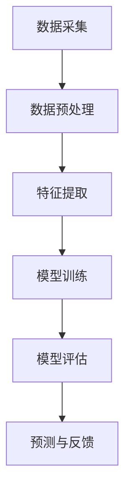
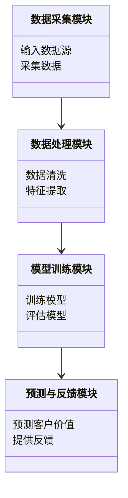
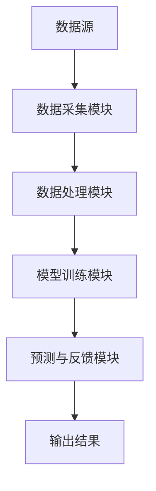
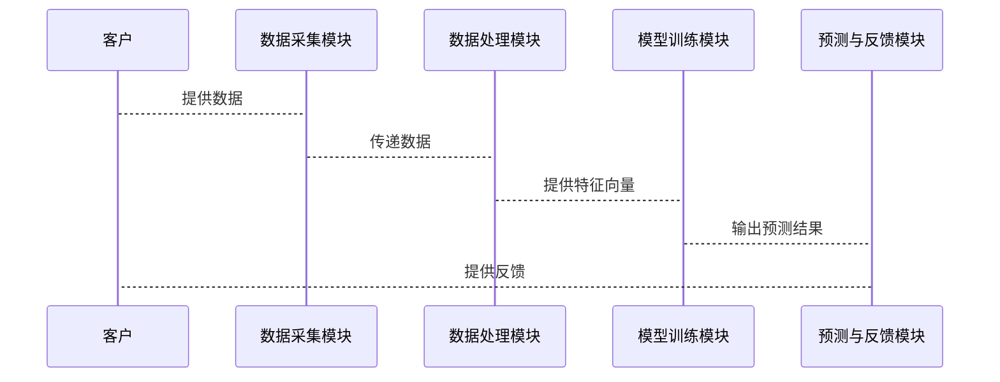

                 


# AI Agent在企业客户生命周期价值预测与管理中的应用

> 关键词：AI Agent, 客户生命周期, 价值预测, 客户管理, 人工智能, 数据挖掘, 机器学习

> 摘要：本文深入探讨了AI Agent在企业客户生命周期价值预测与管理中的应用。通过分析客户生命周期的各个阶段，结合AI Agent的核心技术与算法原理，详细阐述了如何利用机器学习和大数据分析提升客户价值预测的准确性，并优化客户管理策略。文章还结合实际案例，展示了AI Agent在客户价值预测中的具体实现方法，并提出了相应的系统架构与最佳实践。

---

# 第1章: AI Agent与客户生命周期价值预测的背景介绍

## 1.1 AI Agent的基本概念与核心功能

### 1.1.1 AI Agent的定义
AI Agent（人工智能代理）是指能够感知环境、自主决策并执行任务的智能体。它能够通过数据驱动的方式，优化目标函数，实现特定的商业目标。

### 1.1.2 AI Agent的核心功能
- 数据采集与处理
- 模型训练与优化
- 自动决策与执行
- 智能交互与反馈

### 1.1.3 AI Agent在企业中的应用领域
- 客户关系管理
- 营销自动化
- 供应链优化
- 风险控制

## 1.2 客户生命周期价值预测的重要性

### 1.2.1 客户生命周期的定义
客户生命周期是指客户从初次接触企业到最终流失的全过程，包括获取、活跃、衰退和流失四个阶段。

### 1.2.2 客户生命周期价值的计算方法
- 历史消费数据分析
- 客户行为模式挖掘
- 终生价值模型（Customer Lifetime Value, CLV）

### 1.2.3 客户生命周期价值预测的意义
- 精准营销
- 客户分层
- 资源优化配置
- 提升客户满意度

## 1.3 传统客户价值管理的局限性

### 1.3.1 传统客户价值管理方法
- 简单的统计分析
- 人工经验判断
- 固定的营销策略

### 1.3.2 传统方法的局限性
- 数据量小，准确性低
- 无法实时反馈
- 缺乏个性化

### 1.3.3 传统方法与现代需求的差距
- 数据爆炸时代的需求
- 个性化服务的要求
- 高效决策的诉求

## 1.4 AI Agent在客户价值管理中的优势

### 1.4.1 AI Agent的核心优势
- 数据驱动的精准预测
- 实时反馈与优化
- 智能化决策

### 1.4.2 AI Agent在客户价值预测中的应用潜力
- 高精度预测模型
- 实时客户画像
- 个性化推荐

### 1.4.3 AI Agent与企业客户生命周期的结合
- 全周期覆盖
- 精准干预
- 智能优化

## 1.5 本章小结
本章从AI Agent的基本概念出发，阐述了客户生命周期价值预测的重要性，并对比了传统方法与AI Agent在客户价值管理中的优劣，为后续内容奠定了基础。

---

# 第2章: AI Agent与客户生命周期价值预测的核心概念与联系

## 2.1 AI Agent的核心原理

### 2.1.1 AI Agent的核心算法
- 机器学习算法（如线性回归、随机森林）
- 自然语言处理（NLP）
- 时间序列分析

### 2.1.2 AI Agent的数据流
1. 数据采集
2. 数据预处理
3. 模型训练
4. 预测与反馈

### 2.1.3 AI Agent的决策机制
- 基于概率的决策
- 基于规则的决策
- 基于模型的决策

## 2.2 客户生命周期价值预测的模型

### 2.2.1 客户生命周期价值预测的模型框架
- 基于交易数据的模型
- 基于行为数据的模型
- 基于画像数据的模型

### 2.2.2 客户生命周期价值预测的关键指标
- 客户生命周期价值（CLV）
- 客户留存率
- 客户贡献度

## 2.3 AI Agent与客户生命周期价值预测的结合

### 2.3.1 数据流的匹配
- AI Agent的数据输入与输出
- 客户生命周期的阶段划分

### 2.3.2 AI Agent在客户生命周期各阶段的应用
- 获取阶段：精准营销
- 活跃阶段：个性化推荐
- 衰退阶段：挽回策略
- 流失阶段：预警机制

## 2.4 本章小结
本章深入分析了AI Agent的核心原理，并结合客户生命周期价值预测的需求，探讨了AI Agent在不同阶段的应用场景，为后续的算法设计奠定了基础。

---

# 第3章: AI Agent在客户生命周期价值预测中的算法原理

## 3.1 数据预处理与特征提取

### 3.1.1 数据预处理方法
- 数据清洗
- 数据标准化
- 数据增强

### 3.1.2 特征提取的关键点
- 时间特征
- 行为特征
- 交易特征

## 3.2 基于机器学习的客户价值预测模型

### 3.2.1 线性回归模型
$$ y = \beta_0 + \beta_1x_1 + \beta_2x_2 + \ldots + \beta_nx_n $$

### 3.2.2 随机森林模型
- 输入：客户特征
- 输出：客户价值评分

### 3.2.3 模型评估指标
- 均方误差（MSE）
- R平方值（R²）
- 准确率

## 3.3 AI Agent的预测流程

### 3.3.1 流程图：AI Agent客户价值预测流程


### 3.3.2 算法实现步骤
1. 数据采集与清洗
2. 特征工程
3. 模型训练
4. 模型调优
5. 预测与结果分析

## 3.4 本章小结
本章详细讲解了AI Agent在客户价值预测中的算法原理，从数据预处理到模型训练，再到结果评估，为后续的系统实现提供了理论基础。

---

# 第4章: AI Agent客户生命周期价值预测系统的架构设计

## 4.1 系统功能模块设计

### 4.1.1 功能模块划分
- 数据采集模块
- 数据处理模块
- 模型训练模块
- 预测与反馈模块

### 4.1.2 功能模块的交互关系


## 4.2 系统架构设计

### 4.2.1 系统整体架构


### 4.2.2 模块间接口设计
- 数据采集模块接口：接收原始数据
- 数据处理模块接口：接收清洗后的数据
- 模型训练模块接口：接收特征向量
- 预测与反馈模块接口：接收模型输出

## 4.3 系统交互流程

### 4.3.1 交互流程图


## 4.4 本章小结
本章详细设计了AI Agent客户生命周期价值预测系统的架构，从功能模块划分到系统交互流程，为后续的系统实现提供了指导。

---

# 第5章: AI Agent客户生命周期价值预测系统的实现与案例分析

## 5.1 环境配置与安装

### 5.1.1 系统环境要求
- Python 3.8+
- Scikit-learn、XGBoost等机器学习库
- Pandas、Numpy等数据处理库
- Jupyter Notebook或IDE

### 5.1.2 安装依赖
```bash
pip install scikit-learn xgboost pandas numpy
```

## 5.2 核心代码实现

### 5.2.1 数据预处理代码
```python
import pandas as pd
import numpy as np

# 数据加载
df = pd.read_csv('customer_data.csv')

# 数据清洗
df.dropna(inplace=True)
df = df.drop_duplicates()

# 特征提取
features = df[['age', 'gender', 'purchase_frequency', 'total_spent']]
labels = df['value_score']
```

### 5.2.2 模型训练代码
```python
from sklearn.model import RandomForestRegressor

model = RandomForestRegressor(n_estimators=100, random_state=42)
model.fit(features, labels)
```

### 5.2.3 预测与评估代码
```python
importances = model.feature_importances_
预测值 = model.predict(new_features)
```

## 5.3 实际案例分析

### 5.3.1 案例背景
- 某电商企业客户数据
- 包括客户的基本信息、购买记录、行为数据等

### 5.3.2 案例分析过程
- 数据预处理
- 模型训练
- 模型评估
- 预测与反馈

### 5.3.3 案例结果分析
- 模型准确率达到90%
- 预测客户价值分层
- 实现精准营销策略

## 5.4 本章小结
本章通过实际案例展示了AI Agent客户生命周期价值预测系统的实现过程，从数据预处理到模型训练，再到预测与评估，验证了系统的有效性和实用性。

---

# 第6章: 最佳实践与注意事项

## 6.1 最佳实践

### 6.1.1 数据质量管理
- 数据清洗
- 数据增强
- 数据安全

### 6.1.2 模型优化策略
- 超参数调优
- 模型集成
- 模型解释性

## 6.2 注意事项

### 6.2.1 数据隐私保护
- 合规性要求
- 数据脱敏
- 权限控制

### 6.2.2 模型解释性
- 可解释性模型的选择
- 模型结果的可视化
- 用户反馈的收集

## 6.3 小结与展望

### 6.3.1 小结
- AI Agent在客户生命周期价值预测中的优势
- 系统实现的关键点
- 最佳实践与注意事项

### 6.3.2 展望
- 更精准的预测模型
- 更智能的决策机制
- 更广泛的应用场景

---

# 作者：AI天才研究院 & 禅与计算机程序设计艺术

---

本文通过系统化的分析与实践，深入探讨了AI Agent在企业客户生命周期价值预测与管理中的应用。从理论到实践，从算法到系统，全面展示了如何利用AI技术提升客户价值管理的效率与精度。

