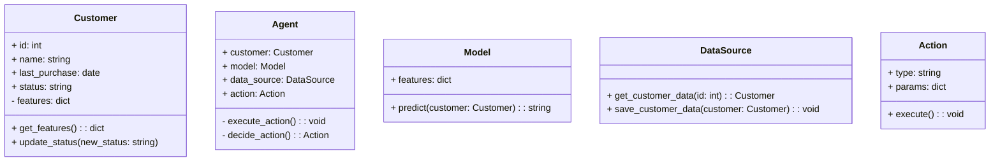
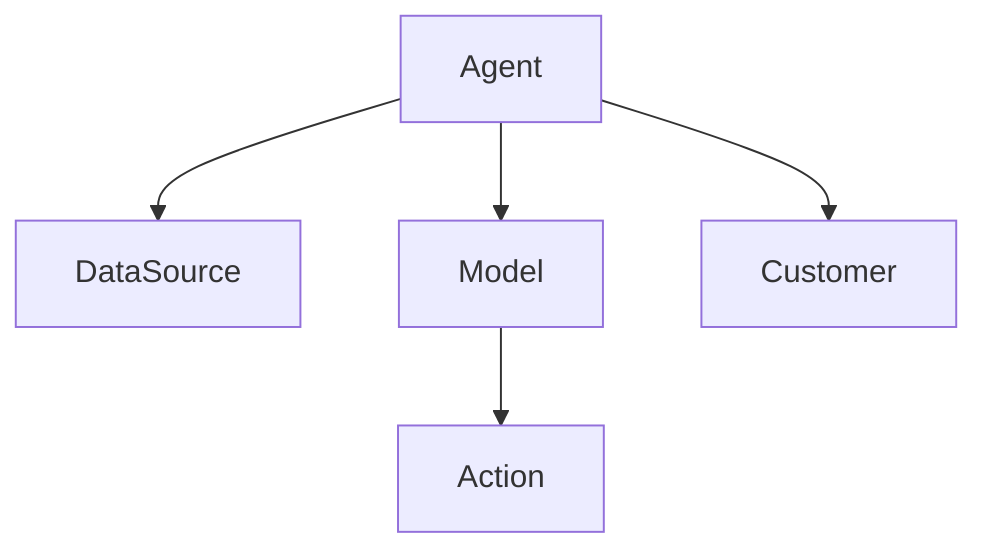

                 


# AI Agent在企业客户生命周期管理中的应用

> 关键词：AI Agent, 客户生命周期管理, 人工智能, 企业客户管理, 数据驱动决策

> 摘要：本文深入探讨了AI Agent在企业客户生命周期管理中的应用，从理论基础到实际案例，详细阐述了AI Agent如何通过感知、决策和执行机制优化客户管理流程。文章结合强化学习和监督学习算法，分析了客户获取、培养、保留和流失四个阶段的AI解决方案，并提供了系统架构设计和项目实战案例，为企业的智能化客户管理提供了切实可行的指导。

---

# 第一部分: AI Agent与企业客户生命周期管理概述

## 第1章: AI Agent与客户生命周期管理概述

### 1.1 AI Agent的基本概念与核心原理

#### 1.1.1 AI Agent的定义与分类

**定义**：AI Agent（人工智能代理）是指能够感知环境、自主决策并执行任务的智能实体。它通过传感器获取信息，利用算法处理数据，并通过执行器与环境互动。

**分类**：
- **简单反射型Agent**：基于预设规则直接响应输入。
- **基于模型的反应型Agent**：利用内部模型分析环境并做出决策。
- **目标驱动型Agent**：为实现特定目标而行动。
- **效用驱动型Agent**：通过最大化效用函数来优化决策。

#### 1.1.2 AI Agent的核心技术原理

AI Agent的核心在于其感知、决策和执行能力：
- **感知**：通过数据采集、特征提取和状态识别理解环境。
- **决策**：基于感知结果，运用算法生成最优行动方案。
- **执行**：通过执行器将决策转化为实际操作。

#### 1.1.3 AI Agent在企业中的应用场景

- **客户服务**：智能客服系统实时响应客户需求。
- **营销自动化**：精准营销策略的制定与执行。
- **风险管理**：预测客户流失并采取干预措施。

---

### 1.2 企业客户生命周期管理的核心概念

#### 1.2.1 客户生命周期的定义与阶段划分

**定义**：客户生命周期指客户与企业互动的全过程，通常分为获取、培养、保留和流失四个阶段。

**阶段划分**：
1. **获取阶段**：识别潜在客户并促使其转化为实际客户。
2. **培养阶段**：增强客户对企业的认知和忠诚度。
3. **保留阶段**：通过持续服务延长客户生命周期。
4. **流失阶段**：预测并防止客户流失，或在流失后重新赢回客户。

#### 1.2.2 客户生命周期管理的重要性

- **提高客户满意度**：通过个性化服务提升客户体验。
- **优化资源配置**：精准定位高价值客户，降低运营成本。
- **增强竞争力**：通过数据驱动的决策提高市场响应速度。

#### 1.2.3 传统客户生命周期管理的挑战与局限

- **数据孤岛**：各部门间数据分散，难以形成统一的客户视图。
- **决策滞后**：依赖人工分析，难以实时响应客户需求。
- **缺乏个性化**：传统方法难以实现大规模定制化服务。

---

### 1.3 AI Agent在客户生命周期管理中的价值

#### 1.3.1 提高客户体验与满意度

- **个性化推荐**：基于客户行为数据，实时推荐相关内容。
- **智能客服**：通过自然语言处理技术提供24/7的客户服务。

#### 1.3.2 优化企业运营效率

- **自动化流程**：AI Agent可以自动处理重复性任务，如数据录入和订单处理。
- **实时监控**：通过实时数据分析，快速发现并解决问题。

#### 1.3.3 数据驱动的精准决策

- **客户画像构建**：通过机器学习算法生成详细的客户画像。
- **预测分析**：利用预测模型预判客户行为，优化资源配置。

---

### 1.4 本章小结

本章介绍了AI Agent的基本概念和核心原理，并探讨了其在企业客户生命周期管理中的应用价值。通过对比传统管理方式的局限性，突出了AI Agent在提升客户体验、优化运营效率和实现精准决策方面的重要作用。

---

# 第二部分: AI Agent的核心原理与技术实现

## 第2章: AI Agent的核心原理

### 2.1 AI Agent的感知机制

#### 2.1.1 数据采集与处理

- **数据源**：包括客户行为数据、市场数据和内部系统数据。
- **数据预处理**：清洗、转换和特征提取，确保数据质量。

#### 2.1.2 感知模型的构建

- **监督学习**：使用标注数据训练分类器。
- **无监督学习**：通过聚类分析发现潜在模式。

#### 2.1.3 感知数据的特征提取

- **文本处理**：使用NLP技术提取关键词和情感倾向。
- **图像处理**：通过计算机视觉技术识别图像特征。

### 2.2 AI Agent的决策机制

#### 2.2.1 决策算法的选择与应用

- **强化学习**：适用于动态环境下的策略优化。
- **监督学习**：适用于有标签数据的分类和回归任务。

#### 2.2.2 决策模型的训练与优化

- **模型选择**：根据任务需求选择合适算法。
- **超参数调优**：通过交叉验证优化模型性能。
- **在线学习**：实时更新模型以适应环境变化。

#### 2.2.3 多目标决策的实现

- **目标权重分配**：根据业务需求设定不同目标的优先级。
- **多目标优化算法**：如帕累托前沿方法，平衡多个目标之间的冲突。

### 2.3 AI Agent的执行与反馈机制

#### 2.3.1 行为规划与执行

- **路径规划**：在复杂环境中规划最优路径。
- **任务分解**：将复杂任务分解为简单子任务，逐步执行。

#### 2.3.2 反馈机制的建立

- **实时反馈**：根据执行结果调整下一步行动。
- **历史记录**：保存执行记录，用于后续分析和优化。

#### 2.3.3 自适应优化策略

- **反馈循环**：通过持续反馈优化决策模型。
- **弹性调整**：根据环境变化动态调整执行策略。

---

## 第3章: AI Agent的算法实现

### 3.1 强化学习算法在AI Agent中的应用

#### 3.1.1 强化学习的基本原理

**定义**：强化学习是一种通过试错机制，学习策略以最大化累计奖励的方法。

**核心要素**：
- **状态（State）**：环境中的当前情况。
- **动作（Action）**：Agent的执行行为。
- **奖励（Reward）**：对行为的评价，用于指导学习方向。
- **策略（Policy）**：决定下一步行动的概率分布。

#### 3.1.2 Q-learning算法的实现

**算法流程**：
1. 初始化Q表，所有状态-动作对的Q值设为0。
2. 在每个时间步，选择当前状态下的最优动作。
3. 执行动作，观察新的状态和获得的奖励。
4. 更新Q表：$$ Q(s, a) = Q(s, a) + \alpha (r + \gamma \max Q(s', a')) $$

**实现代码示例**：
```python
import numpy as np

class QLearningAgent:
    def __init__(self, state_space_size, action_space_size, alpha=0.1, gamma=0.9):
        self.Q = np.zeros((state_space_size, action_space_size))
        self.alpha = alpha
        self.gamma = gamma

    def get_action(self, state, epsilon=0.1):
        if np.random.random() < epsilon:
            return np.random.randint(0, action_space_size)
        else:
            return np.argmax(self.Q[state, :])
    
    def update_Q(self, state, action, reward, next_state):
        self.Q[state, action] = self.Q[state, action] + self.alpha * (reward + self.gamma * np.max(self.Q[next_state, :]))
```

---

### 3.2 监督学习算法在客户生命周期预测中的应用

#### 3.2.1 监督学习的基本原理

**定义**：监督学习是一种通过训练数据学习函数的方法，输入为特征向量，输出为目标标签。

**常用算法**：
- **线性回归**：用于预测连续型目标。
- **支持向量机（SVM）**：适用于分类和回归任务。
- **随机森林**：基于决策树的集成学习方法。

#### 3.2.2 客户流失预测模型的实现

**特征工程**：
- **客户属性**：如年龄、性别、职业。
- **行为特征**：如购买频率、最近一次互动时间。
- **历史数据**：如过去的消费金额、投诉记录。

**实现代码示例**：
```python
from sklearn.ensemble import RandomForestClassifier
from sklearn.model_selection import train_test_split
from sklearn.metrics import accuracy_score

# 假设data包含特征和目标列'target'
X = data.drop('target', axis=1)
y = data['target']

X_train, X_test, y_train, y_test = train_test_split(X, y, test_size=0.2, random_state=42)

model = RandomForestClassifier(n_estimators=100, random_state=42)
model.fit(X_train, y_train)

y_pred = model.predict(X_test)
print(f"Accuracy: {accuracy_score(y_test, y_pred)}")
```

---

## 第4章: AI Agent的系统架构设计

### 4.1 系统功能设计

#### 4.1.1 领域模型设计

**领域模型类图**：


#### 4.1.2 系统架构设计

**系统架构图**：


---

### 4.2 系统接口设计

**API接口示例**：
- **获取客户信息**：`GET /customers/{id}`
- **更新客户状态**：`PUT /customers/{id}/status`
- **触发AI决策**：`POST /agents/decide`

---

## 第5章: 项目实战——基于AI Agent的客户流失预测系统

### 5.1 环境配置

**依赖安装**：
```bash
pip install numpy scikit-learn matplotlib pandas
```

### 5.2 核心实现代码

**客户数据预处理**：
```python
import pandas as pd
from sklearn.preprocessing import StandardScaler

# 加载数据
data = pd.read_csv('customer_data.csv')

# 分割特征与目标
X = data.drop('churn', axis=1)
y = data['churn']

# 标准化处理
scaler = StandardScaler()
X_scaled = scaler.fit_transform(X)
```

**模型训练与评估**：
```python
from sklearn.model_selection import train_test_split
from sklearn.linear_model import LogisticRegression
from sklearn.metrics import confusion_matrix, classification_report

X_train, X_test, y_train, y_test = train_test_split(X_scaled, y, test_size=0.2, random_state=42)

model = LogisticRegression()
model.fit(X_train, y_train)

y_pred = model.predict(X_test)
print(classification_report(y_test, y_pred))
```

---

## 第6章: 最佳实践与注意事项

### 6.1 小结

AI Agent通过感知、决策和执行机制，显著提升了企业客户生命周期管理的效率和精准度。通过强化学习和监督学习算法的应用，企业能够实现客户行为预测、个性化推荐和智能决策。

### 6.2 注意事项

- **数据隐私**：确保客户数据的合法使用和隐私保护。
- **模型可解释性**：选择可解释的模型，便于业务人员理解和使用。
- **系统稳定性**：确保AI Agent系统的高可用性和容错能力。

### 6.3 拓展阅读

- 《机器学习实战》
- 《深度学习》
- 《强化学习入门》

---

# 作者：AI天才研究院/AI Genius Institute & 禅与计算机程序设计艺术 /Zen And The Art of Computer Programming

---

这篇文章从AI Agent的基本原理到实际应用，全面探讨了其在企业客户生命周期管理中的价值和实现方法。通过理论分析和代码实现，为读者提供了丰富的知识和实践指导。

