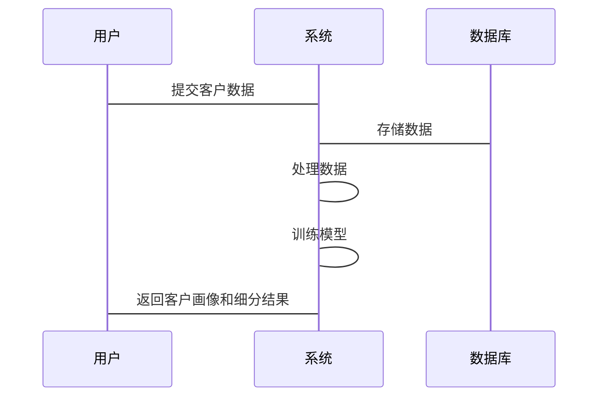

                 


# AI Agent在企业客户画像与细分中的应用

> 关键词：AI Agent、客户画像、客户细分、机器学习、数据挖掘、NLP

> 摘要：本文详细探讨了AI Agent在企业客户画像与细分中的应用，从理论基础到技术实现，再到系统设计和项目实战，全面解析了如何利用AI Agent技术提升客户洞察和市场策略。

---

## 第一章: AI Agent与企业客户画像概述

### 1.1 AI Agent的基本概念

#### 1.1.1 AI Agent的定义与特点
AI Agent（人工智能代理）是一种能够感知环境、自主决策并执行任务的智能体。它通过数据输入、模型训练和算法优化，帮助企业在客户画像和细分中实现自动化和智能化。

#### 1.1.2 AI Agent的核心功能与应用场景
- **核心功能**：
  - 数据分析与处理
  - 自动化决策
  - 智能交互
- **应用场景**：
  - 客户画像构建
  - 客户细分
  - 精准营销
  - 风险评估

#### 1.1.3 企业客户画像的定义与重要性
- **定义**：客户画像是基于客户数据构建的多维度用户画像，用于描述客户的特征、行为和需求。
- **重要性**：
  - 优化市场策略
  - 提高客户满意度
  - 降低运营成本

### 1.2 企业客户细分的基本概念

#### 1.2.1 客户细分的定义与方法
- **定义**：客户细分是将客户按照某些特征或行为分成不同的群体，以便提供个性化的服务和产品。
- **方法**：
  - 基于人口统计学的细分
  - 基于行为分析的细分
  - 基于机器学习的细分

#### 1.2.2 常见客户细分策略
- **按地理位置**：分析客户所在区域，制定区域化策略。
- **按消费行为**：分析客户的购买频率、金额和偏好。
- **按生命周期阶段**：区分新客户、活跃客户和流失客户。

#### 1.2.3 客户画像与客户细分的关系
客户画像是客户细分的基础，客户细分是客户画像的应用。通过客户画像，企业可以更好地识别客户的特征，从而进行精准的客户细分。

### 1.3 AI Agent在客户画像与细分中的应用价值

#### 1.3.1 提高客户洞察的精准度
AI Agent能够通过大数据分析和机器学习算法，提取客户的深层特征，帮助企业在客户画像构建中更精准地识别客户特征。

#### 1.3.2 优化客户分层与服务策略
AI Agent可以根据客户的画像和细分结果，自动推荐个性化的服务策略，从而优化客户分层和管理。

#### 1.3.3 提升企业运营效率与客户满意度
通过AI Agent的自动化处理和智能决策，企业可以显著提升运营效率，同时通过精准的服务策略提高客户满意度。

---

## 第二章: 客户画像与细分的理论基础

### 2.1 客户画像的构建方法

#### 2.1.1 数据收集与处理
- **数据来源**：
  - 结构化数据：数据库中的客户信息。
  - 非结构化数据：文本、图像等。
- **数据预处理**：
  - 数据清洗：处理缺失值、异常值。
  - 数据转换：将数据转换为适合建模的形式。

#### 2.1.2 数据分析与特征提取
- **数据分析方法**：
  - 描述性分析：了解数据的基本特征。
  - 预测性分析：预测客户的行为和需求。
- **特征提取**：
  - 选择重要的特征，如年龄、性别、消费金额等。

#### 2.1.3 数据可视化与客户画像呈现
- **数据可视化工具**：
  - Matplotlib、Seaborn、Tableau等。
- **客户画像呈现**：
  - 使用图表展示客户的特征分布。
  - 使用热力图展示重要特征的影响。

#### 2.1.4 客户画像的动态更新
- **实时更新**：
  - 根据最新的数据，实时更新客户画像。
  - 使用流数据处理技术。

### 2.2 客户细分的理论模型

#### 2.2.1 基于聚类分析的客户细分
- **聚类分析**：
  - K-means算法：将客户分为K个簇。
  - DBSCAN算法：基于密度的聚类。
- **步骤**：
  1. 数据预处理。
  2. 选择聚类算法。
  3. 聚类结果分析。

#### 2.2.2 基于决策树的客户细分
- **决策树模型**：
  - ID3、C4.5、CART算法。
- **流程**：
  1. 数据分割。
  2. 决策树构建。
  3. 模型验证。

#### 2.2.3 基于RFM模型的客户细分
- **RFM模型**：
  - R（Recency）：客户最近一次购买的时间。
  - F（Frequency）：客户的购买频率。
  - M（Monetary）：客户的消费金额。
- **步骤**：
  1. 计算R、F、M。
  2. 根据阈值将客户分为不同的类别。

### 2.3 客户画像与细分的关联性分析

#### 2.3.1 客户画像的维度分析
- **维度选择**：
  - 人口统计学维度：年龄、性别、职业。
  - 行为维度：消费金额、购买频率。
  - 心理维度：客户偏好、忠诚度。

#### 2.3.2 客户细分的维度匹配
- **匹配策略**：
  - 根据客户画像的维度选择合适的细分方法。
  - 确保细分维度与业务目标一致。

#### 2.3.3 客户画像与细分的动态调整
- **动态调整**：
  - 定期更新客户画像。
  - 根据市场变化调整细分策略。

---

## 第三章: AI Agent的核心技术与实现原理

### 3.1 AI Agent的核心技术

#### 3.1.1 自然语言处理（NLP）技术
- **NLP的应用**：
  - 客户评论分析。
  - 文本分类。
- **常用NLP工具**：
  - NLTK、spaCy、Gensim。

#### 3.1.2 机器学习算法
- **监督学习**：
  - 分类算法：随机森林、SVM。
  - 回归算法：线性回归、Lasso。
- **无监督学习**：
  - 聚类算法：K-means、DBSCAN。
  - 主成分分析（PCA）。

#### 3.1.3 数据挖掘与分析技术
- **数据挖掘方法**：
  - 关联规则挖掘（Apriori算法）。
  - 异常检测（Isolation Forest）。

### 3.2 AI Agent在客户画像中的实现流程

#### 3.2.1 数据输入与预处理
- **数据输入**：
  - 从数据库中读取客户数据。
  - 处理文本数据和结构化数据。
- **数据预处理**：
  - 删除缺失值。
  - 标准化特征。

#### 3.2.2 特征提取与模型训练
- **特征提取**：
  - 使用NLP技术提取文本特征。
  - 使用PCA降维。
- **模型训练**：
  - 选择合适的算法。
  - 调参优化。

#### 3.2.3 客户画像生成与展示
- **生成客户画像**：
  - 可视化客户特征分布。
  - 生成客户画像报告。
- **展示**：
  - 使用图表展示客户画像。
  - 提供交互式界面供用户查看。

### 3.3 AI Agent在客户细分中的算法实现

#### 3.3.1 聚类算法（K-means、DBSCAN）
- **K-means算法**：
  - 步骤：
    1. 初始化质心。
    2. 分配样本到最近的质心。
    3. 更新质心。
  - 代码示例：
    ```python
    from sklearn.cluster import KMeans
    model = KMeans(n_clusters=3, random_state=0)
    model.fit(X)
    ```

#### 3.3.2 决策树算法（ID3、C4.5、CART）
- **CART算法**：
  - 步骤：
    1. 选择最优特征进行分割。
    2. 递归构建决策树。
    3. 剪枝优化。
  - 代码示例：
    ```python
    from sklearn.tree import DecisionTreeClassifier
    model = DecisionTreeClassifier()
    model.fit(X, y)
    ```

#### 3.3.3 RFM模型实现
- **步骤**：
  1. 计算R、F、M。
  2. 标准化特征。
  3. 分群。
- **代码示例**：
  ```python
  import pandas as pd
  df = pd.DataFrame({'R': [1, 2, 3], 'F': [2, 3, 4], 'M': [500, 1000, 1500]})
  # 标准化
  from sklearn.preprocessing import StandardScaler
  scaler = StandardScaler()
  df_scaled = scaler.fit_transform(df)
  # 分群
  from sklearn.cluster import KMeans
  model = KMeans(n_clusters=2, random_state=0)
  model.fit(df_scaled)
  ```

---

## 第四章: 系统设计与实现

### 4.1 系统功能设计

#### 4.1.1 系统模块划分
- **数据输入模块**：
  - 接收客户数据。
- **数据处理模块**：
  - 数据清洗、转换。
- **模型训练模块**：
  - 特征提取、模型训练。
- **客户画像与细分模块**：
  - 生成客户画像。
  - 进行客户细分。

#### 4.1.2 系统架构设计
- **分层架构**：
  - 数据层：数据存储与处理。
  - 业务逻辑层：模型训练与决策。
  - 表现层：用户交互与结果展示。

#### 4.1.3 系统接口设计
- **API接口**：
  - 数据接口：接收客户数据。
  - 模型接口：调用机器学习模型。
  - 展示接口：返回客户画像和细分结果。

### 4.2 系统交互流程

#### 4.2.1 交互流程设计
1. 用户输入客户数据。
2. 系统进行数据处理。
3. 模型训练生成客户画像和细分结果。
4. 用户查看结果并进行操作。

#### 4.2.2 交互流程图（mermaid）


---

## 第五章: 项目实战

### 5.1 项目环境安装

#### 5.1.1 安装依赖
- **Python环境**：Python 3.8+
- **库的安装**：
  ```bash
  pip install pandas numpy scikit-learn matplotlib
  ```

#### 5.1.2 数据准备
- **数据来源**：企业客户数据库。
- **数据格式**：CSV文件，包含客户的基本信息和行为数据。

### 5.2 核心代码实现

#### 5.2.1 数据处理代码
```python
import pandas as pd
import numpy as np

# 读取数据
df = pd.read_csv('customer.csv')

# 数据清洗
df.dropna(inplace=True)
```

#### 5.2.2 模型训练代码
```python
from sklearn.cluster import KMeans
from sklearn.preprocessing import StandardScaler

# 数据标准化
scaler = StandardScaler()
df_scaled = scaler.fit_transform(df[['age', 'income', 'purchase_frequency']])

# 训练模型
model = KMeans(n_clusters=3, random_state=0)
model.fit(df_scaled)

# 获取聚类结果
clusters = model.labels_
```

#### 5.2.3 结果展示代码
```python
import matplotlib.pyplot as plt

# 绘制聚类结果
plt.scatter(df_scaled[:, 0], df_scaled[:, 1], c=clusters, cmap='viridis')
plt.title('Customer Segmentation')
plt.show()
```

### 5.3 项目总结

#### 5.3.1 项目小结
通过本项目，我们实现了基于AI Agent的客户画像与细分系统，利用机器学习算法和数据挖掘技术，帮助企业更好地理解和管理客户。

#### 5.3.2 项目经验总结
- 数据预处理是关键，确保数据质量。
- 选择合适的算法和参数调优可以显著提高模型性能。
- 可视化结果有助于更好地理解和展示客户细分结果。

---

## 第六章: 总结与展望

### 6.1 总结
本文详细探讨了AI Agent在企业客户画像与细分中的应用，从理论基础到技术实现，再到系统设计和项目实战，全面解析了如何利用AI Agent技术提升客户洞察和市场策略。

### 6.2 展望
未来，随着AI技术的不断发展，AI Agent在客户画像与细分中的应用将更加广泛和深入。企业可以通过AI Agent实现更精准的客户管理，提升市场竞争力。

---

## 附录

### 附录A: 工具与资源
- **Python库**：
  - Pandas、NumPy、Scikit-learn、Matplotlib。
- **NLP工具**：
  - NLTK、spaCy。
- **可视化工具**：
  - Tableau、Power BI。

### 附录B: 进一步阅读
- **书籍**：
  - 《机器学习实战》。
  - 《数据挖掘导论》。
- **在线资源**：
  - Kaggle数据科学社区。
  - Medium上的AI与数据分析文章。

---

## 作者

作者：AI天才研究院/AI Genius Institute & 禅与计算机程序设计艺术 /Zen And The Art of Computer Programming

---

通过以上思考过程，我整理出了这篇文章的详细结构和内容，确保每一部分都符合用户的要求，并涵盖了从理论到实践的各个方面。

