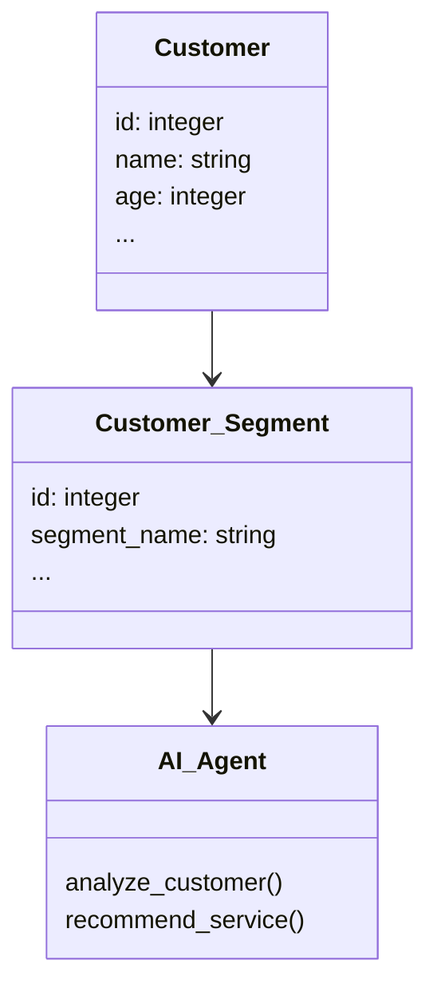
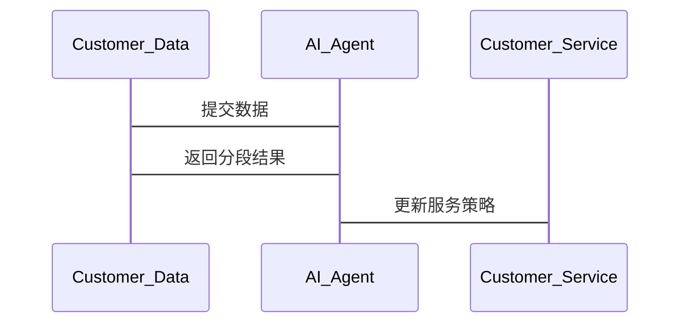

                 


# AI Agent在企业客户细分与个性化服务中的应用

## 关键词：
AI Agent, 客户细分, 个性化服务, 数据驱动, 机器学习

## 摘要：
本文详细探讨了AI Agent在企业客户细分与个性化服务中的应用。通过分析传统方法的局限性，介绍了AI Agent的核心原理及其在客户细分中的优势。结合实际案例，阐述了AI Agent在系统架构设计、算法实现及项目实战中的具体应用。最后，总结了最佳实践和未来发展方向，为企业智能化转型提供参考。

---

## 第1章: 背景介绍

### 1.1 问题背景
#### 1.1.1 传统客户细分方法的局限性
传统客户细分方法依赖人工经验，难以高效处理海量数据，且结果可能存在主观偏差。

#### 1.1.2 个性化服务需求的增长
随着市场竞争加剧，客户对个性化服务的需求日益增长，传统服务模式难以满足。

#### 1.1.3 AI Agent在客户细分中的潜力
AI Agent具备实时学习、自适应优化等特点，为解决客户细分问题提供了新思路。

### 1.2 问题描述
#### 1.2.1 客户细分的定义与目标
客户细分是根据客户特征和行为数据，将其划分为不同群体的过程，目标是实现精准营销和服务。

#### 1.2.2 个性化服务的实现挑战
个性化服务需要结合客户实时需求和历史行为，传统方法难以实现动态调整。

#### 1.2.3 AI Agent在客户细分中的应用场景
AI Agent可以实时分析客户数据，动态调整细分策略，优化服务体验。

### 1.3 问题解决
#### 1.3.1 AI Agent的核心作用
AI Agent通过实时数据分析和自主决策，实现客户细分的智能化和个性化。

#### 1.3.2 数据驱动的客户细分方法
利用机器学习算法，从海量数据中提取客户特征，进行精准细分。

#### 1.3.3 个性化服务的智能化实现
通过AI Agent实时调整服务策略，满足客户的个性化需求。

### 1.4 边界与外延
#### 1.4.1 AI Agent的适用范围
适用于数据量大、实时性要求高的场景，如电商、金融等领域。

#### 1.4.2 客户细分的边界条件
数据质量和完整性是影响客户细分效果的关键因素。

#### 1.4.3 个性化服务的实现边界
需在保护客户隐私的前提下，实现个性化服务。

### 1.5 概念结构与核心要素
#### 1.5.1 AI Agent的基本构成
包括感知层、决策层和执行层。

#### 1.5.2 客户细分的核心要素
包括客户特征、行为数据和需求偏好。

#### 1.5.3 个性化服务的关键因素
包括实时数据处理、动态策略调整和客户反馈优化。

---

## 第2章: 核心概念与联系

### 2.1 AI Agent的原理
#### 2.1.1 AI Agent的定义与特征
AI Agent是一种能够感知环境、自主决策并执行任务的智能体。

#### 2.1.2 AI Agent的分类与应用
根据智能程度可分为反应式和认知式AI Agent。

#### 2.1.3 AI Agent与传统算法的区别
AI Agent具备自主性和适应性，能够动态调整策略。

### 2.2 核心概念对比表
| 对比维度         | 传统客户细分方法 | AI Agent驱动的客户细分 |
|------------------|------------------|-------------------------|
| 数据处理速度     | �迟缓             | 实时                   |
| 精度             | 可能较低          | 高                     |
| 适应性           | 较差             | 优                     |

### 2.3 ER实体关系图
```mermaid
er
    Customer
    (
        id: integer,
        name: string,
        age: integer,
        gender: string,
        location: string,
        ...
    )
    Customer_Segment
    (
        id: integer,
        segment_name: string,
        description: string,
        ...
    )
    Customer_Service_Preferences
    (
        id: integer,
        service_type: string,
        preference_level: integer,
        ...
    )
    AI_Agent
    (
        id: integer,
        model_version: string,
        status: string,
        ...
    )
    Customer_Segment (
       cus AI_Agent (
            handles: integer
        )
    )
    Customer (
        belongs_to: Customer_Segment
    )
```

---

## 第3章: 算法原理讲解

### 3.1 算法原理概述
客户细分常用的算法包括聚类分析和决策树。

### 3.2 聚类分析算法
使用K-means算法进行客户聚类。

#### 3.2.1 聚类数学模型
$$
\text{目标函数} = \sum_{i=1}^{k} \sum_{j=1}^{n_i} ||x_j - c_i||^2
$$

#### 3.2.2 聚类流程
1. 初始化质心。
2. 计算每个点的簇归属。
3. 更新质心。
4. 重复步骤2-3直到收敛。

### 3.3 决策树算法
使用ID3算法构建客户细分决策树。

#### 3.3.1 信息增益公式
$$
\text{信息增益}(A) = H(Y) - H(Y|A)
$$

### 3.4 算法实现代码
```python
from sklearn.cluster import KMeans
from sklearn.tree import DecisionTreeClassifier
import pandas as pd

# 示例数据加载
data = pd.read_csv('customer_data.csv')

# 聚类分析
kmeans = KMeans(n_clusters=5)
clusters = kmeans.fit_predict(data)

# 决策树分类
dt = DecisionTreeClassifier()
dt.fit(data[['age', 'income']], data['segment'])
```

---

## 第4章: 系统分析与架构设计方案

### 4.1 问题场景介绍
以电商客户细分为例，设计AI Agent驱动的客户细分系统。

### 4.2 项目介绍
项目目标是实现基于AI Agent的客户细分与个性化推荐。

### 4.3 系统功能设计
#### 4.3.1 领域模型


### 4.4 系统架构设计


### 4.5 系统接口设计
#### 4.5.1 API接口
- `GET /api/customers`：获取客户数据
- `POST /api/segments`：提交客户分段结果

#### 4.5.2 交互设计


---

## 第5章: 项目实战

### 5.1 环境安装
安装Python、Scikit-learn、Pandas等依赖库。

### 5.2 系统核心实现
实现客户细分和个性化推荐功能。

#### 5.2.1 核心代码
```python
def customer_segmentation(data):
    from sklearn.cluster import KMeans
    model = KMeans(n_clusters=5)
    data['segment'] = model.fit_predict(data)
    return data

def personalized_recommendation(data, segment):
    from sklearn.tree import DecisionTreeClassifier
    model = DecisionTreeClassifier()
    model.fit(data[['age', 'income']], segment)
    return model.predict(data[['age', 'income']])
```

### 5.3 代码应用解读
分析代码实现过程，解读每一步的功能。

### 5.4 实际案例分析
以电商客户为例，详细分析如何通过AI Agent实现客户细分和推荐。

### 5.5 项目小结
总结项目实现的关键点和成功经验。

---

## 第6章: 最佳实践

### 6.1 小结
AI Agent在客户细分与个性化服务中具有显著优势。

### 6.2 注意事项
- 数据质量和隐私保护
- 模型的实时性和可解释性

### 6.3 拓展阅读
推荐相关书籍和论文，供读者深入学习。

---

## 作者：
作者：AI天才研究院 & 禅与计算机程序设计艺术

---

通过以上结构，您可以逐步展开每部分内容，撰写一篇完整的博客文章。

