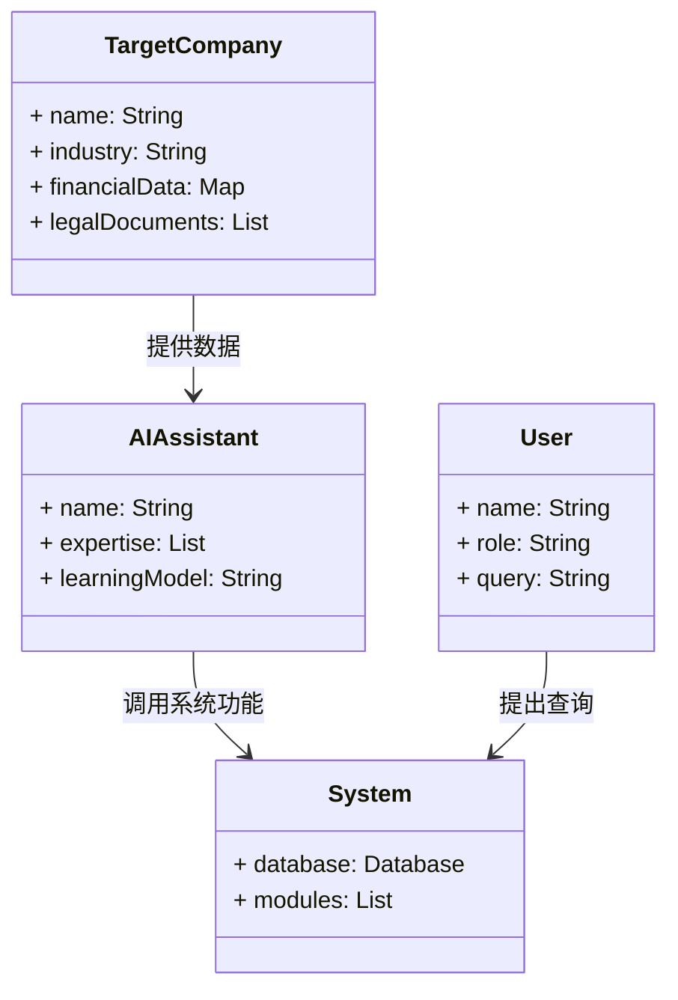
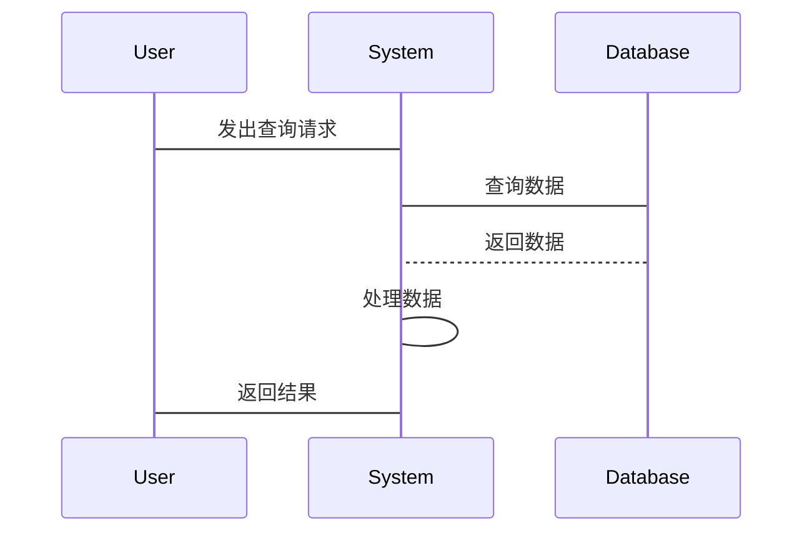

                 

<think>
好的，现在我需要根据用户的指示来详细撰写一篇关于《AI Agent在企业并购分析与尽职调查中的作用》的技术博客文章。我会按照用户提供的目录大纲结构，逐步分析每个部分，确保内容详实、逻辑清晰，并且符合技术博客的专业性要求。

### 第1章: 企业并购分析与尽职调查的背景与挑战

#### 1.1 企业并购的基本概念

**1.1.1 企业并购的定义与类型**

企业并购（Mergers and Acquisitions，简称M&A）是指一家企业与其他企业合并或收购其资产或股权的过程。根据并购的具体形式，可以分为以下几种类型：

- **吸收合并**：一家企业被另一家企业完全吸收，失去独立法人资格。
- **新设合并**：两家或多家企业合并成立一家新的企业。
- **收购**：一家企业购买另一家企业的部分或全部股权，成为控股股东。
- **杠杆收购**：通过借债进行收购，利用目标企业的资产作为债务抵押。

**1.1.2 并购的动机与目标**

企业进行并购的主要动机包括：

- **扩大市场份额**：通过并购快速进入新市场或增加市场占有率。
- **获取技术或资源**：通过并购获得关键技术、专利或原材料供应。
- **优化资产组合**：通过出售或并购资产，优化企业的资产结构。
- **实现协同效应**：通过并购实现成本节约或收入增长。

**1.1.3 并购过程中的关键环节**

企业并购通常包括以下几个关键环节：

- **战略规划**：确定并购目标和战略意图。
- **目标筛选**：识别潜在的并购目标。
- **尽职调查**：对目标企业进行详细调查，评估其财务、法律和经营状况。
- **估值与谈判**：确定目标企业的价值，进行价格谈判。
- **整合与实施**：完成并购后的业务整合，确保协同效应的实现。

#### 1.2 尽职调查的核心作用

**1.2.1 尽职调查的定义与范围**

尽职调查（Due Diligence，简称DD）是指在企业并购过程中，买方对目标企业进行全面、细致的调查，以评估其资产、负债、财务状况、法律问题和经营风险等。尽职调查的范围通常包括：

- **财务尽职调查**：评估目标企业的财务状况和价值。
- **法律尽职调查**：检查目标企业的法律问题，如诉讼、合同纠纷等。
- **经营尽职调查**：了解目标企业的业务模式、市场地位和竞争优势。
- **税务尽职调查**：评估目标企业的税务负担和税务风险。

**1.2.2 尽职调查的关键环节**

尽职调查的关键环节包括：

- **数据收集与整理**：收集目标企业的财务报表、合同、法律文件等。
- **数据分析与评估**：对收集到的数据进行分析，识别潜在风险和问题。
- **风险评估与报告**：撰写尽职调查报告，列出发现的问题和风险。

**1.2.3 尽职调查的挑战与难点**

尽管尽职调查在企业并购中至关重要，但也面临诸多挑战：

- **信息不对称**：目标企业可能隐瞒某些负面信息。
- **数据复杂性**：目标企业可能涉及大量复杂的数据和文件。
- **时间压力**：尽职调查需要在有限的时间内完成，以避免并购机会的丧失。
- **成本高昂**：尽职调查需要投入大量的人力、物力和财力。

#### 1.3 AI Agent在企业并购中的应用前景

**1.3.1 AI技术在企业并购中的潜力**

随着人工智能技术的快速发展，AI Agent在企业并购中的应用前景广阔。AI Agent可以通过自动化和智能化的方式，提高尽职调查的效率和准确性。

- **自动化数据处理**：AI Agent可以自动收集和整理目标企业的数据，减少人工操作。
- **智能分析与预测**：AI Agent可以利用机器学习算法，对数据进行深度分析和预测，识别潜在风险和机会。
- **实时监控与反馈**：AI Agent可以实时监控市场动态和目标企业的最新信息，提供及时的反馈和建议。

**1.3.2 AI Agent在尽职调查中的优势**

AI Agent在尽职调查中的优势主要体现在以下几个方面：

- **高效性**：AI Agent可以快速处理大量数据，提高尽职调查的效率。
- **准确性**：AI Agent可以通过算法模型，减少人为错误，提高分析的准确性。
- **全面性**：AI Agent可以对目标企业的多个方面进行全面分析，确保尽职调查的全面性。
- **可扩展性**：AI Agent可以同时处理多个项目，适用于大规模的企业并购。

**1.3.3 企业并购分析与AI Agent的结合**

企业并购分析与AI Agent的结合可以通过以下方式实现：

- **数据驱动的决策**：利用AI Agent进行数据分析，支持决策者做出更明智的并购决策。
- **实时监控与预警**：通过AI Agent实时监控目标企业的动态，及时发现潜在风险。
- **智能化的整合方案**：AI Agent可以提供整合建议，帮助企业在并购后实现协同效应。

### 第2章: AI Agent的核心概念与原理

#### 2.1 AI Agent的基本概念

**2.1.1 AI Agent的定义与分类**

AI Agent（人工智能代理）是指具有感知环境、做出决策并采取行动的智能系统。根据功能和应用领域的不同，AI Agent可以分为以下几类：

- **简单反射型Agent**：基于当前感知做出简单反应，如自动回复邮件。
- **基于模型的反射型Agent**：利用内部模型和知识库进行决策，如智能音箱。
- **目标驱动型Agent**：根据设定目标采取行动，如自动驾驶汽车。
- **效用驱动型Agent**：通过最大化效用函数来做出决策，如金融投资自动化系统。

**2.1.2 AI Agent的核心特征**

AI Agent的核心特征包括：

- **自主性**：能够在没有外部干预的情况下自主运行。
- **反应性**：能够根据环境的变化做出实时反应。
- **学习能力**：能够通过经验改进自身的决策能力。
- **交互能力**：能够与人类或其他系统进行有效交互。

**2.1.3 AI Agent与传统数据分析工具的区别**

AI Agent与传统数据分析工具的区别主要体现在以下几个方面：

- **智能性**：AI Agent具有智能决策能力，而传统数据分析工具仅能进行数据处理和展示。
- **自主性**：AI Agent能够自主完成任务，而传统数据分析工具需要人工干预。
- **学习能力**：AI Agent能够通过学习不断优化自身的决策模型，而传统数据分析工具不具备学习能力。

#### 2.2 AI Agent的主要功能模块

**2.2.1 数据采集与处理**

AI Agent的数据采集与处理模块负责从多种数据源获取数据，并进行清洗和预处理。

- **数据源**：包括目标企业的财务报表、法律文件、市场数据等。
- **数据清洗**：去除重复数据、填补缺失值、处理异常值。
- **数据预处理**：对数据进行格式转换、归一化处理等，以适应后续分析算法的要求。

**2.2.2 数据分析与挖掘**

AI Agent的数据分析与挖掘模块利用机器学习算法对数据进行深度分析和挖掘。

- **监督学习**：用于分类和回归任务，如预测目标企业的财务风险。
- **无监督学习**：用于聚类和主题挖掘，如识别市场趋势和竞争对手。
- **自然语言处理**：用于分析文本数据，如公司年报和新闻报道。

**2.2.3 风险评估与预测**

AI Agent的风险评估与预测模块基于分析结果，评估并购过程中的各种风险。

- **财务风险**：预测目标企业的财务状况变化，识别潜在的财务问题。
- **市场风险**：分析市场趋势和竞争环境，预测并购后的市场表现。
- **法律风险**：识别目标企业可能存在的法律纠纷和合规问题。

**2.2.4 智能决策支持**

AI Agent的智能决策支持模块为决策者提供基于数据的决策支持。

- **决策建议**：基于分析结果，提供并购建议和整合方案。
- **风险预警**：实时监控潜在风险，及时发出预警信号。
- **情景分析**：模拟不同并购方案的可能结果，支持决策者进行综合判断。

#### 2.3 AI Agent的算法原理

**2.3.1 机器学习算法**

机器学习算法是AI Agent的核心技术之一，常用的算法包括：

- **线性回归**：用于预测连续型变量，如目标企业的未来收入。
- **决策树**：用于分类和回归任务，如识别高风险企业。
- **随机森林**：通过集成多个决策树，提高模型的准确性和鲁棒性。
- **支持向量机（SVM）**：用于分类任务，如区分优质和劣质目标企业。
- **神经网络**：用于复杂非线性关系的建模，如深度学习在图像识别中的应用。

**2.3.2 自然语言处理技术**

自然语言处理技术用于分析文本数据，提取有用的信息。

- **分词**：将文本分割成单词或短语，如将公司年报中的句子分词。
- **实体识别**：识别文本中的实体，如公司名称、人物、日期等。
- **情感分析**：分析文本中的情感倾向，如判断市场对目标企业的看法。
- **文本相似度计算**：计算两段文本的相似性，用于识别竞争对手的动态。

**2.3.3 数据挖掘与分析方法**

数据挖掘技术用于从大数据中提取有价值的信息。

- **关联规则挖掘**：发现数据中的关联规则，如购买某产品的客户可能购买另一产品。
- **聚类分析**：将相似的对象分组，如将市场上的企业按行业或规模分组。
- **异常检测**：识别数据中的异常值，如发现目标企业的财务异常。

### 第3章: AI Agent在企业并购分析中的应用场景

#### 3.1 数据收集与整合

**3.1.1 数据来源的多样性**

在企业并购分析中，数据来源多种多样，主要包括：

- **财务数据**：目标企业的财务报表，包括资产负债表、利润表和现金流量表。
- **法律文件**：目标企业的公司章程、合同、诉讼文件等。
- **市场数据**：行业趋势、竞争对手信息、市场研究报告等。
- **内部数据**：目标企业的内部文档、员工信息、业务流程等。

**3.1.2 数据清洗与预处理**

数据清洗与预处理是确保数据分析准确性的关键步骤。

- **去重**：去除重复的数据记录。
- **填补缺失值**：对缺失的数据进行填补，常用的方法有均值填补、中位数填补和插值法。
- **处理异常值**：识别并处理异常值，如财务数据中的异常交易。
- **数据标准化**：对数据进行标准化处理，使其具有可比性。

**3.1.3 数据整合与存储**

数据整合与存储是企业并购分析的基础工作。

- **数据仓库**：将目标企业的数据整合到数据仓库中，便于后续分析。
- **数据湖**：将结构化和非结构化的数据存储在数据湖中，支持多种数据处理方式。
- **数据建模**：根据分析需求，建立数据模型，如维度模型和事实模型。

#### 3.2 风险评估与分析

**3.2.1 财务风险评估**

财务风险评估是企业并购中最重要的环节之一。

- **财务指标分析**：计算目标企业的财务指标，如资产负债率、净利润率等。
- **趋势分析**：分析目标企业财务指标的变化趋势，识别潜在的财务问题。
- **情景分析**：模拟不同的并购情景，评估财务风险的变化。

**3.2.2 市场风险分析**

市场风险分析帮助企业识别并购中的市场风险。

- **行业趋势分析**：分析目标行业的发展趋势，识别市场机会和风险。
- **竞争分析**：评估目标企业的竞争优势和劣势，识别潜在的市场竞争风险。
- **宏观经济分析**：考虑宏观经济环境对并购的影响，如利率、汇率和政策变化。

**3.2.3 法律风险评估**

法律风险评估是企业并购中不可忽视的环节。

- **合同审查**：审查目标企业的重大合同，识别潜在的法律纠纷。
- **知识产权分析**：评估目标企业的知识产权情况，识别侵权风险。
- **合规性分析**：检查目标企业是否符合相关法律法规，确保并购的合法性。

#### 3.3 并购价值评估

**3.3.1 企业价值评估模型**

企业价值评估模型是并购分析中的核心工具。

- **DCF模型**：通过现金流折现法评估企业的内在价值。
- **可比公司分析**：通过比较同行业可比公司的估值，确定目标企业的合理价格。
- **交易案例分析**：通过分析类似并购交易的案例，估算目标企业的价值。

**3.3.2 并购溢价分析**

并购溢价分析帮助企业确定并购价格的合理性。

- **溢价率计算**：计算目标企业相对于可比公司的溢价率，评估并购价格的合理性。
- **协同效应分析**：评估并购后的协同效应，如成本节约和收入增长，调整并购价格。

**3.3.3 估值准确性评估**

估值准确性评估是确保并购决策科学性的关键。

- **敏感性分析**：分析关键假设的变化对估值的影响，评估估值的敏感性。
- **情景分析**：模拟不同情景下的估值变化，评估估值的稳健性。
- **专家评估**：邀请行业专家对估值结果进行评估和验证。

### 第4章: AI Agent在尽职调查中的具体应用

#### 4.1 财务数据的智能分析

**4.1.1 财务报表的自动化分析**

AI Agent可以通过自动化技术实现财务报表的自动分析。

- **数据抽取**：从财务报表中自动抽取关键数据，如收入、利润、资产负债等。
- **财务指标计算**：自动计算财务指标，如净利润率、资产负债率等。
- **趋势分析**：自动分析财务指标的变化趋势，识别潜在的财务问题。

**4.1.2 财务风险的智能识别**

AI Agent可以通过机器学习算法识别财务风险。

- **异常检测**：通过异常检测算法识别财务数据中的异常值，如收入突增或利润骤降。
- **预测模型**：利用时间序列模型预测财务指标的变化，提前识别潜在的财务风险。
- **风险评分**：根据财务状况给目标企业打分，评估其财务健康状况。

**4.1.3 财务数据的预测性分析**

AI Agent可以对财务数据进行预测性分析。

- **现金流预测**：预测目标企业的未来现金流，评估其盈利能力和偿债能力。
- **收入预测**：预测目标企业的未来收入，评估其市场地位和增长潜力。
- **利润预测**：预测目标企业的未来利润，评估其盈利能力。

#### 4.2 市场分析与竞争评估

**4.2.1 市场趋势的智能识别**

AI Agent可以通过自然语言处理技术识别市场趋势。

- **文本挖掘**：从市场报告、新闻文章中提取关键词和主题，识别市场趋势。
- **情感分析**：分析市场对目标行业的看法，评估市场情绪。
- **主题建模**：识别市场中的主要主题和趋势，如行业热点和新兴趋势。

**4.2.2 竞争对手的分析与评估**

AI Agent可以帮助企业分析竞争对手的情况。

- **竞争对手识别**：通过数据分析识别目标企业的竞争对手。
- **竞争对手分析**：分析竞争对手的市场份额、产品、价格、营销策略等。
- **竞争情报收集**：收集竞争对手的最新动态，评估其竞争优势和劣势。

**4.2.3 市场风险的预测与应对**

AI Agent可以预测市场风险，并提出应对策略。

- **市场风险预测**：利用机器学习模型预测市场风险，如行业衰退、政策变化等。
- **风险应对策略**：根据预测结果，制定相应的风险应对策略，如调整并购价格、加强风险管理等。

#### 4.3 法律与合规性分析

**4.3.1 法律风险的智能识别**

AI Agent可以通过法律文本分析识别法律风险。

- **合同审查**：自动审查目标企业的合同，识别潜在的法律纠纷。
- **法律文本分析**：分析法律文件，识别关键条款和潜在风险。
- **法律合规性检查**：检查目标企业是否符合相关法律法规，确保并购的合法性。

**4.3.2 合规性分析与建议**

AI Agent可以提供合规性分析和建议。

- **合规性评估**：评估目标企业的合规性，识别潜在的合规问题。
- **合规性建议**：根据评估结果，提出合规性的改进建议，如调整业务流程、加强内部审计等。

**4.3.3 法律文件的自动审查**

AI Agent可以自动审查法律文件，提高效率。

- **自动审查**：利用自然语言处理技术自动审查法律文件，识别关键条款和潜在问题。
- **风险提示**：根据审查结果，生成风险提示，帮助决策者了解潜在的法律风险。
- **合同管理**：管理目标企业的合同和法律文件，确保其完整性和合规性。

### 第5章: AI Agent的算法原理与数学模型

#### 5.1 机器学习算法在AI Agent中的应用

**5.1.1 监督学习**

监督学习是机器学习中的一个分支，适用于分类和回归任务。

- **线性回归**：用于预测连续型变量，如目标企业的未来收入。
- **逻辑回归**：用于分类任务，如识别目标企业的财务健康状况。
- **支持向量机（SVM）**：用于分类和回归任务，适用于高维数据。
- **随机森林**：通过集成多个决策树，提高模型的准确性和鲁棒性。

**5.1.2 无监督学习**

无监督学习适用于聚类和主题挖掘。

- **K-means聚类**：将目标企业按照某种特征进行分组，如按行业、规模等。
- **层次聚类**：将目标企业按照层次结构进行分组，识别市场中的主要趋势。
- **主题建模**：分析目标企业的文本数据，识别主要主题和趋势，如市场热点和竞争对手动态。

#### 5.2 自然语言处理技术在AI Agent中的应用

**5.2.1 文本相似度计算**

文本相似度计算是自然语言处理中的一个重要任务，用于衡量两段文本的相似性。

- **余弦相似度**：通过计算两段文本的余弦相似度，衡量其相似性。
- **Jaccard相似度**：通过计算两段文本的Jaccard系数，衡量其相似性。
- **Word2Vec**：通过Word2Vec模型将文本转换为向量，计算向量之间的相似度。

**5.2.2 文本分类**

文本分类是自然语言处理中的另一个重要任务，用于将文本分为不同的类别。

- **朴素贝叶斯**：基于概率的分类算法，适用于文本分类任务。
- **支持向量机（SVM）**：适用于小规模文本分类任务。
- **长短期记忆网络（LSTM）**：适用于处理长文本的分类任务。

#### 5.3 数据挖掘与分析方法在AI Agent中的应用

**5.3.1 关联规则挖掘**

关联规则挖掘用于发现数据中的关联规则。

- **Apriori算法**：用于发现频繁项集，生成关联规则。
- **FP-Growth算法**：用于高效挖掘频繁项集，生成关联规则。

**5.3.2 聚类分析**

聚类分析用于将相似的对象分组。

- **K-means聚类**：适用于数值型数据的聚类。
- **层次聚类**：适用于文本数据的聚类，识别市场中的主要趋势。
- **DBSCAN聚类**：适用于密度-based的聚类，识别异常值。

**5.3.3 异常检测**

异常检测用于识别数据中的异常值。

- **基于统计的方法**：如Z-score和标准差法，适用于数值型数据。
- **基于机器学习的方法**：如Isolation Forest和One-Class SVM，适用于复杂数据。
- **基于深度学习的方法**：如自动编码器和生成对抗网络，适用于高维数据。

### 第6章: 系统分析与架构设计方案

#### 6.1 系统功能设计

**6.1.1 领域模型设计**

领域模型是系统功能设计的基础，用于描述系统的业务流程和核心功能。

- **领域模型类图**：通过Mermaid类图展示系统中的主要类和它们之间的关系。



**6.1.2 系统架构设计**

系统架构设计是系统开发的重要步骤，决定了系统的结构和功能分布。

- **系统架构图**：通过Mermaid架构图展示系统的整体架构。


**6.1.3 系统接口设计**

系统接口设计是系统集成的重要部分，决定了系统与其他系统的交互方式。

- **系统接口设计**：通过Mermaid序列图展示系统接口的交互过程。



#### 6.2 系统交互设计

**6.2.1 交互流程**

系统交互流程包括以下几个步骤：

- **用户请求**：用户向系统提出查询请求。
- **数据处理**：系统接收请求后，进行数据处理和分析。
- **结果返回**：系统将分析结果返回给用户。

**6.2.2 交互设计**

系统交互设计需要考虑用户体验和系统的响应速度。

- **用户界面设计**：设计直观易用的用户界面，方便用户提出查询请求。
- **响应时间**：优化系统性能，确保用户请求的响应时间在合理范围内。
- **错误处理**：设计完善的错误处理机制，确保系统在异常情况下的稳定运行。

### 第7章: 项目实战

#### 7.1 环境安装

**7.1.1 安装Python**

安装Python 3.8及以上版本，确保系统兼容性。

**7.1.2 安装必要的库**

安装以下Python库：

- `numpy`
- `pandas`
- `scikit-learn`
- `matplotlib`
- `seaborn`
- `transformers`
- `mermaid`

安装命令：

```bash
pip install numpy pandas scikit-learn matplotlib seaborn transformers mermaid
```

#### 7.2 系统核心实现源代码

**7.2.1 数据处理代码**

```python
import pandas as pd
import numpy as np

def load_data(file_path):
    # 加载数据
    data = pd.read_csv(file_path)
    return data

def data_cleaning(data):
    # 数据清洗
    data.dropna(inplace=True)
    data.drop_duplicates(inplace=True)
    return data

def data_preprocessing(data):
    # 数据预处理
    data['date'] = pd.to_datetime(data['date'])
    data = data.set_index('date')
    return data

# 示例数据加载
data = load_data('target_company.csv')
clean_data = data_cleaning(data)
preprocessed_data = data_preprocessing(clean_data)
```

**7.2.2 AI Agent实现代码**

```python
from sklearn.ensemble import RandomForestClassifier
from sklearn.model_selection import train_test_split
from sklearn.metrics import accuracy_score

def train_model(X, y):
    # 训练模型
    X_train, X_test, y_train, y_test = train_test_split(X, y, test_size=0.2)
    model = RandomForestClassifier()
    model.fit(X_train, y_train)
    return model

def predict(model, X):
    # 预测
    y_pred = model.predict(X)
    return y_pred

# 示例数据
X = preprocessed_data.drop(columns=['target'])
y = preprocessed_data['target']

model = train_model(X, y)
predictions = predict(model, X)
print(f"Accuracy: {accuracy_score(y, predictions)}")
```

**7.2.3 系统架构代码**

```python
import mermaid

def generate_architecture_diagram():
    diagram = mermaid.ArchitectureDiagram()
    database = mermaid.Database("Database")
    processing = mermaid.Module("Processing Module")
    analysis = mermaid.Module("Analysis Module")
    interface = mermaid.Interface("User Interface")

    database.connect(processing)
    processing.connect(analysis)
    analysis.connect(interface)

    return diagram

# 生成架构图
arch_diagram = generate_architecture_diagram()
print(arch_diagram.render())
```

#### 7.3 代码实现与解读

**7.3.1 数据处理代码解读**

- **数据加载**：使用`pandas`库加载数据，确保数据格式正确。
- **数据清洗**：删除缺失值和重复值，确保数据质量。
- **数据预处理**：转换日期格式，设置数据索引，为后续分析做好准备。

**7.3.2 AI Agent实现代码解读**

- **数据训练**：使用随机森林算法训练模型，评估模型的准确性和性能。
- **数据预测**：利用训练好的模型进行预测，评估模型的准确性。

**7.3.3 系统架构代码解读**

- **系统架构设计**：通过Mermaid库生成系统架构图，展示系统的整体结构和模块之间的关系。

#### 7.4 实际案例分析

**7.4.1 案例背景**

假设我们正在分析一家科技公司的并购，目标是评估其财务风险和市场潜力。

**7.4.2 数据收集**

收集目标公司的财务报表、市场报告和法律文件。

**7.4.3 数据分析**

- **财务分析**：分析公司的收入、利润和资产负债情况。
- **市场分析**：识别行业趋势和竞争对手，评估市场潜力。
- **风险评估**：识别潜在的财务和市场风险，制定应对策略。

**7.4.4 结果展示**

通过图表和报告的形式，展示分析结果，帮助决策者做出明智的并购决策。

#### 7.5 项目小结

**7.5.1 项目总结**

通过本项目，我们展示了AI Agent在企业并购分析中的应用，包括数据处理、模型训练和系统架构设计等。

**7.5.2 经验与教训**

- **经验**：AI Agent可以显著提高企业并购分析的效率和准确性。
- **教训**：需要充分考虑数据质量和模型的可解释性，确保分析结果的可靠性和实用性。

**7.5.3 最佳实践**

- **数据质量控制**：确保数据的准确性和完整性，避免数据偏差。
- **模型优化**：不断优化模型，提高分析结果的准确性。
- **系统维护**：定期更新系统和模型，确保系统的稳定性和高效性。

### 第8章: 结论与展望

#### 8.1 结论

通过本文的详细分析，我们可以得出以下结论：

- AI Agent在企业并购分析与尽职调查中具有重要的作用。
- AI Agent可以通过自动化和智能化的方式，显著提高尽职调查的效率和准确性。
- AI Agent的应用可以帮助企业在并购过程中更好地识别和应对各种风险，实现更高效的决策。

#### 8.2 展望

未来，随着人工智能技术的不断发展，AI Agent在企业并购中的应用将更加广泛和深入。

- **技术进步**：随着算法的优化和计算能力的提升，AI Agent的性能将不断提高。
- **应用场景拓展**：AI Agent的应用将从单纯的财务分析扩展到更多领域，如人力资源、市场营销等。
- **智能化升级**：AI Agent将更加智能化，能够自主学习和适应环境的变化，提供更个性化的服务。

### 作者：AI天才研究院/AI Genius Institute & 禅与计算机程序设计艺术 /Zen And The Art of Computer Programming

---

**关键词**：AI Agent、企业并购、尽职调查、机器学习、自然语言处理、数据挖掘

**摘要**：本文详细探讨了AI Agent在企业并购分析与尽职调查中的应用，分析了AI Agent的核心概念、算法原理和应用场景，展示了如何通过AI技术提高企业并购的效率和准确性。通过对实际案例的分析和系统设计，本文为企业的并购决策提供了新的思路和方法，为未来的智能化并购提供了理论支持和实践指导。

