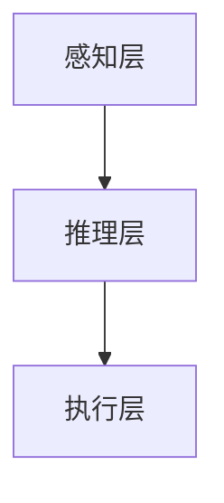
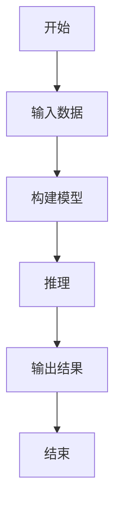
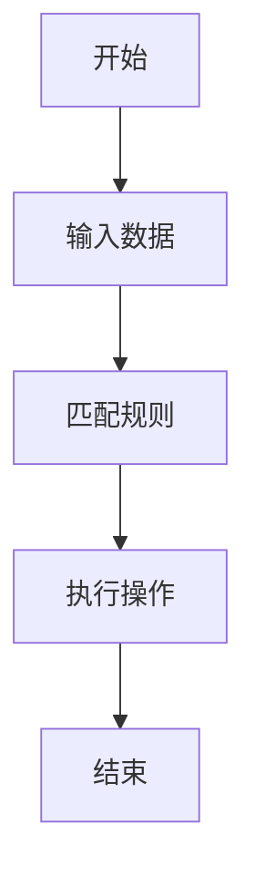
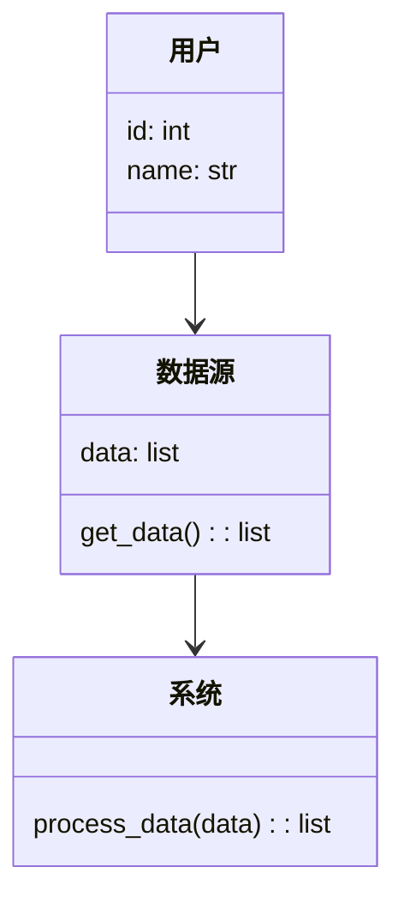
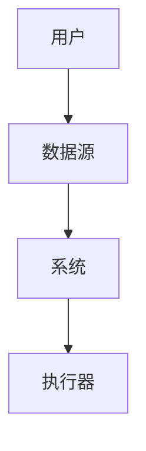
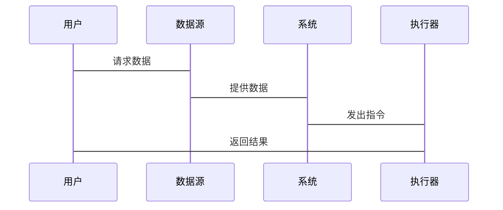

                 


# AI Agent在企业数字化转型中的关键角色与实施策略

> 关键词：AI Agent, 数字化转型, 企业应用, 人工智能, 自动化

> 摘要：本文探讨了AI Agent在企业数字化转型中的核心作用，分析了其在企业中的应用策略，并通过详细的技术分析和案例研究，展示了如何有效实施AI Agent以提升企业效率和竞争力。

---

## 第1章: AI Agent的基本概念与背景介绍

### 1.1 AI Agent的定义与核心概念

AI Agent是一种智能代理，能够感知环境、自主决策并采取行动以实现目标。它不同于传统自动化系统，具备更强的适应性和主动性。

#### 1.1.1 AI Agent的基本定义
- **定义**：AI Agent是能够感知环境、自主决策并执行任务的智能系统。
- **目标**：通过自动化和智能化提升企业效率和决策能力。

#### 1.1.2 AI Agent的核心属性与特征
| 属性 | 描述 |
|------|------|
| 自主性 | 能够独立决策和行动 |
| 反应性 | 根据环境反馈调整行为 |
| 社交能力 | 能与人类或其他系统有效交互 |

#### 1.1.3 AI Agent与传统自动化系统的区别
- **传统自动化**：基于规则执行任务，缺乏灵活性。
- **AI Agent**：具备学习和自适应能力，能够处理复杂问题。

### 1.2 数字化转型的背景与挑战

#### 1.2.1 数字化转型的定义与目标
- **定义**：通过技术手段将业务流程转化为数字化、智能化的过程。
- **目标**：提升效率、优化决策、增强客户体验。

#### 1.2.2 企业数字化转型中的主要挑战
- 数据孤岛问题
- 业务流程复杂性
- 技术与组织文化的冲突

#### 1.2.3 AI Agent在数字化转型中的作用
- 提供自动化解决方案
- 优化业务流程
- 支持数据驱动的决策

---

## 第2章: AI Agent的核心概念与原理

### 2.1 AI Agent的原理与工作流程

#### 2.1.1 基于模型的推理过程
- **流程**：感知环境、构建模型、推理、行动。
- **图示**：
  ```mermaid
  graph TD
      A[感知环境] --> B[构建模型]
      B --> C[推理]
      C --> D[采取行动]
  ```

#### 2.1.2 基于规则的推理过程
- **流程**：感知环境、匹配规则、行动。
- **图示**：
  ```mermaid
  graph TD
      A[感知环境] --> B[匹配规则]
      B --> C[采取行动]
  ```

### 2.2 AI Agent的实体关系与架构

#### 2.2.1 实体关系图（ER图）
```mermaid
erDiagram
    actor 用户
    actor 系统
    actor 数据源
    actor 执行器
    用户 --> 数据源: 提供数据
    数据源 --> 系统: 处理数据
    系统 --> 执行器: 发出指令
```

#### 2.2.2 AI Agent的系统架构图


---

## 第3章: AI Agent的算法原理与实现

### 3.1 基于模型的推理算法

#### 3.1.1 算法流程图


#### 3.1.2 Python实现代码
```python
def model_based_inference(data):
    # 假设模型已训练好
    import numpy as np
    # 示例模型：简单的线性回归
    model = np.array([0.5, 0.3])
    inference = np.dot(data, model)
    return inference
```

#### 3.1.3 算法的数学模型与公式
$$ \text{预测值} = \sum (w_i \times x_i) $$

### 3.2 基于规则的推理算法

#### 3.2.1 算法流程图


#### 3.2.2 Python实现代码
```python
def rule_based_inference(data):
    # 示例规则：如果数据大于阈值，则执行操作
    threshold = 10
    if data > threshold:
        return "执行操作"
    else:
        return "不执行操作"
```

---

## 第4章: AI Agent的系统分析与架构设计

### 4.1 系统功能设计

#### 4.1.1 领域模型类图


#### 4.1.2 系统架构图


### 4.2 系统接口与交互设计

#### 4.2.1 系统交互序列图


---

## 第5章: AI Agent的项目实战

### 5.1 环境安装与配置

#### 5.1.1 开发环境搭建
- **工具**：Python、Jupyter Notebook、TensorFlow

#### 5.1.2 依赖库安装
```bash
pip install numpy matplotlib scikit-learn
```

### 5.2 核心代码实现

#### 5.2.1 基于模型的推理代码
```python
import numpy as np
from sklearn.linear_model import LinearRegression

# 示例数据
X = np.array([[1], [2], [3], [4]])
y = np.array([2, 4, 6, 8])

# 训练模型
model = LinearRegression()
model.fit(X, y)

# 推理
new_data = np.array([[5]])
prediction = model.predict(new_data)
print(prediction)  # 输出: [[10.]]
```

#### 5.2.2 基于规则的推理代码
```python
def rule_based_inference(data):
    threshold = 10
    if data > threshold:
        return "执行操作"
    else:
        return "不执行操作"
```

---

## 第6章: AI Agent的最佳实践与注意事项

### 6.1 实施AI Agent的关键成功因素

#### 6.1.1 选择合适的AI Agent类型
- 根据需求选择基于模型或基于规则的AI Agent。

#### 6.1.2 确保数据质量与安全性
- 数据是AI Agent的核心，确保数据的准确性和安全性。

#### 6.1.3 定期维护与优化
- 定期更新模型和规则，确保系统持续有效。

### 6.2 案例分析与经验分享

#### 6.2.1 成功案例分析
- 某企业通过AI Agent优化了供应链管理，提高了效率。

#### 6.2.2 实施中的常见问题及解决方案
- **问题**：数据不足。
  - **解决方案**：采用数据增强技术或使用预训练模型。

---

## 第7章: 项目总结与未来展望

### 7.1 项目总结

#### 7.1.1 项目成果
- 成功开发并实施了AI Agent系统，显著提升了企业效率。

#### 7.1.2 项目经验与教训
- 数据质量直接影响系统性能，需高度重视。

### 7.2 未来展望

#### 7.2.1 AI Agent技术的未来发展方向
- 更加智能化和自适应，结合边缘计算和物联网技术。

#### 7.2.2 数字化转型的趋势与挑战
- 更加注重人机协作，数据隐私保护成为重点。

---

## 作者：AI天才研究院 & 禅与计算机程序设计艺术

---

通过以上详细的内容，希望本文能为企业在数字化转型中实施AI Agent提供有价值的指导和参考。

