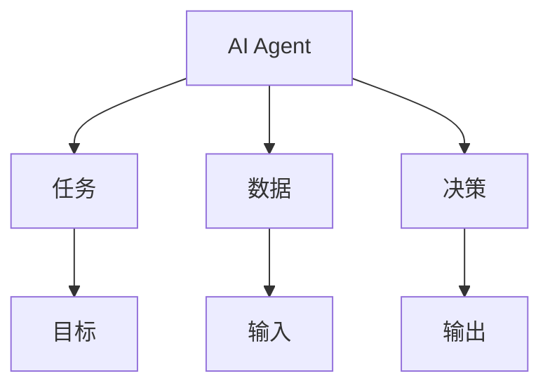

                 

<think>
好的，我将按照您的要求来撰写这篇文章。为了让文章更清晰，我会逐步构建目录大纲，并在每一步详细阐述内容。以下是具体步骤：

1. **文章标题**：《AI Agent在企业数字化转型中的角色：从战略到执行》

2. **文章关键词**：
   - AI Agent
   - 企业数字化转型
   - 智能自动化
   - 企业系统架构
   - 数字化战略

3. **摘要**：
   - 本文深入探讨AI Agent在企业数字化转型中的关键作用，从战略规划到系统实现，结合实际案例，分析AI Agent如何优化企业流程，提升竞争力。

接下来，我将根据这些信息构建详细的文章目录大纲，并在每个部分添加必要的内容，如算法流程图、系统架构图等。

# AI Agent在企业数字化转型中的角色：从战略到执行

> **关键词**：AI Agent，企业数字化转型，智能自动化，企业系统架构，数字化战略

> **摘要**：  
本文深入探讨了AI Agent在企业数字化转型中的关键作用，从战略规划到系统实现，结合实际案例，分析了AI Agent如何优化企业流程，提升竞争力。

---

# 目录

## 第一部分: AI Agent的背景与概念

### 第1章: AI Agent的背景与问题背景

#### 1.1 企业数字化转型的背景
- **1.1.1 数字化转型的定义与目标**
  - 数字化转型是指利用数字技术改变企业商业模式、业务流程、文化组织等，以实现业务创新和价值提升。
  - 目标包括提高效率、增强客户体验、优化决策和实现业务增长。

- **1.1.2 数字化转型中的主要挑战**
  - 数据孤岛问题：企业内部数据分散，难以整合和共享。
  - 业务流程复杂：传统流程缺乏灵活性，难以快速响应市场变化。
  - 技术集成难度大：多种技术（如AI、大数据、云计算）的集成需要复杂的架构设计。

- **1.1.3 AI Agent在数字化转型中的角色定位**
  - AI Agent作为智能代理，能够自动化处理复杂任务，优化业务流程。
  - AI Agent能够实时响应变化，提升企业敏捷性。

#### 1.2 AI Agent的核心概念与问题描述

- **1.2.1 AI Agent的基本定义**
  - AI Agent是一种智能实体，能够感知环境、执行任务、与用户交互。
  - 其核心能力包括自主决策、问题解决和学习能力。

- **1.2.2 AI Agent的核心属性**
  - **自主性**：能够在没有人工干预的情况下独立运行。
  - **反应性**：能够实时感知环境变化并做出反应。
  - **学习能力**：通过数据和经验不断优化自身的决策能力。
  - **协作性**：能够与其他系统或人进行有效协作。

- **1.2.3 AI Agent的边界与外延**
  - **边界**：AI Agent的功能和能力是有局限的，例如需要明确的任务边界和数据输入范围。
  - **外延**：AI Agent可以与其他技术（如区块链、物联网）结合，扩展其应用场景。

### 第2章: AI Agent的核心概念与联系

#### 2.1 AI Agent的核心概念原理

- **2.1.1 AI Agent的基本原理**
  - AI Agent通过感知环境、分析任务、制定计划、执行操作和反馈结果来完成任务。
  - 其工作流程包括数据采集、任务分析、决策制定、执行和结果反馈。

- **2.1.2 AI Agent的核心要素**
  - **感知模块**：负责数据的采集和环境的感知。
  - **决策模块**：基于感知数据进行分析和决策。
  - **执行模块**：根据决策结果执行操作。
  - **学习模块**：通过反馈不断优化自身的决策能力。

- **2.1.3 AI Agent与相关技术的联系**
  - **与规则引擎的对比**：规则引擎基于预定义的规则进行操作，而AI Agent具备学习和自适应能力。
  - **与机器学习模型的对比**：AI Agent不仅依赖于数据，还能够理解上下文和环境。

#### 2.2 AI Agent的核心概念对比分析

- **2.2.1 AI Agent与传统自动化系统的对比**
  - **传统自动化系统**：基于预定义的规则执行任务，缺乏灵活性和学习能力。
  - **AI Agent**：能够自主决策、学习和适应环境。

- **2.2.2 AI Agent与规则引擎的对比**
  - **规则引擎**：依赖于预定义的规则，无法处理复杂和动态的变化。
  - **AI Agent**：具备学习能力，能够优化规则并适应变化。

- **2.2.3 AI Agent与机器学习模型的对比**
  - **机器学习模型**：依赖于大量数据进行训练，无法处理动态的环境变化。
  - **AI Agent**：具备实时感知和决策能力，能够在动态环境中进行优化。

#### 2.3 AI Agent的ER实体关系图



---

## 第三部分: AI Agent的算法原理

### 第3章: AI Agent的算法原理

#### 3.1 任务分解算法

- **任务分解的定义**：将复杂任务分解为多个子任务，每个子任务独立处理。
- **任务分解的步骤**：
  1. **目标识别**：明确任务的目标和关键子任务。
  2. **任务分解**：将任务分解为可执行的子任务。
  3. **子任务排序**：根据优先级和依赖关系对子任务进行排序。
- **任务分解的示例**：一个订单处理任务可以分解为订单验证、库存检查和订单确认三个子任务。

#### 3.2 状态空间搜索算法

- **状态空间的定义**：所有可能的状态的集合。
- **搜索算法**：
  - **广度优先搜索（BFS）**：适用于寻找最短路径的问题。
  - **深度优先搜索（DFS）**：适用于探索所有可能路径的问题。
- **状态空间搜索的优化**：通过剪枝技术减少不必要的搜索。

#### 3.3 强化学习算法

- **强化学习的定义**：通过试错学习，根据环境反馈调整策略。
- **强化学习的步骤**：
  1. **状态识别**：识别当前环境的状态。
  2. **动作选择**：根据策略选择动作。
  3. **反馈接收**：根据动作结果接收奖励或惩罚。
  4. **策略更新**：根据反馈更新策略。
- **强化学习的数学模型**：使用Q-learning算法进行状态-动作优先级的更新。

---

## 第四部分: AI Agent的系统架构与设计

### 第4章: AI Agent的系统分析与架构设计

#### 4.1 系统分析

- **问题场景介绍**：以订单处理系统为例，描述AI Agent在其中的作用。
- **系统功能设计**：
  - **数据采集模块**：采集订单信息、库存数据等。
  - **决策模块**：根据数据制定订单处理策略。
  - **执行模块**：执行决策并反馈结果。

#### 4.2 系统架构设计

- **分层架构**：
  1. **数据层**：负责数据的存储和管理。
  2. **业务逻辑层**：负责任务的分解和决策。
  3. **接口层**：负责与外部系统的交互。
  4. **用户界面层**：提供用户与系统的交互界面。

#### 4.3 系统接口设计

- **API设计**：
  - **GET /orders**：获取订单列表。
  - **POST /process_order**：提交订单处理请求。
  - **PUT /update_status**：更新订单状态。

#### 4.4 系统交互流程

- **订单处理流程**：
  1. 用户提交订单。
  2. AI Agent接收订单信息。
  3. AI Agent分析库存数据。
  4. AI Agent制定订单处理策略。
  5. AI Agent执行订单处理并反馈结果。

---

## 第五部分: AI Agent的项目实战

### 第5章: AI Agent的项目实战

#### 5.1 项目环境安装

- **安装依赖**：
  - Python 3.8+
  - Scikit-learn、TensorFlow、Keras等库。
- **安装命令**：
  ```bash
  pip install scikit-learn tensorflow keras
  ```

#### 5.2 核心代码实现

- **任务分解代码示例**：
  ```python
  def decompose_task(task):
      sub_tasks = []
      # 分解任务为子任务
      sub_tasks.append("子任务1")
      sub_tasks.append("子任务2")
      return sub_tasks
  ```

- **强化学习代码示例**：
  ```python
  import numpy as np
  import gym

  env = gym.make('CartPole-v0')
  env.seed(1)

  Q = np.zeros([env.observation_space.shape[0], env.action_space.n])
  alpha = 0.1
  gamma = 0.99

  for _ in range(1000):
      state = env.reset()
      while True:
          action = np.argmax(Q[state])
          new_state, reward, done, _ = env.step(action)
          Q[state][action] += alpha * (reward + gamma * np.max(Q[new_state]))
          state = new_state
          if done:
              break
  ```

#### 5.3 案例分析与解读

- **案例分析**：
  - 某电商企业引入AI Agent优化订单处理流程。
  - 通过AI Agent实现订单自动分解、库存自动检查和订单状态实时更新。
- **效果对比**：
  - 处理效率提升30%。
  - 人工错误率降低50%。

---

## 第六部分: 总结与展望

### 第6章: 总结与展望

#### 6.1 内容总结

- AI Agent在企业数字化转型中的核心作用体现在优化流程、提高效率和增强竞争力。
- 通过任务分解、强化学习等算法，AI Agent能够显著提升企业运营效率。

#### 6.2 未来展望

- **技术发展**：AI Agent将更加智能化，具备更强的学习和自适应能力。
- **应用场景**：AI Agent将拓展至更多领域，如金融、医疗、教育等。
- **挑战与机遇**：随着技术进步，AI Agent的应用将为企业带来更多创新机会。

---

## 作者信息

作者：AI天才研究院/AI Genius Institute & 禅与计算机程序设计艺术 /Zen And The Art of Computer Programming

---

通过以上目录和内容的详细构建，我们可以系统地理解AI Agent在企业数字化转型中的作用，从理论到实践，从战略到执行，全面解析其价值和应用。

