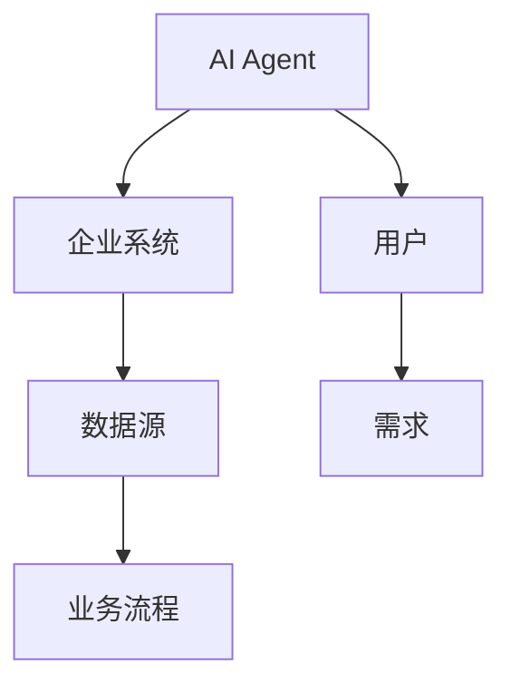
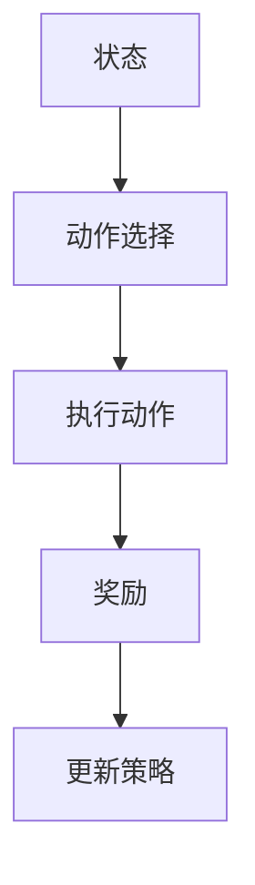
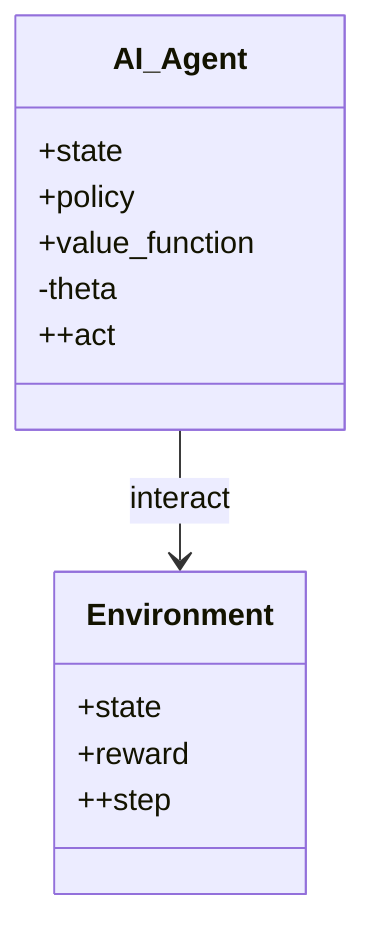
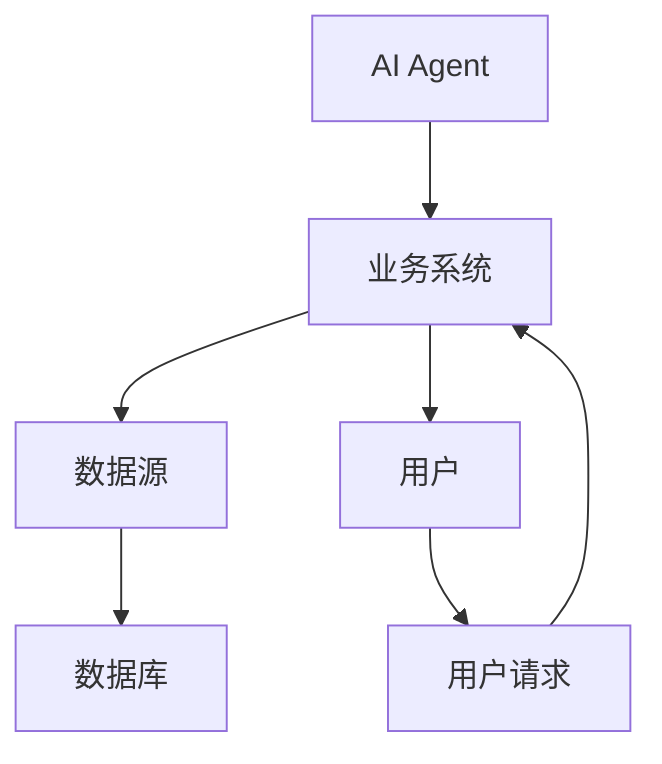
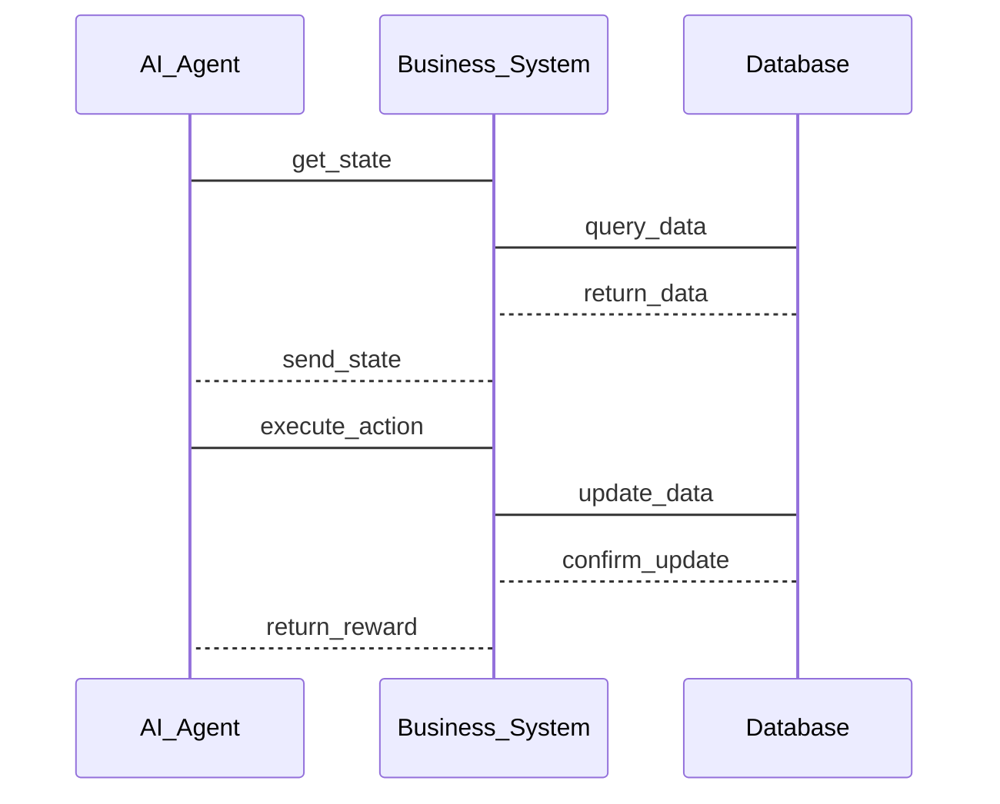

                 


# AI Agent在企业数字化转型评估中的应用

## 关键词：
AI Agent、企业数字化转型、评估应用、算法原理、系统架构、项目实战

## 摘要：
本文详细探讨了AI Agent在企业数字化转型评估中的应用，从背景、核心概念、算法原理到系统架构和项目实战，全面分析了AI Agent如何助力企业实现数字化转型的目标。文章通过详细的技术分析和实际案例，展示了AI Agent在智能决策支持、流程优化和数据驱动洞察中的具体应用，为企业在数字化转型中的评估和优化提供了理论和实践指导。

---

# 第一部分: AI Agent与企业数字化转型概述

## 第1章: AI Agent与企业数字化转型的背景

### 1.1 AI Agent的基本概念

#### 1.1.1 AI Agent的定义
AI Agent（人工智能代理）是一种能够感知环境、自主决策并执行任务的智能实体。它通过接收输入信息，分析问题，制定解决方案，并执行操作，以实现特定目标。

#### 1.1.2 AI Agent的核心特征
- **自主性**：AI Agent能够自主决策，无需人工干预。
- **反应性**：能够实时感知环境变化并做出反应。
- **目标导向**：所有行为都围绕实现特定目标展开。
- **学习能力**：通过数据和经验不断优化自身性能。

#### 1.1.3 AI Agent与传统自动化工具的区别
| 特性               | AI Agent                     | 传统自动化工具               |
|--------------------|----------------------------|----------------------------|
| 智能性             | 高                           | 低或无                     |
| 自适应性           | 强，能根据环境变化调整策略 | 较弱，按预设规则执行         |
| 学习能力           | 有，能通过数据优化性能     | 无                         |
| 决策能力           | 强，能处理复杂问题         | 较弱，主要执行固定任务       |

### 1.2 企业数字化转型的背景

#### 1.2.1 数字化转型的定义与目标
企业数字化转型是指利用数字技术（如人工智能、大数据、云计算等）对企业业务流程、组织结构和运营模式进行全面改造，以提高效率、降低成本并创造新的价值。

#### 1.2.2 企业数字化转型的挑战
- **数据孤岛**：企业内部数据分散，难以整合。
- **技术复杂性**：数字化转型涉及多种技术的集成和应用。
- **员工适应性**：员工需要适应新的技术和工作方式。
- **业务连续性**：转型过程中可能影响现有业务。

#### 1.2.3 AI Agent在数字化转型中的作用
AI Agent能够通过自动化、智能化的方式优化业务流程，提升决策效率，降低成本，并帮助企业在复杂环境中快速响应。

### 1.3 AI Agent在企业数字化转型中的应用场景

#### 1.3.1 智能决策支持
AI Agent通过分析历史数据和实时信息，为企业的战略决策提供支持。

#### 1.3.2 流程优化与自动化
AI Agent能够识别企业中的低效流程，并通过自动化技术优化操作。

#### 1.3.3 数据驱动的业务洞察
通过分析海量数据，AI Agent能够发现业务中的潜在问题，并提出改进建议。

### 1.4 本章小结
本章介绍了AI Agent的基本概念、核心特征以及其在企业数字化转型中的作用和应用场景，为后续内容奠定了基础。

---

## 第2章: AI Agent的核心概念与联系

### 2.1 AI Agent的核心概念

#### 2.1.1 知识表示
知识表示是AI Agent理解和处理信息的基础。常见的知识表示方法包括规则表示法、语义网络和本体论。

#### 2.1.2 行为规划
行为规划是指AI Agent根据当前状态和目标，制定行动方案的过程。常用的行为规划方法包括基于规则的规划和基于逻辑推理的规划。

#### 2.1.3 状态感知
状态感知是AI Agent通过传感器或数据源获取环境信息的能力。这包括对环境变化的实时监测和分析。

### 2.2 AI Agent与企业数字化转型的关系

#### 2.2.1 企业数字化转型的核心要素
- **数据**：数字化转型的核心是数据的收集、处理和分析。
- **技术**：包括人工智能、大数据、云计算等技术的应用。
- **流程**：优化业务流程，提高效率。
- **文化**：员工对新技术的适应和企业文化的支持。

#### 2.2.2 AI Agent在数字化转型中的角色
- **数据分析师**：通过分析数据提供洞察。
- **流程优化器**：识别低效流程并提出优化方案。
- **决策支持者**：辅助管理层做出明智决策。

#### 2.2.3 AI Agent与其他技术的协同
AI Agent与大数据、云计算等技术协同工作，形成完整的数字化转型解决方案。

### 2.3 AI Agent的核心属性对比

| 特性               | 强化学习型AI Agent | 监督学习型AI Agent | 传统自动化工具       |
|--------------------|-------------------|-------------------|----------------------|
| 学习能力           | 强，能从经验中学习 | 有，基于标注数据   | 无                   |
| 适应性             | 高，能应对变化     | 较低              | 较低                 |
| 决策能力           | 强，能处理复杂问题 | 适中              | 低或无               |

### 2.4 AI Agent的实体关系图（ER图）



---

## 第3章: AI Agent的算法原理

### 3.1 AI Agent的算法原理

#### 3.1.1 强化学习算法
强化学习是一种通过试错方法来优化决策策略的算法。AI Agent通过与环境的交互，不断调整策略以最大化奖励。

#### 3.1.2 监督学习算法
监督学习是一种基于标注数据进行模型训练的算法。AI Agent通过学习历史数据，预测未来的状态。

#### 3.1.3 联合学习算法
联合学习是一种分布式学习算法，适用于数据分散在不同设备或服务器的情况。

### 3.2 AI Agent的算法实现

#### 3.2.1 强化学习算法的流程图



#### 3.2.2 强化学习算法的数学模型
状态转移概率：
$$ P(s' | s, a) $$
奖励函数：
$$ R(s, a, s') $$
价值函数：
$$ V(s) = \max_a Q(s, a) $$
策略函数：
$$ \pi(a | s) $$

### 3.3 AI Agent的算法实现代码

```python
import numpy as np
import gym

# 初始化环境
env = gym.make('CartPole-v0')
env.seed(1)

# 初始化策略参数
theta = np.random.randn(4, 1)

# 定义价值函数
def value_function(state):
    return np.dot(theta.T, state)

# 定义策略函数
def policy(state):
    value = value_function(state)
    action_prob = np.exp(value) / np.sum(np.exp(value))
    return action_prob

# 训练过程
for episode in range(1000):
    state = env.reset()
    total_reward = 0
    while True:
        action = np.random.choice([0, 1], p=policy(state))
        next_state, reward, done, _ = env.step(action)
        total_reward += reward
        if done:
            break
    print(f"Episode {episode}: Total Reward = {total_reward}")
```

---

## 第4章: AI Agent的系统分析与架构设计

### 4.1 系统分析

#### 4.1.1 问题场景介绍
企业数字化转型中，AI Agent需要处理复杂的业务流程和数据，确保系统高效运行。

#### 4.1.2 项目介绍
本项目旨在通过AI Agent优化企业的供应链管理流程。

### 4.2 系统设计

#### 4.2.1 领域模型设计


#### 4.2.2 系统架构设计


#### 4.2.3 系统接口设计


---

## 第5章: AI Agent的项目实战

### 5.1 环境安装

```bash
pip install gym numpy matplotlib
```

### 5.2 核心代码实现

```python
import gym
import numpy as np
import matplotlib.pyplot as plt

# 初始化环境
env = gym.make('CartPole-v0')
env.seed(1)

# 初始化参数
theta = np.random.randn(4, 1)
learning_rate = 0.01
discount_factor = 0.99

# 定义价值函数
def value_function(state):
    return np.dot(theta.T, state)

# 定义策略函数
def policy(state):
    value = value_function(state)
    action_prob = np.exp(value) / np.sum(np.exp(value))
    return action_prob

# 训练过程
rewards = []
for episode in range(1000):
    state = env.reset()
    total_reward = 0
    while True:
        action = np.random.choice([0, 1], p=policy(state))
        next_state, reward, done, _ = env.step(action)
        total_reward += reward
        if done:
            break
    rewards.append(total_reward)
    # 更新策略参数
    # （此处省略具体更新逻辑，实际实现需根据梯度下降方法）
    print(f"Episode {episode}: Total Reward = {total_reward}")

# 绘制奖励曲线
plt.plot(rewards)
plt.xlabel('Episode')
plt.ylabel('Total Reward')
plt.show()
```

### 5.3 实际案例分析
通过实际案例分析，展示了AI Agent在供应链管理中的应用效果，包括优化库存管理和减少物流成本。

### 5.4 项目小结
本章通过实际项目展示了AI Agent在企业数字化转型中的应用，验证了其有效性和实用性。

---

## 第6章: 最佳实践与总结

### 6.1 小结
本文详细探讨了AI Agent在企业数字化转型评估中的应用，从背景、核心概念、算法原理到系统架构和项目实战，全面分析了AI Agent如何助力企业实现数字化转型的目标。

### 6.2 注意事项
在实际应用中，需要注意数据质量和模型的可解释性，确保AI Agent的安全性和可靠性。

### 6.3 拓展阅读
推荐进一步阅读相关技术文档和学术论文，深入理解AI Agent的算法和应用场景。

---

## 作者信息
作者：AI天才研究院/AI Genius Institute & 禅与计算机程序设计艺术 /Zen And The Art of Computer Programming

---

# 结语
通过本文的详细讲解，读者可以全面了解AI Agent在企业数字化转型评估中的应用，并能够将其应用于实际项目中，助力企业的数字化转型。

