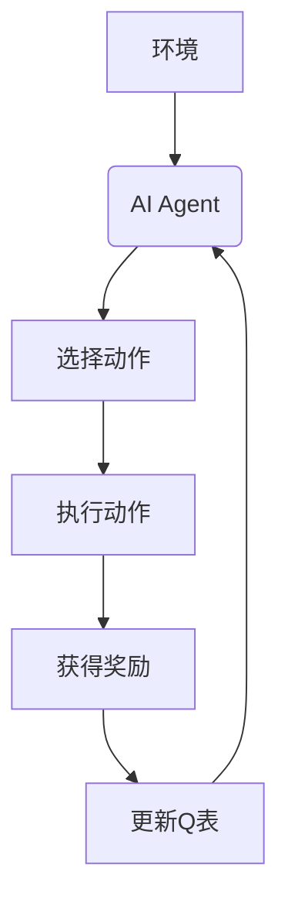
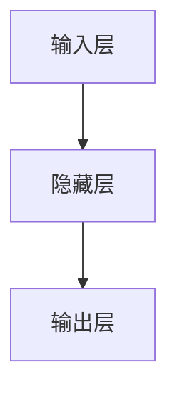
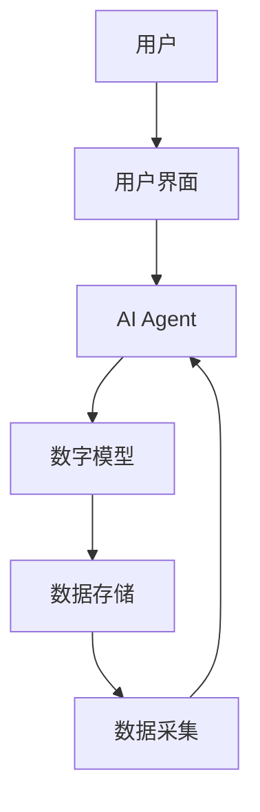
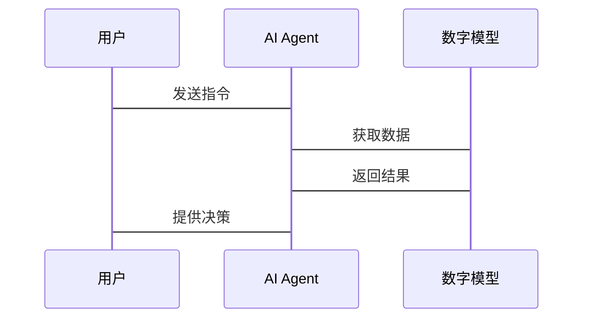

                 


# AI Agent在企业数字孪生技术中的应用

---

## 关键词
AI Agent, 数字孪生, 企业数字化, 智能系统, 人工智能, 企业架构

---

## 摘要
本文详细探讨了AI Agent在企业数字孪生技术中的应用，从基本概念到实际应用，结合算法实现、系统架构和项目实战，全面解析了AI Agent如何赋能企业的数字化转型。文章通过理论分析和实践案例，展示了AI Agent在智能监控、决策支持和优化调度中的重要作用，为企业技术决策者和开发者提供了有价值的参考和指导。

---

## 正文

---

### 第一部分: AI Agent与数字孪生技术概述

---

#### 第1章: AI Agent的基本概念

##### 1.1 AI Agent的定义与特点

###### 1.1.1 AI Agent的定义
AI Agent（人工智能代理）是指在计算机系统中，能够感知环境并采取行动以实现目标的实体。它可以自主决策、学习和适应，是人工智能技术的核心应用之一。

###### 1.1.2 AI Agent的核心特点
- **自主性**：AI Agent能够独立决策，无需外部干预。
- **反应性**：能够实时感知环境变化并做出反应。
- **目标导向**：以实现特定目标为导向，优化行动。
- **学习能力**：通过数据和经验不断优化性能。

###### 1.1.3 AI Agent与传统软件的区别
| 特性         | AI Agent                   | 传统软件             |
|--------------|----------------------------|----------------------|
| 决策能力     | 强大，自主决策              | 依赖人工或固定逻辑   |
| 学习能力     | 具备机器学习能力           | 无法自主学习         |
| 适应性       | 能够自适应环境变化          | 需人工调整            |
| 知识表示     | 使用知识图谱、规则引擎等    | 依赖预定义规则        |

---

##### 1.2 数字孪生技术的定义与应用

###### 1.2.1 数字孪生的定义
数字孪生（Digital Twin）是物理世界与数字世界的镜像，通过实时数据和模型模拟，实现对物理系统的全面数字化呈现。

###### 1.2.2 数字孪生的核心技术
- 数据采集：通过传感器获取物理系统的实时数据。
- 数据融合：将多源数据整合，形成统一的数字模型。
- 模拟与分析：利用数学模型对系统进行仿真和预测。

###### 1.2.3 数字孪生在企业中的应用领域
- **制造**：设备状态监测与预测性维护。
- **建筑**：能耗优化与空间管理。
- **交通**：实时交通监控与优化。
- **医疗**：患者病情实时跟踪与治疗方案优化。

---

##### 1.3 AI Agent与数字孪生的结合

###### 1.3.1 AI Agent在数字孪生中的作用
- **智能监控**：实时分析数据，发现异常。
- **智能决策**：基于数据提供最优方案。
- **智能优化**：动态调整系统参数，提升效率。

###### 1.3.2 数字孪生如何赋能AI Agent
- 提供实时数据，增强AI Agent的感知能力。
- 通过数字模型，提升AI Agent的决策精度。
- 通过虚拟环境，支持AI Agent的模拟与测试。

###### 1.3.3 两者的结合对企业数字化转型的意义
- 提升企业运营效率。
- 降低运营成本。
- 增强企业的竞争力和创新能力。

---

### 第二部分: AI Agent在企业数字孪生中的核心应用

---

#### 第4章: AI Agent在企业数字孪生中的应用场景

##### 4.1 智能监控与预测
AI Agent通过实时数据分析，识别系统中的异常情况，预测未来趋势，帮助企业提前采取措施。

##### 4.2 智能决策支持
AI Agent基于历史数据和实时信息，为企业提供数据驱动的决策支持，优化资源配置。

##### 4.3 智能优化与调度
AI Agent通过强化学习算法，优化生产流程、供应链管理等，提升企业运营效率。

---

#### 第5章: AI Agent在数字孪生系统中的算法实现

##### 5.1 常见AI算法在数字孪生中的应用
- **机器学习**：用于数据分类、预测。
- **深度学习**：用于图像识别、自然语言处理。
- **强化学习**：用于动态优化和策略制定。

##### 5.2 基于强化学习的AI Agent实现

###### 5.2.1 强化学习的基本原理
强化学习是一种通过试错机制，学习最优策略的方法。AI Agent通过与环境交互，不断优化动作，以获得最大奖励。

###### 5.2.2 Q-Learning算法实现
```python
class QLearningAgent:
    def __init__(self, state_space, action_space):
        self.state_space = state_space
        self.action_space = action_space
        self.q_table = defaultdict(lambda: np.zeros(len(action_space)))

    def choose_action(self, state, epsilon=0.1):
        if np.random.random() < epsilon:
            return np.random.randint(len(self.action_space))
        else:
            return np.argmax(self.q_table[state])

    def learn(self, state, action, reward, next_state):
        self.q_table[state][action] = self.q_table[state][action] * 0.9 + reward * 0.1
```

###### 5.2.3 算法流程图


---

##### 5.3 基于深度学习的数字孪生模型构建

###### 5.3.1 深度学习模型的基本原理
深度学习通过多层神经网络，自动提取数据特征，构建高度复杂的模型。

###### 5.3.2 神经网络结构


###### 5.3.3 数学模型
$$
y = \sigma(Wx + b)
$$
其中，$W$ 是权重矩阵，$x$ 是输入，$b$ 是偏置，$\sigma$ 是激活函数。

---

### 第三部分: 系统架构与技术实现

---

#### 第6章: 企业数字孪生系统的架构设计

##### 6.1 系统整体架构


##### 6.2 系统功能模块划分
| 模块         | 功能描述                         |
|--------------|----------------------------------|
| 数据采集     | 收集物理系统的实时数据           |
| 数据处理     | 对数据进行清洗、融合与存储       |
| 数字模型构建 | 建立物理系统的数字孪生模型         |
| AI Agent     | 执行智能监控、决策与优化         |
| 用户界面     | 提供可视化界面，供用户交互       |

##### 6.3 系统数据流设计


---

#### 第7章: AI Agent与数字孪生系统的接口设计

##### 7.1 系统接口定义
- **输入接口**：接收实时数据和用户指令。
- **输出接口**：提供决策结果和优化方案。

##### 7.2 接口交互流程


##### 7.3 接口实现的技术选型
- **数据传输**：使用RESTful API进行接口通信。
- **数据格式**：采用JSON格式，确保跨平台兼容性。

---

### 第四部分: 项目实战与案例分析

---

#### 第8章: 企业数字孪生系统开发实战

##### 8.1 开发环境搭建
- **开发工具**：PyCharm、Jupyter Notebook
- **框架选型**：TensorFlow、Flask
- **数据源**：企业设备传感器数据

##### 8.2 系统核心功能实现

###### 8.2.1 AI Agent实现
```python
def ai_agent_decision(data):
    # 数据预处理
    processed_data = preprocess(data)
    # 调用机器学习模型进行预测
    prediction = model.predict(processed_data)
    return prediction
```

###### 8.2.2 数字模型构建
```python
def build_digital_twin_model():
    # 数据加载
    data = load_data()
    # 建立模型
    model = create_model()
    # 训练模型
    train_model(model, data)
    return model
```

##### 8.3 代码解读与分析
- **数据预处理**：对传感器数据进行清洗和标准化。
- **模型训练**：使用深度学习框架训练数字孪生模型。
- **AI Agent决策**：基于模型输出决策结果。

---

#### 第9章: 案例分析与经验分享

##### 9.1 典型案例分析
- **案例背景**：某制造企业希望通过数字孪生技术优化生产线。
- **实施过程**：部署AI Agent进行设备状态监测和预测性维护。
- **效果评估**：设备故障率降低30%，维护成本减少20%。

##### 9.2 项目开发中的经验总结
- **数据质量**：高质量的数据是模型准确性的基础。
- **模型迭代**：持续优化模型，提升性能。
- **团队协作**：跨学科团队合作至关重要。

---

### 第五部分: 最佳实践与未来展望

---

#### 第10章: AI Agent与数字孪生的最佳实践

##### 10.1 技术选型建议
- **AI Agent**：根据需求选择合适的算法和框架。
- **数字孪生**：确保数据来源可靠，模型精度高。
- **系统架构**：设计合理的分层架构，确保可扩展性。

##### 10.2 系统优化技巧
- **数据处理**：采用分布式计算，提升处理效率。
- **模型部署**：使用容器化技术，便于部署和管理。
- **监控与日志**：实时监控系统状态，及时发现和解决问题。

##### 10.3 开发团队协作经验
- **明确角色**：分工明确，确保各司其职。
- **沟通机制**：建立高效的沟通渠道，及时同步进展。
- **知识共享**：定期分享技术经验，提升团队整体水平。

---

#### 第11章: 未来发展趋势与挑战

##### 11.1 数字孪生技术的未来发展方向
- **实时性提升**：增强系统的实时响应能力。
- **多模态融合**：结合视觉、听觉等多种数据源。
- **边缘计算**：将计算能力推向边缘，减少延迟。

##### 11.2 AI Agent在数字孪生中的潜力
- **自主学习**：AI Agent具备更强的自适应能力。
- **人机协作**：实现更自然的人机交互方式。
- **多智能体协同**：多个AI Agent协同工作，提升系统整体性能。

##### 11.3 技术融合中的挑战与解决方案
- **数据隐私**：通过加密和数据脱敏技术，保护数据隐私。
- **计算资源**：优化算法和硬件配置，降低计算成本。
- **模型可解释性**：提升模型的透明度，便于问题排查。

---

## 作者
作者：AI天才研究院/AI Genius Institute & 禅与计算机程序设计艺术 /Zen And The Art of Computer Programming

---

通过以上详细的内容，文章从理论到实践，全面阐述了AI Agent在企业数字孪生中的应用，为企业技术决策者和开发者提供了深入的技术指导和实践案例。

